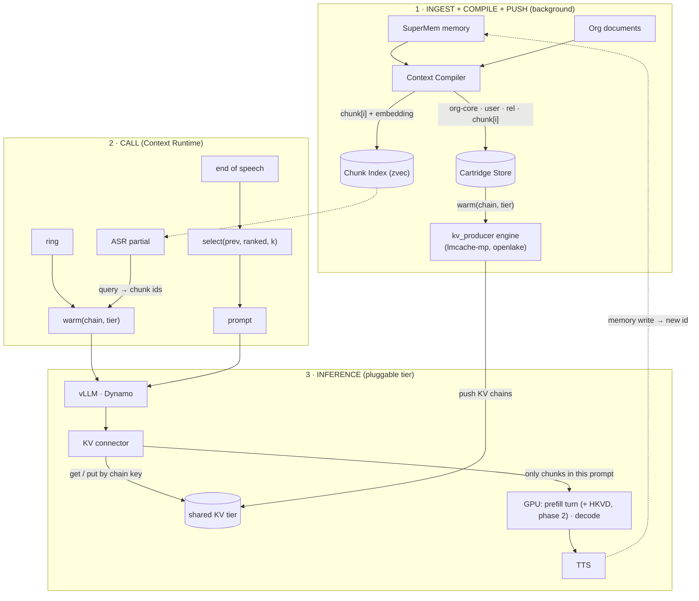
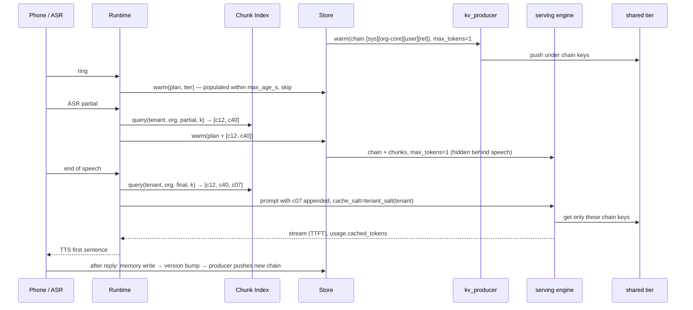

# KV Cartridge Engine Implementation Plan

> **For Claude:** REQUIRED SUB-SKILL: Use superpowers:executing-plans to implement this plan task-by-task.

**Goal:** Turn SuperMem's long-lived context into KV cartridges that are stored by id, pushed into a KV
tier (LMCache, OpenLake, Dynamo) under the exact prefix chain a turn will send, and attached per turn:
only the chunks the utterance needs. The plan also builds our own CacheBlend reference for non-prefix reuse.

**Architecture:** The Context Compiler emits whole cartridges (org-core, user, rel) and 512-token chunk
cartridges. A sqlite `CartridgeStore` maps ids to text and records where each chain's KV was populated. A
zvec `ChunkIndex` picks the chunks for a turn, and `select()` appends them so chains extend instead of
breaking. `warm()` pushes a chain through any OpenAI-compatible engine (the serving engine, or a producer
engine on a shared tier). The tiers themselves differ only in serving config, in
`scripts/gcp_serve_cartridges.sh`. `blend.py` is a reference CacheBlend in plain transformers, and
`SuperMemConnector` is a thin vLLM connector that guards tenancy and carries cartridge ids.

**Tech Stack:** Python 3.12, stdlib `sqlite3`/`unittest`/`asyncio`, httpx, FastAPI (simulator), zvec 0.7,
PyTorch + transformers 4.57, vLLM v0.30 (GPU only), LMCache v0.5.5 MP, OpenLake, NVIDIA Dynamo 1.5.

**Design:** `docs/superpowers/specs/2026-09-30-kv-cartridge-engine-design.md` (Section J amends it with
the research findings). Diagrams: `diagrams/kv-cartridge-end-to-end.*`, `diagrams/kv-cartridge-one-turn.*`.

---

## How to use this plan

- **Repo:** `SuperMem/`, a standalone git repo. Branch `feat/kv-cartridge-engine`. Run every command
  from the repo root.
- **Python:** `PY=/Users/parvbhullar/Drives/Vault/Projects/Unpod/super/.venv/bin/python`. supermem is not
  installed; tests put the repo root on `sys.path`. Three test commands (Task A.0 explains them):
  - core: `$PY tests/test_cartridge.py`
  - index: `uv run --no-project --python $PY --with "zvec>=0.7,<0.8" --with numpy==2.2.6 python tests/test_cartridge_index.py`
  - blend: `uv run --no-project --python $PY --with tokenizers==0.22.2 --with huggingface-hub==0.36.2 python tests/test_blend.py`
- **Never** `pip` or `uv pip install`. Use the overlays above, and `uv add --project . --frozen` to record a dependency.
- **Commits:** one per task, conventional style, ending with
  `Co-Authored-By: Claude Opus 5.5 <noreply@anthropic.com>`. `tests/` is in `.gitignore`, so new test
  modules need `git add -f`.
- **Order:** sections A → J are a valid execution order. Section H (blend) depends only on A and can run in
  parallel with B–G. Tasks marked **MANUAL** need a GPU VM. They are written out in full but were not
  executed while writing this plan.
- **Expected outputs** (test counts, failure messages) come from a dry run of this plan in a fresh clone.
  If your count is off by the number of tests an earlier task added, check that you did not skip a task.

| Section | What it delivers | Tasks |
|---|---|---|
| A | Environment; `chunk` kind; `tenant_salt`; `compile_chunks` | A.0–A.2 |
| B | Chunks in the prompt; `select()` | B.1–B.2 |
| C | `CartridgeStore`, `chain_key`, `warm()` (the push) | C.1–C.3 |
| D | zvec `ChunkIndex`, hashed filter keys, embedders | D.1–D.4 |
| E | Engine KV-usage + tier-hit metrics, `kv_transfer_params`; simulator shared tier | E.1–E.3 |
| F | Bench: section tags, `select` + `pushed` arms, report columns | F.1–F.5 |
| G | Serving script: `KV_TIER`, `PRODUCER`, `DRY_RUN`; GPU check | G.1–G.3 |
| H | `blend.py` reference CacheBlend, `generate`, `blend_eval` | H.1–H.3 |
| I | `SuperMemConnector` (phase 2a), GPU check, 2b spike | I.1–I.4 |
| J | Runbook, spec amendments, final lint and full test run | J.1–J.3 |

---

---

## Section A: Environment, chunk contract, `compile_chunks`

Everything below runs from the SuperMem repo root on branch `feat/kv-cartridge-engine`:

```bash
cd /Users/parvbhullar/Drives/Vault/Projects/Unpod/super/superkik/SuperMem
export PY=/Users/parvbhullar/Drives/Vault/Projects/Unpod/super/.venv/bin/python
```

`supermem` is not installed in that venv. `tests/test_cartridge.py:14` puts the repo root on
`sys.path`, so always run from the repo root (research/repo.md, fact (e)).

---

### Task A.0: Environment (record zvec, confirm the 19-test baseline)

Later sections add a zvec chunk index. This task records the dependency in `pyproject.toml`
without touching the shared `/super/.venv` or the broken root lock, and confirms the core
suite (19 tests) and `tests/test_compare.py` (31 tests) are green before any code changes.

**Files:**
- Modify: `pyproject.toml` (`[project] dependencies`, lines 29-77; uv appends after
  `"pywebrtc-audio",` at line 76)

**Git: `tests/` is ignored (every section).** `.gitignore` line 8 is `tests/`. The existing
test files are tracked, so a plain `git add ... tests/test_cartridge.py` still stages them,
but it prints "The following paths are ignored by one of your .gitignore files" and exits 1,
which breaks an `&&` chain or an executor that stops on a non-zero exit. A NEW file under
`tests/` (`tests/test_cartridge_index.py`, `tests/test_blend.py`) is not staged at all, and
plain `git status --short` does not list it. So every section stages source files with
`git add` and test files with `git add -f`, and checks what is staged with
`git diff --cached --stat` (or `git status --short --ignored` for a new test file) before it
commits. I checked this on a clone with git 2.54.0.

1. **Confirm the branch and the baseline.**

   ```bash
   git branch --show-current
   $PY tests/test_cartridge.py
   $PY tests/test_compare.py
   ```

   Expected: `feat/kv-cartridge-engine`, then `Ran 19 tests in ~0.15s` and `OK`, then
   `Ran 31 tests` and `OK`. Task A.2 reruns `test_compare.py` against this baseline.

2. **Record zvec.**

   ```bash
   uv add --project . --frozen "zvec>=0.7,<0.8"
   ```

   Expected: exit 0 (uv may print `Using CPython 3.x.y`). `--frozen` means no lock and no
   sync, so no `uv.lock` or `.venv` appears. SuperMem is not a member of the `/super`
   workspace, and `/super/pyproject.toml` is untouched. I checked this on a scratch copy laid
   out under a copy of the `/super` root.

3. **Check the diff.**

   ```bash
   git diff --stat pyproject.toml
   git status --short
   ```

   Expected: `pyproject.toml | 17 +++++++++--------` (`9 insertions(+), 8 deletions(-)`).
   The one semantic change is the new line `    "zvec>=0.7,<0.8",`. The other 8 lines come
   from uv re-indenting the continuation comments under `torchvision`, `accelerate`,
   `soundfile` and `pydantic` to 4 spaces. Keep that: uv applies its own format again on
   every `uv add`. `git status` shows ` M pyproject.toml` plus the two untracked
   `docs/*.html`/`*.pdf` files that were already there. Do not stage those.

4. **Smoke-test the index overlay.** Nothing is installed into the shared venv.

   ```bash
   uv run --no-project --python $PY --with "zvec>=0.7,<0.8" --with numpy==2.2.6 \
     python -c "import importlib.metadata as m, zvec, numpy; print('zvec', m.version('zvec'), 'numpy', numpy.__version__)"
   ```

   Expected: `zvec 0.7.0 numpy 2.2.6`. The `numpy==2.2.6` pin makes the overlay's numpy the
   same version as the venv's, so compiled venv packages (scipy, torch) keep a matching ABI.
   The overlay still ships its own copy and loads it ahead of the venv's (research/repo.md,
   fact (e), "least-bad option").

   These are the three test commands used for the rest of the plan. Only `core` exists now.
   The other two files are created in later sections.

   ```bash
   # core
   $PY tests/test_cartridge.py
   # index
   uv run --no-project --python $PY --with "zvec>=0.7,<0.8" --with numpy==2.2.6 python tests/test_cartridge_index.py
   # blend (the pins work around the venv's tokenizers 0.23.1 / hub 1.21 drift that breaks transformers)
   uv run --no-project --python $PY --with tokenizers==0.22.2 --with huggingface-hub==0.36.2 python tests/test_blend.py
   ```

5. **Commit.**

   ```bash
   git add pyproject.toml
   git commit -m "chore(deps): record zvec>=0.7,<0.8 for the chunk index" \
     -m "Co-Authored-By: Claude Opus 5.5 <noreply@anthropic.com>"
   ```

---

### Task A.1: Contract — `chunk` kind and `tenant_salt`

Org knowledge is about to be split into small `chunk` cartridges that are attached after the
org/user/rel cartridges, in the order they were first attached, so a chunk added on turn 2
extends turn 1's cached prefix rather than reordering it. `ordered()` already does this
because Python's sort is stable, so its code stays as it is and a test pins the behaviour.
`tenant_salt()` gives each tenant a vLLM `cache_salt`. vLLM v0.30.0 rejects a salt that is
empty, longer than 128 chars, or contains `@`, `/`, `\` or NUL (research/vllm_lmcache.md §2,
`validate_cache_salt`). A 16-hex hash always passes that check, whatever the tenant id is.

**Files:**
- Modify: `supermem/cartridge/contract.py`: the comment, `KIND_ORDER` and `KIND_TITLES`
  (lines 19-30); a new function after `sha()` (lines 33-34); the `Cartridge.kind` and `scope`
  field comments (lines 39, 41). `ordered()` (lines 84-94) is not changed.
- Test: `tests/test_cartridge.py`: the import at line 20; a new class goes before
  `if __name__ == "__main__":` (line 202).

1. **Write the failing test.** Change the import at the top of `tests/test_cartridge.py`,
   line 20:

   ```python
   from supermem.cartridge.contract import Cartridge, ordered, tenant_salt  # noqa: E402
   ```

   Add this class just before `if __name__ == "__main__":`:

   ```python
   class ChunkContractTest(unittest.TestCase):
       def test_ordered_keeps_chunk_attach_order(self):
           c = _compiler()
           org, rel = c.compile_org("org", [("A", "x")]), c.compile_rel("org", "u", {"k": "v"})
           user = c.compile_user("u", [Fact("s", "fact")])
           chunks = [Cartridge("chunk", "t1", {"org": "org", "doc": "d", "chunk": i}, f"c{i}", 1,
                               "test-model", "test-model", 1) for i in (7, 2, 5)]
           out = ordered([chunks[0], rel, chunks[1], user, org, chunks[2]])
           self.assertEqual([x.kind for x in out], ["org", "user", "rel", "chunk", "chunk", "chunk"])
           self.assertEqual([x.body for x in out[3:]], ["c7", "c2", "c5"])   # attach order, not index
           self.assertTrue(out[3].render().startswith("### KNOWLEDGE [cartridge "))

       def test_tenant_salt_is_a_valid_vllm_cache_salt(self):
           raw = "acme/eu@prod\\x\x00"            # '/', '@', '\\' and NUL: vLLM's cache_salt rejects each
           self.assertRegex(tenant_salt(raw), r"^[0-9a-f]{16}$")
           self.assertEqual(tenant_salt(raw), tenant_salt(raw))                # stable, or no cache hits
           self.assertNotEqual(tenant_salt(raw), tenant_salt("acme/eu@prod"))  # tenants never share KV
   ```

   The regex pins the vLLM contract. The other two assertions pin what the salt is for: a
   random salt (`secrets.token_hex(8)`) or a constant one (`"0" * 16`) passes the regex, but
   the first gets no cache hits and the second lets tenants share KV.

2. **Run it and watch it fail.**

   ```bash
   $PY tests/test_cartridge.py
   ```

   Expected: no tests run. The module fails at import with
   `ImportError: cannot import name 'tenant_salt' from 'supermem.cartridge.contract'`.
   Without the import, `Cartridge("chunk", ...)` would raise
   `ValueError: unknown cartridge kind 'chunk'` from `__post_init__`.

3. **Minimal implementation** in `supermem/cartridge/contract.py`.

   Replace lines 19-30 (the attach-order comment, `KIND_ORDER`, `KIND_TITLES`) with:

   ```python
   # Canonical attach order: most-shared first, most-volatile last. Exact prefix
   # caching can only reuse a leading run of identical tokens, so the block shared
   # by every caller of the tenant goes first, then the one stable for this caller,
   # then the caller x org state. Retrieved knowledge chunks come last, in the
   # order they were first attached (ordered() sorts stably), so a chunk added on a
   # later turn extends the cached chain instead of breaking it. Per-turn memory
   # hits and the utterance follow the cartridges and are never cached.
   KIND_ORDER = ("org", "user", "rel", "chunk")

   KIND_TITLES = {
       "org": "ORGANISATION CONTEXT",
       "user": "CALLER MEMORY",
       "rel": "CALLER x ORGANISATION ACCOUNT",
       "chunk": "KNOWLEDGE",
   }
   ```

   Add this new function directly after `sha()`, with two blank lines before and after it:

   ```python
   def tenant_salt(tenant: str) -> str:
       """The engine ``cache_salt`` for a tenant, sent on every warm and turn so
       identical text in two tenants never shares KV. Hashed because vLLM accepts
       only a non-empty salt of <=128 chars without '@', '/', '\\' or NUL; a tenant
       id is not guaranteed to be one."""
       return sha(f"tenant:{tenant}")
   ```

   In `class Cartridge`, replace the two field comment lines (39 and 41):

   ```python
       kind: str                     # org | user | rel | chunk
   ```

   ```python
       scope: dict                   # keys: org / user / org+user / org+doc+chunk (chunk index)
   ```

4. **Run and watch it pass.**

   ```bash
   $PY tests/test_cartridge.py
   ```

   Expected: `Ran 21 tests in ~0.1s` and `OK`. This includes
   `test_ordered_keeps_chunk_attach_order` and `test_tenant_salt_is_a_valid_vllm_cache_salt`.
   I checked that the attach-order test catches the wrong implementation: an `ordered()` that
   tie-breaks by scope fails it.

5. **Commit.**

   ```bash
   git add supermem/cartridge/contract.py && git add -f tests/test_cartridge.py
   git diff --cached --stat
   git commit -m "feat(cartridge): chunk kind and tenant_salt in the contract" \
     -m "Co-Authored-By: Claude Opus 5.5 <noreply@anthropic.com>"
   ```

   Expected: both `git add` calls exit 0 (`-f` because `tests/` is ignored, see Task A.0), and
   the stat lists exactly `supermem/cartridge/contract.py` and `tests/test_cartridge.py`.

---

### Task A.2: Compiler — `ContextCompiler.compile_chunks`

The `select` arm attaches only the org chunks a turn needs, so an org document has to be split
into deterministic chunk cartridges that do not overlap. Overlapping text would break
byte-identity and store the same KV twice. The bench's largest section, "Service clauses", is
about 9.5K tokens written as 180 single-newline lines with no blank lines
(research/repo.md, fact 3). Splitting only on paragraphs would leave it as one 9.5K chunk, so
the packing rule falls back in three steps: paragraph, then line, then a single oversize line
as its own chunk.

**Files:**
- Modify: `supermem/cartridge/compiler.py`: a new method in `ContextCompiler` directly after
  `compile_rel` (lines 115-120), before the two blank lines that precede
  `def facts_from_space` (line 123). `re` is already imported (line 11).
- Test: `tests/test_cartridge.py`: a new class after `ChunkContractTest`, before
  `if __name__ == "__main__":`. No new imports: `build`, `_compiler` and `_EstimateCounter`
  already exist.

1. **Write the failing test.** Add this class just before `if __name__ == "__main__":`:

   ```python
   class CompileChunksTest(unittest.TestCase):
       """_EstimateCounter counts len(text) // 4, so a 40-char line is 10 tokens."""

       CLAUSES = "\n".join(f"Clause {i:02d}: records are kept for audit." for i in range(30))
       TEXT = f"About\nSunrise clinic, Whitefield.\n\n{CLAUSES}\n\n  \nPharmacy is open 24x7.\n"

       def _lines(self, chunks):
           return "\n".join(c.body for c in chunks).split("\n")

       def test_deterministic_ids_scope_and_kind(self):
           a = _compiler().compile_chunks("org", "Service clauses", self.TEXT, chunk_tokens=100)
           b = _compiler().compile_chunks("org", "Service clauses", self.TEXT, chunk_tokens=100)
           self.assertEqual([x.id for x in a], [x.id for x in b])
           self.assertEqual(len({x.id for x in a}), len(a))
           self.assertEqual({x.kind for x in a}, {"chunk"})
           want = [{"org": "org", "doc": "Service clauses", "chunk": i} for i in range(len(a))]
           self.assertEqual([x.scope for x in a], want)

       def test_no_overlap_nothing_lost_budget_kept(self):
           chunks = _compiler().compile_chunks("org", "d", self.TEXT, chunk_tokens=100)
           self.assertEqual(len(chunks), 4)   # ~10 clause lines of 38 chars fill 100 tokens
           lines = [ln.strip() for ln in self.TEXT.split("\n") if ln.strip()]
           self.assertEqual(self._lines(chunks), lines)
           self.assertTrue(all(c.tokens <= 100 for c in chunks))
           self.assertEqual(chunks[0].body.split("\n")[:2], ["About", "Sunrise clinic, Whitefield."])

       def test_small_paragraphs_pack_into_one_chunk(self):
           chunks = _compiler().compile_chunks("org", "d", "First para.\n\nSecond para.")
           self.assertEqual([c.body for c in chunks], ["First para.\nSecond para."])

       def test_fitting_paragraph_moves_whole_to_next_chunk(self):
           text = "a" * 60 + "\n\n" + "b" * 40 + "\n" + "c" * 40   # 15-token para, then a 20-token para
           chunks = _compiler().compile_chunks("org", "d", text, chunk_tokens=25)
           self.assertEqual([c.body for c in chunks], ["a" * 60, "b" * 40 + "\n" + "c" * 40])

       def test_oversize_line_is_its_own_chunk(self):
           text = "short a\n" + "y" * 800 + "\nshort b"
           chunks = _compiler().compile_chunks("org", "d", text, chunk_tokens=50)
           self.assertEqual([c.body for c in chunks], ["short a", "y" * 800, "short b"])

       def test_empty_text_has_no_chunks(self):
           self.assertEqual(_compiler().compile_chunks("org", "d", ""), [])
           self.assertEqual(_compiler().compile_chunks("org", "d", " \n\n \n"), [])

       def test_ids_differ_per_chunk_index_and_doc(self):
           twice = _compiler().compile_chunks("org", "d", "x" * 40 + "\n" + "x" * 40, chunk_tokens=10)
           self.assertEqual([c.body for c in twice], ["x" * 40, "x" * 40])
           self.assertNotEqual(twice[0].id, twice[1].id)
           self.assertNotEqual(_compiler().compile_chunks("org", "d1", "same")[0].id,
                               _compiler().compile_chunks("org", "d2", "same")[0].id)

       def test_dataset_service_clauses_split_by_line(self):
           # The bench's big section: ~9.5K tokens as 180 single-newline lines, no blank line.
           text = dict(build(3, 11000, 500).org_sections)["Service clauses"]
           chunks = _compiler().compile_chunks("org", "Service clauses", text)
           self.assertGreater(len(chunks), 15)
           self.assertTrue(all(c.tokens <= 512 for c in chunks))
           self.assertEqual(self._lines(chunks), text.split("\n"))
   ```

   What the tests cover: determinism and idempotent ids, scope and kind (positive); no
   overlap, nothing lost, the budget respected, and the exact chunk count, which pins greedy
   line packing inside an over-budget paragraph; paragraphs joined with a single `"\n"`; a
   paragraph that fits moving whole to the next chunk rather than being split across the
   boundary; an oversize line kept alone (boundary); empty and whitespace-only text returning `[]`
   (edge); identical bodies at different chunk indexes or docs getting different ids
   (negative); and the real dataset section, which uses `build(3, 11000, 500)` and takes
   about 0.08s.

2. **Run it and watch it fail.**

   ```bash
   $PY tests/test_cartridge.py
   ```

   Expected: `Ran 29 tests` and `FAILED (errors=8)`. All eight `CompileChunksTest` tests
   error with `AttributeError: 'ContextCompiler' object has no attribute 'compile_chunks'`.
   The other 21 pass.

3. **Minimal implementation.** Insert this into `ContextCompiler` directly after
   `compile_rel`, keeping one blank line before the new header and two blank lines after the
   method, before `def facts_from_space`:

   ```python
       # ── org knowledge (chunks) ────────────────────────────────────────────────

       def compile_chunks(self, org_id: str, doc_id: str, text: str,
                          chunk_tokens: int = 512) -> list[Cartridge]:
           """Split one org document into ``chunk`` cartridges of at most ``chunk_tokens``.

           Units are paragraphs (split on blank lines); a paragraph over budget falls
           apart into its lines, and a single line over budget is a chunk of its own.
           Units are packed greedily in order and joined with a newline. No overlap:
           overlapping text breaks byte-identity and stores the same KV twice. Bodies hold
           only ``text``: a title the caller prepends to it lands in chunk 0 alone."""
           units: list[str] = []
           for para in filter(None, (p.strip() for p in re.split(r"\n\s*\n", text))):
               units += [para] if self.counter.count(para) <= chunk_tokens else para.split("\n")
           bodies: list[str] = []
           cur: list[str] = []
           for unit in units:
               # ponytail: re-counts the growing chunk per unit, exact for any tokenizer but
               # O(units x chunk); sum per-unit counts if compiling large corpora gets slow.
               if cur and self.counter.count("\n".join([*cur, unit])) > chunk_tokens:
                   bodies.append("\n".join(cur))
                   cur = []
               cur.append(unit)
           if cur:
               bodies.append("\n".join(cur))
           return [self._make("chunk", {"org": org_id, "doc": doc_id, "chunk": i}, body)
                   for i, body in enumerate(bodies)]
   ```

   `_make` with no `version` uses the content hash as the version, and it sets `tokens` and
   `tokens_estimated` from `self.counter`. That is why the budget test can read `c.tokens`.

4. **Run and watch it pass.**

   ```bash
   $PY tests/test_cartridge.py
   ```

   Expected: `Ran 29 tests in ~0.1s` and `OK`. Also run `$PY tests/test_compare.py`, which
   should give `Ran 31 tests` and `OK`, the same as the Task A.0 baseline. That suite uses
   the same contract and should not change.

   Checks I ran on a scratch copy:
   - Removing the line fallback fails 4 of the new tests.
   - A line-only packer (every paragraph split into lines) fails
     `test_fitting_paragraph_moves_whole_to_next_chunk`. A packer that puts each line of an
     over-budget paragraph in its own chunk gives 32 chunks for `TEXT` and fails
     `test_no_overlap_nothing_lost_budget_kept`.
   - With a real HF tokenizer (`hf-internal-testing/tiny-random-LlamaForCausalLM`, through the
     blend overlay's pins), "Service clauses" becomes 26 chunks. The largest is 485 of 512
     tokens, and no text is lost.

5. **Commit.**

   ```bash
   git add supermem/cartridge/compiler.py && git add -f tests/test_cartridge.py
   git diff --cached --stat
   git commit -m "feat(cartridge): compile_chunks packs org docs into chunk cartridges" \
     -m "Co-Authored-By: Claude Opus 5.5 <noreply@anthropic.com>"
   ```

   Expected: both `git add` calls exit 0, and the stat lists exactly
   `supermem/cartridge/compiler.py` and `tests/test_cartridge.py`.

---

## Section B: Runtime: chunks in the prompt + `select()`

Assumes Section A is applied: `KIND_ORDER` ends in `"chunk"`, `KIND_TITLES["chunk"] == "KNOWLEDGE"`, and
`ContextCompiler.compile_chunks(org_id, doc_id, text, chunk_tokens=512)` exists. Section A also has a test
pinning that `ordered()` is a stable sort. This section relies on that: chunks passed after the whole
cartridges keep their attach order.

All commands run from the repo root:

```bash
cd /Users/parvbhullar/Drives/Vault/Projects/Unpod/super/superkik/SuperMem
PY=/Users/parvbhullar/Drives/Vault/Projects/Unpod/super/.venv/bin/python
```

`$PY tests/test_cartridge.py <ClassName> ...` runs only the named classes, because `unittest.main` reads test
names from argv.

---

### Task B.1: `ContextRuntime` renders per-turn chunk cartridges after the whole cartridges

Why: a `select` turn attaches a few org-knowledge chunks instead of the whole org. Prefix caching only
reuses a leading run of identical tokens. The whole-cartridge part of the system message (persona, org,
user, rel) must therefore stay byte-identical, and the chunks must come after it in the order they were
attached. `prefetch_messages` must build the same chain, because the warm request has to match the turn.
Routing the combined list through `ordered()` keeps the existing tenant and model guard, so a chunk from
another tenant can never enter a prompt. `ordered()` does not check kind, so `_system` adds one guard:
`chunks=` takes only kind `"chunk"`. The ids reach it through `ChunkIndex.query` and `CartridgeStore.get`,
and the store holds every kind. Without the guard, one bad id would sort a whole cartridge (possibly
another caller's memory) into the middle of the stable prefix.

**Files:**
- Modify: `supermem/cartridge/runtime.py`
  - module docstring, prompt layout (lines 4-18)
  - `from typing import ...` (line 21)
  - `ContextRuntime._system` (lines 66-72)
  - `ContextRuntime.messages` (lines 74-83)
  - `ContextRuntime.prefetch_messages` (lines 85-89)
- Test: `tests/test_cartridge.py`: new class `RuntimeChunkTest`, placed just before the final
  `if __name__ == "__main__":` block. No new imports: `unittest`, `BLEND_SEPARATOR`, `ContextRuntime`,
  `_compiler` and `RuntimeTest` are already in the module.

**Steps:**

1. Write the failing test. Add this class to `tests/test_cartridge.py`, just before `if __name__ == "__main__":`:

```python
class RuntimeChunkTest(unittest.TestCase):
    """Per-turn chunk cartridges ride after the whole cartridges, never inside them."""

    def setUp(self):
        RuntimeTest.setUp(self)   # same runtime: org + user + rel for caller "u"
        c = _compiler()
        self.fees = c.compile_chunks("org", "Fees", "Cardiology fee Rs 1200.")[0]
        self.rooms = c.compile_chunks("org", "Rooms", "Cardiology is in room 106.")[0]

    def test_chunks_follow_the_rel_block_in_attach_order(self):
        rel = self.rt.cartridges("u")[-1]
        self.assertEqual(rel.kind, "rel")
        for attach in ([self.fees, self.rooms], [self.rooms, self.fees]):
            sys_msg = self.rt.messages("u", "q", chunks=attach)[0]["content"]
            first, second = (sys_msg.index(c.render()) for c in attach)
            self.assertLess(sys_msg.index(rel.render()), first)
            self.assertLess(first, second)

    def test_whole_cartridge_prefix_is_byte_identical_with_chunks(self):
        chunks = [self.fees, self.rooms]
        for mode, joiner in (("cartridge", "\n\n"), ("blend", BLEND_SEPARATOR)):
            base = self.rt.messages("u", "q", mode=mode)[0]["content"]
            got = self.rt.messages("u", "q", mode=mode, chunks=chunks)[0]["content"]
            self.assertEqual(got, base + joiner + joiner.join(c.render() for c in chunks))

    def test_prefetch_sends_the_same_chain_as_the_turn(self):
        chunks = [self.rooms, self.fees]
        self.assertEqual(self.rt.prefetch_messages("u", chunks=chunks)[0],
                         self.rt.messages("u", "q", turn_memory="hit", chunks=chunks)[0])

    def test_chunk_from_another_tenant_is_refused(self):
        other = _compiler("t2").compile_chunks("org", "Fees", "Cardiology fee Rs 1200.")[0]
        with self.assertRaises(ValueError):
            self.rt.messages("u", "q", chunks=[other])
        with self.assertRaises(ValueError):
            self.rt.prefetch_messages("u", chunks=[other])

    def test_nomem_ignores_chunks(self):
        self.assertEqual(self.rt.messages("u", "q", mode="nomem", chunks=[self.fees]),
                         self.rt.messages("u", "q", mode="nomem"))

    def test_non_chunk_cartridge_is_refused(self):
        user = self.rt.cartridges("u")[1]
        self.assertEqual(user.kind, "user")
        with self.assertRaises(ValueError):
            self.rt.messages("u", "q", chunks=[user])
```

   Three tests are built to catch a wrong implementation:
   - `test_chunks_follow_the_rel_block_in_attach_order` runs both attach orders. It fails if chunks are
     sorted by id or by doc instead of kept in attach order.
   - `test_whole_cartridge_prefix_is_byte_identical_with_chunks` checks exact bytes in both joiner modes.
   - `test_non_chunk_cartridge_is_refused` fails if a whole cartridge passed in `chunks=` is sorted into
     the prefix instead of refused.

2. Run it and confirm the failure:

```bash
$PY tests/test_cartridge.py RuntimeChunkTest
```

   Expected: all 6 tests `ERROR`, ending with `FAILED (errors=6)`.
   - 5 tests fail with `TypeError: ContextRuntime.messages() got an unexpected keyword argument 'chunks'`
     (`assertRaises(ValueError)` does not catch a `TypeError`).
   - `test_prefetch_sends_the_same_chain_as_the_turn` fails with
     `TypeError: ContextRuntime.prefetch_messages() got an unexpected keyword argument 'chunks'`.

   If `setUp` fails with `AttributeError: ... 'compile_chunks'` instead, Section A is not applied. Stop and
   apply it first.

3. Minimal implementation in `supermem/cartridge/runtime.py`.

   Replace the module docstring (lines 1-18) with:

```python
"""Context Runtime: which cartridges a turn gets, in what order, and when to
pre-fill them.

Prompt layout (identical for every arm that carries memory, so arms differ
only in how the engine treats the KV, never in what the model reads)::

    system : persona + epoch
             [org cartridge]      shared by every caller of the tenant
             [caller cartridge]   stable for this caller
             [account cartridge]  caller x org state
             [chunk cartridges]   org knowledge picked for this turn, attach order
    ... conversation history ...
    user   : this turn's memory hits (volatile) + the utterance

Everything up to the end of the whole cartridges is a stable prefix: exact
prefix caching (vLLM APC, LMCache, Dynamo KVBM) reuses it from the second
turn on, and ``prefetch_messages`` lets it be computed before the caller
speaks at all. Chunks come after it, in attach order. A prefix tier reuses
the chunks before the first new or removed one and recomputes the rest: that
chunk, every chunk after it, then the history and the user turn.
"""
```

   Change the typing import (line 21) to:

```python
from typing import AsyncIterator, Callable, Sequence
```

   Replace `_system`, `messages` and `prefetch_messages` (lines 66-89) with:

```python
    def _system(self, caller_id: str, mode: str, chunks: Sequence[Cartridge] = ()) -> str:
        head = f"[session {self.epoch}]\n{self.persona}" if self.epoch else self.persona
        if mode == "nomem":
            return head
        if any(c.kind != "chunk" for c in chunks):   # ordered() would sort it into the prefix
            raise ValueError("chunks= takes only kind 'chunk' cartridges")
        # ordered() re-checks tenant and model across the whole set; its sort is stable,
        # so chunks (last in KIND_ORDER) keep their attach order after the rel block.
        blocks = [c.render() for c in ordered(list(self.cartridges(caller_id)) + list(chunks))]
        joiner = BLEND_SEPARATOR if mode == "blend" else "\n\n"
        return head + "\n\n" + joiner.join(blocks)

    def messages(self, caller_id: str, utterance: str, *, mode: str = "cartridge",
                 history: list[dict] | None = None, turn_memory: str = "",
                 chunks: Sequence[Cartridge] = ()) -> list[dict]:
        if mode not in MODES:
            raise ValueError(f"mode must be one of {MODES}, got {mode!r}")
        user = utterance
        if turn_memory and mode != "nomem":
            user = f"(Relevant memory for this turn)\n{turn_memory}\n\n(Caller says)\n{utterance}"
        return ([{"role": "system", "content": self._system(caller_id, mode, chunks)}]
                + list(history or [])
                + [{"role": "user", "content": user}])

    def prefetch_messages(self, caller_id: str, mode: str = "cartridge",
                          chunks: Sequence[Cartridge] = ()) -> list[dict]:
        """A request whose prompt shares the whole cartridge prefix (plus ``chunks``)
        with the caller's real turns. Send it with max_tokens=1 on ring / first ASR partial."""
        return [{"role": "system", "content": self._system(caller_id, mode, chunks)},
                {"role": "user", "content": "."}]
```

   `cartridge_reply` stays as it is. It passes no chunks, so its prompts are unchanged.

4. Run the whole file and confirm it passes:

```bash
$PY tests/test_cartridge.py
```

   Expected: `Ran 35 tests in ~0.2s` and `OK` (29 after Section A, plus 6). The 6 `RuntimeChunkTest`
   tests pass, and the existing `RuntimeTest` tests still pass because the no-chunk output is
   byte-for-byte the same as before.

5. Commit:

```bash
git add supermem/cartridge/runtime.py && git add -f tests/test_cartridge.py
git commit -m "feat(cartridge): render per-turn chunk cartridges after the whole cartridges" \
  -m "Co-Authored-By: Claude Opus 5.5 <noreply@anthropic.com>"
```

---

### Task B.2: module-level `select(prev, ranked, k)`

Why: each turn the index returns ranked chunk ids, and the runtime has to decide which ones to attach and
in what order. Prefix-only tiers (vLLM APC, OpenLake, KVBM) hash each block together with every block
before it (spec, "Keying"). A reshuffle would therefore miss every chunk after the first changed position.
`select` keeps last turn's ids where they were and appends the new ones, so while the selection is under
`k`, turn 2's chain extends turn 1's (the spec example: `[c12, c40]` becomes `[c12, c40, c07]`). It drops
ids only when over budget: first the LATEST id that is no longer ranked, and if none is stale, the last
one. A drop breaks the chain at the dropped position, so dropping as late as possible keeps the longest
cached prefix: `[a, b, c]` + new `d` with `k=3` and `a`, `b` stale gives `[a, c, d]` (a hit on `a`), where
dropping the earliest stale id would give `[b, c, d]` (no hit at all).

The caller starts each call with `prev=[]`, so each call's order starts from the index's rank order. This
is the interface sheet's choice, not the spec's "resets to canonical" (`ordered()` tie-break by attach
order, then scope). The sheet keeps `ordered()` unchanged, so the canonical scope tie-break is deferred:
two calls that rank the same chunks differently build different chains.

**Files:**
- Modify: `supermem/cartridge/runtime.py`: new module-level function `select`, inserted directly above
  `def cartridge_reply(` (line 92 on the pre-plan tree, line 101 after Task B.1).
- Test: `tests/test_cartridge.py`
  - new class `SelectTest`, placed after `RuntimeChunkTest`, before the final `if __name__ == "__main__":` block
  - import change: replace the existing line
    `from supermem.cartridge.runtime import BLEND_SEPARATOR, ContextRuntime  # noqa: E402` with
    `from supermem.cartridge.runtime import BLEND_SEPARATOR, ContextRuntime, select  # noqa: E402`

**Steps:**

1. Write the failing test. Make the import change above, then add this class before `if __name__ == "__main__":`:

```python
class SelectTest(unittest.TestCase):
    """select(prev, ranked, k): which chunk ids this turn attaches, in what order."""

    def test_keeps_prev_order_and_appends_new_ids(self):
        # c40 is no longer ranked but fits the budget, so it stays (no churn in the chain).
        got = select(["c12", "c40"], ["c07", "c12"], k=4)
        self.assertEqual(got, ["c12", "c40", "c07"])

    def test_first_turn_takes_the_top_k_in_rank_order(self):
        self.assertEqual(select([], ["a", "b", "c"], k=2), ["a", "b"])

    def test_over_budget_drops_the_latest_stale_id(self):
        # a and b are stale; dropping b keeps a, so the chain still hits on its first block.
        self.assertEqual(select(["a", "b", "c"], ["c", "d"], k=3), ["a", "c", "d"])

    def test_over_budget_with_nothing_stale_drops_the_last(self):
        self.assertEqual(select(["a", "b"], ["b", "a", "c"], k=2), ["a", "b"])

    def test_zero_budget_and_empty_inputs(self):
        self.assertEqual(select(["a"], ["a", "b"], k=0), [])
        self.assertEqual(select([], [], k=4), [])

    def test_empty_ranking_keeps_prev(self):
        # An empty or failed index query attaches nothing new and keeps the chain already sent.
        self.assertEqual(select(["a", "b"], [], k=4), ["a", "b"])

    def test_duplicates_in_ranked_are_ignored(self):
        self.assertEqual(select(["a"], ["b", "a", "b", "c"], k=4), ["a", "b", "c"])
```

2. Run it and confirm the failure:

```bash
$PY tests/test_cartridge.py SelectTest
```

   Expected: the module does not import, so no test runs. The traceback ends with
   `ImportError: cannot import name 'select' from 'supermem.cartridge.runtime'`.

3. Minimal implementation. Insert this function in `supermem/cartridge/runtime.py`, directly above
   `def cartridge_reply(`, with two blank lines on each side:

```python
def select(prev: list[str], ranked: list[str], k: int) -> list[str]:
    """Chunk ids to attach this turn (``k >= 0``). ``prev`` is last turn's selection in
    attach order (``[]`` at the start of a call), ``ranked`` the index's ids for this
    turn, best first.

    Keeps ``prev`` in place and appends new ranked ids, so this turn's chunk chain
    extends last turn's when ``k`` allows. Over ``k``, it drops the latest id no longer
    ranked, else the last one: a drop breaks the chain from the dropped position, so the
    latest drop keeps the longest cached prefix."""
    out = list(prev)
    out += [cid for cid in dict.fromkeys(ranked) if cid not in out]
    wanted = set(ranked)
    while len(out) > k:
        stale = [i for i, cid in enumerate(out) if cid not in wanted]
        del out[stale[-1] if stale else -1]
    return out
```

   `dict.fromkeys` removes duplicates from `ranked` while keeping rank order. The comprehension is evaluated
   before `+=`, so it compares against `prev` only, and that is all it needs.

4. Run the whole file and confirm it passes:

```bash
$PY tests/test_cartridge.py
```

   Expected: `Ran 42 tests in ~0.15s` and `OK` (35 after Task B.1, plus 7).

5. Commit:

```bash
git add supermem/cartridge/runtime.py && git add -f tests/test_cartridge.py
git commit -m "feat(cartridge): add select() for append-only per-turn chunk attach" \
  -m "Co-Authored-By: Claude Opus 5.5 <noreply@anthropic.com>"
```

Skipped: `select` is not exported from `supermem/cartridge/__init__.py`, and `cartridge_reply` does not take
chunks. Add them when a caller outside `runtime.py` and `run_bench.py` needs them.

Over budget, `select` drops the latest stale id (changed from the first draft's earliest-stale rule after
review: a simulation re-prefilled 24,918 vs 48,903 tokens when the index returns fewer than `k` ids, and
the same when it returns `k`, the bench shape `--select-k 4`). Stale ids at the front stay only while the
budget allows; a turn whose ranking is all new replaces every stale id.

---

## Section C: Cartridge store (sqlite) + chain_key + warm()

Assumes Sections A and B are applied: `KIND_ORDER` has `"chunk"`, `ContextCompiler.compile_chunks(...)` exists,
and `ContextRuntime.prefetch_messages(caller_id, mode="cartridge", chunks=())` renders the whole chain with the
chunks last, in attach order.

All commands run from the SuperMem repo root with
`PY=/Users/parvbhullar/Drives/Vault/Projects/Unpod/super/.venv/bin/python` (Environment, Task 0).
`$PY tests/test_cartridge.py <ClassName>` runs one TestCase class (unittest.main takes test names from argv).
After Section B the full file runs 42 tests: 19 before Section A, 10 added by A, 13 added by B. The "Run" steps
below count from 42; if A or B changed their test count, shift every total by the same amount.

---

### Task C.1: CartridgeStore: cartridges and the current version per scope

**Why:** a cartridge id must map back to its exact text, and "the cartridge for this scope" must mean the newest
version. Both have to survive a process restart. SQLite from the stdlib does this with no new dependency. This task
creates all three tables, because the schema is the store's contract; C.2 adds the methods for `populated`.

**Files:**
- Create: `supermem/cartridge/store.py`
- Test: `tests/test_cartridge.py` (new class `StoreTest`, placed before the final `if __name__ == "__main__":` block)

**Steps:**

1. **Write the failing test.** In the import block at the top of `tests/test_cartridge.py`:
   - Add `import tempfile` between `import sys` and `import unittest`.
   - Add this line directly after `from supermem.cartridge.simulator import make_app  # noqa: E402`:

   ```python
   from supermem.cartridge.store import CartridgeStore  # noqa: E402
   ```

   Then add this class before `if __name__ == "__main__":`:

   ```python
   class StoreTest(unittest.TestCase):
       def test_put_get_round_trip_survives_reopen(self):
           c = _compiler()
           carts = [c.compile_org("org", [("About", "Sunrise Clinic")]),
                    *c.compile_chunks("org", "Fees", "Cardiology fee Rs 1200.")]
           with tempfile.TemporaryDirectory() as d:
               db = Path(d) / "cartridges.sqlite"
               store = CartridgeStore(db)
               store.put(carts)
               store.close()
               store = CartridgeStore(db)                  # reopen: the schema is IF NOT EXISTS
               got = [store.get(x.id) for x in carts]
               missing = store.get("0" * 16)
               store.close()
           self.assertEqual(got, carts)                    # every field, body included
           self.assertEqual([g.id for g in got], [x.id for x in carts])
           self.assertIsNone(missing)

       def test_current_follows_the_version_bump(self):
           c = _compiler()
           v1 = c.compile_rel("org", "u", {"plan": "basic"}, version=1)
           v2 = c.compile_rel("org", "u", {"plan": "gold"}, version=2)
           store = CartridgeStore(":memory:")
           self.addCleanup(store.close)
           store.put([v1])
           self.assertEqual(store.current("t1", "rel", {"org": "org", "user": "u"}), v1)
           store.put([v2])
           self.assertEqual(store.current("t1", "rel", {"user": "u", "org": "org"}), v2)  # key order
           self.assertEqual(store.get(v1.id), v1)                        # old version kept for tracing
           self.assertIsNone(store.current("t2", "rel", {"org": "org", "user": "u"}))   # other tenant
           self.assertIsNone(store.current("t1", "user", {"user": "u"}))                 # never stored

       def test_get_refuses_a_row_that_no_longer_rebuilds_its_id(self):
           v1 = _compiler().compile_rel("org", "u", {"plan": "basic"}, version=1)
           store = CartridgeStore(":memory:")
           self.addCleanup(store.close)
           store.put([v1])
           store.db.execute("UPDATE cartridges SET body = 'x'")    # stands in for a contract change
           with self.assertRaises(ValueError):
               store.get(v1.id)
   ```

   The round trip includes a `chunk` cartridge on purpose: its scope has an int (`"chunk": 0`) that must survive
   JSON unchanged, or the rebuilt id would differ. Rows outlive the process, and phase 2 adds fields to the id, so
   the third test pins that `get` refuses a row whose rebuilt id is no longer the id it was stored under.

2. **Run it and watch it fail.**

   ```bash
   $PY tests/test_cartridge.py StoreTest
   ```

   Expected: the module fails at import, before any test runs:
   `ModuleNotFoundError: No module named 'supermem.cartridge.store'`.

3. **Minimal implementation.** Create `supermem/cartridge/store.py`:

   ```python
   """Cartridge store: id <-> text, the current version per scope, and where each
   cartridge chain's KV was populated.

   SuperMem never holds a KV tensor. A ``populated`` row is the last successful
   prefill-only request for a chain, at T; its ``cached_tokens`` says whether that
   request observed a hit. It never claims residency: tiers evict silently, so a
   row means "a re-warm is probably cheap", not "it is there".
   """
   from __future__ import annotations

   import json
   import sqlite3
   from pathlib import Path
   from typing import Sequence

   from supermem.cartridge.contract import Cartridge

   _SCHEMA = """
   CREATE TABLE IF NOT EXISTS cartridges (
       id TEXT PRIMARY KEY, tenant TEXT, kind TEXT, scope TEXT, manifest TEXT, body TEXT);
   CREATE TABLE IF NOT EXISTS current (
       tenant TEXT, kind TEXT, scope TEXT, id TEXT, PRIMARY KEY (tenant, kind, scope));
   CREATE TABLE IF NOT EXISTS populated (
       tier TEXT, chain_key TEXT, ids TEXT, populated_at REAL, prompt_tokens INTEGER,
       cached_tokens INTEGER, PRIMARY KEY (tier, chain_key));
   """


   def _scope(scope: dict) -> str:
       return json.dumps(scope, sort_keys=True)


   class CartridgeStore:
       """SQLite (stdlib). Queries are parameterised, so tenant / scope strings never
       reach SQL text."""

       def __init__(self, path: str | Path) -> None:
           # ponytail: one connection; threads sharing it share its transaction, so put() is
           # atomic only from one thread at a time. Add a threading.Lock around writes, or one
           # store per thread, if put() runs on several threads.
           self.db = sqlite3.connect(str(path), check_same_thread=False)
           self.db.executescript(_SCHEMA)

       def put(self, cartridges: Sequence[Cartridge]) -> None:
           """Upsert each cartridge and make it the current version of its scope."""
           with self.db:
               for c in cartridges:
                   scope = _scope(c.scope)
                   self.db.execute("INSERT OR REPLACE INTO cartridges VALUES (?, ?, ?, ?, ?, ?)",
                                   (c.id, c.tenant, c.kind, scope, json.dumps(c.manifest()), c.body))
                   # ponytail: last put wins, even an older version put late (content-hash
                   # versions are not ordered); compare compiled_at if compilers can race.
                   self.db.execute("INSERT OR REPLACE INTO current VALUES (?, ?, ?, ?)",
                                   (c.tenant, c.kind, scope, c.id))

       def get(self, cid: str) -> Cartridge | None:
           """Rebuild a cartridge from its row. Raises ValueError when the row no longer
           rebuilds to ``cid`` (the id contract changed since the put, or the row was edited)."""
           row = self.db.execute("SELECT manifest, body FROM cartridges WHERE id = ?",
                                 (cid,)).fetchone()
           if row is None:
               return None
           fields = json.loads(row[0])
           del fields["id"], fields["chunk_sha"]     # derived; the rebuilt cartridge recomputes them
           c = Cartridge(body=row[1], **fields)
           if c.id != cid:
               raise ValueError(f"cartridge {cid} rebuilds as {c.id}: contract changed, recompile")
           return c

       def current(self, tenant: str, kind: str, scope: dict) -> Cartridge | None:
           row = self.db.execute("SELECT id FROM current WHERE tenant = ? AND kind = ? AND scope = ?",
                                 (tenant, kind, _scope(scope))).fetchone()
           return self.get(row[0]) if row else None

       def close(self) -> None:
           self.db.close()
   ```

   Notes:
   - "Newest" means the last `put` for that scope (the `ponytail:` comment in `put`). With no explicit version,
     `_make` uses a content hash as the version, so comparing version numbers would mean nothing.
   - `current` is accepted as an unquoted table name (checked on SQLite 3.50.4, the venv's build).
   - `Cartridge.manifest()` is `asdict()` minus `body`, plus the derived `id` and `chunk_sha`, so dropping those two
     keys gives exactly the constructor's fields.

4. **Run it and watch it pass.**

   ```bash
   $PY tests/test_cartridge.py StoreTest
   $PY tests/test_cartridge.py
   ```

   Expected: `Ran 3 tests in 0.00Xs` / `OK`, then the full file prints `Ran 45 tests` / `OK`.

5. **Commit.**

   ```bash
   git add supermem/cartridge/store.py && git add -f tests/test_cartridge.py
   git commit -m "feat(cartridge): sqlite cartridge store with current version per scope" \
     -m "Co-Authored-By: Claude Opus 5.5 <noreply@anthropic.com>"
   ```

---

### Task C.2: chain_key and the populated rows

**Why:** prefix tiers key KV by a chained block hash, so a cartridge by itself has no KV key. Only the whole chain
in front of the turn does. `chain_key` names that chain, and `record` / `populated_at` store when an engine last
prefilled it and what the engine reported. The salt goes into the key because vLLM adds `cache_salt` to block 0's
extra keys, and the parent chain carries it into every later block hash (research/vllm_lmcache.md §1, "cache_salt
effect"). The chunk order goes in too, because the key is a prefix hash.

**Files:**
- Modify: `supermem/cartridge/store.py`: the import block (lines 11-16 after C.1); add `chain_key` after `_scope`
  (C.1 lines 29-30); add `record` and `populated_at` between `current` and `close` (C.1 lines 70-76).
- Test: `tests/test_cartridge.py` (new class `PopulatedTest` placed after `StoreTest`, before `if __name__`)

**Steps:**

1. **Write the failing test.** In the import block of `tests/test_cartridge.py`, make these two lines read:

   ```python
   from supermem.cartridge.engine import Engine, TurnResult, _metric_sum  # noqa: E402
   from supermem.cartridge.store import CartridgeStore, chain_key  # noqa: E402
   ```

   Add this class after `StoreTest` and before `if __name__ == "__main__":`:

   ```python
   class PopulatedTest(unittest.TestCase):
       def test_record_overwrites_per_tier_and_chain(self):
           store = CartridgeStore(":memory:")
           self.addCleanup(store.close)
           res = TurnResult(arm="warm", prompt_tokens=400, cached_tokens=384)
           self.assertIsNone(store.populated_at("sim", "k1"))
           store.record("sim", "k1", ["a", "b"], res, now=100.0)
           store.record("sim", "k1", ["a", "b"], res, now=250.0)          # a re-warm replaces the row
           self.assertEqual(store.populated_at("sim", "k1"), 250.0)
           self.assertIsNone(store.populated_at("lmcache-mp@10.0.0.5:6000", "k1"))   # other tier
           self.assertIsNone(store.populated_at("sim", "k2"))                         # other chain
           self.assertEqual(
               store.db.execute("SELECT ids, prompt_tokens, cached_tokens FROM populated").fetchall(),
               [('["a", "b"]', 400, 384)])

       def test_chain_key_changes_with_salt_model_and_chunk_order(self):
           c = _compiler()
           rt = ContextRuntime(org=c.compile_org("org", [("About", "Sunrise Clinic")]))
           rt.register("u", [c.compile_user("u", [Fact("s", "Allergic to penicillin.")])])
           [fees] = c.compile_chunks("org", "Fees", "Cardiology fee Rs 1200.")
           [rooms] = c.compile_chunks("org", "Rooms", "Cardiology is in room 106.")

           def system(chunks):
               return rt.prefetch_messages("u", chunks=chunks)[0]["content"]

           key = chain_key(system([fees, rooms]), "s1", "m")
           self.assertEqual(key, chain_key(system([fees, rooms]), "s1", "m"))     # same plan, same key
           self.assertNotEqual(key, chain_key(system([fees, rooms]), "s2", "m"))  # tenant salt
           self.assertNotEqual(key, chain_key(system([fees, rooms]), "s1", "m2"))  # model
           self.assertNotEqual(key, chain_key(system([rooms, fees]), "s1", "m"))  # chunk order
   ```

   Each `compile_chunks` call gets one short document, so each returns exactly one chunk whatever the packing
   details of Section A are.

2. **Run it and watch it fail.**

   ```bash
   $PY tests/test_cartridge.py PopulatedTest
   ```

   Expected: import error before any test:
   `ImportError: cannot import name 'chain_key' from 'supermem.cartridge.store' (.../supermem/cartridge/store.py)`.

3. **Minimal implementation.** In `supermem/cartridge/store.py`, change the first-party imports to:

   ```python
   from supermem.cartridge.contract import Cartridge, sha
   from supermem.cartridge.engine import TurnResult
   ```

   Add this function directly after `_scope`:

   ```python
   def chain_key(system: str, salt: str, model: str) -> str:
       """Key of one cartridge chain: equal exactly when a prefix tier's chained block
       hashes are equal for this layout (same cache_salt, model and prefix bytes)."""
       # ponytail: one hash over the whole prefix stands in for the tier's per-block keys;
       # the phase-2 connector computes the tier's real keys.
       return sha(json.dumps([salt, model, system]))
   ```

   Add these two methods to `CartridgeStore`, between `current` and `close`:

   ```python
       def record(self, tier: str, key: str, ids: Sequence[str], res: TurnResult,
                  now: float) -> None:
           """Remember what the engine reported for one successful warm of a chain."""
           with self.db:
               self.db.execute("INSERT OR REPLACE INTO populated VALUES (?, ?, ?, ?, ?, ?)",
                               (tier, key, json.dumps(list(ids)), now, res.prompt_tokens,
                                res.cached_tokens))

       def populated_at(self, tier: str, key: str) -> float | None:
           row = self.db.execute("SELECT populated_at FROM populated WHERE tier = ? AND chain_key = ?",
                                 (tier, key)).fetchone()
           return row[0] if row else None
   ```

   `json.dumps([...])` on a list cannot be ambiguous the way string concatenation can: salt "a" + system "bc" never
   collides with salt "ab" + system "c". `sha` is `contract.sha` (16 hex chars), the same hash cartridge ids use.

4. **Run it and watch it pass.**

   ```bash
   $PY tests/test_cartridge.py PopulatedTest
   $PY tests/test_cartridge.py
   ```

   Expected: `Ran 2 tests in 0.00Xs` / `OK`, then `Ran 47 tests` / `OK`.

5. **Commit.**

   ```bash
   git add supermem/cartridge/store.py && git add -f tests/test_cartridge.py
   git commit -m "feat(cartridge): chain_key and populated rows in the cartridge store" \
     -m "Co-Authored-By: Claude Opus 5.5 <noreply@anthropic.com>"
   ```

---

### Task C.3: warm(): prefill a caller's chain once per max_age, record only real results

**Why:** this is the "push by prefix key" step. One prefill-only request per chain, sent exactly as the turn will
send it, puts the KV where the turn will look for it. That is the serving engine's own prefix cache, or a shared tier
when the request goes to a producer engine attached to that tier. The call must be idempotent: a second ASR partial
that arrives after the first warm has finished costs one SQLite read, not a request. It must also be honest: a
failed request leaves no row, so the next call retries and the turn just runs cold (spec, "Failure handling").

**Files:**
- Modify: `supermem/cartridge/store.py`: the import block (lines 11-17 after C.2); append `warm` at the end of the file.
- Modify: `docs/CARTRIDGES.md`: one row after the `supermem/cartridge/simulator.py` row (line 29) of the
  "What's in the repo" table.
- Test: `tests/test_cartridge.py` (new class `WarmTest` placed after `PopulatedTest`, before `if __name__`)

**Steps:**

1. **Write the failing test.** In the import block of `tests/test_cartridge.py`:
   - Add `import json` between `import asyncio` and `import sys`.
   - Make the store import read:

   ```python
   from supermem.cartridge.store import CartridgeStore, chain_key, warm  # noqa: E402
   ```

   Add this class after `PopulatedTest` and before `if __name__ == "__main__":`:

   ```python
   class WarmTest(unittest.TestCase):
       """warm() against the in-process simulator: one prefill-only request per chain."""

       def setUp(self):
           c = _compiler()
           org = c.compile_org("org", [("Fees", "Cardiology fee Rs 1200. " * 60)])
           self.rt = ContextRuntime(org=org)
           self.rt.register("u", [c.compile_user("u", [Fact("s", "Allergic to penicillin.")])])
           [self.chunk] = c.compile_chunks("org", "Rooms", "Cardiology is in room 106.")
           self.store = CartridgeStore(":memory:")
           self.addCleanup(self.store.close)
           self.clock = 1000.0

       def _warm(self, engine, **kw):
           return warm(self.store, self.rt, engine, "u", tier="sim", now=lambda: self.clock, **kw)

       @staticmethod
       def _sim():
           app = make_app(cache=True, base_ms=1, per_token_ms=0.0, decode_ms=0)
           return Engine("http://sim/v1", "m", arm="warm", transport=httpx.ASGITransport(app=app))

       def test_skips_a_fresh_chain_and_rewarms_a_stale_one(self):
           async def go():
               e = self._sim()
               cold = await self._warm(e, chunks=[self.chunk])
               self.clock += 599                                   # still fresh (max_age_s=600)
               skipped = await self._warm(e, chunks=[self.chunk])
               self.clock += 1                                     # exactly max_age_s old: stale
               again = await self._warm(e, chunks=[self.chunk])
               await e.close()
               return cold, skipped, again
           cold, skipped, again = asyncio.run(go())
           self.assertIsNone(cold.error)
           self.assertEqual(cold.cached_tokens, 0)
           self.assertIsNone(skipped)
           self.assertGreater(again.cached_tokens, 0.9 * again.prompt_tokens)   # hit observed

       def test_records_the_chain_key_and_ids_in_prompt_order(self):
           async def go():
               e = self._sim()
               await self._warm(e, chunks=[self.chunk])
               await e.close()
           asyncio.run(go())
           system = self.rt.prefetch_messages("u", chunks=[self.chunk])[0]["content"]
           self.assertEqual(self.store.populated_at("sim", chain_key(system, "", "m")), 1000.0)
           ids = json.loads(self.store.db.execute("SELECT ids FROM populated").fetchone()[0])
           self.assertEqual(ids, [x.id for x in self.rt.cartridges("u")] + [self.chunk.id])

       def test_mode_picks_the_chain(self):
           async def go():
               e = self._sim()
               await self._warm(e)
               blend = await self._warm(e, mode="blend")       # other layout: not the fresh chain
               await e.close()
               return blend
           self.assertIsNotNone(asyncio.run(go()))
           system = self.rt.prefetch_messages("u", "blend")[0]["content"]
           self.assertEqual(self.store.populated_at("sim", chain_key(system, "", "m")), 1000.0)

       def test_failed_warm_leaves_no_row(self):
           async def go():
               e = Engine("http://down/v1", "m", arm="warm",
                          transport=httpx.MockTransport(lambda req: httpx.Response(500, text="boom")))
               first = await self._warm(e)
               again = await self._warm(e)                         # not skipped: nothing recorded
               await e.close()
               return first, again
           first, again = asyncio.run(go())
           self.assertIn("HTTP 500", first.error)
           self.assertIsNotNone(again)
           self.assertIsNone(self.store.db.execute("SELECT 1 FROM populated").fetchone())

       def test_salt_reaches_the_engine(self):
           async def go():
               e = self._sim()
               await self._warm(e, salt="tenant-a")
               other = await self._warm(e, salt="tenant-b")        # same text, other tenant
               same = await self._warm(e, salt="tenant-a")
               await e.close()
               return other, same
           other, same = asyncio.run(go())
           self.assertIsNotNone(other)                 # a different salt is a different chain
           self.assertEqual(other.cached_tokens, 0)    # the simulator keys blocks by cache_salt: miss
           self.assertIsNone(same)                     # tenant-a's chain is still fresh
   ```

   What each test pins:
   - The first test pins the skip boundary: 599 s is fresh, and exactly `max_age_s` is stale.
   - The second pins what a warm records: the key is `chain_key` of the prefetch system prompt, and the ids are the
     chain in prompt order, chunks last.
   - The mode test pins that `mode` reaches `prefetch_messages`. Blend mode joins the blocks with
     `BLEND_SEPARATOR`, so its system prompt, and with it its key, differs from cartridge mode's; a `warm` that
     ignored `mode` would find the cartridge chain fresh and return `None`.
   - The failing engine is an in-process `httpx.MockTransport` app that answers every request with 500.
     `Engine.stream` turns that into `res.error = "RuntimeError: HTTP 500: boom"` (engine.py:139-141, 168-169).
   - The salt test works because `PrefixCache.lookup_and_insert` seeds its chain hash with the salt
     (simulator.py:46). If `warm` dropped the salt, tenant-b's identical text would hit.

2. **Run it and watch it fail.**

   ```bash
   $PY tests/test_cartridge.py WarmTest
   ```

   Expected: `ImportError: cannot import name 'warm' from 'supermem.cartridge.store' (.../supermem/cartridge/store.py)`.

3. **Minimal implementation.** In `supermem/cartridge/store.py`, replace the import block with:

   ```python
   import json
   import sqlite3
   import time
   from pathlib import Path
   from typing import Callable, Sequence

   from supermem.cartridge.contract import Cartridge, sha
   from supermem.cartridge.engine import Engine, TurnResult
   from supermem.cartridge.runtime import ContextRuntime
   ```

   (`runtime` imports only `contract`, so there is no import cycle.) Append at the end of the file:

   ```python
   async def warm(store: CartridgeStore, runtime: ContextRuntime, engine: Engine, caller_id: str, *,
                  tier: str, chunks: Sequence[Cartridge] = (), salt: str = "",
                  mode: str = "cartridge", max_age_s: float = 600,
                  now: Callable[[], float] = time.time) -> TurnResult | None:
       """Prefill one caller's whole chain (cartridges, then ``chunks`` in attach order)
       exactly as the turn will send it, with ``max_tokens=1``.

       ``tier`` labels where the KV lands: the engine URL for its own prefix cache, or
       a shared tier such as ``"lmcache-mp@10.0.0.5:6000"``. Pushing into a shared tier
       is this call with the producer engine and that tier's label. Returns ``None``
       when the chain was warmed less than ``max_age_s`` ago; only successful warms
       are recorded, so a failure is retried next time and the turn runs cold."""
       msgs = runtime.prefetch_messages(caller_id, mode, chunks)
       key = chain_key(msgs[0]["content"], salt, engine.model)
       t = now()
       # ponytail: no in-flight dedupe, so two overlapping warms of one chain both prefill; add
       # an in-flight (tier, key) set on the store when ASR partials call warm concurrently.
       last = store.populated_at(tier, key)
       if last is not None and t - last < max_age_s:
           return None
       res = await engine.warm(msgs, cache_salt=salt or None)
       if res.error is None:
           ids = [c.id for c in runtime.cartridges(caller_id)] + [c.id for c in chunks]
           store.record(tier, key, ids, res, t)
       return res
   ```

   Notes:
   - `ids` equals the prompt order. `runtime.cartridges()` is already `ordered()`, and `ordered()` is stable with
     `chunk` last in `KIND_ORDER`, so chunks follow in attach order (Section A). `prefetch_messages` runs `ordered()`
     over cartridges + chunks first, so a chunk from another tenant or model raises `ValueError` before any request.
   - The `tier` label never reaches the engine; only `salt` does. So a label containing `@` is fine, while
     `cache_salt` must be at most 128 chars with no `@`, `/` or `\` (research/vllm_lmcache.md §2). Callers pass
     `contract.tenant_salt(tenant)` (Section A), a 16-hex hash, which always passes.
   - On real vLLM, `cached_tokens` is filled only when the server runs with `--enable-prompt-tokens-details`. It
     counts local prefix hits plus external connector (tier) tokens (research/vllm_lmcache.md §4). Without the
     flag, the row stores `None` and the "hit observed" proof is unavailable.

   In `docs/CARTRIDGES.md`, insert after line 29 (the `supermem/cartridge/simulator.py` row of the "What's in the
   repo" table):

   ```markdown
   | `supermem/cartridge/store.py` | SQLite cartridge store: id <-> text, current version per scope, where each chain's KV was warmed; `warm()` |
   ```

   Every later row moves down one line. Later sections that edit this table name each row by its text, so find
   the row by text, not by line number.

4. **Run it and watch it pass.**

   ```bash
   $PY tests/test_cartridge.py WarmTest
   $PY tests/test_cartridge.py
   grep -c "cartridge/store.py" docs/CARTRIDGES.md
   ```

   Expected: `Ran 5 tests in 0.1XXs` / `OK`, then `Ran 52 tests` / `OK`, then `1`.
   (Checked on a scratch tree with Sections A and B applied as written: `Ran 52 tests ... OK`, and
   `uvx ruff check --select E9,F supermem/cartridge tests/test_cartridge.py` reports `All checks passed!`. Each of
   these mutations failed at least one test: dropping the salt from the request, dropping the salt from the key,
   recording on error, using `<=` for the age check, leaving chunk ids out of `ids`, ignoring `mode`, and `get`
   skipping its id check.)

5. **Commit.**

   ```bash
   git add supermem/cartridge/store.py docs/CARTRIDGES.md && git add -f tests/test_cartridge.py
   git commit -m "feat(cartridge): warm() prefills a caller's chain once per max_age and records hits" \
     -m "Co-Authored-By: Claude Opus 5.5 <noreply@anthropic.com>"
   ```

Skipped: `CartridgeStore`, `chain_key` and `warm` are not exported from `supermem/cartridge/__init__.py`; the bench
imports them from `supermem.cartridge.store`. Add the exports when a package-level caller needs them (Section B
skips `select` the same way).

---

## Section D: Chunk index on zvec + embedders

This section adds `supermem/cartridge/index.py`. Its `ChunkIndex` answers the question "which chunk cartridges does this utterance need?" for one tenant and org. It runs zvec 0.7 in-process and fuses a vector search with a BM25 search. The section also adds two embedder factories: `hash_embedders` (no model, used by tests and by `--embed hash`) and `e5_embedders` (the multilingual-e5-small model that leftbrain already uses). Tests go in a new module, `tests/test_cartridge_index.py`, which runs through the zvec uv overlay.

**Preconditions**
- Section A is applied. `KIND_ORDER` contains `"chunk"`, so `Cartridge(kind="chunk", ...)` constructs without error.
- Task 0 has recorded the dependency: `grep -n '"zvec' pyproject.toml` prints `"zvec>=0.7,<0.8"`. This section does not edit `pyproject.toml`.

**Commands.** Run all of these from the repo root (`SuperMem/`).

```bash
PY=/Users/parvbhullar/Drives/Vault/Projects/Unpod/super/.venv/bin/python
# index suite (zvec is not in the shared venv; the overlay leaves the venv untouched)
uv run --no-project --python $PY --with "zvec>=0.7,<0.8" --with numpy==2.2.6 python tests/test_cartridge_index.py
```

**zvec 0.7 facts this section relies on.** "R" marks a fact from `research/zvec.md`. "P" marks a fact re-checked by a probe while this section was written, using the overlay command above (scratch probes run while writing this plan; not kept).

| Fact | Src |
|---|---|
| `zvec.create_and_open(path, schema)` / `zvec.open(path)`. `open`'s default option is `{"read_only": 0}`. | R, P |
| `create_and_open` **refuses an existing path, even an empty dir** (`ValueError ... create expects a path that does not exist`), and creates missing parents. `open` refuses a missing path, and on an existing empty dir it fails with a misleading `RuntimeError: Can't open lock file: <dir>/LOCK`. | P |
| Collection names need 3+ chars in 0.7.0 (`"m"`, `"cc"`, `"c1"` fail the name regex; `"abc"`, `"chunks"` pass). | P |
| `Doc.id` is the implicit string primary key. Upserting the same id again replaces the doc, and `doc_count` is unchanged. | R |
| Filters are SQL-like text with a single `=` (`==` is a ValueError). String literals are quoted. | R |
| A backslash escapes a quote inside a literal: `doc = 'Doctor\'s hours'` matched. Doubling the quote (`''`) is a syntax error. | P |
| Several `Query`s need a reranker. `[Query("emb", vector=v), Query("text", fts=Fts(match_string=s))]` with `RrfReRanker()` plus a filter works. | R |
| `Fts(match_string="")` or whitespace raises `ValueError: Fts requires a non-empty ...`. `topk=0` raises `ValueError: topk must be a positive integer`. | P |
| A query on an empty collection returns `[]`. `upsert([])` returns `[]`. `close()` flushes, and a second `close()` is a no-op. | R, P |
| A read-write open takes an exclusive flock on `<path>/LOCK`. No second open is possible in any process while the handle is held. | R |
| New vectors go to a flat brute-force buffer until `optimize()`. Queries are correct either way. | R |

---

### Task D.1: ChunkIndex round trip and hash embedder

The select arm needs a persistent, per-tenant, per-org store of chunk cartridges that returns the few relevant chunks for an utterance. This task builds that store on zvec (hybrid vector + BM25 search with RRF) together with a model-free embedder, so the tests run on a laptop with no download. The filter is still built with plain f-strings here. Task D.2 closes that gap in the next commit, so land D.1 and D.2 together.

**Files:**
- Create: `supermem/cartridge/index.py`
- Test (create): `tests/test_cartridge_index.py`

**Steps**

1. Write the failing test. Create `tests/test_cartridge_index.py`:

```python
"""Chunk index on zvec: hybrid search, tenant/org isolation, drop, persistence.

No GPU, no model (hash embedder). zvec is not in the shared venv, so run it from the
repo root through the uv overlay::

    uv run --no-project --python $PY --with "zvec>=0.7,<0.8" --with numpy==2.2.6 \\
        python tests/test_cartridge_index.py
"""
import sys
import tempfile
import unittest
from pathlib import Path

sys.path.insert(0, str(Path(__file__).resolve().parent.parent))

from supermem.cartridge.contract import Cartridge  # noqa: E402
from supermem.cartridge.index import ChunkIndex, hash_embedders  # noqa: E402


def _chunk(body, doc="Pharmacy", tenant="t1", org="o1", i=0):
    return Cartridge(kind="chunk", tenant=tenant, scope={"org": org, "doc": doc, "chunk": i},
                     body=body, version=1, model="test-model", tokenizer="test-model",
                     tokens=len(body) // 4)


FEES = _chunk("Cardiology consultation fee is Rs 1200.", doc="Department: Cardiology")
CANCEL = _chunk("Appointments can be cancelled free of charge up to 6 hours before.",
                doc="Cancellation policy")
PHARMACY = _chunk("The pharmacy on the ground floor is open 24 hours.")


class ChunkIndexTest(unittest.TestCase):
    def setUp(self):
        tmp = tempfile.TemporaryDirectory()
        self.addCleanup(tmp.cleanup)
        self.path = Path(tmp.name)  # exists, empty: ChunkIndex starts a new index
        self.idx = self._open()

    def _open(self):
        idx = ChunkIndex(self.path, *hash_embedders())
        self.addCleanup(idx.close)  # releases the flock; a second close is a no-op
        return idx

    def test_query_ranks_the_relevant_chunk_first(self):
        self.idx.upsert([CANCEL, FEES, PHARMACY])
        self.assertEqual(self.idx.query("t1", "o1", "What is the cardiology fee?")[0], FEES.id)

    def test_tenant_and_org_filters_isolate(self):
        other_org = _chunk(FEES.body, doc=FEES.scope["doc"], org="o2")
        other_tenant = _chunk(FEES.body, doc=FEES.scope["doc"], tenant="t2")
        self.idx.upsert([FEES, other_org, other_tenant])
        self.assertEqual(self.idx.query("t1", "o1", "cardiology fee", k=10), [FEES.id])
        self.assertEqual(self.idx.query("t1", "o2", "cardiology fee", k=10), [other_org.id])
        self.assertEqual(self.idx.query("t2", "o1", "cardiology fee", k=10), [other_tenant.id])

    def test_upserting_the_same_id_again_replaces_it(self):
        self.idx.upsert([FEES, CANCEL])
        self.idx.upsert([FEES])
        self.assertCountEqual(self.idx.query("t1", "o1", "fee", k=10), [FEES.id, CANCEL.id])

    def test_k_larger_than_the_collection_returns_what_exists(self):
        self.idx.upsert([FEES, CANCEL])
        self.assertCountEqual(self.idx.query("t1", "o1", "fee", k=50), [FEES.id, CANCEL.id])

    def test_empty_index_returns_nothing(self):
        self.assertEqual(self.idx.query("t1", "o1", "fee"), [])

    def test_blank_text_or_zero_k_returns_nothing(self):
        self.idx.upsert([FEES])
        self.assertEqual(self.idx.query("t1", "o1", "   "), [])
        self.assertEqual(self.idx.query("t1", "o1", "fee", k=0), [])

    def test_reopen_from_disk_keeps_data(self):
        self.idx.upsert([FEES, CANCEL, PHARMACY])
        before = self.idx.query("t1", "o1", "cardiology fee", k=10)
        self.assertEqual(len(before), 3)
        self.idx.close()
        self.assertEqual(self._open().query("t1", "o1", "cardiology fee", k=10), before)


if __name__ == "__main__":
    unittest.main(verbosity=2)
```

   Notes:
   - Each cartridge id hashes its body (`contract.py:60-70`), so "same id" always means the same content. The replace test shows that a second upsert of that id adds no second row: `assertCountEqual` fails on a duplicate id.
   - `test_tenant_and_org_filters_isolate` uses the same body in all three chunks, so only the filter can separate them.
   - `setUp` passes an existing empty directory, which is what `tempfile.mkdtemp()` gives the bench. Every test therefore covers the "empty dir becomes a new index" branch, and `test_reopen_from_disk_keeps_data` covers the "open an existing index" branch.

2. Run it:

```bash
uv run --no-project --python $PY --with "zvec>=0.7,<0.8" --with numpy==2.2.6 python tests/test_cartridge_index.py
```

   Expected failure: the import fails with `ModuleNotFoundError: No module named 'supermem.cartridge.index'`.

3. Minimal implementation. Create `supermem/cartridge/index.py`:

```python
"""Chunk index: which chunk cartridges exist, and which ones this utterance needs.

zvec 0.7, in-process, one collection per directory. tenant/org/doc are scalar fields
(inverted index), the chunk body is BM25 full-text searchable, and its embedding sits
under HNSW cosine. ``query`` runs the vector route and the BM25 route together and fuses
them with reciprocal-rank fusion, pre-filtered to one tenant and org.

A read-write open takes an exclusive flock on ``<path>/LOCK``: while one process holds
the index no other process can open it, not even read-only. One process owns it.

Not re-exported from ``supermem.cartridge``: only this module needs zvec, so the rest of
the package still imports without it.
"""
from __future__ import annotations

import re
from collections.abc import Callable, Sequence
from pathlib import Path

import zvec
from zvec import (
    CollectionSchema, DataType, Doc, FieldSchema, Fts, FtsIndexParam, HnswIndexParam,
    InvertIndexParam, MetricType, Query, RrfReRanker, VectorSchema,
)

from supermem.cartridge.contract import Cartridge, sha

EmbedDocs = Callable[[list[str]], list[list[float]]]
EmbedQuery = Callable[[str], list[float]]


def _schema(dim: int) -> CollectionSchema:
    return CollectionSchema(
        name="chunks",  # zvec 0.7 rejects collection names shorter than 3 characters
        fields=[
            FieldSchema("tenant", DataType.STRING, index_param=InvertIndexParam()),
            FieldSchema("org", DataType.STRING, index_param=InvertIndexParam()),
            FieldSchema("doc", DataType.STRING, index_param=InvertIndexParam()),
            FieldSchema("text", DataType.STRING, index_param=FtsIndexParam(
                tokenizer_name="standard", filters=["lowercase"])),
        ],
        vectors=VectorSchema("emb", DataType.VECTOR_FP32, dimension=dim,
                             index_param=HnswIndexParam(metric_type=MetricType.COSINE)),
    )


class ChunkIndex:
    """Chunk cartridges of every tenant, searchable by meaning and by words within one org.

    ``path`` is the index directory. An existing index there is opened; a missing or empty
    directory (e.g. ``tempfile.mkdtemp()``) becomes a new index."""

    def __init__(self, path: str | Path, embed_docs: EmbedDocs, embed_query: EmbedQuery,
                 dim: int) -> None:
        p = Path(path)
        if p.is_dir() and not any(p.iterdir()):
            p.rmdir()  # create_and_open refuses any existing path, even an empty dir
        self._col = zvec.open(str(p)) if p.exists() else zvec.create_and_open(str(p), _schema(dim))
        self._embed_docs = embed_docs
        self._embed_query = embed_query

    def upsert(self, chunks: Sequence[Cartridge]) -> None:
        """Doc id = cartridge id, so upserting a cartridge again replaces it."""
        vectors = self._embed_docs([c.body for c in chunks])
        docs = [Doc(id=c.id, vectors={"emb": v},
                    fields={"tenant": c.tenant, "org": c.scope["org"], "doc": c.scope["doc"],
                            "text": c.body})
                for c, v in zip(chunks, vectors)]
        # ponytail: never optimize(); new vectors stay in zvec's flat buffer (exact brute force).
        # Call self._col.optimize() after bulk ingest once one index holds ~100k chunks.
        if not all(s.ok() for s in self._col.upsert(docs)):
            raise RuntimeError(f"zvec upsert failed for {len(docs)} chunks")

    def query(self, tenant: str, org: str, text: str, k: int = 4) -> list[str]:
        """Ids of the ``k`` chunk cartridges of ``tenant``/``org`` most relevant to ``text``,
        best first. Blank text or k < 1 attaches nothing (zvec rejects both)."""
        where = f"tenant = '{tenant}' AND org = '{org}'"
        if k < 1 or not text.strip():
            return []
        routes = [Query(field_name="emb", vector=self._embed_query(text)),
                  Query(field_name="text", fts=Fts(match_string=text))]
        return [d.id for d in self._col.query(routes, topk=k, filter=where, reranker=RrfReRanker())]

    def close(self) -> None:
        """Flush to disk and release the flock. Safe to call twice."""
        self._col.close()


def hash_embedders(dim: int = 64) -> tuple[EmbedDocs, EmbedQuery, int]:
    """Bag-of-words hashing into ``dim`` buckets: no model, deterministic across processes
    (sha, not Python's salted hash()). For tests and the bench's ``--embed hash`` rehearsal."""
    def embed(text: str) -> list[float]:
        v = [0.0] * dim
        for word in re.findall(r"\w+", text.lower()):
            v[int(sha(word, 8), 16) % dim] += 1.0
        return v
    return (lambda texts: [embed(t) for t in texts]), embed, dim
```

   Notes:
   - The API calls are the ones `research/zvec.md` verified: the schema, `Doc(id, vectors, fields)`, `query(list, topk, filter, reranker)` with a single-`=` filter, and `RrfReRanker()` with default `rank_constant=60`.
   - COSINE scores are distances, but RRF fuses ranks, so the order that comes back is already best-first.
   - A text with no word characters hashes to a zero vector. The probe showed zvec's COSINE route accepts it without error.

4. Run the same command. Expected result: `Ran 7 tests in ~2s`, then `OK`.

5. Commit. SuperMem's `.gitignore` line 8 is `tests/`, so a plain `git add` of the new test module exits 1 ("paths are ignored ... Use -f") and stages nothing under `tests/`. Force-add it:

```bash
git add supermem/cartridge/index.py && git add -f tests/test_cartridge_index.py
git commit -m "feat(cartridge): zvec chunk index with hybrid search and hash embedder" \
  -m "Co-Authored-By: Claude Opus 5.5 <noreply@anthropic.com>"
git show --stat --format= HEAD            # lists both files
git ls-files tests/test_cartridge_index.py  # prints the path: the module is tracked
```

---

### Task D.2: Filter values are a trust boundary: filter on hashed keys

zvec filters are strings with no bound parameters. The tenant id `t2' OR tenant = 't1` turns the filter into `tenant = 't2' OR tenant = 't1' AND org = 'o1'`, which is valid and returns another tenant's chunks, and a backslash escapes the closing quote (probe P). Refusing quotes would make ordinary names like "Patients' rights" un-indexable. Instead the index stores and filters on `sha(name)`: hex never needs quoting, so no caller value can reach the filter syntax, and every name stays valid. The tenant/org/doc fields are only ever filtered on, never shown.

**Files:**
- Modify: `supermem/cartridge/index.py`. Add `_key` after `_schema`, before `class ChunkIndex:`. Replace the whole `ChunkIndex.upsert` and `ChunkIndex.query`.
- Test: `tests/test_cartridge_index.py`. Add two methods to `ChunkIndexTest` after `test_reopen_from_disk_keeps_data`, before the final `if __name__` block. No new imports.

**Steps**

1. Write the failing tests. Add to `ChunkIndexTest`:

```python
    def test_hostile_filter_values_cannot_cross_tenants(self):
        self.idx.upsert([FEES, _chunk("t2 secret fee", tenant="t2")])
        for tenant in ("t2' OR tenant = 't1", 't1"', "t1\\"):
            with self.subTest(tenant=tenant):
                self.assertEqual(self.idx.query(tenant, "o1", "fee", k=10), [])
        self.assertEqual(self.idx.query("t1", "o1' OR org = 'o2", "fee", k=10), [])

    def test_quotes_and_backslashes_are_valid_names(self):
        odd = _chunk("Patients may bring one attendant.", doc="Patients' rights",
                     tenant='t"1\\', org="o'1")
        self.idx.upsert([FEES, odd])
        self.assertEqual(self.idx.query('t"1\\', "o'1", "attendant", k=10), [odd.id])
```

2. Run the index command. Expected result: `Ran 9 tests`, `FAILED (failures=2, errors=2)`, all in the two new tests. The injected tenant `t2' OR tenant = 't1` and the injected org both return chunks instead of `[]` (`AssertionError: Lists differ`), which accounts for the 2 failures. The backslash values (subtest `t1\\` and `test_quotes_and_backslashes_are_valid_names`) make zvec raise `ValueError: Invalid filter [...]`, which accounts for the 2 errors (zvec also prints `parse filter failed` lines). The `t1"` subtest already passes, because it still parses as a valid filter that matches nothing. What matters is that only these two tests fail.

3. Minimal implementation. Insert `_key` after `_schema` (two blank lines on each side):

```python
def _key(value: str) -> str:
    """Filter-safe form of a tenant/org/doc name. zvec filters are SQL-like text with no bound
    parameters, so a raw name could rewrite the filter (``t2' OR tenant = 't1``) and cross
    tenants. The index stores and filters on a hash instead: hex never needs quoting, and any
    name, quotes included, stays valid."""
    return sha(f"key:{value}")
```

   Replace the whole `ChunkIndex.upsert` with:

```python
    def upsert(self, chunks: Sequence[Cartridge]) -> None:
        """Doc id = cartridge id, so upserting a cartridge again replaces it."""
        vectors = self._embed_docs([c.body for c in chunks])
        docs = [Doc(id=c.id, vectors={"emb": v},
                    fields={"tenant": _key(c.tenant), "org": _key(c.scope["org"]),
                            "doc": _key(c.scope["doc"]), "text": c.body})
                for c, v in zip(chunks, vectors)]
        # ponytail: never optimize(); new vectors stay in zvec's flat buffer (exact brute force).
        # Call self._col.optimize() after bulk ingest once one index holds ~100k chunks.
        if not all(s.ok() for s in self._col.upsert(docs)):
            raise RuntimeError(f"zvec upsert failed for {len(docs)} chunks")
```

   Replace the whole `ChunkIndex.query` with:

```python
    def query(self, tenant: str, org: str, text: str, k: int = 4) -> list[str]:
        """Ids of the ``k`` chunk cartridges of ``tenant``/``org`` most relevant to ``text``,
        best first. Blank text or k < 1 attaches nothing (zvec rejects both)."""
        if k < 1 or not text.strip():
            return []
        where = f"tenant = '{_key(tenant)}' AND org = '{_key(org)}'"
        routes = [Query(field_name="emb", vector=self._embed_query(text)),
                  Query(field_name="text", fts=Fts(match_string=text))]
        return [d.id for d in self._col.query(routes, topk=k, filter=where, reranker=RrfReRanker())]
```

4. Run the index command. Expected result: `Ran 9 tests`, `OK`.

5. Commit (`-f` again because of the `tests/` ignore rule; it is harmless once the file is tracked):

```bash
git add supermem/cartridge/index.py && git add -f tests/test_cartridge_index.py
git commit -m "fix(cartridge): filter the chunk index on hashed tenant/org/doc keys" \
  -m "Co-Authored-By: Claude Opus 5.5 <noreply@anthropic.com>"
git show --stat --format= HEAD   # lists both files
```

---

### Task D.3: `drop(tenant, org, doc)`

When an org document changes, its old chunks must leave the index before the new version is upserted. Otherwise stale chunks keep winning retrieval. `drop` removes one document's chunks for one tenant and org and touches nothing else.

**Files:**
- Modify: `supermem/cartridge/index.py`. Add `ChunkIndex.drop` between `query` and `close` (`close` is currently at line 92).
- Test: `tests/test_cartridge_index.py`. Add a method to `ChunkIndexTest` after `test_quotes_and_backslashes_are_valid_names`, before the final `if __name__` block. No new imports.

**Steps**

1. Write the failing test. The same-titled document in another org and in another tenant must both survive, so a `drop` that leaves out either the tenant or the org clause fails it:

```python
    def test_drop_removes_one_documents_chunks_only(self):
        fees_2 = _chunk("Cardiology OPD runs Monday to Friday.", doc=FEES.scope["doc"], i=1)
        other_org = _chunk(FEES.body, doc=FEES.scope["doc"], org="o2")
        other_tenant = _chunk(FEES.body, doc=FEES.scope["doc"], tenant="t2")
        self.idx.upsert([FEES, fees_2, CANCEL, other_org, other_tenant])
        self.idx.drop("t1", "o1", FEES.scope["doc"])
        self.assertEqual(self.idx.query("t1", "o1", "cardiology fee", k=10), [CANCEL.id])
        self.assertEqual(self.idx.query("t1", "o2", "cardiology fee", k=10), [other_org.id])
        self.assertEqual(self.idx.query("t2", "o1", "cardiology fee", k=10), [other_tenant.id])
```

2. Run the index command. Expected result: `Ran 10 tests`, `FAILED (errors=1)`, with `AttributeError: 'ChunkIndex' object has no attribute 'drop'`.

3. Minimal implementation. Add to `ChunkIndex`, just before `close`. It uses `delete_by_filter(filter_str)` from R, which returns None:

```python
    def drop(self, tenant: str, org: str, doc: str) -> None:
        """Remove every chunk of one document, e.g. before ingesting its new version."""
        where = f"tenant = '{_key(tenant)}' AND org = '{_key(org)}' AND doc = '{_key(doc)}'"
        self._col.delete_by_filter(where)
```

4. Run the index command. Expected result: `Ran 10 tests`, `OK`.

5. Commit:

```bash
git add supermem/cartridge/index.py && git add -f tests/test_cartridge_index.py
git commit -m "feat(cartridge): drop one document's chunks from the chunk index" \
  -m "Co-Authored-By: Claude Opus 5.5 <noreply@anthropic.com>"
git show --stat --format= HEAD   # lists both files
```

---

### Task D.4: `e5_embedders` and registering the test module

Chunks and queries must be embedded in the same space that leftbrain memory already uses. That space is multilingual-e5-small, 384-d, with the `passage: ` and `query: ` prefixes that `LocalE5Embedder` adds. Loading the model must wait until the bench asks for `--embed e5`, so it happens on the first call and not at import. The new test module is registered in `docs/CARTRIDGES.md`, which is where this repo lists its tests; there is no runner script.

**Files:**
- Modify: `supermem/cartridge/index.py`. Append `e5_embedders` at the end of the file, after `hash_embedders`.
- Modify: `docs/CARTRIDGES.md`. In the "What's in the repo" table, add one row after the `simulator.py` row (line 29) and one after the tests row (line 35; Section C's `store.py` row sits at line 30).
- Test: none new. `e5_embedders` is three lines of wiring over `LocalE5Embedder`. Exercising it downloads the model, and this venv's transformers is broken (research/repo.md (f)). The check below pins the one property that matters here, the lazy import.

**Steps**

1. Write the failing check. There is no new test file; this is the check:

```bash
uv run --no-project --python $PY --with "zvec>=0.7,<0.8" --with numpy==2.2.6 python -c "import sys; from supermem.cartridge.index import e5_embedders; assert 'supermem.leftbrain.local_e5_embedder' not in sys.modules; print('e5 import is lazy')"
```

2. Run it. Expected failure: `ImportError: cannot import name 'e5_embedders' from 'supermem.cartridge.index' (...). Did you mean: 'hash_embedders'?`

3. Minimal implementation. Append to `supermem/cartridge/index.py`. `LocalE5Embedder` takes no constructor arguments. `embed_texts` adds `"passage: "` and `embed_query_text` adds `"query: "`, both normalized. The output is 384-d (research/repo.md, local_e5_embedder.py:48-70).

```python
def e5_embedders() -> tuple[EmbedDocs, EmbedQuery, int]:
    """multilingual-e5-small, the space leftbrain memory already uses. ``embed_texts`` adds the
    "passage: " prefix and ``embed_query_text`` adds "query: ". The model loads on first call
    (and downloads the first time), not on import."""
    from supermem.leftbrain.local_e5_embedder import LocalE5Embedder
    e5 = LocalE5Embedder()
    # ponytail: 384 is e5-small's width, hard-coded because e5.dimensions loads the model.
    return e5.embed_texts, e5.embed_query_text, 384
```

   In `docs/CARTRIDGES.md`, insert after line 29 (the `supermem/cartridge/simulator.py` row):

```markdown
| `supermem/cartridge/index.py` | Chunk index on zvec: hybrid vector + BM25 search over chunk cartridges, filtered by tenant and org; hash or E5 embedders |
```

   and insert after the `tests/test_cartridge.py, tests/test_compare.py, ...` row (line 35 before the insert above):

```markdown
| `tests/test_cartridge_index.py` | no GPU, needs zvec: `uv run --no-project --python "$PY" --with "zvec>=0.7,<0.8" --with numpy==2.2.6 python tests/test_cartridge_index.py` (`$PY` = the Python that runs the other tests) |
```

4. Run the checks:
   - The lazy-import check from step 1 prints `e5 import is lazy`.
   - The index suite prints `Ran 10 tests`, `OK`.
   - `$PY tests/test_cartridge.py` prints `Ran 52 tests` and `OK` (Section C's total; D adds nothing to that file) with no zvec import error. Nothing in `supermem/cartridge/__init__.py` imports `index`, so the core suite still runs without zvec.
   - `grep -n "cartridge/index.py\|test_cartridge_index" docs/CARTRIDGES.md` prints 2 lines.
   - Optional and manual: this downloads the model on first use and needs the transformers pins from the Environment section. It was not run while this plan was written.

```bash
uv run --no-project --python $PY --with "zvec>=0.7,<0.8" --with numpy==2.2.6 --with tokenizers==0.22.2 --with huggingface-hub==0.36.2 python -c "from supermem.cartridge.index import e5_embedders; d, q, n = e5_embedders(); print(len(d(['fee'])[0]), len(q('fee')), n)"
```

   Expected output: `384 384 384`.

5. Commit:

```bash
git add supermem/cartridge/index.py docs/CARTRIDGES.md
git commit -m "feat(cartridge): e5 embedders for the chunk index; list its tests" \
  -m "Co-Authored-By: Claude Opus 5.5 <noreply@anthropic.com>"
```

**Deliberately skipped**
- `optimize()`: the bench index holds about 30 chunks. Add it after bulk ingest once one index holds about 100k chunks.
- A second read-only handle: zvec's flock forbids one next to a writer.
- Re-exporting from `supermem.cartridge`: that would make zvec a hard import for every cartridge user.
- Readable tenant/org/doc values inside zvec: the index stores `sha(name)`, so inspecting the collection shows hashes. The cartridge store (Section C) keeps the readable manifest by id.

---

## Section E: Engine metrics (kv_cache_pct, external_cached_tokens, kv_transfer_params) + simulator shared tier

**Goal:** every turn reports how full the engine's KV cache was and how many prompt tokens a KV
tier (connector) served, requests can carry `kv_transfer_params`, and the laptop simulator can
fake a producer engine and a serving engine that share one tier.

**Depends on:** nothing from Sections A–D (Section A is applied but E uses none of its names).
**Touches:** `supermem/cartridge/engine.py`, `supermem/cartridge/simulator.py`,
`tests/test_cartridge.py`. No new test module, so `docs/CARTRIDGES.md` does not change.

**Run from the repo root.** `PY` is from Task 0:
`PY=/Users/parvbhullar/Drives/Vault/Projects/Unpod/super/.venv/bin/python`.
After Sections A–D the core file runs 52 tests (19 pre-plan, A +10, B +13, C +10); the totals
below count from there.

**Facts this section relies on:**
- `vllm:kv_cache_usage_perc` is a Gauge (0..1) with labels `model_name`, `engine`.
  `vllm:gpu_cache_usage_perc` was deprecated in 0.9.2 and removed in 0.12.0, so the engine reads
  the new name first and falls back to the old one (research/vllm_lmcache.md §4;
  vllm@v0.30.0 `vllm/v1/metrics/loggers.py:566-574`).
- `vllm:external_prefix_cache_hits` is a Counter of tokens a KV connector loaded
  (research/vllm_lmcache.md §4). vLLM builds it with `prometheus_client.Counter`
  (`loggers.py:9`), which exposes it on `/metrics` as **`vllm:external_prefix_cache_hits_total`**.
  I checked this with `generate_latest()` on the venv's prometheus_client. `_metric_sum` matches
  the exact sample name, so the engine reads the `_total` name, and the simulator writes it. (The
  interface sheet names the counter; `_total` is the sample of that counter on `/metrics`.)
- `vllm:external_prefix_cache_hits` exists from vLLM 0.11.1 (absent from
  `vllm/v1/metrics/loggers.py` at v0.11.0, present at v0.11.1). An older engine reports
  `external_cached_tokens=None`, so the `pushed` arm needs vLLM >= 0.11.1.
- vLLM serves `/metrics` with prometheus_client's `make_asgi_app`, which renders the whole
  exposition synchronously (`_bake_output`) on the API server's event loop, the loop that also
  streams the reply. A mid-stream scrape therefore holds the reply back for one render (about
  3 ms for v0.30.0's registry, measured with `generate_latest` on a laptop).
- `usage.prompt_tokens_details.cached_tokens` counts local plus external hits
  (research/vllm_lmcache.md §4), so `external_cached_tokens <= cached_tokens`.
- `kv_transfer_params` (a dict) is a `ChatCompletionRequest` field and reaches the connector as
  `request.kv_transfer_params`. Stream responses carry nothing back (research/vllm_lmcache.md §2).
  The engine therefore only sends it.
- The KV-usage gauge counts only blocks that live requests hold. This is unverified: it comes
  from research/repo.md (c), marked ❓. So the engine samples at the first streamed delta, not
  after the request. A one-token `warm()` may have freed its blocks before the sample lands, so
  report KV usage from turns only.

---

### Task E.1: Engine: one `_scrape()`, `kv_cache_pct` sampled at the first delta, `external_cached_tokens`

Why: the benchmark has to show where the GPU memory goes and whether a shared tier (not the local
GPU prefix cache) served the prompt. Both numbers come from the engine's `/metrics`, and today the
engine scrapes it only for prefill time. One `_scrape()` returns the raw text, and every counter
is read from it. The gauge is read by a task started at the first delta, so the client never
waits on it. `ttft_ms` is untouched, but vLLM renders `/metrics` on the loop that streams the
reply (see Facts), so on a real engine every turn's `ttfs_ms` and `total_ms` carry about one
render (a few ms). That cost is the same for every arm, so arm comparisons hold.

**Files:**
- Modify: `supermem/cartridge/engine.py`
  - module docstring (lines 1-13)
  - imports (lines 16-20: add `asyncio`)
  - `TurnResult` fields (lines 37-39)
  - new `_kv_usage` and `_delta` after `_metric_sum` (lines 59-69)
  - `Engine._prefill_seconds` (lines 100-109) becomes `Engine._scrape`
  - `Engine.stream` (lines 129-176)
- Modify: `supermem/cartridge/simulator.py`, inside `make_app`: the `stats` line (line 90), the
  `metrics` route (lines 96-99, adds the gauge), and one line in `chat` (after line 107)
- Test: `tests/test_cartridge.py`: the `from supermem.cartridge.engine import ...` line, and the
  new `_sim_engine` helper and `KvMetricsTest` placed before `if __name__ == "__main__":`

**Step 1: Write the failing tests.**

In the import block, replace the `from supermem.cartridge.engine import ...` line with the line
below. Section C.2 already made it `Engine, TurnResult, _metric_sum`; this adds `_kv_usage`.

```python
from supermem.cartridge.engine import Engine, TurnResult, _kv_usage, _metric_sum  # noqa: E402
```

Insert this directly above `if __name__ == "__main__":`:

```python
def _sim_engine(scrape_metrics=True, **app_kw):
    """Engine on an in-process simulator; app_kw reaches make_app (e.g. shared=, origin=)."""
    app = make_app(cache=True, base_ms=1, per_token_ms=0.0, decode_ms=0, **app_kw)
    return Engine("http://sim/v1", "m", arm="t", scrape_metrics=scrape_metrics,
                  transport=httpx.ASGITransport(app=app))


class KvMetricsTest(unittest.TestCase):
    def test_kv_usage_reads_the_new_gauge_then_the_pre_0_12_name(self):
        new = 'vllm:kv_cache_usage_perc{model_name="m",engine="0"} 0.25\n'
        old = 'vllm:gpu_cache_usage_perc{model_name="m"} 0.5\n'
        self.assertEqual(_kv_usage(new), 0.25)
        self.assertEqual(_kv_usage(old), 0.5)
        self.assertEqual(_kv_usage(new + old), 0.25)          # the current name wins
        self.assertIsNone(_kv_usage("vllm:prefix_cache_hits_total 3\n"))
        self.assertIsNone(_kv_usage(None))                    # scrape failed or disabled

    def test_to_dict_carries_the_new_fields(self):
        d = TurnResult("a", kv_cache_pct=0.1, external_cached_tokens=32).to_dict()
        self.assertEqual((d["kv_cache_pct"], d["external_cached_tokens"]), (0.1, 32))
        self.assertIsNone(TurnResult("a").to_dict()["kv_cache_pct"])

    def test_turn_samples_kv_usage_from_the_engine(self):
        async def go():
            e = _sim_engine()
            r = await e.complete([{"role": "system", "content": "x" * 800},
                                  {"role": "user", "content": "q"}])
            await e.close()
            return r
        r = asyncio.run(go())
        self.assertIsNone(r.error)
        self.assertGreater(r.kv_cache_pct, 0.0)
        self.assertLessEqual(r.kv_cache_pct, 1.0)

    def test_kv_usage_is_sampled_while_the_request_is_live(self):
        live = False

        async def body():
            nonlocal live
            live = True
            for w in ("a", " b", " c"):
                yield f'data: {{"choices":[{{"delta":{{"content":"{w}"}}}}]}}\n\n'.encode()
                await asyncio.sleep(0.01)          # decode time: the sample lands here
            live = False
            yield b"data: [DONE]\n\n"

        def handler(req: httpx.Request) -> httpx.Response:
            if req.method == "GET":    # /metrics: the gauge counts only blocks live requests hold
                usage = 0.5 if live else 0.0
                return httpx.Response(200, text=f"vllm:kv_cache_usage_perc {usage}\n")
            return httpx.Response(200, content=body())

        async def go():
            e = Engine("http://x/v1", "m", arm="t", transport=httpx.MockTransport(handler))
            r = await e.complete([{"role": "user", "content": "q"}])
            await e.close()
            return r
        self.assertEqual(asyncio.run(go()).kv_cache_pct, 0.5)

    def test_no_scrape_reports_nothing(self):
        async def go():
            e = _sim_engine(scrape_metrics=False)
            r = await e.complete([{"role": "user", "content": "q"}])
            await e.close()
            return r
        r = asyncio.run(go())
        self.assertEqual((r.kv_cache_pct, r.external_cached_tokens, r.prefill_gpu_ms),
                         (None, None, None))

    def test_a_sample_left_pending_by_a_barge_in_is_none(self):
        async def go():
            e = _sim_engine()
            await e.client.aclose()     # engine.close() while the first-delta sample is pending
            return await e._scrape()
        self.assertIsNone(asyncio.run(go()))
```

`test_kv_usage_is_sampled_while_the_request_is_live` pins when the sample is taken. The
simulator test cannot: `httpx.ASGITransport` runs the app to completion and buffers the whole
body before the engine sees the first delta, so a sample taken after the stream would pass it
too. The mock's gauge reads 0.5 only while the body is still streaming, as vLLM's does.

The last test is the regression for a real caller. `web/run.py:1088-1104` closes the engine in a
`finally` when a barge-in stops the reply. The async generator is not finalized first, so the
pending sample task then calls `get` on a closed client. That raises
`RuntimeError: Cannot send a request, as the client has been closed.`, which is not an
`httpx.HTTPError`. I reproduced the "Task exception was never retrieved" log over a real socket.

**Step 2: Run it and watch it fail.**

```bash
$PY tests/test_cartridge.py -k KvMetricsTest
```

Expected: the module fails to import, so no test runs.
`ImportError: cannot import name '_kv_usage' from 'supermem.cartridge.engine'`.

**Step 3: Minimal implementation.**

`supermem/cartridge/engine.py`: the whole module docstring becomes:

```python
"""Measuring client for an OpenAI-compatible engine (vLLM, vLLM + LMCache,
NVIDIA Dynamo frontend).

Every number the benchmark reports comes from here, so it measures only what
it can observe and leaves the rest as ``None`` rather than guessing:

* TTFT / time-to-first-sentence: wall clock on the streamed response.
* prompt / cached tokens: the engine's own ``usage`` (vLLM needs
  ``--enable-prompt-tokens-details`` for ``cached_tokens``).
* prefill GPU time: delta of vLLM's ``vllm:request_prefill_time_seconds``
  histogram sum around the request. Only exact when requests run one at a
  time, which is how the benchmark runs them.
* tier-served tokens: delta of ``vllm:external_prefix_cache_hits`` (tokens a KV
  connector loaded) around the request, same caveat.
* KV-cache usage: the ``vllm:kv_cache_usage_perc`` gauge sampled at the first
  streamed token, while the request still holds its blocks. vLLM renders
  ``/metrics`` on the loop that streams the reply, so this sample adds about
  one render (a few ms) to TTFS and total on every turn, the same for all arms.
"""
```

Imports become:

```python
import asyncio
import json
import re
import time
```

`TurnResult` fields (the properties and `to_dict` are unchanged, since `asdict` already picks up
new fields):

```python
@dataclass
class TurnResult:
    arm: str
    text: str = ""
    ttft_ms: float | None = None          # request sent -> first content token
    ttfs_ms: float | None = None          # request sent -> first full sentence (TTS can start)
    total_ms: float | None = None
    prompt_tokens: int | None = None
    cached_tokens: int | None = None      # served from KV cache (GPU prefix cache or LMCache)
    completion_tokens: int | None = None
    prefill_gpu_ms: float | None = None   # engine-reported prefill time for this request
    kv_cache_pct: float | None = None     # KV-cache usage 0..1 sampled at the first delta
    external_cached_tokens: int | None = None  # of the prompt, tokens a KV connector/tier served
    error: str | None = None
    extra: dict = field(default_factory=dict)
```

Add directly below `_metric_sum`:

```python
def _kv_usage(text: str | None) -> float | None:
    """KV-cache usage 0..1. ``gpu_cache_usage_perc`` is the name vLLM removed in 0.12."""
    if text is None:
        return None
    # ponytail: sums label sets, so one engine per server; average per `engine` label for DP > 1.
    v = _metric_sum(text, "vllm:kv_cache_usage_perc")
    return v if v is not None else _metric_sum(text, "vllm:gpu_cache_usage_perc")


def _delta(before: str | None, after: str | None, name: str) -> float | None:
    """How much one counter grew between two scrapes; None when either lacks it."""
    if before is None or after is None:
        return None
    a, b = _metric_sum(before, name), _metric_sum(after, name)
    return None if a is None or b is None else b - a
```

Replace `Engine._prefill_seconds` with:

```python
    async def _scrape(self) -> str | None:
        """The engine's Prometheus text, or None when scraping is off or fails."""
        if not self.scrape_metrics:
            return None
        try:
            r = await self.client.get(self.metrics_url, timeout=5.0)
            return r.text if r.status_code == 200 else None
        except (httpx.HTTPError, RuntimeError):  # RuntimeError: closed under a pending kv sample
            return None
```

The whole new `Engine.stream`:

```python
    async def stream(self, messages: list[dict], max_tokens: int = 96,
                     cache_salt: str | None = None) -> AsyncIterator[tuple[str, object]]:
        """Yields ("delta", str) while generating, then exactly one ("done", TurnResult)."""
        res = TurnResult(arm=self.arm)
        before = await self._scrape()
        kv_sample: asyncio.Task | None = None
        t0 = time.perf_counter()
        try:
            async with self.client.stream(
                    "POST", f"{self.base_url}/chat/completions",
                    json=self._payload(messages, max_tokens, cache_salt)) as r:
                if r.status_code != 200:
                    body = (await r.aread()).decode("utf-8", "replace")[:500]
                    raise RuntimeError(f"HTTP {r.status_code}: {body}")
                async for line in r.aiter_lines():
                    if not line.startswith("data:"):
                        continue
                    data = line[5:].strip()
                    if data == "[DONE]":
                        break
                    chunk = json.loads(data)
                    if chunk.get("simulated"):
                        res.extra["simulated"] = True
                    usage = chunk.get("usage")
                    if usage:
                        res.prompt_tokens = usage.get("prompt_tokens")
                        res.completion_tokens = usage.get("completion_tokens")
                        details = usage.get("prompt_tokens_details") or {}
                        res.cached_tokens = details.get("cached_tokens")
                    for choice in chunk.get("choices") or []:
                        delta = (choice.get("delta") or {}).get("content")
                        if not delta:
                            continue
                        now = (time.perf_counter() - t0) * 1000
                        if res.ttft_ms is None:
                            res.ttft_ms = now
                            # The gauge counts only blocks live requests hold, so sample now, in
                            # a task the client never waits on (vLLM still spends one /metrics
                            # render on this reply's loop: a few ms of ttfs/total, every arm).
                            kv_sample = asyncio.create_task(self._scrape())
                        res.text += delta
                        if res.ttfs_ms is None and _SENTENCE_END.search(res.text):
                            res.ttfs_ms = now
                        yield "delta", delta
        except Exception as e:  # noqa: BLE001 -- recorded on the result, the run continues
            res.error = f"{type(e).__name__}: {e}"
        res.total_ms = (time.perf_counter() - t0) * 1000
        if res.ttfs_ms is None and res.text:
            res.ttfs_ms = res.total_ms
        if kv_sample is not None:
            res.kv_cache_pct = _kv_usage(await kv_sample)
        after = await self._scrape()
        prefill = _delta(before, after, "vllm:request_prefill_time_seconds_sum")
        if prefill is not None:
            res.prefill_gpu_ms = prefill * 1000
        # prometheus_client exposes a Counter named X as X_total.
        external = _delta(before, after, "vllm:external_prefix_cache_hits_total")
        if external is not None:
            res.external_cached_tokens = int(external)
        yield "done", res
```

`external_cached_tokens` is asserted end to end in Task E.2, once the simulator exposes the
counter. Until then it reads `None` against the simulator, which is correct: the engine does not
expose that counter.

`supermem/cartridge/simulator.py`, inside `make_app`. The fake gauge reports the last request's
blocks, not every block the cache holds. A count of cached blocks only grows during a run, so an
arm that runs later would read higher whatever its prompt size, which reverses the `select` vs
whole-org comparison that `kv_cache_pct` exists for. The `stats` line becomes:

```python
    stats = {"prefill_s": 0.0, "count": 0, "blocks": 0}
```

In `chat`, directly after `recomputed = len(toks) - cached`, add:

```python
        stats["blocks"] = len(toks) // BLOCK   # what this request holds while it runs
```

The whole new `metrics` route:

```python
    @app.get("/metrics", response_class=PlainTextResponse)
    def metrics():
        # Fake gauge: last request's blocks / capacity; vLLM's counts blocks running requests hold.
        return (f"vllm:request_prefill_time_seconds_sum{{model_name=\"sim\"}} {stats['prefill_s']}\n"
                f"vllm:request_prefill_time_seconds_count{{model_name=\"sim\"}} {stats['count']}\n"
                f"vllm:kv_cache_usage_perc{{model_name=\"sim\"}} {stats['blocks'] / pc.capacity}\n")
```

**Step 4: Run it and watch it pass.**

```bash
$PY tests/test_cartridge.py -k KvMetricsTest
$PY tests/test_cartridge.py
```

Expected: `Ran 6 tests in ...s` then `OK`. The full file prints `Ran 58 tests` and `OK`
(52 after Section C, plus 6).

**Step 5: Commit.**

```bash
git add supermem/cartridge/engine.py supermem/cartridge/simulator.py && git add -f tests/test_cartridge.py
git commit -m "feat(cartridge): sample KV-cache usage and tier-served tokens per turn" \
  -m "Co-Authored-By: Claude Opus 5.5 <noreply@anthropic.com>"
```

---

### Task E.2: Simulator: shared `PrefixCache` + `origin` fake a producer and a serving engine on one tier

Why: the `pushed` arm has a producer engine write a caller's chain into a shared tier, and the
serving engine reads it back. It needs an in-process laptop rehearsal, and a test that
`external_cached_tokens` proves the tier served the prompt. Two simulator apps sharing one
`PrefixCache` are that tier. Each block records the app (origin) that inserted it, and a hit on
another origin's block is an external hit. `cache_salt` still seeds the chain hash, so tenants
never share blocks, even across origins.

**Files:**
- Modify: `supermem/cartridge/simulator.py`
  - `PrefixCache` (lines 39-59): whole class
  - `make_app` (lines 84-128): whole function; the `metrics` route from E.1 gains the counter
- Test: `tests/test_cartridge.py`: the `from supermem.cartridge.simulator import make_app` line,
  and the new `SharedTierTest` placed before `if __name__ == "__main__":`

**Step 1: Write the failing tests.**

Change `from supermem.cartridge.simulator import make_app  # noqa: E402` to:

```python
from supermem.cartridge.simulator import PrefixCache, make_app  # noqa: E402
```

Insert directly above `if __name__ == "__main__":`:

```python
class SharedTierTest(unittest.TestCase):
    """Two apps on one PrefixCache: a producer fills the tier, the serving engine reads it."""

    def test_only_blocks_another_origin_inserted_are_external(self):
        pc = PrefixCache()
        toks = [f"{i:04d}" for i in range(64)]                                   # 4 blocks
        self.assertEqual(pc.lookup_and_insert(toks[:32], "s", "producer"), (0, 0))
        self.assertEqual(pc.lookup_and_insert(toks, "s", "serving"), (32, 32))   # producer's 2
        self.assertEqual(pc.lookup_and_insert(toks, "s", "serving"), (64, 32))   # own 2 are local
        self.assertEqual(pc.lookup_and_insert(toks, "other", "serving"), (0, 0))  # salt isolates

    def test_pushed_chain_is_served_by_the_tier(self):
        system = {"role": "system", "content": "Cardiology fee Rs 1200. " * 60}

        async def go():
            tier = PrefixCache()
            producer = _sim_engine(shared=tier, origin="producer")
            serving = _sim_engine(shared=tier, origin="serving")
            warm = await producer.warm([system, {"role": "user", "content": "."}], cache_salt="t1")
            turn = await serving.complete([system, {"role": "user", "content": "What is the fee?"}],
                                          cache_salt="t1")
            await producer.close()
            await serving.close()
            return warm, turn
        warm, turn = asyncio.run(go())
        self.assertEqual(warm.external_cached_tokens, 0)       # exposed, and nothing to load yet
        self.assertGreater(turn.cached_tokens, 0.8 * turn.prompt_tokens)
        self.assertEqual(turn.external_cached_tokens, turn.cached_tokens)
```

**Step 2: Run it and watch it fail.**

```bash
$PY tests/test_cartridge.py -k SharedTierTest
```

Expected: `Ran 2 tests`, `FAILED (errors=2)`, with
`TypeError: PrefixCache.lookup_and_insert() takes from 2 to 3 positional arguments but 4 were given`
and `TypeError: make_app() got an unexpected keyword argument 'shared'`.

**Step 3: Minimal implementation.**

`supermem/cartridge/simulator.py`: the whole new `PrefixCache`. Its only caller is `make_app`,
so the return type can change to a pair.

```python
class PrefixCache:
    """Chained block cache. Shared by two apps it is a KV tier: every block remembers the
    origin (engine) that inserted it."""

    def __init__(self, capacity_blocks: int = 200_000) -> None:
        self.blocks: OrderedDict[str, str] = OrderedDict()   # block key -> origin that inserted it
        self.capacity = capacity_blocks

    def lookup_and_insert(self, toks: list[str], salt: str = "",
                          origin: str = "") -> tuple[int, int]:
        """Returns (leading tokens cached, how many of those another origin inserted), then caches
        the rest under ``origin``."""
        h = hashlib.sha256(salt.encode())
        cached, external, hit = 0, 0, True
        for i in range(0, len(toks) - len(toks) % BLOCK, BLOCK):
            h.update("".join(toks[i:i + BLOCK]).encode())
            key = h.hexdigest()
            if hit and key in self.blocks:
                cached += BLOCK
                # ponytail: a hit on another origin's block is external on every turn, where vLLM
                # would load it once and then hit its own GPU cache; put a per-app PrefixCache in
                # front of the shared one if the bench's external share needs that.
                if self.blocks[key] != origin:
                    external += BLOCK
                self.blocks.move_to_end(key)
            else:
                hit = False
                self.blocks[key] = origin
                if len(self.blocks) > self.capacity:
                    self.blocks.popitem(last=False)
        return cached, external
```

The whole new `make_app`:

```python
def make_app(cache: bool, base_ms: float, per_token_ms: float, decode_ms: float,
             shared: PrefixCache | None = None, origin: str = ""):
    """``shared``: two apps on one PrefixCache model a producer and a serving engine attached to
    one KV tier; hits on blocks another ``origin`` inserted count as external (connector) hits."""
    from fastapi import FastAPI, Request
    from fastapi.responses import PlainTextResponse, StreamingResponse

    app = FastAPI()
    pc = shared if shared is not None else PrefixCache()
    stats = {"prefill_s": 0.0, "count": 0, "external": 0, "blocks": 0}

    @app.get("/version")
    def version():
        return {"version": "simulator"}

    @app.get("/metrics", response_class=PlainTextResponse)
    def metrics():
        # Fake gauge: last request's blocks / capacity; vLLM's counts blocks running requests hold.
        return (f"vllm:request_prefill_time_seconds_sum{{model_name=\"sim\"}} {stats['prefill_s']}\n"
                f"vllm:request_prefill_time_seconds_count{{model_name=\"sim\"}} {stats['count']}\n"
                f"vllm:kv_cache_usage_perc{{model_name=\"sim\"}} {stats['blocks'] / pc.capacity}\n"
                f"vllm:external_prefix_cache_hits_total{{model_name=\"sim\"}} {stats['external']}\n")

    @app.post("/v1/chat/completions")
    async def chat(req: Request):
        body = await req.json()
        msgs = body["messages"]
        toks = _tokens(_render(msgs))
        cached, external = (pc.lookup_and_insert(toks, body.get("cache_salt") or "", origin)
                            if cache else (0, 0))
        recomputed = len(toks) - cached
        stats["blocks"] = len(toks) // BLOCK   # what this request holds while it runs
        prefill_s = (base_ms + per_token_ms * recomputed) / 1000
        text = _answer(msgs) if body.get("max_tokens", 96) > 1 else "."
        words = text.split(" ")[: max(1, body.get("max_tokens", 96))]

        async def gen():
            await asyncio.sleep(prefill_s)
            stats["prefill_s"] += prefill_s
            stats["count"] += 1
            stats["external"] += external
            for i, w in enumerate(words):
                chunk = {"choices": [{"index": 0, "delta": {"content": w if i == 0 else " " + w}}],
                         "simulated": True}
                yield f"data: {json.dumps(chunk)}\n\n"
                await asyncio.sleep(decode_ms / 1000)
            usage = {"prompt_tokens": len(toks), "completion_tokens": len(words),
                     "prompt_tokens_details": {"cached_tokens": cached}}
            yield f"data: {json.dumps({'choices': [], 'usage': usage, 'simulated': True})}\n\n"
            yield "data: [DONE]\n\n"

        return StreamingResponse(gen(), media_type="text/event-stream")

    return app
```

A single app keeps today's behaviour: `origin=""` owns every block, so external hits stay 0.
`main()` does not change, because two uvicorn processes cannot share one in-memory
`PrefixCache`. So `pushed` is rehearsed only in-process (this task's test and Section F's
`PushedArmTest`), never through the bench CLI against simulator processes: there
`--producer-url` always shows `external_cached_tokens` = 0.

**Step 4: Run it and watch it pass.**

```bash
$PY tests/test_cartridge.py -k SharedTierTest
$PY tests/test_cartridge.py
```

Expected: `Ran 2 tests in ...s` then `OK`. The full file prints `Ran 60 tests` and `OK`
(58 after E.1, plus 2).

**Step 5: Commit.**

```bash
git add supermem/cartridge/simulator.py && git add -f tests/test_cartridge.py
git commit -m "feat(cartridge): simulator shared KV tier with external-hit counter" \
  -m "Co-Authored-By: Claude Opus 5.5 <noreply@anthropic.com>"
```

---

### Task E.3: Engine: `kv_transfer_params` passthrough on `_payload` / `stream` / `complete` / `warm`

Why: phase 2's connector reads `{"supermem": {"salt": ..., "cartridges": [ids]}}` from each
request's `kv_transfer_params`, and the pushed warm has to send the same field. vLLM accepts it on
chat requests and hands it to the connector (research/vllm_lmcache.md §2). The engine only adds
it to the body when it is given.

**Files:**
- Modify: `supermem/cartridge/engine.py`
  - `Engine._payload` (lines 118-127 before E.1)
  - `Engine.stream` (the E.1 version)
  - `Engine.complete` (lines 178-184 before E.1)
  - `Engine.warm` (lines 186-189 before E.1)
- Test: `tests/test_cartridge.py`: `import json` in the stdlib imports (if it is not already
  there), and the new `KvTransferParamsTest` placed before `if __name__ == "__main__":`

**Step 1: Write the failing test.**

Add `import json` between `import asyncio` and `import sys` if it is not already there (Section
C.3 adds it). Keep every other import; Section C's `import tempfile` stays.

Insert directly above `if __name__ == "__main__":`. The test uses `httpx.MockTransport`, which
ships with httpx, to capture request bodies. That needs no FastAPI echo app and no test hook in
the simulator.

```python
class KvTransferParamsTest(unittest.TestCase):
    def test_params_reach_the_request_body_only_when_given(self):
        bodies = []

        def handler(req: httpx.Request) -> httpx.Response:     # scrape off: every call is a POST
            bodies.append(json.loads(req.content))
            return httpx.Response(200, text="data: [DONE]\n\n")

        params = {"supermem": {"salt": "s", "cartridges": ["c1", "c2"]}}

        async def go():
            e = Engine("http://x/v1", "m", arm="t", scrape_metrics=False,
                       transport=httpx.MockTransport(handler))
            await e.warm([{"role": "user", "content": "q"}], kv_transfer_params=params)
            await e.complete([{"role": "user", "content": "q"}])
            await e.close()
        asyncio.run(go())
        self.assertEqual(bodies[0]["kv_transfer_params"], params)   # warm -> complete -> stream
        self.assertEqual(bodies[0]["max_tokens"], 1)
        self.assertNotIn("kv_transfer_params", bodies[1])
```

**Step 2: Run it and watch it fail.**

```bash
$PY tests/test_cartridge.py -k KvTransferParamsTest
```

Expected: `Ran 1 test`, `FAILED (errors=1)`, with
`TypeError: Engine.warm() got an unexpected keyword argument 'kv_transfer_params'`.

**Step 3: Minimal implementation.**

`supermem/cartridge/engine.py`: the whole new `_payload`:

```python
    def _payload(self, messages: list[dict], max_tokens: int, cache_salt: str | None,
                 kv_transfer_params: dict | None = None) -> dict:
        body = {
            "model": self.model, "messages": messages, "stream": True,
            "max_tokens": max_tokens, "temperature": 0,
            "stream_options": {"include_usage": True},
        }
        if cache_salt:
            # vLLM: requests with different salts never share prefix-cache blocks.
            body["cache_salt"] = cache_salt
        if kv_transfer_params:
            # vLLM: becomes request.kv_transfer_params, which the KV connector reads.
            body["kv_transfer_params"] = kv_transfer_params
        return body
```

The whole new `stream`. Only the signature and the `_payload(...)` call differ from E.1.

```python
    async def stream(self, messages: list[dict], max_tokens: int = 96,
                     cache_salt: str | None = None,
                     kv_transfer_params: dict | None = None) -> AsyncIterator[tuple[str, object]]:
        """Yields ("delta", str) while generating, then exactly one ("done", TurnResult)."""
        res = TurnResult(arm=self.arm)
        before = await self._scrape()
        kv_sample: asyncio.Task | None = None
        t0 = time.perf_counter()
        try:
            async with self.client.stream(
                    "POST", f"{self.base_url}/chat/completions",
                    json=self._payload(messages, max_tokens, cache_salt, kv_transfer_params)) as r:
                if r.status_code != 200:
                    body = (await r.aread()).decode("utf-8", "replace")[:500]
                    raise RuntimeError(f"HTTP {r.status_code}: {body}")
                async for line in r.aiter_lines():
                    if not line.startswith("data:"):
                        continue
                    data = line[5:].strip()
                    if data == "[DONE]":
                        break
                    chunk = json.loads(data)
                    if chunk.get("simulated"):
                        res.extra["simulated"] = True
                    usage = chunk.get("usage")
                    if usage:
                        res.prompt_tokens = usage.get("prompt_tokens")
                        res.completion_tokens = usage.get("completion_tokens")
                        details = usage.get("prompt_tokens_details") or {}
                        res.cached_tokens = details.get("cached_tokens")
                    for choice in chunk.get("choices") or []:
                        delta = (choice.get("delta") or {}).get("content")
                        if not delta:
                            continue
                        now = (time.perf_counter() - t0) * 1000
                        if res.ttft_ms is None:
                            res.ttft_ms = now
                            # The gauge counts only blocks live requests hold, so sample now, in
                            # a task the client never waits on (vLLM still spends one /metrics
                            # render on this reply's loop: a few ms of ttfs/total, every arm).
                            kv_sample = asyncio.create_task(self._scrape())
                        res.text += delta
                        if res.ttfs_ms is None and _SENTENCE_END.search(res.text):
                            res.ttfs_ms = now
                        yield "delta", delta
        except Exception as e:  # noqa: BLE001 -- recorded on the result, the run continues
            res.error = f"{type(e).__name__}: {e}"
        res.total_ms = (time.perf_counter() - t0) * 1000
        if res.ttfs_ms is None and res.text:
            res.ttfs_ms = res.total_ms
        if kv_sample is not None:
            res.kv_cache_pct = _kv_usage(await kv_sample)
        after = await self._scrape()
        prefill = _delta(before, after, "vllm:request_prefill_time_seconds_sum")
        if prefill is not None:
            res.prefill_gpu_ms = prefill * 1000
        # prometheus_client exposes a Counter named X as X_total.
        external = _delta(before, after, "vllm:external_prefix_cache_hits_total")
        if external is not None:
            res.external_cached_tokens = int(external)
        yield "done", res
```

The whole new `complete` and `warm`:

```python
    async def complete(self, messages: list[dict], max_tokens: int = 96,
                       cache_salt: str | None = None,
                       kv_transfer_params: dict | None = None) -> TurnResult:
        result = None
        async for kind, val in self.stream(messages, max_tokens, cache_salt, kv_transfer_params):
            if kind == "done":
                result = val
        return result

    async def warm(self, messages: list[dict], cache_salt: str | None = None,
                   kv_transfer_params: dict | None = None) -> TurnResult:
        """Prefill-only request (one output token). Used for pre-ring prefetch:
        the KV for the cartridges is computed while the phone is still ringing."""
        return await self.complete(messages, max_tokens=1, cache_salt=cache_salt,
                                   kv_transfer_params=kv_transfer_params)
```

The new argument is last and defaults to None, so every existing positional caller
(`runtime.cartridge_reply`, `run_bench.py:121,128,186`, `web/run.py:1092,1121`) keeps working.

**Step 4: Run it and watch it pass.**

```bash
$PY tests/test_cartridge.py -k KvTransferParamsTest
$PY tests/test_cartridge.py
```

Expected: `Ran 1 test in ...s` then `OK`. The full file prints `Ran 61 tests` and `OK`
(60 after E.2, plus 1).

**Step 5: Commit.**

```bash
git add supermem/cartridge/engine.py && git add -f tests/test_cartridge.py
git commit -m "feat(cartridge): pass kv_transfer_params through Engine requests" \
  -m "Co-Authored-By: Claude Opus 5.5 <noreply@anthropic.com>"
```

---

## Section F: Benchmark: org_section tags, `select` + `pushed` arms, report columns

Assumes Sections A-E are applied:
- A: `KIND_ORDER` ends in `"chunk"` and `ContextCompiler.compile_chunks(org_id, doc_id, text, chunk_tokens=512)` exists.
- B: `ContextRuntime.messages(..., chunks=...)` exists, as do `prefetch_messages(..., chunks=...)` and the module-level `select(prev, ranked, k)`.
- C: `supermem/cartridge/store.py` has `CartridgeStore` and `warm`.
- D: `supermem/cartridge/index.py` has `ChunkIndex`, `hash_embedders` and `e5_embedders`, and zvec is imported only there.
- E: `TurnResult` has `kv_cache_pct` and `external_cached_tokens`, and `make_app(..., shared=, origin=)` exists. So does E's test helper `_sim_engine(scrape_metrics=True, **app_kw)`, defined in `tests/test_cartridge.py`.

After Sections C and E, the test import block of `tests/test_cartridge.py` already contains `import json`, `import tempfile`,
`from supermem.cartridge.simulator import PrefixCache, make_app` and `from supermem.cartridge.store import CartridgeStore, chain_key, warm`.
This section only adds the imports each task lists.

Line numbers in a task are from before that task's first edit (F.4's are from after F.3). Each replacement shifts
the code below it, so find every later target by its `def`/`class` line, not by the number. For example, after
F.1's two dataclass edits, `build` is at lines 143-212.

All commands run from the repo root:

```bash
cd /Users/parvbhullar/Drives/Vault/Projects/Unpod/super/superkik/SuperMem
PY=/Users/parvbhullar/Drives/Vault/Projects/Unpod/super/.venv/bin/python
```

Two ways to run `tests/test_cartridge.py`:
- **core:** `$PY tests/test_cartridge.py`. zvec is not in the shared venv, so the select-arm tests (F.3) report `skipped`.
- **overlay:** `uv run --no-project --python $PY --with "zvec>=0.7,<0.8" --with numpy==2.2.6 python tests/test_cartridge.py`.
  This is the index command from the interface sheet, pointed at this file, and it runs everything.

`$PY tests/test_cartridge.py <ClassName> ...` runs only the named classes. The run_bench smoke tests print their
per-turn `[  n] ok ttft ...` lines. That output is expected.

Three design decisions were measured on scratch copies before they were written down here. The probe used the real `build()`
workload, Section D's `ChunkIndex` with `hash_embedders`, and k=4:

| retrieval query | hash dim | fee/cancel (`org`) hit | `cross` hit |
|---|---|---|---|
| utterance alone | 1024 | 20/20 | 1/20 |
| utterance + the caller's whole profile (all non-history facts) | 1024 | 7/20 | 9/20 |
| utterance + the caller's care-team fact | 64 | 13/20 | 12/20 |
| **utterance + the caller's care-team fact** | **1024** | **20/20** | **20/20** (same on seeds 1 and 3) |

- The retrieval query is the utterance plus the one memory SuperMem's per-turn recall would bring back for this caller:
  "X is treated in <dept> by Dr. Y". "Which room should I go to for my doctor?" never names the department, so without
  that memory the question has almost no chance (1/20). Adding every profile fact drowns the fee and cancel questions.
  The dataset records that memory as `Caller.turn_memory`. It is one of the caller's real facts, already in their user
  cartridge, so the prompt is unchanged and only the query differs.
- Chunks keep their section title (`## Department: Cardiology`) in their text, as the whole-org cartridge does. The model
  needs the department next to its fee: without the title, four attached department chunks show four unlabeled fees.
  Retrieval does not need it (the probe without titles still finds org 20/20 and cross 20/20, through the doctor names
  in the care-team memory), so a test pins it instead: each section's first chunk starts with `## {title}`.
- `--embed hash` uses `hash_embedders(1024)`. At the default 64 buckets, hash collisions swamp the vector route.

---

### Task F.1: Dataset: tag org/cross questions with their org section; the caller's turn memory

Why: the `select` arm attaches a few org chunks instead of the whole org. To say whether it picked the right one
("select recall"), each org or cross question has to name the org section that answers it. Matching the expected answer
against the section text does not work: fee "1200" appears in four department sections, and room "106" also appears in
"Service clauses" (research/repo.md, "org-section tagging"). The select arm also needs to know what SuperMem's per-turn
recall would add to a turn, so that is recorded on the caller too.

**Files:**
- Modify: `evaluation/cartridges/dataset.py`
  - `Question` (lines 47-51)
  - `Caller` (lines 54-61)
  - `build` (lines 141-210)
- Test: `tests/test_cartridge.py`: new class `DatasetSectionTagTest`, placed before the final `if __name__ == "__main__":`
  block. No new imports: `build` and `score` are already imported.

**Steps:**

1. Write the failing test. Add this class before `if __name__ == "__main__":`:

```python
class DatasetSectionTagTest(unittest.TestCase):
    """Org and cross questions name the org section that answers them (select recall)."""

    def test_org_and_cross_questions_name_the_section_that_answers_them(self):
        w = build(10, 2000, 300)
        sections = dict(w.org_sections)
        tagged = 0
        for c in w.callers:
            for q in c.questions:
                if q.source not in ("org", "cross"):
                    self.assertEqual(q.org_section, "", q.text)
                    continue
                self.assertIn(q.org_section, sections, q.text)
                # The tagged section alone holds the answer; select recall relies on it.
                self.assertTrue(score(sections[q.org_section], q.expect), (q.text, q.org_section))
                tagged += 1
        self.assertEqual(tagged, 40)   # fee, cancel, room, timings x 10 callers

    def test_turn_memory_is_the_callers_own_care_team_fact(self):
        for c in build(3, 1000, 200).callers:
            dept = next(q.org_section for q in c.questions if q.source == "cross")
            self.assertIn(c.turn_memory, [f.content for f in c.facts])   # a memory they really have
            self.assertIn(dept.removeprefix("Department: "), c.turn_memory)
```

2. Run it and confirm the failure:

```bash
$PY tests/test_cartridge.py DatasetSectionTagTest
```

   Expected: both tests `ERROR` with `AttributeError: 'Question' object has no attribute 'org_section'`, ending in
   `FAILED (errors=2)`.

3. Minimal implementation in `evaluation/cartridges/dataset.py`. Replace `Question` (lines 47-51) and `Caller`
   (lines 54-61) with:

```python
@dataclass
class Question:
    text: str
    expect: list[str]              # every string must appear in the answer (normalised)
    source: str                    # org | user | rel | cross
    org_section: str = ""          # title of the org section that answers it ("" = not org)


@dataclass
class Caller:
    user_id: str
    name: str
    facts: list[Fact]
    traits: list[str]
    account: dict[str, str]
    questions: list[Question] = field(default_factory=list)
    turn_memory: str = ""          # what SuperMem's per-turn recall brings back: the care-team fact
```

   Replace `build` (lines 141-210) with the version below. Only three things change, and no `rng` call is added or
   moved, so every question, answer and org byte stays the same as before:
   - the care-team fact is bound to `care` and reused;
   - `Caller(..., turn_memory=care.content)`;
   - the four org/cross `Question`s get their section.

```python
def build(n_callers: int = 10, org_tokens: int = 11000, user_tokens: int = 3000,
          seed: int = 7) -> Workload:
    rng = random.Random(seed)
    sections, doctors = _org(rng, org_tokens)
    callers: list[Caller] = []
    fees = {title.split(": ", 1)[1]: int(re.search(r"Rs (\d+)", text).group(1))
            for title, text in sections if title.startswith("Department: ")}

    for i in range(n_callers):
        name = f"{FIRST[(i * 5) % len(FIRST)]} {LAST[(i * 3) % len(LAST)]}"
        uid = f"caller-{i + 1:03d}"
        dept = DEPARTMENTS[(i * 7) % len(DEPARTMENTS)]
        doc = doctors[dept][i % 3]
        med = MEDS[i % len(MEDS)]
        allergy = ALLERGIES[(i * 3) % len(ALLERGIES)]
        lang = LANGS[i % len(LANGS)]
        pref_day = doc["days"][i % 3]
        city = CITIES[i % len(CITIES)]
        care = Fact("health", f"{name} is treated in {dept} by {doc['name']}.", "2026-03-02")
        facts = [
            Fact("identity", f"{name} lives in {city}, Bengaluru.", "2026-03-02"),
            care,
            Fact("health", f"{name} takes {med} every day.", "2026-04-11"),
            Fact("health", f"{name} is allergic to {allergy}.", "2026-04-11"),
            Fact("preference", f"{name} prefers to speak {lang}.", "2026-03-02"),
            Fact("preference", f"{name} can only come on {pref_day}s.", "2026-05-19"),
        ]
        # Past-call summaries: the long tail a real memory accumulates.
        day = 3
        while sum(len(f.content) for f in facts) // 4 < user_tokens:
            facts.append(Fact(
                "history",
                f"Call on 2026-06-{day % 28 + 1:02d}: {name} asked about "
                f"{rng.choice(['a lab report', 'a refill', 'a bill', 'parking', 'a follow-up', 'a diet chart'])}; "
                f"agent {rng.choice(['resolved it', 'raised ticket SR-' + str(rng.randint(1000, 9999)), 'sent an SMS'])}; "
                f"caller sounded {rng.choice(['calm', 'rushed', 'worried', 'relieved'])}.",
                f"2026-06-{day % 28 + 1:02d}"))
            day += 1
        traits = [
            "Gets anxious about severity; give a concrete next step before reassurance.",
            f"Switches to {lang} mid-sentence; mirror it.",
        ]
        pid = f"SUN-{rng.randint(100000, 999999)}"
        balance = rng.choice([350, 800, 1250, 2400, 4150])
        hour, meridiem = (rng.choice(["9", "10", "11"]), "AM") if i % 2 == 0 else \
            (rng.choice(["3", "4", "5"]), "PM")
        appt = f"{pref_day} {hour}:{rng.choice(['00', '15', '30', '45'])} {meridiem}"
        plan = PLANS[i % len(PLANS)]
        account = {
            "patient id": pid,
            "insurance plan": plan,
            "outstanding balance": f"Rs {balance}",
            "next appointment": f"{appt} with {doc['name']} ({dept})",
            "last lab report": rng.choice(["HbA1c 7.2%", "LDL 132 mg/dL", "TSH 5.8", "Vitamin D 14 ng/mL",
                                           "Creatinine 1.4 mg/dL"]),
        }
        c = Caller(uid, name, facts, traits, account, turn_memory=care.content)
        section = f"Department: {dept}"
        c.questions = [
            Question("Mera next appointment kab hai?", [appt.split(" ", 1)[1]], "rel"),
            Question("What's my patient ID?", [pid], "rel"),
            Question("Which doctor do I usually see?", [doc["name"].replace("Dr. ", "")], "user"),
            Question("Mujhe kis cheez se allergy hai, pharmacist ko batana hai.", [allergy], "user"),
            Question("Which medicine am I on?", [med.split(" ")[0]], "user"),
            Question(f"What is the consultation fee in {dept}?", [str(fees[dept])], "org", section),
            Question("Till how many hours before can I cancel for free?", ["6 hours"], "org",
                     "Cancellation policy"),
            Question("Kitna paisa baaki hai mera?", [str(balance)], "rel"),
            Question("Which room should I go to for my doctor?", [doc["room"]], "cross", section),
            Question("What were the timings of my doctor's OPD?", [doc["slot"].split(" to ")[0]],
                     "cross", section),
        ]
        callers.append(c)
    return Workload(sections, callers, seed)
```

4. Run the whole file:

```bash
$PY tests/test_cartridge.py
```

   Expected: `Ran 63 tests` and `OK` (61 after Section E, plus 2). The existing
   `DatasetTest.test_deterministic_and_answerable` still passes.

5. Commit:

```bash
git add evaluation/cartridges/dataset.py && git add -f tests/test_cartridge.py
git diff --cached --stat
git commit -m "feat(bench): tag org/cross questions with their org section" \
  -m "Co-Authored-By: Claude Opus 5.5 <noreply@anthropic.com>"
```

   Expected: both `git add` calls exit 0 (`-f` because `tests/` is ignored, see Task A.0), and the stat lists
   exactly `evaluation/cartridges/dataset.py` and `tests/test_cartridge.py`.

---

### Task F.2: Report: select recall, KV-cache usage and tier-served columns

Why: the new arms make three claims, and the table has to be able to show each one or print "not measured":
- `select` attaches the right knowledge (select recall, per question source, because cross questions are the hard case);
- a smaller per-request KV footprint (`kv_cache_pct` from Section E);
- the tier, not the local cache, served the prefix (`external_cached_tokens` from Section E).

Selection runs before the engine is called, so selection recall counts errored turns too. Every engine number still
excludes errors.

**Files:**
- Modify: `supermem/cartridge/report.py`
  - `ArmSummary` (lines 31-49)
  - `summarize` (lines 52-78)
  - `arms_markdown` (lines 157-168), with a new helper `_recall` directly above it
- Test: `tests/test_cartridge.py`: new class `ReportSelectColumnsTest`, placed after `DatasetSectionTagTest` and before
  `if __name__ == "__main__":`. Import change: the report import line becomes
  `from supermem.cartridge.report import arms_markdown, pct, showcase_rows, summarize  # noqa: E402`

**Steps:**

1. Write the failing test. Make the import change above, then add:

```python
class ReportSelectColumnsTest(unittest.TestCase):
    """select_recall, kv_cache_pct_p50 and external_frac: summarize() and the arms table."""

    @staticmethod
    def _turn(source, hit, external=None, kv=None, error=None):
        extra = {"source": source, "select_hit": hit}
        if error:
            return {"error": error, "extra": extra}
        return {"ttft_ms": 10, "ttfs_ms": 10, "prefill_gpu_ms": 1, "prompt_tokens": 100,
                "cached_tokens": 80, "recomputed_tokens": 20, "recomputed_frac": 0.2,
                "external_cached_tokens": external, "kv_cache_pct": kv, "error": None,
                "extra": extra}

    def test_summarize_measures_recall_per_source_and_the_tier_share(self):
        s = summarize("select", [
            self._turn("org", True, external=50, kv=0.1),
            self._turn("cross", False, external=0, kv=0.3),
            self._turn("cross", True, kv=0.2),           # external not scraped: left out
            self._turn("rel", None),                      # not an org question: no recall score
            self._turn("org", True, error="boom"),        # selected before the engine failed
        ])
        self.assertAlmostEqual(s.select_recall, 0.75)
        self.assertEqual(s.select_recall_by_source, {"org": 1.0, "cross": 0.5})
        self.assertAlmostEqual(s.external_frac, 0.25)
        self.assertEqual(s.kv_cache_pct_p50, 0.2)
        row = arms_markdown([s]).splitlines()[2]
        self.assertIn("| 75.0% (cross 50.0%, org 100.0%) | 20.0% | 25.0% |", row)

    def test_absent_values_print_not_measured(self):
        s = summarize("cartridge", [self._turn("org", None)])
        self.assertEqual((s.select_recall, s.select_recall_by_source, s.kv_cache_pct_p50,
                          s.external_frac), (None, None, None, None))
        header, sep, row = arms_markdown([s]).splitlines()
        self.assertEqual(header.count("|"), sep.count("|"))
        self.assertEqual(row.count("|"), header.count("|"))
        self.assertEqual(row.split("|")[-4:-1], [" not measured "] * 3)
```

   The numbers in the first test:
   - Select recall counts all turns, including the errored one: 3 hits out of 4 org/cross turns. Org is 2/2, cross 1/2.
   - Tier-served is the mean of 50/100 and 0/100. The turn with no scrape is left out.
   - KV cache p50 is taken over the non-error samples 0.1, 0.3 and 0.2 (nearest rank), so it is 0.2.

2. Run it and confirm the failure:

```bash
$PY tests/test_cartridge.py ReportSelectColumnsTest
```

   Expected: both tests `ERROR` with `AttributeError: 'ArmSummary' object has no attribute 'select_recall'`,
   ending in `FAILED (errors=2)`.

3. Minimal implementation in `supermem/cartridge/report.py`. Replace `ArmSummary` (lines 31-49) with:

```python
@dataclass
class ArmSummary:
    arm: str
    n: int
    errors: int
    ttft_p50: float | None
    ttft_p95: float | None
    ttfs_p50: float | None
    prompt_tokens: float | None
    recomputed_frac: float | None       # recomputed / prompt tokens, averaged over turns
    prefill_gpu_ms: float | None        # mean per turn
    accuracy: float | None              # fraction of turns answered correctly
    e2e_p50: float | None               # end of speech -> first audio (only if TTS was measured)
    e2e_p95: float | None
    context_leverage: float | None      # prompt tokens presented / tokens actually recomputed
    prefetch_p50: float | None = None   # pre-ring warm-up time (hidden behind the ring)
    select_recall: float | None = None  # select arm: org/cross turns that got their section
    select_recall_by_source: dict[str, float] | None = None   # the same per question source
    kv_cache_pct_p50: float | None = None   # engine KV-cache usage (0..1) sampled mid-request
    external_frac: float | None = None  # share of the prompt a KV tier served, per-turn mean

    def to_dict(self) -> dict:
        return dict(self.__dict__)
```

   Replace `summarize` (lines 52-78) with:

```python
def summarize(arm: str, turns: list[dict]) -> ArmSummary:
    ok = [t for t in turns if not t.get("error")]
    prompt = [t["prompt_tokens"] for t in ok if t.get("prompt_tokens") is not None]
    recomputed = [t["recomputed_tokens"] for t in ok
                  if t.get("recomputed_tokens") is not None and t.get("cached_tokens") is not None]
    fracs = [t["recomputed_frac"] for t in ok
             if t.get("recomputed_frac") is not None and t.get("cached_tokens") is not None]
    correct = [t["extra"]["correct"] for t in ok if "correct" in t.get("extra", {})]
    e2e = [t["extra"]["e2e_ms"] for t in ok if t.get("extra", {}).get("e2e_ms") is not None]
    prefetch = [t["extra"]["prefetch_ms"] for t in turns
                if t.get("extra", {}).get("prefetch_ms") is not None]
    # Selection happens before the engine is called, so errored turns still count here.
    by_source: dict[str, list[bool]] = {}
    for t in turns:
        hit = t.get("extra", {}).get("select_hit")
        if hit is not None:
            by_source.setdefault(t["extra"].get("source", "?"), []).append(hit)
    external = [t["external_cached_tokens"] / t["prompt_tokens"] for t in ok
                if t.get("external_cached_tokens") is not None and t.get("prompt_tokens")]
    leverage = None
    if recomputed and prompt and len(recomputed) == len(prompt):
        leverage = sum(prompt) / max(1, sum(recomputed))
    return ArmSummary(
        arm=arm, n=len(ok), errors=len(turns) - len(ok),
        ttft_p50=pct([t["ttft_ms"] for t in ok], 50),
        ttft_p95=pct([t["ttft_ms"] for t in ok], 95),
        ttfs_p50=pct([t["ttfs_ms"] for t in ok], 50),
        prompt_tokens=mean(prompt),
        recomputed_frac=mean(fracs),
        prefill_gpu_ms=mean([t["prefill_gpu_ms"] for t in ok]),
        accuracy=(sum(correct) / len(correct)) if correct else None,
        e2e_p50=pct(e2e, 50), e2e_p95=pct(e2e, 95),
        context_leverage=leverage,
        prefetch_p50=pct(prefetch, 50),
        select_recall=mean([h for hits in by_source.values() for h in hits]),
        select_recall_by_source={src: mean(hits) for src, hits in by_source.items()} or None,
        kv_cache_pct_p50=pct([t.get("kv_cache_pct") for t in ok], 50),
        external_frac=mean(external),
    )
```

   `mean()` of a list of bools is the hit fraction. `pct()` and `mean()` already drop `None`, so a turn with no scrape
   never counts as 0. Replace `arms_markdown` (lines 157-168) with the helper and the new table:

```python
def _recall(s: ArmSummary) -> str:
    if s.select_recall is None:
        return NOT_MEASURED
    by = ", ".join(f"{src} {_pctf(v)}"
                   for src, v in sorted((s.select_recall_by_source or {}).items()))
    return f"{_pctf(s.select_recall)} ({by})"


def arms_markdown(summaries: list[ArmSummary]) -> str:
    lines = ["| Arm | N | TTFT p50 | TTFT p95 | Prompt tok | Recomputed | Prefill GPU/turn | "
             "Accuracy | Leverage | Pre-ring prefetch p50 | Select recall | KV cache used p50 | "
             "Tier-served |",
             "|---|---|---|---|---|---|---|---|---|---|---|---|---|"]
    for s in summaries:
        lines.append(
            f"| `{s.arm}` | {s.n} | {_ms(s.ttft_p50)} | {_ms(s.ttft_p95)} | "
            f"{NOT_MEASURED if s.prompt_tokens is None else f'{s.prompt_tokens:,.0f}'} | "
            f"{_pctf(s.recomputed_frac)} | {_ms(s.prefill_gpu_ms)} | {_pctf(s.accuracy)} | "
            f"{NOT_MEASURED if s.context_leverage is None else f'{s.context_leverage:.1f}x'} | "
            f"{_ms(s.prefetch_p50) if s.prefetch_p50 is not None else '-'} | "
            f"{_recall(s)} | {_pctf(s.kv_cache_pct_p50)} | {_pctf(s.external_frac)} |")
    return "\n".join(lines)
```

   `_pctf` already prints "not measured" for `None`, so no new formatting rule is needed. `to_dict()` is unchanged:
   `summary.json` picks up the four new fields on its own, and `select_recall_by_source` is a plain dict, so it
   serializes to JSON.

4. Run the whole file:

```bash
$PY tests/test_cartridge.py
```

   Expected: `Ran 65 tests` and `OK` (63 after F.1, plus 2).
   `ReportTest` still passes, because the showcase table is untouched.

5. Commit:

```bash
git add supermem/cartridge/report.py && git add -f tests/test_cartridge.py
git diff --cached --stat
git commit -m "feat(report): select recall, KV-cache usage and tier-served columns" \
  -m "Co-Authored-By: Claude Opus 5.5 <noreply@anthropic.com>"
```

   Expected: both `git add` calls exit 0, and the stat lists exactly `supermem/cartridge/report.py` and
   `tests/test_cartridge.py`.

---

### Task F.3: run_bench: the `select` arm, with a testable `select_turn`

Why: this is the arm the spec asks for ("top-k chunks vs whole org"). The org cartridge shrinks to an org-core, the
"About" section. Every other section becomes chunk cartridges in a zvec index, and each turn attaches the top
`--select-k` of them. `select()` from Section B keeps last turn's chunks in place, so the prefix chain grows instead of
breaking. The per-turn step is the part most likely to be wrong, so it is its own function, `select_turn`, which the
tests call directly on the real workload. `run_arm` already takes an `engines` dict, so the smoke test injects Section
E's `_sim_engine()` (an `Engine` over `httpx.ASGITransport`) and runs the whole arm against the in-process simulator.

**Files:**
- Modify: `evaluation/cartridges/run_bench.py`
  - module docstring arm list (lines 6-12)
  - imports through `ARMS` (lines 28-47)
  - `parse` (lines 50-70)
  - new `_select_index` and `select_turn` after `_first_sentence` (line 96)
  - `run_arm` (lines 99-145)
- Test: `tests/test_cartridge.py`: new helper `_run_arm` and class `SelectArmTest`, placed after `ReportSelectColumnsTest`
  and before `if __name__ == "__main__":`. Import changes:
  - add `import importlib.util` above `import json` in the stdlib block;
  - the dataset line becomes `from evaluation.cartridges.dataset import ORG_ID, TENANT, build, score, turn_order  # noqa: E402`;
  - add, directly after the dataset line:
    ```python
    from evaluation.cartridges.run_bench import (  # noqa: E402
        _select_index, parse, run_arm, select_turn)
    ```

**Steps:**

1. Write the failing test. Make the import changes above, then add:

```python
def _run_arm(arm, argv, engines, workload, *rest):
    """run_arm on in-process simulators; ``rest`` = extra run_arm args. Closes the engines."""
    compiler = _compiler(TENANT)

    async def go():
        try:
            return await run_arm(arm, parse(["--model", "test-model", *argv]), engines, workload,
                                 compiler, "test", None, *rest)
        finally:
            for e in engines.values():
                await e.close()
    return asyncio.run(go())


@unittest.skipUnless(importlib.util.find_spec("zvec"), "needs zvec: run via the uv zvec overlay")
class SelectArmTest(unittest.TestCase):
    """The select arm on the real workload: org-core + top-k org chunks from a zvec index."""

    @classmethod
    def setUpClass(cls):
        cls.args = parse(["--model", "test-model", "--embed", "hash"])
        cls.w = build()   # the default workload: 22 org sections, ~11K-token org
        cls.tmp = tempfile.TemporaryDirectory()   # ~5 MB zvec index, removed in tearDownClass
        cls.core, cls.index, cls.chunks = _select_index(cls.w, _compiler(TENANT), cls.args,
                                                        Path(cls.tmp.name) / "chunks")

    @classmethod
    def tearDownClass(cls):
        cls.index.close()
        cls.tmp.cleanup()

    def _hits(self, source):
        return [(c, q, *select_turn(self.index, self.chunks, [], c, q, self.args.select_k))
                for c in self.w.callers for q in c.questions if q.source == source]

    def test_org_core_is_about_and_every_other_section_is_chunked(self):
        self.assertTrue(self.core.body.startswith("## About\n"))
        self.assertEqual({c.scope["doc"] for c in self.chunks.values()},
                         {title for title, _ in self.w.org_sections} - {"About"})
        for c in self.chunks.values():   # the model sees which department a fee belongs to
            if c.scope["chunk"] == 0:
                self.assertTrue(c.body.startswith(f"## {c.scope['doc']}\n"), c.body[:60])

    def test_fee_and_cancel_questions_attach_their_section(self):
        for c, q, ids, hit in self._hits("org"):
            self.assertTrue(hit, (c.user_id, q.text, [self.chunks[i].scope["doc"] for i in ids]))

    def test_turn_memory_gives_cross_questions_a_fair_chance(self):
        hits = [hit for *_, hit in self._hits("cross")]
        # The utterance alone finds 1 of 20 here: "my doctor" never names the department.
        self.assertGreaterEqual(sum(hits) / len(hits), 0.9)

    def test_select_arm_smoke_run_on_the_simulator(self):
        w = build(2, 11000, 300)
        eng, systems = _sim_engine(), []
        complete = eng.complete

        async def recording(msgs, **kw):   # keep the system prompt the engine really got
            systems.append(msgs[0]["content"])
            return await complete(msgs, **kw)
        eng.complete = recording
        turns = _run_arm("select", ["--embed", "hash", "--turns", "20"], {"select": eng}, w)
        whole_org = _compiler(TENANT).compile_org(ORG_ID, w.org_sections).tokens
        self.assertEqual((len(turns), len(systems)), (20, 20))
        prev: dict[str, list[str]] = {}
        for t, system in zip(turns, systems):
            ex, ids = t["extra"], t["extra"]["selected"]
            self.assertIsNone(t["error"])
            self.assertTrue(0 < len(ids) <= self.args.select_k)
            self.assertTrue(all(f"[cartridge {i} " in system for i in ids), ids)   # in the prompt
            kept = [i for i in prev.get(ex["caller"], []) if i in ids]
            self.assertEqual(ids[:len(kept)], kept)   # last turn's chunks stay first: chain grows
            prev[ex["caller"]] = ids
            self.assertEqual(ex["select_hit"] is None, ex["source"] not in ("org", "cross"))
            self.assertGreaterEqual(ex["select_ms"], 0.0)    # the index query, outside TTFT
            self.assertLess(t["prompt_tokens"], whole_org)   # a few chunks, never the whole org
        # The simulator answers fee and cancel questions from the attached chunk.
        self.assertTrue(all(t["extra"]["correct"] for t in turns if t["extra"]["source"] == "org"))
        self.assertIsNotNone(summarize("select", turns).select_recall)
        json.dumps(turns)                                    # turns_select.jsonl stays writable
```

   `SelectArmTest` is skipped when zvec is not importable. That keeps the core command green in the shared venv, where
   zvec is not installed (research/repo.md (e)). The `_run_arm` helper passes `*rest` through, so Task F.4 can hand
   `run_arm` its store without editing the helper.

   The smoke run checks the wiring, not only what `select_turn` returned. It wraps the engine's `complete` to keep each
   system prompt, then checks three things. Every selected id is rendered in the prompt (`[cartridge <id> v...]`, from
   `Cartridge.render`). Last turn's ids come first, so `run_arm` really passed them as `prev`. And every fee/cancel
   answer is correct, because the simulator answers those only from an attached chunk. Selection recall is computed
   from `extra["selected"]`, so without these checks an arm that never attached its chunks would still show 100%.

2. Run it and confirm the failure:

```bash
uv run --no-project --python $PY --with "zvec>=0.7,<0.8" --with numpy==2.2.6 python tests/test_cartridge.py
```

   Expected: the module does not import, so no test runs. The traceback ends with
   `ImportError: cannot import name '_select_index' from 'evaluation.cartridges.run_bench' (...)`.

3. Minimal implementation in `evaluation/cartridges/run_bench.py`.

   In the module docstring, insert after the `blend` entry (line 12, `blending-enabled engine at --blend-url`):

```text
    select    org-core (About) + the top --select-k org chunks per turn from a zvec
              index, instead of the whole org
```

   Replace everything from `import argparse` through the `ARMS = ...` line (lines 28-47) with the block below.
   `ChunkIndex` is imported only for type checking. The real import happens inside `_select_index`, so `run_bench`, and
   every test that imports it, still loads without zvec:

```python
import argparse
import asyncio
import json
import subprocess
import sys
import tempfile
import time
import uuid
from datetime import datetime, timezone
from pathlib import Path
from typing import TYPE_CHECKING

ROOT = Path(__file__).resolve().parents[2]
sys.path.insert(0, str(ROOT))

from evaluation.cartridges.dataset import (  # noqa: E402
    ORG_ID, TENANT, Caller, Question, Workload, build, score, turn_order)
from supermem.cartridge.compiler import ContextCompiler, TokenCounter  # noqa: E402
from supermem.cartridge.contract import Cartridge  # noqa: E402
from supermem.cartridge.engine import Engine  # noqa: E402
from supermem.cartridge.report import arms_markdown, showcase_markdown, summarize  # noqa: E402
from supermem.cartridge.runtime import ContextRuntime, select  # noqa: E402

if TYPE_CHECKING:
    from supermem.cartridge.index import ChunkIndex

ARMS = ("nomem", "full", "cartridge", "prefetch", "blend", "select")
```

   Replace `parse` (lines 50-70) with:

```python
def parse(argv=None):
    p = argparse.ArgumentParser(description=__doc__, formatter_class=argparse.RawDescriptionHelpFormatter)
    p.add_argument("--model", required=True)
    p.add_argument("--full-url", help="engine with prefix caching OFF (baseline)")
    p.add_argument("--cartridge-url", help="engine with KV reuse ON (vLLM APC / LMCache / Dynamo frontend)")
    p.add_argument("--blend-url", help="engine with LMCache CacheBlend enabled (blend arm only)")
    p.add_argument("--single-url", help="one engine for all arms; full arm uses a unique cache_salt per request")
    p.add_argument("--api-key", default="EMPTY")
    p.add_argument("--arms", default="nomem,full,cartridge,prefetch")
    p.add_argument("--showcase-arm", default="",
                   help="arm compared against full in the showcase table (default: prefetch if run, else cartridge)")
    p.add_argument("--turns", type=int, default=100)
    p.add_argument("--callers", type=int, default=10)
    p.add_argument("--org-tokens", type=int, default=11000)
    p.add_argument("--user-tokens", type=int, default=3000)
    p.add_argument("--max-tokens", type=int, default=96)
    p.add_argument("--seed", type=int, default=7)
    p.add_argument("--gpu-label", default="", help="e.g. 'GCP g2-standard-8, 1x L4 24GB'")
    p.add_argument("--tts", default="", help="measure end-of-speech -> first audio with this supermem TTS provider")
    p.add_argument("--select-k", type=int, default=4,
                   help="select arm: chunk cartridges attached per turn")
    p.add_argument("--chunk-tokens", type=int, default=512,
                   help="select arm: max tokens per org chunk")
    p.add_argument("--embed", choices=("e5", "hash"), default="e5",
                   help="select arm: chunk embeddings; 'hash' needs no model (laptop rehearsal)")
    p.add_argument("--out", default=str(ROOT / "results" / "cartridges"))
    return p.parse_args(argv)
```

   Insert these two functions after `_first_sentence` (ends line 96), before `run_arm`:

```python
def _select_index(workload: Workload, compiler: ContextCompiler, args,
                  path: Path) -> tuple[Cartridge, ChunkIndex, dict[str, Cartridge]]:
    """select arm: the org-core is the "About" section; every other org section becomes
    chunk cartridges (doc = section title) in a new ChunkIndex at ``path`` (must not exist).
    Returns (org-core, index, {chunk id: chunk})."""
    # zvec is imported only here, so the other arms and the core tests run without it.
    from supermem.cartridge.index import ChunkIndex, e5_embedders, hash_embedders
    core = compiler.compile_org(ORG_ID, [s for s in workload.org_sections if s[0] == "About"],
                                version=1)
    # The title stays in the chunk, as in the whole-org cartridge: the model needs
    # "Department: Cardiology" next to that department's fee.
    chunks = [c for title, text in workload.org_sections if title != "About"
              for c in compiler.compile_chunks(ORG_ID, title, f"## {title}\n{text}",
                                               args.chunk_tokens)]
    # Hash buckets: at the default 64 dims collisions swamp the vector route (fee/cancel
    # recall 13/20 on the default workload); at 1024 it is 20/20.
    embed = hash_embedders(1024) if args.embed == "hash" else e5_embedders()
    index = ChunkIndex(path, *embed)
    index.upsert(chunks)
    return core, index, {c.id: c for c in chunks}


def select_turn(index: ChunkIndex, chunks: dict[str, Cartridge], prev: list[str],
                caller: Caller, q: Question, k: int) -> tuple[list[str], bool | None]:
    """One select-arm turn: query the index with the utterance plus what SuperMem's per-turn
    recall brings back for this caller, keep last turn's chunks where they fit (``select``),
    and score it. Returns (chunk ids to attach, select_hit); select_hit is None when ``q``
    has no org section."""
    ranked = index.query(TENANT, ORG_ID, f"{q.text}\n{caller.turn_memory}", k)
    ids = select(prev, ranked, k)
    hit = q.org_section in {chunks[i].scope["doc"] for i in ids} if q.org_section else None
    return ids, hit
```

   Notes:
   - `path` must not exist yet, so callers pass `<a temp dir>/chunks`. Section D's `ChunkIndex.__init__` opens an
     existing index at `path` as it is, which would bring back another run's chunks. It builds a new index only for a
     missing or empty path, because zvec's `create_and_open` refuses any existing path (research/zvec.md, "entry
     points"). Each open takes an exclusive flock on its own directory (research/zvec.md, "locking"), so the test class
     index and the smoke run's index can be open in one process at the same time.
   - The caller owns the temp dir and removes it after `index.close()`: the 40-chunk default index is about 5 MB on
     disk, so leaving it behind would leak two of them into `$TMPDIR` on every overlay test run.
   - `--embed e5` loads multilingual-e5-small lazily and downloads it on first use (research/repo.md (a),
     `local_e5_embedder.py`).

   Replace `run_arm` (lines 99-145) with:

```python
async def run_arm(arm: str, args, engines: dict, workload, compiler, run_id: str, tts) -> list[dict]:
    index: ChunkIndex | None = None
    chunks: dict[str, Cartridge] = {}
    tmp = tempfile.TemporaryDirectory()   # holds the select arm's index; removed at the end
    if arm == "select":
        org, index, chunks = _select_index(workload, compiler, args, Path(tmp.name) / "chunks")
    else:
        org = compiler.compile_org(ORG_ID, workload.org_sections, version=1)
    runtime = ContextRuntime(org=org, epoch=f"{run_id}-{arm}")
    for c in workload.callers:
        runtime.register(c.user_id, [
            compiler.compile_user(c.user_id, c.facts, c.traits, display_name=c.name, version=1),
            compiler.compile_rel(ORG_ID, c.user_id, c.account, version=1),
        ])

    engine = engines[arm]
    mode = {"nomem": "nomem", "blend": "blend"}.get(arm, "cartridge")
    salted = arm == "full" and args.single_url and not args.full_url
    histories: dict[str, list[dict]] = {}
    attached: dict[str, list[str]] = {}
    turns = []
    order = turn_order(workload, args.turns)
    print(f"\n== arm {arm}: {len(order)} turns on {engine.base_url} (mode {mode}) ==", flush=True)

    for i, (caller, q, t_idx) in enumerate(order):
        extra = {"caller": caller.user_id, "turn_in_call": t_idx, "question": q.text,
                 "source": q.source, "expect": q.expect}
        if arm == "prefetch" and t_idx == 0:
            # The phone is ringing: caller ID is known, nobody has spoken yet.
            warm = await engine.warm(runtime.prefetch_messages(caller.user_id, mode))
            if warm.error:
                extra["prefetch_error"] = warm.error
            else:
                extra["prefetch_ms"] = warm.total_ms
        picked: list[Cartridge] = []
        if index is not None:
            t0 = time.perf_counter()
            ids, extra["select_hit"] = select_turn(index, chunks, attached.get(caller.user_id, []),
                                                   caller, q, args.select_k)
            # On the critical path after end of speech, but TTFT starts at the request.
            extra["select_ms"] = (time.perf_counter() - t0) * 1000
            attached[caller.user_id] = extra["selected"] = ids
            picked = [chunks[x] for x in ids]
        hist = histories.setdefault(caller.user_id, [])
        msgs = runtime.messages(caller.user_id, q.text, mode=mode, history=hist, chunks=picked)
        res = await engine.complete(msgs, max_tokens=args.max_tokens,
                                    cache_salt=uuid.uuid4().hex if salted else None)
        extra["correct"] = score(res.text, q.expect) if not res.error else False
        if tts is not None and res.text and res.ttfs_ms is not None:
            first_audio = await _tts_first_audio_ms(tts, _first_sentence(res.text))
            if first_audio is not None:
                extra["tts_first_audio_ms"] = first_audio
                # Measured from the moment the final transcript is handed to the
                # LLM; ASR endpointing is identical across arms and excluded.
                extra["e2e_ms"] = res.ttfs_ms + first_audio
        res.extra = {**res.extra, **extra}
        hist += [{"role": "user", "content": q.text}, {"role": "assistant", "content": res.text}]
        turns.append(res.to_dict())
        mark = "ERR" if res.error else ("ok " if extra["correct"] else "x  ")
        ttft = f"{res.ttft_ms:7.0f}" if res.ttft_ms is not None else "      -"
        print(f"  [{i + 1:3d}] {mark} ttft {ttft} ms  prompt {res.prompt_tokens}  "
              f"cached {res.cached_tokens}  {caller.user_id} t{t_idx}  {res.error or ''}", flush=True)
    if index is not None:
        index.close()
    tmp.cleanup()
    return turns
```

   Compared with the old body, four things change:
   - the org cartridge comes from `_select_index` for the `select` arm, with its index in a temp dir that is removed
     after `index.close()` at the end;
   - a per-caller `attached` list feeds `select_turn`, and the chosen chunks go into `runtime.messages(..., chunks=picked)`;
   - `extra["select_ms"]` records the index query. It runs after end of speech (spec: `RT->>IX: query(org, final, k)`
     before the prompt), but TTFT starts at the request, so the report's method line says TTFT excludes it (Task F.4);
   - every arm makes the temp dir, empty for all but `select`, so one unconditional `cleanup()` covers it.

   Every other arm passes `chunks=[]`, and Section B guarantees that renders exactly the old prompt. The mode map needs
   no change: `select` falls through to `"cartridge"`, and `main`'s `url_for` sends it to `--cartridge-url` / `--single-url`.

4. Run both ways:

```bash
uv run --no-project --python $PY --with "zvec>=0.7,<0.8" --with numpy==2.2.6 python tests/test_cartridge.py
$PY tests/test_cartridge.py
```

   Expected:
   - overlay: `Ran 69 tests` and `OK` (65 after F.2, plus the 4 `SelectArmTest` tests);
   - core: the same count, with `OK (skipped=4)`, and each `SelectArmTest` line reading `skipped 'needs zvec: run via the uv zvec overlay'`.

5. Commit:

```bash
git add evaluation/cartridges/run_bench.py && git add -f tests/test_cartridge.py
git diff --cached --stat
git commit -m "feat(bench): select arm attaches top-k org chunks from the zvec index" \
  -m "Co-Authored-By: Claude Opus 5.5 <noreply@anthropic.com>"
```

   Expected: both `git add` calls exit 0, and the stat lists exactly `evaluation/cartridges/run_bench.py` and
   `tests/test_cartridge.py`.

---

### Task F.4: run_bench: the `pushed` arm, the tier condition and the method line

Why: "push KV into the tier before the turn lands" is the spec's first requirement. The arm runs in two stages:
1. The producer engine (`--producer-url`) warms every caller's chain through Section C's `warm`, which records the
   `(tier, chain_key)` rows.
2. The turns then run on the serving engine with no ring prefetch.

`external_cached_tokens` (Section E) shows whether the tier really served turn 1: vLLM's
`vllm:external_prefix_cache_hits` counts tokens a KV connector loaded (research/repo.md, "vLLM metric names").
The report must also say what `select` and `pushed` did, so the method paragraph moves into a small `_method` helper
that names both.

**Files:**
- Modify: `evaluation/cartridges/run_bench.py`. Line numbers are after F.3:
  - module docstring (after the `select` entry, line 14)
  - the first-party imports (add the store line after the runtime import, line 51)
  - `ARMS` (line 56)
  - `parse` (lines 59-85)
  - new `_push` after `select_turn` (ends line 145)
  - `run_arm` (lines 148-213)
  - new `_method` after `run_arm`
  - `main` (from line 216 to the end of the function)
- Test: `tests/test_cartridge.py`: new class `PushedArmTest`, placed after `SelectArmTest` and before
  `if __name__ == "__main__":`. Import change: the run_bench import becomes
  ```python
  from evaluation.cartridges.run_bench import (  # noqa: E402
      _select_index, main, parse, run_arm, select_turn)
  ```

**Steps:**

1. Write the failing test. Make the import change above, then add:

```python
class PushedArmTest(unittest.TestCase):
    """The pushed arm: a producer fills a shared tier, the serving engine reads from it."""

    @staticmethod
    def _pushed(engines):
        """4 turns, 2 callers on the pushed arm. Returns (turns, store rows under the tier)."""
        with tempfile.TemporaryDirectory() as tmp:
            store = CartridgeStore(Path(tmp) / "cartridges.sqlite")
            try:
                turns = _run_arm("pushed", ["--turns", "4", "--tier", "sim-shared"], engines,
                                 build(2, 2000, 300), store)
                rows = store.db.execute(
                    "SELECT COUNT(*) FROM populated WHERE tier = 'sim-shared'").fetchone()[0]
            finally:
                store.close()
        return turns, rows

    def test_first_turn_of_every_call_is_served_by_the_tier(self):
        shared = PrefixCache()
        turns, rows = self._pushed({"pushed": _sim_engine(shared=shared, origin="serving"),
                                    "producer": _sim_engine(shared=shared, origin="producer")})
        self.assertEqual(rows, 2)   # one warm() row per caller, under the tier label
        first = [t for t in turns if t["extra"]["turn_in_call"] == 0]
        self.assertEqual(len(first), 2)
        for t in first:
            self.assertIsNone(t["error"])
            self.assertNotIn("prefetch_ms", t["extra"])   # no ring prefetch: the tier had it
            self.assertNotIn("push_error", t["extra"])
            self.assertGreater(t["external_cached_tokens"], 0.8 * t["prompt_tokens"])
        self.assertGreater(summarize("pushed", turns).external_frac, 0)

    def test_a_failed_push_is_recorded_on_the_first_turn(self):
        down = Engine("http://producer/v1", "m", arm="producer", scrape_metrics=False,
                      transport=httpx.MockTransport(lambda request: httpx.Response(503)))
        turns, rows = self._pushed({"pushed": _sim_engine(), "producer": down})
        self.assertEqual(rows, 0)   # warm() records successful pushes only
        for t in turns:
            self.assertIsNone(t["error"])   # the arm still runs, cold
            self.assertEqual("push_error" in t["extra"], t["extra"]["turn_in_call"] == 0)

    def test_pushed_needs_a_producer_and_a_tier(self):
        with self.assertRaises(SystemExit) as cm:
            asyncio.run(main(["--model", "m", "--arms", "pushed", "--single-url", "http://x/v1"]))
        self.assertIn("--producer-url and --tier", str(cm.exception))
```

   Two in-process apps on one `PrefixCache` are Section E's model of a producer and a serving engine on one tier. The
   first test checks only the first turn of each call. On later turns Section E's simulator still counts the producer's
   blocks as external, and a real engine would serve them from HBM instead. It also reads the store, so a `_push` that
   skipped Section C's `warm` (no `(tier, chain_key)` row) fails. The second test gives the producer a transport that
   answers 503. The arm still runs, but each call's first turn carries `push_error`, so `turns_pushed.jsonl` shows the
   push failed instead of passing off a cold arm as `pushed`.

2. Run it and confirm the failure:

```bash
$PY tests/test_cartridge.py PushedArmTest
```

   Expected: `FAILED (failures=1, errors=2)`.
   - `test_first_turn_of_every_call_is_served_by_the_tier` and `test_a_failed_push_is_recorded_on_the_first_turn` are
     `ERROR`s. argparse prints `test_cartridge.py: error: unrecognized arguments: --tier sim-shared`, then
     `SystemExit: 2`.
   - `test_pushed_needs_a_producer_and_a_tier` is a `FAIL` with
     `AssertionError: '--producer-url and --tier' not found in "unknown arms ['pushed']; choose from ('nomem', 'full', 'cartridge', 'prefetch', 'blend', 'select')"`.

3. Minimal implementation in `evaluation/cartridges/run_bench.py`.

   In the module docstring, insert after the `select` entry:

```text
    pushed    cartridge, but a producer engine (--producer-url) prefills every
              caller's chain into a shared KV tier (--tier) before any call
```

   Add this import directly after `from supermem.cartridge.runtime import ContextRuntime, select  # noqa: E402`:

```python
from supermem.cartridge.store import CartridgeStore, warm  # noqa: E402
```

   Change `ARMS` to:

```python
ARMS = ("nomem", "full", "cartridge", "prefetch", "blend", "select", "pushed")
```

   Replace `parse` with:

```python
def parse(argv=None):
    p = argparse.ArgumentParser(description=__doc__, formatter_class=argparse.RawDescriptionHelpFormatter)
    p.add_argument("--model", required=True)
    p.add_argument("--full-url", help="engine with prefix caching OFF (baseline)")
    p.add_argument("--cartridge-url", help="engine with KV reuse ON (vLLM APC / LMCache / Dynamo frontend)")
    p.add_argument("--blend-url", help="engine with LMCache CacheBlend enabled (blend arm only)")
    p.add_argument("--single-url", help="one engine for all arms; full arm uses a unique cache_salt per request")
    p.add_argument("--api-key", default="EMPTY")
    p.add_argument("--arms", default="nomem,full,cartridge,prefetch")
    p.add_argument("--showcase-arm", default="",
                   help="arm compared against full in the showcase table (default: prefetch if run, else cartridge)")
    p.add_argument("--turns", type=int, default=100)
    p.add_argument("--callers", type=int, default=10)
    p.add_argument("--org-tokens", type=int, default=11000)
    p.add_argument("--user-tokens", type=int, default=3000)
    p.add_argument("--max-tokens", type=int, default=96)
    p.add_argument("--seed", type=int, default=7)
    p.add_argument("--gpu-label", default="", help="e.g. 'GCP g2-standard-8, 1x L4 24GB'")
    p.add_argument("--tts", default="", help="measure end-of-speech -> first audio with this supermem TTS provider")
    p.add_argument("--select-k", type=int, default=4,
                   help="select arm: chunk cartridges attached per turn")
    p.add_argument("--chunk-tokens", type=int, default=512,
                   help="select arm: max tokens per org chunk")
    p.add_argument("--embed", choices=("e5", "hash"), default="e5",
                   help="select arm: chunk embeddings; 'hash' needs no model (laptop rehearsal)")
    p.add_argument("--producer-url",
                   help="pushed arm: engine that prefills every caller's chain into the tier")
    p.add_argument("--tier", default="",
                   help="pushed arm: label of the shared KV tier, e.g. 'lmcache-mp@10.0.0.5:6000'")
    p.add_argument("--out", default=str(ROOT / "results" / "cartridges"))
    return p.parse_args(argv)
```

   Insert after `select_turn`:

```python
async def _push(runtime: ContextRuntime, workload: Workload, producer: Engine,
                store: CartridgeStore, tier: str) -> dict[str, str]:
    """pushed arm: the producer prefills every caller's chain into the shared tier before
    any call starts, as the background job does after each compile.
    Returns {caller id: error} for the pushes that failed."""
    errors: dict[str, str] = {}
    for c in workload.callers:
        res = await warm(store, runtime, producer, c.user_id, tier=tier)
        if res is not None and res.error:
            print(f"  ! push for {c.user_id} failed: {res.error}", flush=True)
            errors[c.user_id] = res.error
    return errors
```

   Replace `run_arm` with the version below. It changes in four ways:
   - it takes an optional `store`;
   - the `pushed` arm pushes before its first turn;
   - a failed push lands in the first turn's `extra["push_error"]`, as `prefetch_error` does for the ring prefetch, so
     the saved turns show it;
   - the prefetch branch's local `warm` becomes `pre`, so it no longer shadows the imported `store.warm`. `_push` is a
     separate function and would work either way, but one name for two things is how the next edit goes wrong.

```python
async def run_arm(arm: str, args, engines: dict, workload, compiler, run_id: str, tts,
                  store: CartridgeStore | None = None) -> list[dict]:
    index: ChunkIndex | None = None
    chunks: dict[str, Cartridge] = {}
    tmp = tempfile.TemporaryDirectory()   # holds the select arm's index; removed at the end
    if arm == "select":
        org, index, chunks = _select_index(workload, compiler, args, Path(tmp.name) / "chunks")
    else:
        org = compiler.compile_org(ORG_ID, workload.org_sections, version=1)
    runtime = ContextRuntime(org=org, epoch=f"{run_id}-{arm}")
    for c in workload.callers:
        runtime.register(c.user_id, [
            compiler.compile_user(c.user_id, c.facts, c.traits, display_name=c.name, version=1),
            compiler.compile_rel(ORG_ID, c.user_id, c.account, version=1),
        ])

    engine = engines[arm]
    mode = {"nomem": "nomem", "blend": "blend"}.get(arm, "cartridge")
    salted = arm == "full" and args.single_url and not args.full_url
    push_errors: dict[str, str] = {}
    if arm == "pushed":
        assert store is not None, "the pushed arm records its pushes in a CartridgeStore"
        push_errors = await _push(runtime, workload, engines["producer"], store, args.tier)
    histories: dict[str, list[dict]] = {}
    attached: dict[str, list[str]] = {}
    turns = []
    order = turn_order(workload, args.turns)
    print(f"\n== arm {arm}: {len(order)} turns on {engine.base_url} (mode {mode}) ==", flush=True)

    for i, (caller, q, t_idx) in enumerate(order):
        extra = {"caller": caller.user_id, "turn_in_call": t_idx, "question": q.text,
                 "source": q.source, "expect": q.expect}
        if arm == "prefetch" and t_idx == 0:
            # The phone is ringing: caller ID is known, nobody has spoken yet.
            pre = await engine.warm(runtime.prefetch_messages(caller.user_id, mode))
            if pre.error:
                extra["prefetch_error"] = pre.error
            else:
                extra["prefetch_ms"] = pre.total_ms
        if t_idx == 0 and caller.user_id in push_errors:
            extra["push_error"] = push_errors[caller.user_id]
        picked: list[Cartridge] = []
        if index is not None:
            t0 = time.perf_counter()
            ids, extra["select_hit"] = select_turn(index, chunks, attached.get(caller.user_id, []),
                                                   caller, q, args.select_k)
            # On the critical path after end of speech, but TTFT starts at the request.
            extra["select_ms"] = (time.perf_counter() - t0) * 1000
            attached[caller.user_id] = extra["selected"] = ids
            picked = [chunks[x] for x in ids]
        hist = histories.setdefault(caller.user_id, [])
        msgs = runtime.messages(caller.user_id, q.text, mode=mode, history=hist, chunks=picked)
        res = await engine.complete(msgs, max_tokens=args.max_tokens,
                                    cache_salt=uuid.uuid4().hex if salted else None)
        extra["correct"] = score(res.text, q.expect) if not res.error else False
        if tts is not None and res.text and res.ttfs_ms is not None:
            first_audio = await _tts_first_audio_ms(tts, _first_sentence(res.text))
            if first_audio is not None:
                extra["tts_first_audio_ms"] = first_audio
                # Measured from the moment the final transcript is handed to the
                # LLM; ASR endpointing is identical across arms and excluded.
                extra["e2e_ms"] = res.ttfs_ms + first_audio
        res.extra = {**res.extra, **extra}
        hist += [{"role": "user", "content": q.text}, {"role": "assistant", "content": res.text}]
        turns.append(res.to_dict())
        mark = "ERR" if res.error else ("ok " if extra["correct"] else "x  ")
        ttft = f"{res.ttft_ms:7.0f}" if res.ttft_ms is not None else "      -"
        print(f"  [{i + 1:3d}] {mark} ttft {ttft} ms  prompt {res.prompt_tokens}  "
              f"cached {res.cached_tokens}  {caller.user_id} t{t_idx}  {res.error or ''}", flush=True)
    if index is not None:
        index.close()
    tmp.cleanup()
    return turns
```

   Insert after `run_arm`:

```python
def _method(args, arms: list[str]) -> str:
    """The report's method paragraph; names what the select and pushed arms did."""
    text = ("Method: turns run one at a time, round-robin across callers; each arm starts from "
            "a cold cache (run-scoped epoch line at the top of the prompt); temperature 0; "
            "accuracy = every expected string present in the answer. End-speech -> first audio "
            "excludes ASR endpointing (identical across arms) and is only reported when --tts "
            "was given.")
    if "select" in arms:
        text += (f" Select arm: org-core (the About section) plus the top {args.select_k} org "
                 f"chunks per turn from a hybrid zvec index ({args.embed} embeddings), queried "
                 "with the utterance plus the caller's care-team memory (stand-in for "
                 "SuperMem's per-turn recall); select recall = the question's tagged org "
                 "section was attached. TTFT starts at the request and excludes the index "
                 "query (select_ms per turn in turns_select.jsonl).")
    if "pushed" in arms:
        text += (f" Pushed arm: a producer engine prefilled every caller's chain into "
                 f"{args.tier} before the arm, no ring prefetch; tier-served = prompt tokens "
                 "the engine's KV connector loaded (vllm:external_prefix_cache_hits).")
    return text
```

   Replace `main` with the version below. It changes in four ways:
   - `pushed` requires `--producer-url` and `--tier`, and the producer engine joins `engines` under the key
     `"producer"`, so warm-up, the version probe and `close()` cover it;
   - one `CartridgeStore` in the run directory records the pushes;
   - `"KV tier"` joins the conditions line (it is omitted when empty);
   - the method paragraph comes from `_method`.

```python
async def main(argv=None) -> int:
    args = parse(argv)
    arms = [a.strip() for a in args.arms.split(",") if a.strip()]
    bad = [a for a in arms if a not in ARMS]
    if bad:
        raise SystemExit(f"unknown arms {bad}; choose from {ARMS}")

    def url_for(arm):
        if arm == "full":
            return args.full_url or args.single_url
        if arm == "blend":
            return args.blend_url
        if arm == "nomem":
            return args.full_url or args.cartridge_url or args.single_url
        return args.cartridge_url or args.single_url

    engines = {}
    for arm in arms:
        url = url_for(arm)
        if not url:
            raise SystemExit(f"arm {arm!r} has no engine URL (see --help)")
        engines[arm] = Engine(url, args.model, arm=arm, api_key=args.api_key)
    if "pushed" in arms:
        if not (args.producer_url and args.tier):
            raise SystemExit("arm 'pushed' needs --producer-url and --tier (see --help)")
        engines["producer"] = Engine(args.producer_url, args.model, arm="producer",
                                     api_key=args.api_key)

    workload = build(args.callers, args.org_tokens, args.user_tokens, args.seed)
    counter = TokenCounter(args.model)
    if not counter.exact:
        print("! tokenizer not loadable here; cartridge token counts are estimates "
              "(the engine's own prompt_tokens are still exact)", flush=True)
    compiler = ContextCompiler(args.model, TENANT, counter)

    tts = None
    if args.tts:
        from supermem.tts import make_tts
        tts = make_tts(args.tts)

    # Engine warm-up (CUDA graphs, allocator), not counted and not memory-related:
    # a throwaway prompt that shares no prefix with the workload.
    for e in {id(e): e for e in engines.values()}.values():
        await e.complete([{"role": "user", "content": "warm-up " + uuid.uuid4().hex}], max_tokens=4)

    run_id = datetime.now(timezone.utc).strftime("%Y%m%dT%H%M%SZ") + "-" + uuid.uuid4().hex[:6]
    out = Path(args.out) / run_id
    out.mkdir(parents=True, exist_ok=True)
    store = CartridgeStore(out / "cartridges.sqlite") if "pushed" in arms else None

    all_turns, summaries = {}, []
    for arm in arms:
        turns = await run_arm(arm, args, engines, workload, compiler, run_id, tts, store)
        all_turns[arm] = turns
        (out / f"turns_{arm}.jsonl").write_text("\n".join(json.dumps(t) for t in turns) + "\n")
        summaries.append(summarize(arm, turns))
    if store is not None:
        store.close()

    versions = {arm: await e.version() for arm, e in engines.items()}
    for e in engines.values():
        await e.close()

    by_arm = {s.arm: s for s in summaries}
    show = args.showcase_arm or ("prefetch" if "prefetch" in by_arm else "cartridge")
    conditions = {
        "context": f"~{by_arm['full'].prompt_tokens:,.0f} prompt tokens" if "full" in by_arm
        and by_arm["full"].prompt_tokens else "",
        "model": args.model,
        "GPU": args.gpu_label or _gpu_name() or "unknown GPU",
        "N": f"{args.turns} turns / {args.callers} callers",
        "engine": ", ".join(sorted({f"vLLM {v}" for v in versions.values() if v})),
        "KV tier": args.tier,
    }
    simulated = "simulator" in versions.values() or any(
        t.get("extra", {}).get("simulated") for turns in all_turns.values() for t in turns)
    md = [f"# Cartridge benchmark {run_id}", ""]
    if simulated:
        md += ["> **SIMULATED ENGINE -- NOT A MEASUREMENT.** These numbers come from "
               "`supermem.cartridge.simulator` and must not go on a slide.", ""]
    if "full" in by_arm and show in by_arm:
        md += [showcase_markdown(by_arm["full"], by_arm[show], conditions), ""]
    md += ["## All arms", "", arms_markdown(summaries), "", _method(args, arms)]
    (out / "summary.json").write_text(json.dumps({
        "run_id": run_id, "simulated": simulated, "conditions": conditions, "showcase_arm": show,
        "args": vars(args), "arms": [s.to_dict() for s in summaries],
    }, indent=2))
    (out / "report.md").write_text("\n".join(md) + "\n")
    latest = Path(args.out) / "latest.json"
    latest.write_text(json.dumps({"run_dir": str(out)}))
    print("\n" + "\n".join(md))
    print(f"\nsaved {out}")
    return 0
```

4. Run both ways:

```bash
uv run --no-project --python $PY --with "zvec>=0.7,<0.8" --with numpy==2.2.6 python tests/test_cartridge.py
$PY tests/test_cartridge.py
```

   Expected:
   - overlay: `Ran 72 tests` and `OK` (69 after F.3, plus 3);
   - core: `Ran 72 tests` with `OK (skipped=4)`.

   Optional laptop rehearsal of the whole CLI. It needs a free port and zvec for the select arm:

```bash
$PY -m supermem.cartridge.simulator --port 8792 --base-ms 1 --per-token-ms 0.001 --decode-ms 0 &
uv run --no-project --python $PY --with "zvec>=0.7,<0.8" --with numpy==2.2.6 python \
    evaluation/cartridges/run_bench.py --model test-model --single-url http://127.0.0.1:8792/v1 \
    --arms full,cartridge,select --embed hash --turns 20 --callers 2 --out /tmp/cartridge-rehearsal
kill %1
```

   In the scratch rehearsal the report opened with the SIMULATED banner. In the `## All arms` table:
   - the `select` row showed `100.0% (cross 100.0%, org 100.0%)` for select recall and about 4.3K prompt tokens,
     against about 15K for `full`;
   - `full` and `cartridge` showed `not measured` under Select recall.

   The method paragraph ended with the "Select arm: ..." sentence. The `pushed` arm cannot be rehearsed this way,
   because two simulator processes do not share a `PrefixCache`. Its test above covers it.

5. Commit:

```bash
git add evaluation/cartridges/run_bench.py && git add -f tests/test_cartridge.py
git diff --cached --stat
git commit -m "feat(bench): pushed arm fills a shared KV tier from a producer engine" \
  -m "Co-Authored-By: Claude Opus 5.5 <noreply@anthropic.com>"
```

   Expected: both `git add` calls exit 0, and the stat lists exactly `evaluation/cartridges/run_bench.py` and
   `tests/test_cartridge.py`.

---

### Task F.5: Docs: the two new arms and the three new columns

Why: `docs/CARTRIDGES.md` is where this repo explains what each benchmark number means. A reader of the report needs
three things from it:
- the source of the three new columns;
- the fact that the select arm's query includes the caller's care-team memory;
- how to run the zvec-dependent tests.

The edits are anchored by content, and they avoid the lines Section G edits (the repo table's script row, the GCP
block, the Optional bullets and the Dynamo paragraph), so the two sections apply in either order. Section J.1 later
replaces the whole page. Its rewrite carries this task's facts (the care-team query, the `SelectArmTest` overlay
command, the three column names and select recall over org and cross turns), so this task keeps the runbook true from
this commit until J.

**Files:**
- Modify: `docs/CARTRIDGES.md`. Find each spot by its text: Sections C and D.4 insert three rows above them, so the
  pre-plan line numbers (31, 107, 112) have become 33, 110 and 115.
  - the `run_bench.py` row of the repo table (line 33)
  - the "How each number is measured" table, after the `Pre-ring prefetch` row (line 110)
  - the end of the file (after line 115)

**Steps:**

1. Write the check. It stands in for a failing test, since this task is prose:

```bash
grep -c 'blend`, `select`, `pushed`' docs/CARTRIDGES.md
grep -n '^| Select recall\|^| KV cache used p50\|^| Tier-served' docs/CARTRIDGES.md
```

2. Run it. Expected: `0`, then no lines (grep exits 1).

3. Make the three edits.
   - Replace the row
     ``| `evaluation/cartridges/run_bench.py` | The benchmark (arms `nomem`, `full`, `cartridge`, `prefetch`, `blend`) |``
     with
     ``| `evaluation/cartridges/run_bench.py` | The benchmark (arms `nomem`, `full`, `cartridge`, `prefetch`, `blend`, `select`, `pushed`) |``
   - Directly after the row that starts `| Pre-ring prefetch |`, insert:

```markdown
| Select recall | `select` arm: share of org/cross turns whose tagged org section (`Question.org_section`) was among the attached chunks, overall and per question source; selection runs before the engine, so errored turns count |
| KV cache used p50 | vLLM `vllm:kv_cache_usage_perc` (older builds: `vllm:gpu_cache_usage_perc`) sampled at the first streamed token, while the request still holds its blocks |
| Tier-served | tokens a KV connector loaded (delta of vLLM `vllm:external_prefix_cache_hits_total` around the request) ÷ prompt tokens, averaged over turns |
```

   - Append at the end of the file, after the "Fairness:" paragraph, with one blank line before it:

```markdown
The `select` arm attaches the org-core (the About section) plus the top `--select-k` org
chunks per turn from a zvec index, queried with the utterance plus the caller's care-team
memory: a stand-in for SuperMem's per-turn recall, because "Which room should I go to for
my doctor?" never names the department. Its TTFT starts at the request and excludes the
index query, which `turns_select.jsonl` records per turn as `select_ms`. `--embed e5`
(default) loads multilingual-e5-small, which downloads on first use; `--embed hash` needs no
model (laptop rehearsal). Its tests (`SelectArmTest` in `tests/test_cartridge.py`) skip
without zvec; run that file through the same uv overlay as `tests/test_cartridge_index.py`.
The `pushed` arm has a producer engine (`--producer-url`) prefill every caller's chain into
the shared tier (`--tier`) before the arm, with no ring prefetch; Tier-served shows what the
tier then served, and a failed push shows as `push_error` on that call's first turn.
```

4. Run the check from step 1 again. Expected: `1`, then three lines numbered in order directly after the
   `Pre-ring prefetch` row.

5. Commit:

```bash
git add docs/CARTRIDGES.md
git commit -m "docs(cartridge): select and pushed arms, new report columns" \
  -m "Co-Authored-By: Claude Opus 5.5 <noreply@anthropic.com>"
```

Skipped:
- The select arm has no ring prefetch or push of its own. Add one when a run needs select and pushed together.
- The bench does not send `cache_salt=tenant_salt(TENANT)`. No arm salts today, and salting only some arms would make
  them incomparable. Switch every arm at once when tenancy is benchmarked.
- Tier-served averages over every scraped turn, as Section J's runbook defines it. On real vLLM only turn 1 of a
  pushed call loads from the tier (later turns hit HBM), so the column reads about a tenth of the turn-1 share. The
  turn-1 proof is `external_cached_tokens` on first turns in `turns_pushed.jsonl`, which `PushedArmTest` checks. Add a
  turn-1 column when a slide needs that number from the table.

---

## Section G: Serving script — KV_TIER switch, producer engine, LMCache MP / OpenLake / Dynamo

**Goal:** `scripts/gcp_serve_cartridges.sh` serves the cartridge arm on one of four KV tiers
(`KV_TIER=lmcache|lmcache-mp|openlake|dynamo`, default `lmcache` = today's behaviour). `PRODUCER=1`
starts a producer vLLM on :8004 attached to the same shared tier (lmcache-mp and openlake only;
anything else is an error). `PYTHONHASHSEED=0` is always exported. `DRY_RUN=1` prints the commands
instead of running them, so every tier's command line is tested on a laptop. A process that exits
while the script waits for it ends the script with exit 2 instead of an endless wait, and `stop`
returns only once the engines are gone. GPU checks are MANUAL (Task G.3).

**Depends on:** no code from other sections. The `Next:` hint the script prints uses run_bench's
`--tier`, `--producer-url` and the `pushed` arm, which Section F.4 already added. Task J.1 later replaces
`docs/CARTRIDGES.md` whole and keeps Task G.2's edits; the end of G.2 lists the script facts its
tier text must also carry.

**Facts used** (research files; cited so nobody re-derives them):
- `lmcache` (default): in-process `LMCacheConnectorV1` + `LMCACHE_CONFIG_FILE=scripts/lmcache/cpu_offload.yaml`,
  unchanged. LMCache's default `pre_caching_hash_algorithm: builtin` is Python `hash()`, so every
  process needs the same PYTHONHASHSEED (vllm_lmcache.md §5).
- `lmcache-mp`: `lmcache server --host localhost --port 6000 --chunk-size 256 --l1-size-gb 20
  --eviction-policy LRU` plus `{"kv_connector":"LMCacheMPConnector","kv_role":"kv_both",
  "kv_connector_extra_config":{"lmcache.mp.host":"127.0.0.1","lmcache.mp.port":6000}}` (vllm_lmcache.md
  §6 "MP mode", LMCache's recommended path; in-process mode is labelled deprecated). `--http-port`,
  `GET /healthcheck`, `lmcache_mp_*` metrics on the HTTP port's `/metrics` and
  `--disable-hybrid-kv-cache-manager` on the vLLM side come from Dynamo's `agg_lmcache_mp.sh`
  (openlake_kvbm.md "Dynamo/LMCache"). LMCache's default HTTP port is 8080
  (lmcache@v0.5.5 lmcache/v1/multiprocess/config.py:589-592), and GCP Deep Learning VM images, which
  the script's VM recipe creates, run JupyterLab on 8080. So the script puts the HTTP port on :6001.
  In LMCache v0.5.5 the MP connector ignores kv_role (fix PR #5148 landed after the release), so both
  engines store. That is harmless here.
- `openlake`: `openlaked` with its bundled default config (h2, 127.0.0.1:9400, slab = 0.5 of host
  RAM), telemetry at RPC port + 1 (`/v1/telemetry/openlake`). The connector JSON is `OpenLakeConnector`
  / `openlake_client.openlake_connector` / `openlake_nodes` / `openlake_device: "local"`. The adapter
  refuses to start without PYTHONHASHSEED. `openlake_min_external_lookup_tokens` defaults to 1000;
  it is lowered to 256 so short chains are looked up too. PyPI `openlake-vllm` 0.8.1 is one Linux
  x86_64 TCP/local wheel, so only the engines on this host share the tier. Keys are namespaced by
  the literal model string, so producer and server must pass the same `MODEL` (openlake_kvbm.md
  "OpenLake/*"). Research read OpenLake main (b416e92); the pinned 0.8.1 wheel was unpacked and
  checked too: `openlake_client/openlake_adapter.py:1198-1209` requires `openlake_nodes`, reads
  `openlake_min_external_lookup_tokens` (default 1000) and `openlake_device` (default `mlx5_ib0`, so
  `local` must be passed); :53-60 is the PYTHONHASHSEED check; its entry points include `openlaked`.
  Every `from vllm...` name the 0.8.1 adapter imports exists in vLLM v0.30.0 (a static check, not a
  run). OpenLake's CPU test image pins vLLM v0.26.0 (openlake_kvbm.md "OpenLake/vllm").
- `dynamo`: KVBM is deprecated in Dynamo 1.5.0, with removal targeted for 1.6.0. The migration path
  is vLLM's native `OffloadingConnector` (`cpu_bytes_to_use`, `block_size`,
  `self_describing_kv_events: true`) plus a zmq `--kv-events-config` and `python -m dynamo.frontend
  --router-mode kv`, with `PYTHONHASHSEED=0`. Dynamo shares KV by routing each caller to the worker
  that holds it, not by one worker reading another's tier, so there is no producer. Dynamo 1.5.0
  pins vLLM 0.28.0 (openlake_kvbm.md "Dynamo/status", "Dynamo/native-offload", "Dynamo/router").
- Dynamo discovery: the default backend is etcd; `--discovery-backend file` on the frontend and the
  worker needs no etcd on one host (Dynamo docs at 4d28ee2: README.md:150-151, quickstart.mdx:55-59,
  install-dynamo.mdx:74). The docs disagree on KV events in file mode: install-dynamo.mdx:158-166
  says "Not available", router-operations.md "Additional Notes" says ZMQ is the event plane for
  every discovery backend. Without events, offloading still works inside the worker
  (native-kv-offloading.md "How Routing Works"). G.3 Step 6 checks which holds.
- Dynamo install pin: PyPI metadata (read 2026-09-30) has `ai_dynamo-1.5.0-py3-none-any.whl`,
  Python >= 3.10, and a `vllm` extra pinning `vllm[flashinfer,otel,runai]==0.28.0` and
  `nixl[cu13]==1.3.2`. Research did not check that `uv run --with "ai-dynamo[vllm]==1.5.0"` resolves
  and starts on the VM; G.3 Step 1 checks it.
- vLLM request logging: v0.30.0 only has `--enable-log-requests`, off by default
  (vllm@v0.30.0 vllm/engine/arg_utils.py:3000-3018). `--disable-log-requests` is gone since v0.17
  (per-tag check during review; v0.28.0 lacks it too), so passing it makes `vllm serve` exit with "unrecognized arguments". The script passes neither.
- GPU check: `vllm:external_prefix_cache_hits` counts the tokens a KV connector served
  (vllm_lmcache.md §4). It is a prometheus_client Counter (vllm@v0.30.0 vllm/v1/metrics/loggers.py:450,
  :626), so `/metrics` shows it as `vllm:external_prefix_cache_hits_total`, next to a
  `..._created` timestamp line. Grep the `_total` name.

**Environment** (every task, from the repo root):

```bash
cd /Users/parvbhullar/Drives/Vault/Projects/Unpod/super/superkik/SuperMem
PY=/Users/parvbhullar/Drives/Vault/Projects/Unpod/super/.venv/bin/python
```

---

### Task G.1: Serving script — KV_TIER switch, PRODUCER, DRY_RUN

Why: the `pushed` arm needs the cartridge engine on a KV tier that a second (producer) engine can
write into, and the comparison needs one script that brings up LMCache MP, OpenLake and Dynamo.
Today's script has four problems:
- it only knows in-process LMCache;
- its install notes use pip;
- `BLEND=1` asks for 3 x 0.42 of the GPU;
- it points at a demo that does not exist (`web/cartridge_demo.py`, line 77).

`DRY_RUN=1` makes each tier's command line testable without a GPU.

**Files:**
- Modify: `scripts/gcp_serve_cartridges.sh`, the whole file. Today it is 80 lines: header and pip
  notes 1-23, `stop` 33-39, engine launches 41-62, `/health` wait 64-69, and the stale
  `web/cartridge_demo.py` hint at 77-78.
- Test: `tests/test_cartridge.py`. Add a new `class ServeScriptTest(unittest.TestCase)` after
  the last test class and before the final `if __name__ == "__main__":` block, plus two imports at
  the top.

- [ ] **Step 1: Write the failing test**

Add two lines to the import block at the top of `tests/test_cartridge.py`: `import os` and
`import subprocess`. Do not add `import tempfile`: Section C already imported it, and a second
import is ruff F811. After Sections C, E and F the stdlib block then reads:

```python
import asyncio
import importlib.util
import json
import os
import subprocess
import sys
import tempfile
import unittest
from pathlib import Path
```

Add this class just before `if __name__ == "__main__":`:

```python
class ServeScriptTest(unittest.TestCase):
    """scripts/gcp_serve_cartridges.sh with DRY_RUN=1: prints what each KV_TIER would start."""

    SCRIPT = Path(__file__).resolve().parent.parent / "scripts" / "gcp_serve_cartridges.sh"

    def setUp(self):
        tmp = tempfile.TemporaryDirectory()
        self.addCleanup(tmp.cleanup)
        self.tmp = Path(tmp.name)
        self.logs = self.tmp / "logs"

    def _run(self, timeout=5, **env):
        # "" = unset for the script (${X:-default}), so the caller's shell cannot leak in
        env = {**os.environ, "KV_TIER": "", "PRODUCER": "", "BLEND": "", "GPU_UTIL": "",
               "PYTHONHASHSEED": "", "DYN_DISCOVERY_BACKEND": "",
               "DRY_RUN": "1", "LOG_DIR": str(self.logs), **env}
        return subprocess.run(["bash", str(self.SCRIPT)], env=env, capture_output=True, text=True,
                              timeout=timeout)

    def test_default_is_the_in_process_lmcache_pair(self):
        out = self._run()
        self.assertEqual(out.returncode, 0, out.stderr)
        for needle in ("export PYTHONHASHSEED=0", "--no-enable-prefix-caching",
                       "LMCacheConnectorV1", "cpu_offload.yaml", "--gpu-memory-utilization 0.42",
                       "--tier http://localhost:8002/v1", "web/run.py"):
            self.assertIn(needle, out.stdout)
        for needle in ("cartridge_demo", "--port 8003", "--port 8004"):
            self.assertNotIn(needle, out.stdout)
        self.assertFalse(self.logs.exists())  # a dry run starts and writes nothing

    def test_each_shared_or_routed_tier_starts_its_connector(self):
        tiers = {
            "lmcache-mp": ["lmcache server", "--http-port 6001", "--l1-size-gb 20",
                           "localhost:6001/healthcheck", "LMCacheMPConnector",
                           "--disable-hybrid-kv-cache-manager", "--tier lmcache-mp@127.0.0.1:6000"],
            "openlake": ["openlaked", "OpenLakeConnector", "openlake_device",
                         "openlake_min_external_lookup_tokens", "--tier openlake@127.0.0.1:9400"],
            "dynamo": ["dynamo.frontend --http-port 8002 --router-mode kv --discovery-backend file",
                       "dynamo.vllm --discovery-backend file", "OffloadingConnector",
                       "--kv-events-config", "--no-router-kv-events",
                       "--tier http://localhost:8002/v1"],
        }
        for tier, needles in tiers.items():
            with self.subTest(tier=tier):
                out = self._run(KV_TIER=tier)
                self.assertEqual(out.returncode, 0, out.stderr)
                self.assertIn("export PYTHONHASHSEED=0", out.stdout)
                for needle in needles:
                    self.assertIn(needle, out.stdout)
                self.assertNotIn("--port 8004", out.stdout)  # no producer unless asked

    def test_producer_joins_the_same_shared_tier(self):
        for tier in ("lmcache-mp", "openlake"):
            with self.subTest(tier=tier):
                out = self._run(KV_TIER=tier, PRODUCER="1")
                self.assertEqual(out.returncode, 0, out.stderr)
                cmds = {line.split(" --port ")[1][:4]: line.split(" --port ")[0]
                        for line in out.stdout.splitlines() if "--kv-transfer-config" in line}
                self.assertEqual(sorted(cmds), ["8002", "8004"])
                self.assertEqual(cmds["8002"], cmds["8004"])  # same model + config = same keys
                self.assertIn("--gpu-memory-utilization 0.28", out.stdout)  # three engines
                self.assertIn("--producer-url http://localhost:8004/v1", out.stdout)

    def test_blend_adds_a_third_lmcache_engine(self):
        out = self._run(BLEND="1")
        self.assertEqual(out.returncode, 0, out.stderr)
        self.assertIn("blend.yaml", out.stdout)
        self.assertIn("--port 8003", out.stdout)
        self.assertIn("--gpu-memory-utilization 0.28", out.stdout)
        self.assertIn("LMCache #4131", out.stderr)  # says up front that it will not start

    def test_refuses_what_it_cannot_serve(self):
        cases = [({"KV_TIER": "kvbm"}, "KV_TIER=kvbm"),        # KVBM: deprecated in Dynamo 1.5
                 ({"PRODUCER": "1"}, "PRODUCER=1"),             # in-process lmcache: per engine
                 ({"KV_TIER": "dynamo", "PRODUCER": "1"}, "PRODUCER=1"),  # routes, no shared pool
                 ({"KV_TIER": "openlake", "BLEND": "1"}, "BLEND=1")]
        for env, message in cases:
            with self.subTest(**env):
                out = self._run(**env)
                self.assertEqual(out.returncode, 2, out.stdout)
                self.assertIn(message, out.stderr)
                self.assertNotIn("--port 8001", out.stdout)  # refused before starting anything

    def test_an_engine_that_exits_ends_the_wait(self):
        fake = self.tmp / "bin"  # a `vllm` that dies at once, as a bad flag or import would
        fake.mkdir()
        (fake / "vllm").write_text(
            "#!/bin/sh\necho 'vllm: error: unrecognized arguments' >&2\nexit 2\n")
        (fake / "vllm").chmod(0o755)
        out = self._run(timeout=20, DRY_RUN="0", PATH=f"{fake}{os.pathsep}{os.environ['PATH']}")
        self.assertEqual(out.returncode, 2, out.stdout)
        self.assertIn("exited: see", out.stderr)
        self.assertIn("unrecognized arguments", (self.logs / "baseline.log").read_text())
```

Notes:
- `""` for KV_TIER/PRODUCER/BLEND/GPU_UTIL/PYTHONHASHSEED/DYN_DISCOVERY_BACKEND means "unset" to
  the script, so a developer's shell cannot change the result. Blanking PYTHONHASHSEED makes the
  echoed `export PYTHONHASHSEED=0` prove that the script itself exports the seed.
- `kvbm` is the spec's old tier name. KVBM is deprecated in Dynamo 1.5, so the script refuses it.
- The producer test compares the :8002 and :8004 command lines with the port cut off. They must be
  identical, because model string and connector config are the key.
- `test_an_engine_that_exits_ends_the_wait` is the one test that runs the script for real
  (`DRY_RUN=0`). A fake `vllm` that exits at once is first on PATH, so nothing real starts and the
  logs go to a temp dir. It takes one 5 s poll.
- There is no test for `stop`: it acts on whatever listens on fixed ports. `DRY_RUN=1 ... stop`
  prints the kills instead of doing them.

- [ ] **Step 2: Run it and see it fail**

The old script ignores `DRY_RUN` and really launches engines. First make sure the laptop has no
vLLM on PATH. Then nothing starts: the launches fail at once and the `/health` loop spins until
the test's 5 s timeout.

```bash
command -v vllm || echo "no vllm on PATH: safe"
$PY tests/test_cartridge.py ServeScriptTest.test_default_is_the_in_process_lmcache_pair
```

Expected: `no vllm on PATH: safe`, then

```
subprocess.TimeoutExpired: Command '['bash', '.../scripts/gcp_serve_cartridges.sh']' timed out after 5 seconds

----------------------------------------------------------------------
Ran 1 test in 5.0s

FAILED (errors=1)
```

Every other `ServeScriptTest` case fails the same way. Running the whole class now costs more
than a minute of timeouts, so run just this one.

- [ ] **Step 3: Replace `scripts/gcp_serve_cartridges.sh` with**

```bash
#!/usr/bin/env bash
# Serve the engines the cartridge benchmark and demo compare, on ONE GPU.
#
#   :8001  baseline   vLLM, prefix caching OFF          -> every turn is a full prefill
#   :8002  cartridge  vLLM + the KV tier below          -> cartridge KV is reused
#   :8003  blend      BLEND=1, KV_TIER=lmcache only     -> LMCache CacheBlend (experimental)
#   :8004  producer   PRODUCER=1, lmcache-mp|openlake   -> prefills cartridge chains into the shared tier
#
# KV_TIER picks where :8002 keeps KV that leaves the GPU:
#   lmcache     (default) in-process LMCacheConnectorV1 + lmcache/cpu_offload.yaml; per engine
#   lmcache-mp  `lmcache server` on :6000 (health + metrics :6001) + LMCacheMPConnector;
#               shared by the engines on this host
#   openlake    `openlaked` on :9400 (telemetry :9401) + OpenLakeConnector over local shm;
#               shared by the engines on this host (PyPI wheel = Linux x86_64 TCP/local build)
#   dynamo      Dynamo frontend on :8002 (--router-mode kv) + one dynamo.vllm worker with vLLM's
#               native OffloadingConnector and KV events. KVBM is deprecated since Dynamo 1.5.
#               Dynamo reuses KV by routing to the worker that holds it: no producer, warm via :8002.
#               Discovery: DYN_DISCOVERY_BACKEND (default file = no etcd; etcd if you started one).
# PYTHONHASHSEED=0 is exported for every process so block/chunk hashes agree across engines.
#
# Same model, same GPU, same vLLM build across arms; only KV reuse differs. The benchmark
# sends one request at a time, so the engines never compete for the GPU during a measurement.
#
# Usage (on the GCP GPU VM, from the repo root):
#   bash scripts/gcp_serve_cartridges.sh                            # lmcache; start, wait until healthy
#   KV_TIER=lmcache-mp PRODUCER=1 bash scripts/gcp_serve_cartridges.sh
#   BLEND=1 bash scripts/gcp_serve_cartridges.sh                    # also :8003 CacheBlend
#   DRY_RUN=1 KV_TIER=openlake bash scripts/gcp_serve_cartridges.sh # print the commands, start nothing
#   bash scripts/gcp_serve_cartridges.sh stop                       # returns once the engines exited
#
# One-time VM + install (check image names / zones for your project):
#   gcloud compute instances create unpod-cartridges --zone=asia-south1-a \
#     --machine-type=g2-standard-8 --accelerator=type=nvidia-l4,count=1 \
#     --maintenance-policy=TERMINATE --boot-disk-size=200GB \
#     --image-project=deeplearning-platform-release --image-family=common-cu124-ubuntu-2204-py310 \
#     --metadata=install-nvidia-driver=True
#   (Deep Learning VM images run JupyterLab on :8080, so nothing here uses that port.)
#   curl -LsSf https://astral.sh/uv/install.sh | sh
#   uv tool install vllm==0.30.0 --with lmcache==0.5.5 --with openlake-vllm==0.8.1 \
#     --with-executables-from lmcache,openlake-vllm     # vllm, lmcache, openlaked on PATH
#   uv run --no-project --python 3.12 --with "ai-dynamo[vllm]==1.5.0" \
#     python -m dynamo.frontend --help                  # KV_TIER=dynamo only: fills uv's cache once
#   uv sync                                             # this repo (benchmark + demo); run with `uv run`
# Pin the versions you benchmark with; they go on the slide.
set -euo pipefail

MODEL="${MODEL:-Qwen/Qwen2.5-3B-Instruct}"
MAX_LEN="${MAX_LEN:-32768}"
KV_TIER="${KV_TIER:-lmcache}"
PRODUCER="${PRODUCER:-0}"
BLEND="${BLEND:-0}"
DRY_RUN="${DRY_RUN:-0}"
LOG_DIR="${LOG_DIR:-results/cartridges/engine-logs}"
HERE="$(cd "$(dirname "$0")" && pwd)"
PIDS=()

die() { echo "error: $*" >&2; exit 2; }

if [[ "${1:-}" == "stop" ]]; then
  killed=""
  for port in 8001 8002 8003 8004 6000 6001 9400 20080; do
    pids=$(lsof -t -sTCP:LISTEN -i ":$port" 2>/dev/null || true)  # servers only, not clients
    [[ -n "$pids" ]] || continue
    if [[ $DRY_RUN == 1 ]]; then echo "kill $pids  # :$port"; continue; fi
    # shellcheck disable=SC2086  # one pid per word
    kill $pids 2>/dev/null && echo "stopped :$port" && killed+=" $pids"
  done
  # ponytail: waits for every engine to exit (GPU memory and ports free) before the next start;
  # an engine that ignores SIGTERM keeps this waiting, so kill -9 it by hand.
  for pid in $killed; do while kill -0 "$pid" 2>/dev/null; do sleep 1; done; done
  exit 0
fi

start() {  # start <log name> <command...>: run it in the background (DRY_RUN=1: print it)
  local log="$LOG_DIR/$1.log"
  shift
  if [[ $DRY_RUN == 1 ]]; then
    printf '%q ' "$@"
    echo "> $log 2>&1 &"
    return
  fi
  nohup "$@" >"$log" 2>&1 &
  PIDS+=("$!")
}

wait_url() {  # wait_url <label> <url> [text the body must contain]; dies if a started process exits
  if [[ $DRY_RUN == 1 ]]; then echo "# wait for $2"; return; fi
  local body pid
  printf "waiting for %s " "$1"
  until body=$(curl -sf "$2") && [[ $body == *"${3:-}"* ]]; do
    for pid in "${PIDS[@]}"; do kill -0 "$pid" 2>/dev/null || die "pid $pid exited: see $LOG_DIR/*.log"; done
    printf "."
    sleep 5
  done
  echo " up"
}

shared() {  # shared <engine command...>: :8002 on the shared tier, plus :8004 when PRODUCER=1
  echo "cartridge :8002  $MODEL  (KV tier $TIER)"
  start cartridge "$@" --port 8002
  [[ $PRODUCER == 1 ]] || return 0
  echo "producer  :8004  $MODEL  (writes cartridge chains into $TIER; same model string, same keys)"
  start producer "$@" --port 8004
  PORTS+=(8004)
}

case "$KV_TIER" in
  lmcache | lmcache-mp | openlake | dynamo) ;;
  *) die "KV_TIER=$KV_TIER: use lmcache | lmcache-mp | openlake | dynamo" ;;
esac
if [[ $PRODUCER == 1 && $KV_TIER != lmcache-mp && $KV_TIER != openlake ]]; then
  die "PRODUCER=1 writes into a shared tier: use KV_TIER=lmcache-mp or openlake (dynamo: warm via :8002)"
fi
if [[ $BLEND == 1 && $KV_TIER != lmcache ]]; then
  die "BLEND=1 runs in-process LMCache CacheBlend: use KV_TIER=lmcache"
fi

export PYTHONHASHSEED=0   # LMCache's builtin hash, OpenLake and Dynamo need one seed everywhere
echo "export PYTHONHASHSEED=$(printenv PYTHONHASHSEED)"   # what the engines inherit
[[ $DRY_RUN == 1 ]] || mkdir -p "$LOG_DIR"

# ponytail: fixed split of one GPU (two engines at 0.42, three at 0.28; three at 0.42 would ask
# for 126%). GPU_UTIL overrides it; per-engine values only if the arms ever need different shares.
if [[ $BLEND == 1 || $PRODUCER == 1 ]]; then
  GPU_UTIL="${GPU_UTIL:-0.28}"
else
  GPU_UTIL="${GPU_UTIL:-0.42}"
fi
# ponytail: dynamo runs from an ephemeral uv env (Dynamo 1.5.0 pins vLLM 0.28.0) and so does its
# baseline, so both arms share one vLLM build. Bump the pin here when Dynamo moves.
DYNAMO=(uv run --no-project --python 3.12 --with "ai-dynamo[vllm]==1.5.0")
VLLM=(vllm)
if [[ $KV_TIER == dynamo ]]; then VLLM=("${DYNAMO[@]}" vllm); fi
SERVE=("${VLLM[@]}" serve "$MODEL" --max-model-len "$MAX_LEN" --gpu-memory-utilization "$GPU_UTIL"
       --enable-prompt-tokens-details)

echo "baseline  :8001  $MODEL  (prefix caching OFF)"
start baseline "${SERVE[@]}" --port 8001 --no-enable-prefix-caching
PORTS=(8001 8002)
TIER="http://localhost:8002/v1"   # KV kept per engine: the label is the engine itself
case "$KV_TIER" in
  lmcache)
    LMCACHE='{"kv_connector":"LMCacheConnectorV1","kv_role":"kv_both"}'
    echo "cartridge :8002  $MODEL  (prefix caching ON + in-process LMCache CPU offload)"
    start cartridge env LMCACHE_CONFIG_FILE="$HERE/lmcache/cpu_offload.yaml" \
      "${SERVE[@]}" --port 8002 --kv-transfer-config "$LMCACHE"
    if [[ $BLEND == 1 ]]; then
      echo "blend     :8003  $MODEL  (LMCache CacheBlend, EXPERIMENTAL)"
      echo "warning: in-process CacheBlend fails at startup on vLLM 0.30 / LMCache 0.5.5 (LMCache #4131)" >&2
      start blend env LMCACHE_CONFIG_FILE="$HERE/lmcache/blend.yaml" \
        "${SERVE[@]}" --port 8003 --no-enable-prefix-caching --kv-transfer-config "$LMCACHE"
      PORTS+=(8003)
    fi
    ;;
  lmcache-mp)
    # ponytail: one lmcache server beside the engines; a fleet across hosts needs LMCache's
    # remote backend or one server per host behind a KV-aware router.
    TIER="lmcache-mp@127.0.0.1:6000"
    echo "tier      :6000  lmcache server (MP mode, 20 GB CPU L1, LRU; health + metrics on :6001)"
    start lmcache-server lmcache server --host localhost --port 6000 --http-port 6001 \
      --chunk-size 256 --l1-size-gb 20 --eviction-policy LRU
    wait_url "lmcache server" "http://localhost:6001/healthcheck"
    shared "${SERVE[@]}" --disable-hybrid-kv-cache-manager --kv-transfer-config \
      '{"kv_connector":"LMCacheMPConnector","kv_role":"kv_both","kv_connector_extra_config":{"lmcache.mp.host":"127.0.0.1","lmcache.mp.port":6000}}'
    ;;
  openlake)
    # ponytail: one openlaked over local shm; across hosts needs the RDMA build (build.sh rdma)
    # and one openlaked per host, listed in the same order in every engine's openlake_nodes.
    TIER="openlake@127.0.0.1:9400"
    echo "tier      :9400  openlaked (KV slab in host RAM, local shm; telemetry on :9401)"
    start openlaked openlaked
    wait_url openlaked "http://127.0.0.1:9401/v1/telemetry/openlake"
    shared "${SERVE[@]}" --kv-transfer-config \
      '{"kv_connector":"OpenLakeConnector","kv_connector_module_path":"openlake_client.openlake_connector","kv_role":"kv_both","kv_connector_extra_config":{"openlake_nodes":["127.0.0.1:9400"],"openlake_device":"local","openlake_min_external_lookup_tokens":256}}'
    ;;
  dynamo)
    DISCOVERY="${DYN_DISCOVERY_BACKEND:-file}"   # file: one host, no etcd to run
    echo "cartridge :8002  Dynamo frontend (--router-mode kv, discovery $DISCOVERY) -> dynamo.vllm worker (OffloadingConnector)"
    if [[ $DISCOVERY == file ]]; then
      # File discovery carries no KV events (Dynamo README, local development): vLLM needs them
      # off, and the router predicts cache state from its own routing decisions instead.
      EVENTS='{"enable_kv_cache_events":false}'
      start dynamo-frontend "${DYNAMO[@]}" python -m dynamo.frontend --http-port 8002 --router-mode kv \
        --discovery-backend file --no-router-kv-events
    else
      EVENTS='{"publisher":"zmq","topic":"kv-events","endpoint":"tcp://*:20080","enable_kv_cache_events":true}'
      start dynamo-frontend "${DYNAMO[@]}" python -m dynamo.frontend --http-port 8002 --router-mode kv \
        --discovery-backend "$DISCOVERY"
    fi
    start dynamo-worker "${DYNAMO[@]}" python -m dynamo.vllm --discovery-backend "$DISCOVERY" \
      --model "$MODEL" --block-size 16 --max-model-len "$MAX_LEN" --gpu-memory-utilization "$GPU_UTIL" \
      --kv-transfer-config '{"kv_connector":"OffloadingConnector","kv_role":"kv_both","kv_connector_extra_config":{"cpu_bytes_to_use":21474836480,"block_size":256,"self_describing_kv_events":true}}' \
      --kv-events-config "$EVENTS"
    ;;
esac
BENCH="--tier $TIER"
if [[ $PRODUCER == 1 ]]; then
  BENCH+=" --producer-url http://localhost:8004/v1 --arms full,cartridge,prefetch,pushed"
fi

for port in "${PORTS[@]}"; do wait_url ":$port" "http://localhost:$port/v1/models" "$MODEL"; done
if [[ $DRY_RUN != 1 ]]; then nvidia-smi --query-gpu=name,memory.used,memory.total --format=csv; fi

cat <<MSG

Next (KV_TIER=$KV_TIER):
  uv run python evaluation/cartridges/run_bench.py --model $MODEL \\
      --full-url http://localhost:8001/v1 --cartridge-url http://localhost:8002/v1 $BENCH \\
      --turns 100 --gpu-label "\$(nvidia-smi --query-gpu=name --format=csv,noheader)"
  uv run python web/run.py --space demo   # web demo on :8787: A/B on, panel A gear -> memory +
      # KV cartridge, own endpoint http://<this VM>:8002/v1, model $MODEL
MSG
```

What changed, and why:
- **`start` / `wait_url`.** Every launch and wait goes through these helpers. With `DRY_RUN=1` they
  print `printf %q`-quoted, copy-pasteable commands and touch nothing: no log dir, no waits, no
  `nvidia-smi`.
- **Health check.** `wait_url` polls `/v1/models` until it lists `$MODEL`. vLLM serves that route.
  So does the Dynamo frontend, but only once its worker has registered; the frontend itself is up
  before any worker. The `/version` print is gone: run_bench already records each engine's version
  (`run_bench.py:199`).
- **No endless wait.** `start` records each background pid. On every poll `wait_url` checks them,
  and if one has exited it stops with `error: pid N exited: see <log dir>/*.log` and exit 2. A bad
  flag, an import error, a model too big for its GPU share or a Dynamo worker that dies all show
  up this way instead of as dots forever.
- **Validation first.** It runs before anything starts. A refusal exits 2 with the reason on stderr.
- **`shared()`.** Starts :8002 and, with `PRODUCER=1`, :8004 with the identical command. Producer
  and server therefore agree on the model string, connector config and hash seed, which are the key.
- **GPU split.** Two engines get 0.42 each; three (`BLEND=1` or `PRODUCER=1`) get 0.28.
- **`BLEND=1` warns.** In-process CacheBlend fails at startup on vLLM 0.30 / LMCache 0.5.5
  (vllm_lmcache.md §7, LMCache #4131). The script says so on stderr, and the wait then stops at
  :8003 with the pid error.
- **No `--disable-log-requests`.** vLLM 0.30 and 0.28 no longer have it (Facts used). Request logging
  is off by default.
- **LMCache HTTP on :6001.** LMCache's default 8080 is the Deep Learning VM's JupyterLab port.
- **Dynamo discovery.** Frontend and worker get `--discovery-backend file`, so one host needs no
  etcd. File discovery carries no KV events, and Dynamo's README (local development) says vLLM then
  needs `enable_kv_cache_events: false`; the frontend gets `--no-router-kv-events` and predicts cache
  state from its own routing decisions (research: router guide). With one worker the router has one
  choice anyway. `DYN_DISCOVERY_BACKEND=etcd` switches both and turns events back on (G.3 Step 6).
- **`stop`.** It kills only the processes that listen on the script's ports (`-sTCP:LISTEN`), not
  clients such as the web demo, run_bench or an `ssh -L` forward. It then waits until they have
  exited, so the next tier's engines do not race the dying ones for GPU memory and ports.
  `DRY_RUN=1` prints the kills.
- **Seed echo.** The echo prints the `PYTHONHASHSEED` the engines inherit, not a fixed string, so
  the tests fail if the `export` goes.
- **One vLLM build under Dynamo.** `KV_TIER=dynamo` runs its baseline from the same
  `uv run --with "ai-dynamo[vllm]==1.5.0"` env as the worker, so both arms use the vLLM that
  Dynamo 1.5.0 pins.
- **uv, never pip.** The install notes use `uv tool install ... --with-executables-from
  lmcache,openlake-vllm` and `uv sync`. On uv 0.9.14, a comma list in `--with-executables-from`
  installs each package's executables (checked).
- **Real demo.** The stale `web/cartridge_demo.py` hint now points at `web/run.py`, the A/B compare
  whose panel A endpoint is :8002.

- [ ] **Step 4: Run the checks and see them pass**

```bash
bash -n scripts/gcp_serve_cartridges.sh
uvx --from shellcheck-py shellcheck scripts/gcp_serve_cartridges.sh
$PY tests/test_cartridge.py ServeScriptTest
$PY tests/test_cartridge.py
uvx ruff check --select E9,F tests
for t in lmcache lmcache-mp openlake dynamo; do
  DRY_RUN=1 KV_TIER=$t /bin/bash scripts/gcp_serve_cartridges.sh >/dev/null && echo "$t ok"
done
DRY_RUN=1 bash scripts/gcp_serve_cartridges.sh stop; echo "stop rc=$?"
DRY_RUN=1 KV_TIER=lmcache-mp PRODUCER=1 bash scripts/gcp_serve_cartridges.sh
```

Expected:
- `bash -n`: no output, exit 0.
- shellcheck: no output, exit 0 (ShellCheck 0.11.0). Plain `uvx shellcheck` fails because PyPI
  has no package named `shellcheck`; `shellcheck-py` ships the binary. If uvx cannot reach PyPI,
  write "shellcheck unavailable" in the PR and rely on `bash -n` plus the tests.
- `ServeScriptTest`: `Ran 6 tests in 5.2s` / `OK`. The 5 s is the dead-engine test's one poll.
- The whole file: `Ran 78 tests` and `OK (skipped=4)` (72 after Section F, plus 6; the 4 skips
  are F's `SelectArmTest`, which needs zvec).
- ruff: `All checks passed!` (no F811 duplicate import).
- The loop prints `lmcache ok`, `lmcache-mp ok`, `openlake ok`, `dynamo ok`. On macOS `/bin/bash`
  is 3.2, and the script avoids 4.x-only features.
- `stop` with `DRY_RUN=1` kills nothing. With no engines listening it prints only `stop rc=0`;
  otherwise it prints one `kill <pids>  # :<port>` line per listening port first.
- The last command prints this (the JSON is `printf %q`-escaped, so it pastes back into a shell):

```
export PYTHONHASHSEED=0
baseline  :8001  Qwen/Qwen2.5-3B-Instruct  (prefix caching OFF)
vllm serve Qwen/Qwen2.5-3B-Instruct --max-model-len 32768 --gpu-memory-utilization 0.28 --enable-prompt-tokens-details --port 8001 --no-enable-prefix-caching > results/cartridges/engine-logs/baseline.log 2>&1 &
tier      :6000  lmcache server (MP mode, 20 GB CPU L1, LRU; health + metrics on :6001)
lmcache server --host localhost --port 6000 --http-port 6001 --chunk-size 256 --l1-size-gb 20 --eviction-policy LRU > results/cartridges/engine-logs/lmcache-server.log 2>&1 &
# wait for http://localhost:6001/healthcheck
cartridge :8002  Qwen/Qwen2.5-3B-Instruct  (KV tier lmcache-mp@127.0.0.1:6000)
vllm serve Qwen/Qwen2.5-3B-Instruct --max-model-len 32768 --gpu-memory-utilization 0.28 --enable-prompt-tokens-details --disable-hybrid-kv-cache-manager --kv-transfer-config \{\"kv_connector\":\"LMCacheMPConnector\"\,\"kv_role\":\"kv_both\"\,\"kv_connector_extra_config\":\{\"lmcache.mp.host\":\"127.0.0.1\"\,\"lmcache.mp.port\":6000\}\} --port 8002 > results/cartridges/engine-logs/cartridge.log 2>&1 &
producer  :8004  Qwen/Qwen2.5-3B-Instruct  (writes cartridge chains into lmcache-mp@127.0.0.1:6000; same model string, same keys)
vllm serve Qwen/Qwen2.5-3B-Instruct --max-model-len 32768 --gpu-memory-utilization 0.28 --enable-prompt-tokens-details --disable-hybrid-kv-cache-manager --kv-transfer-config \{\"kv_connector\":\"LMCacheMPConnector\"\,\"kv_role\":\"kv_both\"\,\"kv_connector_extra_config\":\{\"lmcache.mp.host\":\"127.0.0.1\"\,\"lmcache.mp.port\":6000\}\} --port 8004 > results/cartridges/engine-logs/producer.log 2>&1 &
# wait for http://localhost:8001/v1/models
# wait for http://localhost:8002/v1/models
# wait for http://localhost:8004/v1/models

Next (KV_TIER=lmcache-mp):
  uv run python evaluation/cartridges/run_bench.py --model Qwen/Qwen2.5-3B-Instruct \
      --full-url http://localhost:8001/v1 --cartridge-url http://localhost:8002/v1 --tier lmcache-mp@127.0.0.1:6000 --producer-url http://localhost:8004/v1 --arms full,cartridge,prefetch,pushed \
      --turns 100 --gpu-label "$(nvidia-smi --query-gpu=name --format=csv,noheader)"
  uv run python web/run.py --space demo   # web demo on :8787: A/B on, panel A gear -> memory +
      # KV cartridge, own endpoint http://<this VM>:8002/v1, model Qwen/Qwen2.5-3B-Instruct
```

- [ ] **Step 5: Commit**

```bash
git add scripts/gcp_serve_cartridges.sh && git add -f tests/test_cartridge.py
git commit -m "feat(scripts): KV_TIER switch, shared-tier producer and DRY_RUN in gcp_serve_cartridges.sh" \
  -m "Co-Authored-By: Claude Opus 5.5 <noreply@anthropic.com>"
```

---

### Task G.2: Runbook — KV tiers in docs/CARTRIDGES.md

Why: the runbook still says pip, describes the script as two engines, and sends Dynamo users to
KVBM, which Dynamo 1.5 deprecated. A reader of `docs/CARTRIDGES.md` should find `KV_TIER`,
`PRODUCER`, `DRY_RUN` and the Dynamo path without opening the script. Task J.1 later replaces the
page whole and keeps these edits (10-docs.md, Task J.1).

**Files:**
- Modify: `docs/CARTRIDGES.md`: the intro sentence, the diagram line, the repo-table row for the
  script, the GCP block, the "Optional:" list, and the body of "Dynamo instead of plain vLLM".
  Sections C, D and F insert rows above some of these first, so line numbers move. Find each edit
  by its `old` text: each occurs exactly once, and Section F's edits avoid them (06-bench.md, the
  runbook task).
- Test: none, because this is prose. The check is a grep.

- [ ] **Step 1: Write the failing check**

```bash
grep -c "KV_TIER" docs/CARTRIDGES.md; grep -c "KVBM" docs/CARTRIDGES.md
```

- [ ] **Step 2: Run it and see it fail**

Expected: `0` (no `KV_TIER` line), then `4` (the KVBM mentions in the intro, the diagram, the
"Optional:" list and the Dynamo paragraph).

- [ ] **Step 3: Make the edits** (each `old` text occurs exactly once)

1. The intro sentence.
   - old: `keeps (vLLM prefix cache → LMCache CPU tier → NVIDIA Dynamo KVBM) and reuses.`
   - new: `keeps (vLLM prefix cache → LMCache / OpenLake tier → NVIDIA Dynamo) and reuses.`
2. The diagram line, inside the diagram code block.
   - old: `                      vLLM + LMCache  /  NVIDIA Dynamo (KV router + KVBM)`
   - new: `                      vLLM + LMCache / OpenLake  /  NVIDIA Dynamo (KV router + offload)`
3. The script's row in the "What's in the repo" table.
   - old: ``| `scripts/gcp_serve_cartridges.sh` | Starts baseline (:8001) and cartridge (:8002) vLLM engines on one GPU |``
   - new: ``| `scripts/gcp_serve_cartridges.sh` | Starts baseline (:8001) and cartridge (:8002) engines on one GPU; `KV_TIER=lmcache\|lmcache-mp\|openlake\|dynamo` picks the KV tier, `PRODUCER=1` adds a :8004 producer on a shared tier, `DRY_RUN=1` prints the commands |``
4. The GCP block under "## 2. Measure on GCP".
   - old:
     ```
     # on a GCP VM with one L4 (or A100); see the header of the script for gcloud + pip
     bash scripts/gcp_serve_cartridges.sh
     python evaluation/cartridges/run_bench.py --model Qwen/Qwen2.5-3B-Instruct \
     ```
   - new:
     ```
     # on a GCP VM with one L4 (or A100); see the header of the script for gcloud + uv
     bash scripts/gcp_serve_cartridges.sh
     uv run python evaluation/cartridges/run_bench.py --model Qwen/Qwen2.5-3B-Instruct \
     ```
5. Insert this bullet directly after the `BLEND=1` bullet, i.e. after the line
   `  runs LMCache CacheBlend (non-prefix reuse). Experimental: check the LMCache version's docs first.`:
   ```
   - `KV_TIER=lmcache-mp` or `KV_TIER=openlake` puts :8002 on a KV tier the engines on the VM
     share (`lmcache server` / `openlaked`); add `PRODUCER=1` for a :8004 engine that writes
     cartridge chains into it before the turn. Pass the `--tier` (and `--producer-url`) the
     script prints to run_bench. `curl -s localhost:8002/metrics | grep external_prefix_cache_hits_total`
     shows the tokens the tier served. `DRY_RUN=1` prints the commands without starting anything.
   ```
6. The end of the `--callers 50` bullet.
   - old: `  where the LMCache CPU tier / Dynamo KVBM earn their keep.`
   - new: ``  where the KV tier (`KV_TIER`) earns its keep.``
7. The body of `### Dynamo instead of plain vLLM for the cartridge arm`.
   - old:
     ```
     Point `--cartridge-url` (or panel A's endpoint in the web demo) at a Dynamo frontend
     (KV-aware router + vLLM worker with the LMCache/KVBM connector). Use the Dynamo docs
     for your installed version to start the frontend and worker. Only label a result
     "Dynamo" if it was measured through Dynamo.
     ```
   - new:
     ```
     `KV_TIER=dynamo bash scripts/gcp_serve_cartridges.sh` puts a Dynamo frontend (`--router-mode kv`)
     on :8002 in front of one `dynamo.vllm` worker that offloads KV with vLLM's native
     `OffloadingConnector`; with etcd discovery it also publishes KV events to the router. It does not use KVBM, which is
     deprecated since Dynamo 1.5. Both run with `--discovery-backend file`, so one host needs no
     etcd; set `DYN_DISCOVERY_BACKEND=etcd` when an etcd is running. Dynamo reuses KV by routing a
     caller to the worker that holds it, so there is no producer: warm through :8002. Only label a
     result "Dynamo" if it was measured through Dynamo.
     ```

- [ ] **Step 4: Run the check and see it pass**

```bash
grep -c "KV_TIER" docs/CARTRIDGES.md; grep -c "KVBM" docs/CARTRIDGES.md
```

Expected: `4` (the table row, the new bullet, the `--callers` bullet and the Dynamo paragraph),
then `1` (the "does not use KVBM" sentence). Checked on a copy of the pre-plan page.

- [ ] **Step 5: Commit**

```bash
git add docs/CARTRIDGES.md
git commit -m "docs(cartridge): KV_TIER, PRODUCER and Dynamo offload in the runbook" \
  -m "Co-Authored-By: Claude Opus 5.5 <noreply@anthropic.com>"
```

**Carry forward to Task J.1.** J.1 replaces this page whole. Besides the edits above, its tier text
must match the script on three points:
- the script sets `openlake_min_external_lookup_tokens` to 256, so prompts from 256 tokens up are
  looked up (OpenLake's own default is 1000);
- the `lmcache server` health check and `lmcache_mp_*` metrics are on :6001, not LMCache's default
  :8080;
- `KV_TIER=dynamo` runs with `--discovery-backend file` unless `DYN_DISCOVERY_BACKEND` says
  otherwise, and tier hits are read from `vllm:external_prefix_cache_hits_total`.

---

### Task G.3: MANUAL GPU check of each tier

Why: the laptop test proves the script starts the right commands. Only a GPU run proves that a
tier serves KV another engine wrote. Nothing here changes the repo, so there is no commit. Record
the versions and the numbers below in the PR.

**Files:** none. This runs `scripts/gcp_serve_cartridges.sh` on the VM.

**GPU memory.** `PRODUCER=1` runs three engines at 0.28 of the GPU each. On a 24 GB L4 that is
6.7 GB per engine, and a 3B model in bf16 is about 6 GB of weights, which leaves almost no room
for KV. Run the producer checks on an A100, or on the L4 with `MODEL=Qwen/Qwen2.5-1.5B-Instruct`.

**When the script stops early.** If it ends with `error: pid N exited: see
results/cartridges/engine-logs/*.log`, one process died while the script waited. The last lines
of that engine's log say why. Run `bash scripts/gcp_serve_cartridges.sh stop` before trying again,
because the other engines are still running.

- [ ] **Step 1 (MANUAL): install on the VM** (from the repo root)

```bash
curl -LsSf https://astral.sh/uv/install.sh | sh
uv tool install vllm==0.30.0 --with lmcache==0.5.5 --with openlake-vllm==0.8.1 \
  --with-executables-from lmcache,openlake-vllm
command -v vllm lmcache openlaked && vllm --version
uv run --no-project --python 3.12 --with "ai-dynamo[vllm]==1.5.0" \
  python -c "import dynamo, vllm; print(vllm.__version__)"
uv sync
```

Check:
- Three paths, then `0.30.0`.
- The Dynamo line prints `0.28.0`, the vLLM that `ai-dynamo[vllm]==1.5.0` pins. If it fails or
  prints another version, fix the `DYNAMO=` pin in the script before Step 6. The same extra pins
  `nixl[cu13]==1.3.2`, a CUDA 13 build. If Step 6's worker log names CUDA or nixl, compare the
  `CUDA Version` that `nvidia-smi` prints with 13.
- uv may fail to resolve the three together, since OpenLake's CI image pins vLLM v0.26.0. If it
  does, install per tier:
  - LMCache tiers: `uv tool install --reinstall vllm==0.30.0 --with lmcache==0.5.5 --with-executables-from lmcache`.
  - OpenLake: `uv tool install --reinstall vllm==0.26.0 --with openlake-vllm==0.8.1 --with-executables-from openlake-vllm`.

Put the versions you ran on the slide.

- [ ] **Step 2 (MANUAL): define the tier probe once per shell**

```bash
export MODEL=Qwen/Qwen2.5-3B-Instruct   # what the script serves (1.5B for PRODUCER=1 on an L4)
probe() {  # probe [clauses, default 300]: ~19 tokens a clause, fresh cache_salt: nothing has it cached
  N="${1:-300}" python3 - > /tmp/tier_probe.json <<'EOF'
import json, os, time
n = int(os.environ["N"])
text = " ".join(f"Clause {i}: room {100 + i} is open from {i % 12} to {i % 12 + 8}." for i in range(n))
print(json.dumps({"model": os.environ["MODEL"], "max_tokens": 1, "cache_salt": f"probe-{time.time_ns()}",
                  "messages": [{"role": "user", "content": text}]}))
EOF
}
ask() {  # ask <port>: send the probe, print the usage block
  curl -s "localhost:$1/v1/chat/completions" -H 'content-type: application/json' \
    -d @/tmp/tier_probe.json | python3 -c 'import json, sys; print(json.load(sys.stdin)["usage"])'
}
hits() { curl -s localhost:8002/metrics | grep '^vllm:external_prefix_cache_hits_total'; }
```

- [ ] **Step 3 (MANUAL): lmcache (the default, today's behaviour)**

```bash
bash scripts/gcp_serve_cartridges.sh
probe; ask 8002; ask 8002
```

Check:
- The output shows `waiting for :8001 ... up`, `waiting for :8002 ... up`, the `nvidia-smi` table,
  and then the `Next` block with `--tier http://localhost:8002/v1`.
- The second `ask` shows `prompt_tokens_details` with `cached_tokens` close to `prompt_tokens`
  (the GPU prefix cache).

- [ ] **Step 4 (MANUAL): lmcache-mp with a producer**

```bash
bash scripts/gcp_serve_cartridges.sh stop
KV_TIER=lmcache-mp PRODUCER=1 bash scripts/gcp_serve_cartridges.sh
probe; hits; ask 8004; sleep 5; ask 8002; hits
curl -s localhost:6001/metrics | grep '^lmcache_mp_'
```

Check:
- `ask 8002` shows `cached_tokens` of at least `prompt_tokens - 256`, because LMCache keys whole
  256-token chunks. The salt is new, so :8002's own GPU cache cannot explain the hit: the
  producer's KV came through the server.
- The second `hits` value is higher than the first by about that `cached_tokens`.
- `lmcache_mp_lookup_hit_tokens_total` is above 0. This is the check Dynamo's LMCache docs give.
- If `cached_tokens` is 0, run
  `grep -i error results/cartridges/engine-logs/{lmcache-server,cartridge,producer}.log`. Also make
  sure neither engine was started by hand: the script gives both the same model string and
  `PYTHONHASHSEED=0`.

- [ ] **Step 5 (MANUAL): openlake with a producer**

```bash
bash scripts/gcp_serve_cartridges.sh stop
KV_TIER=openlake PRODUCER=1 bash scripts/gcp_serve_cartridges.sh
probe; hits; ask 8004; sleep 5; ask 8002; hits
probe 30; ask 8004; sleep 5; ask 8002; hits   # a short chain, between the 256 floor and 1000
curl -s localhost:8002/metrics | grep '^vllm:openlake_operation_total'
curl -s 127.0.0.1:9401/v1/telemetry/openlake
```

Check:
- The long probe: `ask 8002` shows `cached_tokens` close to `prompt_tokens`. On a full hit
  OpenLake backs off the last block, so a few tokens are always recomputed. `hits` rises by about
  `cached_tokens`.
- The short probe: its `prompt_tokens` is between 256 and 1000, `ask 8002` shows `cached_tokens`
  above 0, and `hits` rises again. That proves the 256 floor applies. If the long probe hits and
  the short one does not, the floor is not in effect: record that in the PR, since short
  cartridge chains then miss the tier.
- `vllm:openlake_operation_total` on :8002 has `operation="load_get"` with `status="ok"`. The
  producer's :8004 metrics show `save_put`.
- The telemetry JSON shows `used_slots` and `served_blocks` above 0.
- Errors you may see:
  - `ImportError` from `openlake_client` in `cartridge.log`: the 0.8.1 wheel does not match this
    vLLM, because the adapter imports vLLM internals. Use Step 1's OpenLake install (vLLM 0.26.0).
  - `slot size mismatch`: another model attached to this openlaked first. Run `stop`, then start
    again.
  - `requires PYTHONHASHSEED`: the engine was started outside this script.

- [ ] **Step 6 (MANUAL): dynamo**

```bash
bash scripts/gcp_serve_cartridges.sh stop
KV_TIER=dynamo bash scripts/gcp_serve_cartridges.sh
curl -s localhost:8002/v1/models
probe; ask 8002; ask 8002
curl -s localhost:8002/metrics | grep kv_cache_events_applied
```

Check:
- `/v1/models` lists `$MODEL`: the worker registered with the frontend through file discovery. If
  the script stops with the pid error, read `dynamo-frontend.log` and `dynamo-worker.log`.
- The second `ask` shows `cached_tokens` close to `prompt_tokens`, if the frontend returns
  `prompt_tokens_details`. If that field is `None`, the bench prints "not measured" in that
  column. That is expected, not a failure.
- In file mode (the default) `kv_cache_events_applied` stays 0 by design: events are off and the
  router runs with `--no-router-kv-events`. With one worker the router has only one choice, and
  offloading works inside the worker without events, so Step 7's numbers still stand. Write
  "router KV events: off (file discovery)" in the PR. With etcd discovery, `kv_cache_events_applied`
  with `event_type="stored",status="ok"` must rise above 0: the router indexed the worker's events. To get the
  events, start etcd with Dynamo's compose file (in a checkout of ai-dynamo/dynamo,
  `docker compose -f dev/docker-compose.yml up -d`, install-dynamo.mdx:64-68). Then run `stop`,
  then `DYN_DISCOVERY_BACKEND=etcd KV_TIER=dynamo bash scripts/gcp_serve_cartridges.sh`, and
  repeat this step.

- [ ] **Step 7 (MANUAL): the benchmark per tier**

For each tier:
1. Start it as above.
2. Run the `uv run python evaluation/cartridges/run_bench.py ...` command the script prints. It
   carries `--tier`; with `PRODUCER=1` it also carries `--producer-url` and the `pushed` arm from
   the run_bench section.
3. Check that `results/cartridges/<run>/report.md` names the tier label.
4. On lmcache-mp and openlake, check that the pushed arm's turns show `external_cached_tokens`
   above 0 from turn 1.
5. Run `bash scripts/gcp_serve_cartridges.sh stop`.

No commit.

---

## Section H: Reference CacheBlend (blend.py, tests, blend_eval)

This is the phase 2 track. It depends on nothing from phase 1 and can run in parallel with it. Outside
its own files it uses only `evaluation.cartridges.dataset` (`build`, `score`, `Question.source`) and
`supermem.cartridge.report.mean`, all of which exist on the pre-plan tree (Section F's dataset edits
keep them). It adds no dependency: `torch` and `transformers>=4.57,<5` are already in
`pyproject.toml`.

The code comes from the verified prototype in `research/blend.md` (`proto.py`, which passed all four
properties on transformers 4.57.6 / torch 2.14). All three files below were re-run while writing
this plan on the shared venv's **transformers 4.57.1 / torch 2.10.0** through the blend overlay:
- `tests/test_blend.py`: 7 tests pass after H.1 and 10 after H.2.
- `blend_eval.py --device cpu --limit 2`: runs end to end on the real Qwen2.5-0.5B-Instruct.

Conventions for every task in this section:

```bash
cd /Users/parvbhullar/Drives/Vault/Projects/Unpod/super/superkik/SuperMem   # repo root
PY=/Users/parvbhullar/Drives/Vault/Projects/Unpod/super/.venv/bin/python
BLEND="uv run --no-project --python $PY --with tokenizers==0.22.2 --with huggingface-hub==0.36.2"
```

- `$BLEND python ...` is the interface sheet's blend command. The venv's transformers import is broken
  by tokenizers 0.23.1 / hub 1.21 drift, and the overlay pins fix it (research/repo.md (f)).
- `tests/` is in SuperMem's `.gitignore` (line 8). The existing test files are tracked because they were
  force-added, so new test files need `git add -f`.
- Do **not** export blend from `supermem/cartridge/__init__.py`. Exporting it would make torch a hard
  import of `import supermem.cartridge`, which the web demo and the bench import without torch.

---

### Task H.1: blend.py (precompute, rotate_k, fuse)

Why: the spec (phase 2, `blend.py`) wants selective recompute that we own and can explain. The
alternative is a one-line LMCache flag with open upstream bugs. `fuse` takes chunk KV computed
alone at position 0, moves its keys to where the chunk lands, and recomputes layer 0 in full. At
layer 1 it recomputes only the top `ratio` share of tokens by KV deviation (the CacheBlend "HKVD"
tokens), plus the query tokens. At ratio 1.0 it must reproduce a full prefill exactly.

**Files:**
- Create: `supermem/cartridge/blend.py`
- Create/Test: `tests/test_blend.py`
- Modify: `docs/CARTRIDGES.md`: add two rows at the end of the "What's in the repo" table. On the
  pre-plan tree the table is lines 22-34 and its last row is the `tests/test_cartridge.py` row;
  after Sections A-G it is lines 22-37 and its last row is the `tests/test_cartridge_index.py`
  row (Section D). Add the rows directly after whatever the last row is, before the blank line
  and `## 1. In the SuperMem web demo` (line 36 pre-plan, line 39 after A-G). Anchor on that
  heading, because other sections add and edit rows.

1. **Write the failing test.** Create `tests/test_blend.py`:

```python
"""Reference CacheBlend (supermem.cartridge.blend) on a tiny RANDOM Qwen2.

No GPU, no network, no model download: the model is built from a config with
random weights (float32, eager attention). Run from the repo root with the
transformers overlay (the shared venv's tokenizers/hub drifted)::

    uv run --no-project --python $PY --with tokenizers==0.22.2 \\
        --with huggingface-hub==0.36.2 python tests/test_blend.py
"""
import sys
import unittest
from pathlib import Path

sys.path.insert(0, str(Path(__file__).resolve().parent.parent))

import torch  # noqa: E402
from transformers import Qwen2Config, Qwen2ForCausalLM  # noqa: E402

from supermem.cartridge.blend import fuse, precompute, rotate_k  # noqa: E402

LENS = (24, 32, 20)  # 76 chunk tokens


def _tiny_model():
    # initializer_range 0.1, not the 0.02 default: at 0.02 attention is so flat that greedy
    # tokens ignore RoPE position, and an off-by-one decode position would still pass.
    torch.manual_seed(0)
    cfg = Qwen2Config(vocab_size=512, hidden_size=64, intermediate_size=128,
                      num_hidden_layers=4, num_attention_heads=4, num_key_value_heads=2,
                      max_position_embeddings=512, rope_theta=10000.0,
                      initializer_range=0.1, attn_implementation="eager")
    return Qwen2ForCausalLM(cfg).float().eval()


class FuseTest(unittest.TestCase):
    @classmethod
    def setUpClass(cls):
        cls.model = _tiny_model()
        cls.chunks = [torch.randint(0, 512, (n,)) for n in LENS]
        cls.query = torch.randint(0, 512, (8,))
        with torch.no_grad():
            cls.ref = cls.model(torch.cat(cls.chunks + [cls.query])[None]).logits[0, -1]
        cls.res = {r: fuse(cls.model, cls.chunks, cls.query, r, debug=True)
                   for r in (0.0, 0.15, 1.0)}

    def test_rotate_k_matches_native_layer0_keys(self):
        c, delta = self.chunks[1], LENS[0]
        native = precompute(self.model, torch.cat([self.chunks[0], c]))[0][0][:, :, delta:]
        rotated = rotate_k(self.model, precompute(self.model, c)[0][0], delta)
        self.assertTrue(torch.allclose(rotated, native, atol=1e-5))

    def test_full_ratio_equals_full_forward(self):
        logits, info = self.res[1.0]
        self.assertTrue(torch.allclose(logits, self.ref, atol=1e-4))
        self.assertLess(max(info["kv_dev"]), 1e-5)

    def test_zero_ratio_deviates_except_layer0(self):
        logits, info = self.res[0.0]
        self.assertGreater((logits - self.ref).abs().max().item(), 1e-2)
        self.assertLess(info["kv_dev"][0], 1e-5)   # layer-0 KV depends on token + position only
        self.assertGreater(sum(info["kv_dev"]), 1e-2)

    def test_zero_ratio_reuses_rerotated_cache(self):
        _, info = self.res[0.0]
        start, end = LENS[0], LENS[0] + LENS[1]
        fused_k = info["kv"][1][0][:, :, start:end]
        want = rotate_k(self.model, precompute(self.model, self.chunks[1])[1][0], start)
        self.assertTrue(torch.allclose(fused_k, want, atol=1e-6))

    def test_partial_ratio_lies_between(self):
        dev = {r: sum(info["kv_dev"]) for r, (_, info) in self.res.items()}
        self.assertLess(dev[1.0], dev[0.15])
        self.assertLess(dev[0.15], dev[0.0])

    def test_recompute_fraction_is_rounded_share_of_chunk_tokens(self):
        n = sum(LENS)
        for r, (_, info) in self.res.items():
            self.assertAlmostEqual(info["recompute_fraction"], round(r * n) / n)

    def test_bad_inputs_raise(self):
        cases = {"no chunks": ([], self.query, 0.15),
                 "empty chunk": ([self.chunks[0], self.chunks[0][:0]], self.query, 0.15),
                 "empty query": (self.chunks, self.query[:0], 0.15),
                 "ratio above 1": (self.chunks, self.query, 15.0),
                 "negative ratio": (self.chunks, self.query, -0.1)}
        for name, (chunks, query, ratio) in cases.items():
            with self.subTest(name), self.assertRaises(ValueError):
                fuse(self.model, chunks, query, ratio)
        rope = self.model.model.rotary_emb  # rotate_k is only right for default RoPE
        rope.rope_type = "yarn"
        try:
            with self.subTest("non-default rope"), self.assertRaises(ValueError):
                fuse(self.model, self.chunks, self.query, 0.15)
        finally:
            rope.rope_type = "default"


if __name__ == "__main__":
    unittest.main(verbosity=2)
```

   What each test pins: the tests carry the prototype's four properties over (research/blend.md,
   tests 1-4). The tiny model uses `initializer_range=0.1`, where the prototype used 0.02. All four
   properties still hold at 0.1: summed kv_dev is 2.651 / 2.244 / 0 at ratio 0 / 0.15 / 1, and layer 0 is
   always 0. `test_zero_ratio_reuses_rerotated_cache` is new. Without it, a `fuse` that forgot to
   re-rotate the cached keys still passed every other test (checked by mutation). The
   `non-default rope` subtest pins the RoPE guard: `--model` is user input, and on a yarn or
   dynamic-NTK checkpoint `rotate_k` would re-rotate wrongly with no error (only the ratio-1 row
   would still look right). Dropping the guard fails that subtest (checked by mutation).

2. **Run it and see it fail:**

```bash
$BLEND python tests/test_blend.py
```

   Expected: `ModuleNotFoundError: No module named 'supermem.cartridge.blend'` (raised at the import on line 19).

3. **Minimal implementation.** Create `supermem/cartridge/blend.py`:

```python
"""Reference CacheBlend (arXiv 2405.16444) on HF transformers 4.57 Qwen2.

Why reuse-anywhere is correct, at ground level: each chunk's KV is computed
alone at positions 0..n-1, its keys are re-rotated to wherever the chunk lands
(RoPE is relative), layer 0 is recomputed in full, and at layer 1 the tokens
whose fresh V deviates most from the cached V (the top ``ratio`` share) are
recomputed through every later layer. Everything else keeps its cached KV.

Decoder layers are called directly (no model forward). ``Qwen2Attention``
hands its post-RoPE K/V to ``past_key_values.update(...)`` and attends over
whatever that returns, so a duck-typed cache scatters fresh rows into the
fused buffer. Verified with eager attention in float32 only.
"""
from __future__ import annotations

import torch
from transformers.models.qwen2.modeling_qwen2 import rotate_half

KV = list[tuple[torch.Tensor, torch.Tensor]]  # per layer (K, V), each [1, Hkv, N, D]


class _ScatterKV:
    """Duck-typed Cache: write the recomputed tokens' fresh K/V into the fused
    buffer at ``idx`` and return the whole buffer, so recomputed queries attend
    over cached + fresh KV."""

    def __init__(self, kv: KV, idx: torch.Tensor):
        self.kv, self.idx = kv, idx

    def update(self, k, v, layer_idx, cache_kwargs=None):
        K, V = self.kv[layer_idx]
        K[:, :, self.idx], V[:, :, self.idx] = k, v
        return K, V


@torch.no_grad()
def precompute(model, ids: torch.Tensor) -> KV:
    """Per-layer (K, V) of chunk ``ids`` [n] alone at positions 0..n-1 (K post-RoPE)."""
    pkv = model(ids[None], use_cache=True, logits_to_keep=1).past_key_values  # KV only
    return [(layer.keys, layer.values) for layer in pkv.layers]


def rotate_k(model, K: torch.Tensor, delta: int) -> torch.Tensor:
    """Shift post-RoPE keys by ``delta`` positions: R(p + d) = R(d) R(p). V is not rotated."""
    # ponytail: assumes rope attention_scaling == 1 (default rope); yarn/longrope pre-scale
    # cos/sin, so divide by rotary_emb.attention_scaling before composing.
    cos, sin = model.model.rotary_emb(K, torch.tensor([[delta]], device=K.device))  # [1, 1, D]
    return K * cos[:, None] + rotate_half(K) * sin[:, None]


def _mask(qpos: torch.Tensor, kpos: torch.Tensor) -> torch.Tensor:
    """Additive eager mask [1, 1, q, k]: 0 where key pos <= query pos, else finfo.min."""
    m = torch.zeros(1, 1, len(qpos), len(kpos), device=kpos.device)
    return m.masked_fill(kpos[None] > qpos[:, None], torch.finfo(m.dtype).min)


@torch.no_grad()
def fuse(model, chunks: list[torch.Tensor], query: torch.Tensor, ratio: float,
         debug: bool = False) -> tuple[torch.Tensor, dict]:
    """Blend independently cached ``chunks`` (1-D token id tensors), recompute the top
    ``ratio`` share of chunk tokens (HKVD) plus every ``query`` token, prefill the query.

    Returns (last-position logits [vocab], info). ``info["kv"]`` is the fused per-layer
    cache over chunks + query, ``info["recompute_fraction"]`` = selected chunk tokens /
    chunk tokens, and with ``debug`` ``info["kv_dev"]`` is the per-layer relative [K; V]
    deviation from a real full prefill (costs one extra full forward).
    """
    if not chunks or min(len(c) for c in [*chunks, query]) == 0 or not 0 <= ratio <= 1:
        raise ValueError("fuse needs >= 1 non-empty chunk, a non-empty query and 0 <= ratio <= 1")
    base, offsets = model.model, [0]
    if base.rotary_emb.rope_type != "default":  # see rotate_k
        raise ValueError("fuse supports default RoPE only")
    for c in chunks:
        offsets.append(offsets[-1] + len(c))
    n, nq = offsets[-1], len(query)
    cached = [precompute(model, c) for c in chunks]
    kv: KV = []  # fused buffer; query slots start as zeros and are filled by their own scatter
    for li in range(len(base.layers)):
        ks = [rotate_k(model, c[li][0], off) for c, off in zip(cached, offsets)]
        vs = [c[li][1] for c in cached]
        pad = ks[0].new_zeros(*ks[0].shape[:2], nq, ks[0].shape[-1])
        kv.append((torch.cat(ks + [pad], 2), torch.cat(vs + [pad], 2)))

    ids = torch.cat(chunks + [query])
    pos = torch.arange(n + nq, device=ids.device)
    h, sel, n_sel = base.embed_tokens(ids)[None], pos, n  # layer 0: recompute everything
    for li, layer in enumerate(base.layers):
        if li == 1:  # HKVD selection on layer 1: fresh vs cached V deviation per chunk token
            v_new = layer.self_attn.v_proj(layer.input_layernorm(h[:, :n]))[0]
            v_old = kv[1][1][0, :, :n].transpose(0, 1).reshape(n, -1)
            n_sel = round(ratio * n)
            top = ((v_new - v_old) ** 2).sum(-1).topk(n_sel).indices.sort().values
            sel = torch.cat([top, pos[n:]])  # query tokens are always recomputed
            h = h[:, sel]
        cos_sin = base.rotary_emb(h, pos[sel][None])
        # mask in the model dtype, like HF's own eager mask (fp32 would promote bf16 scores)
        h = layer(h, attention_mask=_mask(pos[sel], pos).to(h.dtype),
                  position_embeddings=cos_sin, past_key_values=_ScatterKV(kv, sel))
    logits = model.lm_head(base.norm(h[:, -1]))[0]
    info = {"recompute_fraction": n_sel / n, "kv": kv}
    if debug:
        full = precompute(model, ids)
        info["kv_dev"] = [
            (torch.cat([K - Kf, V - Vf]).norm() / torch.cat([Kf, Vf]).norm()).item()
            for (K, V), (Kf, Vf) in zip(kv, full)
        ]
    return logits, info
```

   Changes from `proto.py` (research/blend.md snippet). Everything else is kept line for line:
   - **Names:** `m` becomes `base`, `offs` → `offsets`, `per` → `cached`, `k` → `n_sel`.
   - **Docstrings:** rewritten.
   - **The `ValueError` guard:** the prototype hit an `IndexError` on `ks[0]` for `[]` and failed
     deep inside the HF forward for an empty chunk. It gave a cryptic `topk` error for a ratio
     outside [0, 1], and `--ratios` is user input.
   - **`device=` on three tensor constructors** (`rotate_k`, `_mask`, `pos`): the prototype built
     them on the CPU, which breaks `--device cuda` in H.3.
   - **The RoPE guard:** `rotate_k` is only right for default RoPE, and H.3's `--model` is user
     input. On yarn (scaled cos/sin) or dynamic NTK (length-dependent `inv_freq`), the ratio 0 /
     0.15 rows would degrade silently while ratio 1 (every row recomputed) still looks exact.
   - **`logits_to_keep=1` in `precompute`:** only `past_key_values` is used. The default computes
     `lm_head` over every position, a [1, n, vocab] tensor per call: 1.6 GB fp32 for the
     2.6K-token `debug` prefill in H.3 (vocab 151,936).
   - **`_mask(...).to(h.dtype)` at the call site** (the `_mask(qpos, kpos)` signature is unchanged):
     an fp32 mask promotes the bf16 [heads, q, k] scores to fp32 (bf16 + fp32 gives float32,
     checked), twice the memory on the GPU run. HF's own eager mask is built in the model dtype.
     In bf16 the fp32 `finfo.min` becomes `-inf`
     (checked). That is safe here: every query row keeps its own key, so no row is fully masked
     and softmax never sees an all-`-inf` row. In fp32 the cast is a no-op.

   API facts this code relies on, all verified in research/blend.md:
   - `Qwen2DecoderLayer.forward(hidden_states, attention_mask, position_ids, past_key_values, use_cache,
     cache_position, position_embeddings, **kw)` returns a plain tensor in 4.57.
   - `Qwen2Attention` calls `past_key_values.update(k, v, layer_idx, kw)` after RoPE, and nothing
     type-checks that object.
   - Eager attention adds `attention_mask[:, :, :, :kv_len]` to QK^T.
   - `rotary_emb(x, pos[B, n])` returns `(cos, sin)` of shape `[B, n, D]`.
   - `DynamicCache.layers[i].keys/.values` have shape `[B, Hkv, seq, D]`.
   - Checked while revising this plan on 4.57.1: `Qwen2ForCausalLM.forward` takes
     `logits_to_keep` (an int keeps the last N positions; the default 0 keeps all of them), and
     `model.model.rotary_emb.rope_type == "default"` with `attention_scaling == 1.0` for both the
     tiny test model and Qwen2.5-0.5B-Instruct.

4. **Run and see it pass:**

```bash
$BLEND python tests/test_blend.py
$PY tests/test_cartridge.py        # regression: the core suite never imports blend
```

   Expected for the first command: 7 `... ok` lines, then `Ran 7 tests in 0.0XXs`, then `OK`. It took
   0.040 s during plan verification. Expected for the second: `Ran 78 tests` and `OK (skipped=4)`,
   Section G's totals; this section adds nothing to that file.

5. **Register and commit.** Add these two rows at the end of the "What's in the repo" table in
   `docs/CARTRIDGES.md`:

```markdown
| `supermem/cartridge/blend.py` | Reference CacheBlend (phase 2): per-chunk KV, RoPE re-rotation, layer-1 HKVD selective recompute. PyTorch + HF, eager attention |
| `tests/test_blend.py` | no GPU, no download (tiny random Qwen2); `python tests/test_blend.py` (on the shared /super venv: `uv run --no-project --python $PY --with tokenizers==0.22.2 --with huggingface-hub==0.36.2 python tests/test_blend.py`) |
```

```bash
git add supermem/cartridge/blend.py docs/CARTRIDGES.md
git add -f tests/test_blend.py
git commit -m "feat(cartridge): reference CacheBlend fuse with tiny-model tests

precompute/rotate_k/fuse from the verified prototype: per-chunk KV at offset 0,
RoPE re-rotation, full layer 0, layer-1 HKVD selection (top ratio by V deviation)
plus all query tokens. ratio=1.0 reproduces a full prefill.

Co-Authored-By: Claude Opus 5.5 <noreply@anthropic.com>"
```

---

### Task H.2: generate (greedy decode continuing from the fused KV)

Why: `fuse` returns only the next-token logits. Getting a quality number that answers "does
the blended cache still answer the question?" means decoding more tokens from the fused KV.
research/blend.md lists this as not implemented. The fused buffer goes into a transformers 4.57
`DynamicCache` with one `update(K, V, layer_idx)` per layer. That call lazily appends a
`DynamicLayer` when the cache was built with no config (checked in 4.57.1
`Cache.update`/`DynamicCache.__init__`). Tokens are then fed one at a time at absolute position
`chunk tokens + query tokens + i`.

**Files:**
- Modify: `supermem/cartridge/blend.py`. In the import block (lines 16-17 after H.1), add
  `from transformers import DynamicCache`. Append `generate` after `fuse`, at the end of the file
  (after `return logits, info`, line 107).
- Modify/Test: `tests/test_blend.py`. Change the blend import (line 19) and add a NEW class
  `GenerateTest` directly before the final `if __name__ == "__main__":` block.
- Modify: `docs/CARTRIDGES.md`: extend the `supermem/cartridge/blend.py` row that H.1 added.

1. **Write the failing test.** Replace the import line in `tests/test_blend.py`:

```python
from supermem.cartridge.blend import fuse, generate, precompute, rotate_k  # noqa: E402
```

   Then add this class before `if __name__ == "__main__":`:

```python
class GenerateTest(unittest.TestCase):
    @classmethod
    def setUpClass(cls):
        cls.model = _tiny_model()
        cls.chunks = [torch.randint(0, 512, (n,)) for n in LENS]
        cls.query = torch.randint(0, 512, (8,))

    def test_full_ratio_decode_equals_hf_greedy(self):
        ids = torch.cat(self.chunks + [self.query])[None]
        want = self.model.generate(ids, max_new_tokens=5, do_sample=False)[0, ids.shape[1]:]
        got = generate(self.model, self.chunks, self.query, ratio=1.0, max_new_tokens=5)
        self.assertEqual(got, want.tolist())

    def test_stops_at_max_new_tokens_or_eos(self):
        three = generate(self.model, self.chunks, self.query, 0.0, 3)
        self.assertEqual(len(three), 3)
        cfg = self.model.generation_config
        cfg.eos_token_id = [three[1]]  # list form, as Qwen2.5-Instruct ships it
        try:
            self.assertEqual(generate(self.model, self.chunks, self.query, 0.0, 3), three[:2])
        finally:
            cfg.eos_token_id = None

    def test_low_ratio_decode_continues_from_fused_kv(self):
        # Oracle: chunk KV never sees the query (causal; HKVD scores chunk tokens only) and
        # query tokens are always recomputed, so decoding t == re-fusing with t in the query.
        got = generate(self.model, self.chunks, self.query, 0.0, 5)
        want: list[int] = []
        for _ in range(5):
            q = torch.cat([self.query, torch.tensor(want, dtype=self.query.dtype)])
            want.append(int(fuse(self.model, self.chunks, q, 0.0)[0].argmax()))
        self.assertEqual(got, want)
```

   Why `initializer_range=0.1` matters here: with the 0.02 default, greedy tokens ignore RoPE, and
   decoding at `pos + 3` still matched `model.generate`. At 0.1, a position off by ±1 and a
   position that never advances both fail `test_full_ratio_decode_equals_hf_greedy` (checked by
   mutation). The EOS test drops the `out[-1] not in stop` check to test the stop branch. The
   mutant fails.

   Why the third test: at ratio 1.0 the fused KV equals a full prefill, so the first test cannot
   tell a `generate` that decodes from the blended KV from one that does not. Two mutants passed
   the other 9 tests and fail this one (checked by mutation): (A) `generate` calls
   `fuse(..., 1.0)` and ignores `ratio`; (B) `generate` refills the `DynamicCache` with a plain
   full forward over chunks + query, discarding the fused KV. blend_eval's per-ratio answer match
   depends on both.

2. **Run it and see it fail:**

```bash
$BLEND python tests/test_blend.py
```

   Expected: `ImportError: cannot import name 'generate' from 'supermem.cartridge.blend'`.

3. **Minimal implementation.** In `supermem/cartridge/blend.py`, the import block becomes:

```python
import torch
from transformers import DynamicCache
from transformers.models.qwen2.modeling_qwen2 import rotate_half
```

   Append this new function at the end of the file:

```python
@torch.no_grad()
def generate(model, chunks: list[torch.Tensor], query: torch.Tensor, ratio: float,
             max_new_tokens: int) -> list[int]:
    """Greedy decode (``max_new_tokens`` >= 1) continuing from ``fuse``'s blended KV.

    The fused buffer becomes a ``DynamicCache`` (one ``update`` per layer); each new token
    is fed alone at the next absolute position. Stops early after an EOS token, like
    ``model.generate``. Returns the generated token ids, EOS included.
    """
    logits, info = fuse(model, chunks, query, ratio)
    cache = DynamicCache()
    for li, (K, V) in enumerate(info["kv"]):
        cache.update(K, V, li)
    eos = model.generation_config.eos_token_id
    stop = set(eos if isinstance(eos, list) else [eos])
    pos, out = cache.get_seq_length(), [int(logits.argmax())]  # pos = chunk + query tokens
    while len(out) < max_new_tokens and out[-1] not in stop:
        step = model(torch.tensor([[out[-1]]], device=query.device), past_key_values=cache,
                     position_ids=torch.tensor([[pos]], device=query.device), use_cache=True)
        pos += 1
        out.append(int(step.logits[0, -1].argmax()))
    return out
```

   `cache_position` is left to the model: `Qwen2Model.forward` derives it from
   `cache.get_seq_length()`, which equals `pos` at every step.

4. **Run and see it pass:**

```bash
$BLEND python tests/test_blend.py
```

   Expected: 10 `... ok` lines, then `Ran 10 tests in 0.1XXs`, then `OK`. It took 0.135 s during
   plan verification.

5. **Register and commit.** In `docs/CARTRIDGES.md`, append `, greedy decode from the fused KV`
   to the description of the `supermem/cartridge/blend.py` row, after `selective recompute`. The
   row becomes:

```markdown
| `supermem/cartridge/blend.py` | Reference CacheBlend (phase 2): per-chunk KV, RoPE re-rotation, layer-1 HKVD selective recompute, greedy decode from the fused KV. PyTorch + HF, eager attention |
```

```bash
git add supermem/cartridge/blend.py docs/CARTRIDGES.md
git add -f tests/test_blend.py
git commit -m "feat(cartridge): greedy generate continuing from the blended KV

Wraps fuse()'s fused buffer in a DynamicCache (update per layer) and decodes one
token at a time at the next absolute position; stops at EOS like model.generate.
ratio=1.0 matches HF greedy on the concatenated prompt; at ratio=0 each decoded
token matches re-fusing with it appended to the query.

Co-Authored-By: Claude Opus 5.5 <noreply@anthropic.com>"
```

---

### Task H.3: blend_eval.py (full vs naive concat vs blend on a real model; GPU, MANUAL)

Why: the tiny random model shows that blending is exact at 1.0 and monotone in `ratio`. It says
nothing about answer quality. The spec (phase 2) asks for a comparison of full prefill, naive
concat (r=0) and blend (r=15%) on a real Qwen2.5 model. It asks for answer match, KV deviation,
recompute fraction and ms, using the bench's own hospital org and questions. The ratio-1 vs
ratio-0 answer gap is the number that justifies owning `blend.py`.

**Files:**
- Create: `evaluation/cartridges/blend_eval.py`
- Modify: `docs/CARTRIDGES.md`: add one row at the end of the "What's in the repo" table, after the
  `tests/test_blend.py` row from H.1.

1. **Failing check.** There is no unit test for this task. The script needs a real checkpoint, and
   its logic is only glue over the `fuse`/`generate` functions H.1/H.2 already test (ponytail:
   the smoke run is its check). The check is the CLI:

```bash
$BLEND python evaluation/cartridges/blend_eval.py --help | grep -c -- '--limit LIMIT'
```

2. **Run it and see it fail.** Expected on stderr:
   `can't open file '.../SuperMem/evaluation/cartridges/blend_eval.py': [Errno 2] No such file or directory`,
   then `0` from `grep -c` (exit 1).

3. **Minimal implementation.** Create `evaluation/cartridges/blend_eval.py`:

```python
"""Reference CacheBlend on a real model: full prefill vs naive concat (ratio 0) vs blend.

Chunks are the hospital's org sections from ``dataset.build`` (one chunk each, plus the
chat template's system header as chunk 0); the query is the chat-templated org question.
Per arm, over every org question:

    next-token = full   argmax of the blended logits equals the full-prefill argmax
    answer match        greedy answer contains every expected string (dataset.score)
    KV dev              mean per-layer relative [K; V] deviation from the full prefill
    recompute           recomputed chunk tokens / chunk tokens
    ms                  full: one plain forward, last-position logits only (like fuse);
                        ratio rows: fuse minus the adjacent chunk precompute that a KV
                        tier would serve

GPU / real model, MANUAL (downloads the model on first run):

    uv run python evaluation/cartridges/blend_eval.py --device cuda            # GCP L4
    uv run python evaluation/cartridges/blend_eval.py --device cpu --limit 2   # CPU smoke
"""
from __future__ import annotations

import argparse
import sys
import time
from pathlib import Path

ROOT = Path(__file__).resolve().parents[2]
sys.path.insert(0, str(ROOT))

import torch  # noqa: E402
from transformers import AutoModelForCausalLM, AutoTokenizer  # noqa: E402

from evaluation.cartridges.dataset import build, score  # noqa: E402
from supermem.cartridge.blend import fuse, generate, precompute  # noqa: E402
from supermem.cartridge.report import mean  # noqa: E402

SYSTEM = "You are the front desk of this hospital. Answer in one short sentence using this:"
MARK = "<<org sections>>"
MAX_NEW_TOKENS = 32  # answers are one short sentence


def parse(argv=None):
    p = argparse.ArgumentParser(description=__doc__,
                                formatter_class=argparse.RawDescriptionHelpFormatter)
    p.add_argument("--model", default="Qwen/Qwen2.5-0.5B-Instruct")
    p.add_argument("--device", default="cuda" if torch.cuda.is_available() else "cpu")
    p.add_argument("--ratios", default="0,0.15,1", help="comma-separated ratios in [0, 1]")
    p.add_argument("--limit", type=int, default=0, help="first N org questions only (0 = all)")
    p.add_argument("--out", default=str(ROOT / "results" / "cartridges" / "blend_eval.md"))
    return p.parse_args(argv)


def _prompt(tok, sections, question: str, device: str) -> tuple[list[torch.Tensor], torch.Tensor]:
    """Chunks = system header + one per org section; query = the chat-templated question."""
    text = tok.apply_chat_template(
        [{"role": "system", "content": f"{SYSTEM}\n\n{MARK}"},
         {"role": "user", "content": question}], tokenize=False, add_generation_prompt=True)
    head, tail = text.split(MARK)
    pieces = [head] + [f"## {title}\n{body.strip()}\n\n" for title, body in sections] + [tail]
    ids = [torch.tensor(tok(p, add_special_tokens=False).input_ids, device=device) for p in pieces]
    return ids[:-1], ids[-1]


def _answer(tok, model, chunks, query, ratio: float) -> str:
    """Greedy answer text continuing from the blended KV at ``ratio``."""
    ids = generate(model, chunks, query, ratio, MAX_NEW_TOKENS)
    return tok.decode(ids, skip_special_tokens=True)


def _timed(fn, device: str):
    """(fn(), wall ms), synchronising CUDA so the time covers the GPU work."""
    if device.startswith("cuda"):
        torch.cuda.synchronize()
    t0 = time.perf_counter()
    out = fn()
    if device.startswith("cuda"):
        torch.cuda.synchronize()
    return out, (time.perf_counter() - t0) * 1000


@torch.no_grad()
def main(argv=None) -> int:
    args = parse(argv)
    ratios = [float(r) for r in args.ratios.split(",")]
    dev = args.device
    dtype = torch.float32 if dev == "cpu" else torch.bfloat16
    tok = AutoTokenizer.from_pretrained(args.model)
    # Eager attention: blend.py's additive mask is verified on eager only.
    model = AutoModelForCausalLM.from_pretrained(args.model, dtype=dtype,
                                                 attn_implementation="eager").to(dev).eval()
    # ponytail: core sections only (~2.6K tokens). The bench's 11K org is ~13.6K Qwen tokens,
    # where eager attention's [heads, N, N] scores peak ~22 GB, past a 24 GB L4; add it back
    # with sdpa/flash in fuse or a >= 40 GB GPU.
    workload = build(org_tokens=0)
    questions = list({q.text: q for c in workload.callers for q in c.questions
                      if q.source == "org"}.values())[: args.limit or None]

    rows: dict[str, list[dict]] = {"full prefill": [], **{f"ratio {r:g}": [] for r in ratios}}
    for i, q in enumerate(questions):
        chunks, query = _prompt(tok, workload.org_sections, q.text, dev)
        ids = torch.cat(chunks + [query])
        if i == 0:  # warm-up (kernels, allocator), not counted
            model(ids[None], logits_to_keep=1)
            fuse(model, chunks, query, 0.0)
        ref, full_ms = _timed(lambda: model(ids[None], logits_to_keep=1).logits[0, -1], dev)
        # A real full prefill + plain greedy. The checkpoint's generation_config samples with
        # repetition_penalty 1.1, so override it to match blend's greedy decode.
        gen = model.generate(ids[None], attention_mask=torch.ones_like(ids[None]),
                             max_new_tokens=MAX_NEW_TOKENS, do_sample=False,
                             repetition_penalty=1.0, temperature=None, top_p=None,
                             top_k=None)[0, len(ids):]
        full = tok.decode(gen, skip_special_tokens=True)
        rows["full prefill"].append({"agree": 1.0, "correct": float(score(full, q.expect)),
                                     "dev": 0.0, "frac": 1.0, "ms": full_ms})
        for r in ratios:
            # ponytail: fuse recomputes chunk KV itself, so the adjacent precompute is
            # subtracted; pass cached KV into fuse if this number has to be exact.
            _, pre_ms = _timed(lambda: [precompute(model, c) for c in chunks], dev)
            (logits, info), ms = _timed(lambda: fuse(model, chunks, query, r), dev)
            kv_dev = fuse(model, chunks, query, r, debug=True)[1]["kv_dev"]
            rows[f"ratio {r:g}"].append({
                "agree": float(int(logits.argmax()) == int(ref.argmax())),
                "correct": float(score(_answer(tok, model, chunks, query, r), q.expect)),
                "dev": sum(kv_dev) / len(kv_dev), "frac": info["recompute_fraction"],
                "ms": ms - pre_ms})
        print(f"[{i + 1}/{len(questions)}] {q.text} ({len(ids)} tokens, {len(chunks)} chunks)",
              flush=True)

    md = [f"# CacheBlend reference eval ({args.model})", "",
          f"{len(questions)} org questions, {dev} {str(dtype).removeprefix('torch.')}, eager "
          f"attention, {len(workload.org_sections) + 1} chunks, "
          f"~{len(ids):,} prompt tokens.", "",
          "| Arm | Next-token = full | Answer match | KV dev (mean rel.) | Recompute | ms |",
          "|---|---|---|---|---|---|"]
    for arm, rs in rows.items():
        m = {k: mean([r[k] for r in rs]) for k in ("agree", "correct", "dev", "frac", "ms")}
        md.append(f"| {arm} | {m['agree']:.0%} | {m['correct']:.0%} | {m['dev']:.4f} | "
                  f"{m['frac']:.1%} | {m['ms']:,.1f} |")
    md += ["", "Method: see the docstring of evaluation/cartridges/blend_eval.py. Reference "
           "implementation (Python layer loop, index scatter); ms is not an engine number."]
    out = Path(args.out)
    out.parent.mkdir(parents=True, exist_ok=True)
    out.write_text("\n".join(md) + "\n")
    print("\n" + "\n".join(md) + f"\n\nsaved {out}")
    return 0


if __name__ == "__main__":
    raise SystemExit(main())
```

   Notes for the implementer:
   - **Questions** are `source == "org"` only, deduplicated by text. With the default 10 callers
     that is 10 distinct department-fee questions plus 1 cancellation question, 11 in all. Cross
     questions need the caller's user cartridge, which is not a chunk here.
   - **The chat-template split** (`MARK`) works for any template. Chunk 0 is the system header, so
     it sits at offset 0 and its KV is exact. The org sections follow, and the query is
     `<|im_end|>` + the user turn + the generation prompt.
   - **Sections** use `compile_org`'s `## {title}\n{text}` layout (research/repo.md (a)).
   - **Org size is fixed at `build(org_tokens=0)`**: the 21 core sections, about 2.6K Qwen tokens.
     Pass the 0 explicitly, because `build()` defaults to `org_tokens=11000`. The spec names no
     context size, so there is no flag for it. The bench's 11K org is about 13.6K Qwen tokens,
     including an 11K-token `Service clauses` chunk (measured). There, eager attention materialises
     [14, N, N] score tensors of 5.2 GB each in bf16 (10.4 GB for the fp32 softmax), and layer 0
     of `fuse` recomputes every token. Even with the engines stopped, the model-dtype mask and
     `logits_to_keep=1`, that peaks around 22 GB, at or past what a 24 GB L4 can allocate. It was
     never run, so it is not a step here. The `ponytail:` comment names the upgrade path.
   - **The `full prefill` row** is a real full prefill: its next-token reference and its timing
     come from one plain forward, and its answer comes from HF `model.generate` on the
     concatenated prompt. The checkpoint's `generation_config` samples (`do_sample` true,
     `repetition_penalty` 1.1), so the call overrides both, plus `temperature`/`top_p`/`top_k`,
     to get plain greedy like blend's `generate`. It is therefore an independent reference in
     bf16 too, not the ratio-1.0 path again. Checked in fp32 on the real checkpoint: that call
     returned the same 15 tokens as `generate(ratio=1.0)` ("The consultation fee for Cardiology
     is Rs 1200.").
   - **`ms` compares like with like.** The full-prefill forward passes `logits_to_keep=1`, so it
     runs `lm_head` on the last position only, as `fuse` does. The default (0 = every position)
     adds a [N, 151936] `lm_head` matmul to the full row only. For Qwen2.5-0.5B that is 136M
     MACs per token on top of ~358M for the 24 decoder layers (+38%), a systematic bias of the
     full row against every ratio row. Each ratio's chunk precompute is timed directly before
     its `fuse`, so each subtraction pairs adjacent runs.
   - **`dtype=`** is the 4.57 keyword, and 5.x keeps only this spelling. In 4.57.1,
     `from_pretrained(..., dtype=torch.bfloat16, attn_implementation="eager")` loads bf16 with eager
     attention, checked on this checkpoint. Qwen2.5-0.5B-Instruct has no `rope_scaling`
     (`rotary_emb.rope_type == "default"`, `attention_scaling == 1.0`), so it passes `fuse`'s
     RoPE guard. A `--model` with yarn or dynamic RoPE gets `fuse`'s `ValueError` instead of
     silently wrong ratio rows.
   - **Recompute ratios:** `--ratios` values outside [0, 1] hit `fuse`'s `ValueError` with a clear
     message.
   - **`MAX_NEW_TOKENS = 32`** is a constant, not a flag: nothing in the plan changes it, and
     `generate` always returns at least one token, so `0` would have been silently wrong.

4. **Run and see it pass.**

   (a) This check can be automated. It needs no model download:

```bash
$BLEND python evaluation/cartridges/blend_eval.py --help | grep -c -- '--limit LIMIT'
```

   Expected: `2` (the usage line and the option's help line). argparse wraps the usage to the
   terminal width, so do not match the whole usage line. At 80 columns the full `--help` output
   starts:

```
usage: blend_eval.py [-h] [--model MODEL] [--device DEVICE] [--ratios RATIOS]
                     [--limit LIMIT] [--out OUT]

Reference CacheBlend on a real model: full prefill vs naive concat (ratio 0) vs blend.
```

   and continues with the rest of the docstring and the options list.

   (b) **MANUAL CPU smoke.** It downloads Qwen2.5-0.5B-Instruct (~1 GB) on first use and takes
   4-5 minutes on an Apple-silicon CPU in fp32:

```bash
$BLEND python evaluation/cartridges/blend_eval.py --device cpu --limit 2
```

   Expected:
   - The progress lines `[1/2] What is the consultation fee in Cardiology? (2609 tokens, 22 chunks)`
     and `[2/2] Till how many hours before can I cancel for free? (...)`.
   - A 4-row table: `full prefill`, `ratio 0`, `ratio 0.15`, `ratio 1`.
   - `saved .../results/cartridges/blend_eval.md`.

   Structural expectations:
   - Recompute is `100.0% / 0.0% / 15.0% / 100.0%`.
   - The `ratio 1` row shows `100%` next-token agreement and `0.0000` KV dev (fp32).
   - The `ratio 0` row shows KV dev around 0.3.

   The run during plan verification, on exactly this code (with the `blend.py` of H.1/H.2), exited
   0 in 278 s and gave:

```
| Arm | Next-token = full | Answer match | KV dev (mean rel.) | Recompute | ms |
|---|---|---|---|---|---|
| full prefill | 100% | 100% | 0.0000 | 100.0% | 4,845.4 |
| ratio 0 | 50% | 50% | 0.3306 | 0.0% | 755.3 |
| ratio 0.15 | 50% | 100% | 0.2957 | 15.0% | 814.2 |
| ratio 1 | 100% | 100% | 0.0000 | 100.0% | 4,117.6 |
```

   The quality columns reproduce from run to run, and match the earlier version of this script
   whose `full prefill` answer came from the ratio-1.0 path. The CPU `ms` column does not
   reproduce: earlier runs gave ratio 0 anywhere from 536 to 1,170 ms and ratio 0.15 from 605 to
   2,980 ms. Each ratio row is a difference of two wall-clock timings, so on a CPU it is noise.
   `ratio 1` still reads below `full prefill` here, although it does the same layer work plus
   the Python loop. If the GPU run shows that too, read it as the error of subtracting a
   separately timed precompute, not as blend being faster. Read `ms` only from the GPU run.

   (c) **MANUAL GPU run** on the GCP L4 box, which is the number for the deck. Run it from the VM's
   repo checkout, which Section G sets up with `uv sync` (so `uv run python`, not bare `python`).
   Stop the vLLM engines first: `gcp_serve_cartridges.sh` gives them most of the 24 GB L4
   (`GPU_UTIL` 0.42 each for two engines, 0.28 each for three with `PRODUCER=1` or `BLEND=1`),
   which leaves too little for this script. `stop` kills every engine port, the :8004 producer
   included.

```bash
bash scripts/gcp_serve_cartridges.sh stop
uv run python evaluation/cartridges/blend_eval.py --device cuda   # 11 questions, ~2.6K tokens
```

   In bf16 on the GPU, `ratio 1` may not be bit-exact (it is on the tiny model in bf16). Expect KV
   dev at or near 0 and agreement near 100%. If the box goes back to serving afterwards, restart
   the engines with `bash scripts/gcp_serve_cartridges.sh` (plus whatever `KV_TIER`/`PRODUCER`
   env Section G's run used). `results/` is gitignored, so nothing from the run is committed.

5. **Register and commit.** Add this row at the end of the "What's in the repo" table in
   `docs/CARTRIDGES.md`, after the `tests/test_blend.py` row:

```markdown
| `evaluation/cartridges/blend_eval.py` | Real-model CacheBlend eval (MANUAL, GPU): full prefill vs ratio 0 vs 0.15 on the hospital org sections: next-token agreement, answer match, KV deviation, recompute fraction, ms → `results/cartridges/blend_eval.md`. CPU smoke: `--device cpu --limit 2` |
```

```bash
git add evaluation/cartridges/blend_eval.py docs/CARTRIDGES.md
git commit -m "feat(eval): blend_eval, full prefill vs naive concat vs CacheBlend

Real-model (Qwen2.5-0.5B-Instruct default) comparison on the bench's hospital
org sections as chunks and chat-templated org questions: next-token agreement,
answer match, KV deviation, recompute fraction, ms. GPU run is manual; CPU smoke
with --device cpu --limit 2.

Co-Authored-By: Claude Opus 5.5 <noreply@anthropic.com>"
```

---

## Section I: Phase 2a `SuperMemConnector` (tenant guard + cartridge ids) + 2b spike

Prerequisites. Sections run in order, A→J, so A–H are in when this section starts.
- Tasks I.1–I.2 need A–E:
  - A.1: `tenant_salt` and the `chunk` kind
  - A.2: `compile_chunks`
  - B.1: `messages` / `prefetch_messages` / `_system` take `chunks=`, and `_system` rejects non-chunk cartridges there
  - B.2: `select`
  - E.3: `Engine.stream(..., cache_salt=None, kv_transfer_params=None)`
- Task I.3 needs Section G's `scripts/gcp_serve_cartridges.sh` (`KV_TIER=lmcache-mp`, `PRODUCER=1`)
  and G.3's install line.
- Task I.4 reads Section H's `supermem/cartridge/blend.py`.
- Section F matters for the expected output. Its `SelectArmTest` (4 tests) skips without zvec, and none
  of the environments in this section has zvec. So the core command already prints `Ran 78 tests` and
  `OK (skipped=4)` before Task I.1 (Sections A–H), and every count below builds on that.

Run every command from the repo root:

```bash
cd /Users/parvbhullar/Drives/Vault/Projects/Unpod/super/superkik/SuperMem
PY=/Users/parvbhullar/Drives/Vault/Projects/Unpod/super/.venv/bin/python
```

**Git trap.** `.gitignore` line 8 is `tests/`, so `git add tests/...` exits 1. This section stages the
test file with `git add -f tests/test_cartridge.py`.

**External facts this section relies on:**
- From research/vllm_lmcache.md:
  - vLLM copies a chat request's `kv_transfer_params` onto `request.kv_transfer_params` (§2).
  - A response carries `kv_transfer_params` only as the second value of the connector's
    `request_finished*`, and only on NON-streaming responses (§2).
  - `cache_salt` must be ≤128 chars with no `@ / \`. It enters block 0's hash and so changes every
    later block (§1, §2).
  - An out-of-tree connector loads through `kv_connector_module_path` and needs the 3-arg
    constructor `(vllm_config, role, kv_cache_config)` (§3).
  - `MultiConnector` wraps children built from KVTransferConfig dicts (§3).
  - LMCache MP keys include `cache_salt` (§6).
- Verified while planning, in the same vLLM v0.30.0 clone the research used
  (a vLLM clone @ ced6857, tag v0.30.0):
  - `MultiConnector.__init__` calls `MultiConnector.all_children_support_hma(...)` by class name,
    reads `extra_config["connectors"]` and asserts HMA support (`multi_connector.py:194-200`).
  - The scheduler calls `request_finished_all_groups` (not `request_finished`) on any
    `SupportsHMA` connector (`scheduler.py:2883-2892`), and `MultiConnector` is one.
  - The external-hits counter is the external token count the scheduler commits from the
    connector's answer (`scheduler.py:985 connector_prefix_cache_hits = num_external_computed_tokens`).
  - LMCache's MP connector creates its per-request tracker inside `get_num_new_matched_tokens` and
    treats `update_state_after_alloc(..., 0)` as "not chosen", which releases its lookup locks. See
    vLLM `lmcache_mp_connector.py:765, :837-845` and LMCache v0.5.5
    `lmcache/integration/vllm/lmcache_mp_connector.py:1009, :1157`.
  - The scheduler can commit fewer external tokens than the connector offered: it keeps a local
    partial tail and loads nothing (`scheduler.py:962-968`). It passes the committed count to
    `update_state_after_alloc` (`:1187-1191`). After an async load lands it calls that hook again
    with 0, because the request no longer has `num_computed_tokens == 0` (`:912-918`). LMCache MP
    answers a preempted request's re-lookup with `(0, False)` (LMCache v0.5.5
    `lmcache_mp_connector.py:1011`).
  - With lmcache installed, vLLM's `LMCacheMPConnector` name resolves to LMCache's own class
    (vLLM `lmcache_mp_connector.py:1204-1230`). When a request's `kv_transfer_params` has a
    `"cached_token_stats"` key, that class returns `cached_token_stats.num_lmcache_cached_tokens`, the
    hit count from its own lookup (LMCache v0.5.5 `lmcache_mp_connector.py:1273-1285`).
  - The class below and its tests ran against this v0.30.0 source on CPU: all tests OK.

---

### Task I.1: `supermem/cartridge/connector.py`: tenant guard around any vLLM KV connector

Why: phase 2 puts SuperMem inside the engine. The first step is small. Every SuperMem turn already
sends `cache_salt = tenant_salt(tenant)` (Task I.2 wires it). This connector sits in front of the
tier's own connector (LMCacheMPConnector, OpenLake, …) and refuses to load tier KV for any request
that declares SuperMem cartridges but carries a missing or different `cache_salt`. A client bug that
drops the salt therefore reads nothing from the shared tier instead of reading unsalted KV. The guard
covers loads only. A refused request's own KV is still saved under whatever `cache_salt` it carries,
and no salt means the unsalted namespace. The class's `ponytail:` note names that ceiling. The
connector also names the cartridges it served in the response.

It is vLLM's own `MultiConnector` with one child. `KVConnectorBase_V1` has about 30 concrete no-op
hooks, which `__getattr__` cannot intercept, so hand-delegating would mean about 35 one-line methods.
`MultiConnector` already delegates every scheduler and worker method, the classmethods, and the stats.

**Files:**
- Create: `supermem/cartridge/connector.py`
- Modify: `tests/test_cartridge.py`
  - import block: add `from supermem.cartridge import connector  # noqa: E402`. The stdlib
    block needs no change, because Section F already added `import importlib.util`.
  - new module-level `HAVE_VLLM` block and classes `ConnectorParamsTest`, `SuperMemConnectorTest`,
    placed before the final `if __name__ == "__main__":` block (line 202 on the pre-plan tree)
- Test: `tests/test_cartridge.py::ConnectorParamsTest`, `::SuperMemConnectorTest` (the second runs
  only where vLLM imports)
- No `docs/CARTRIDGES.md` change: Section J's runbook rewrite already lists `connector.py`.

**Steps:**

1. Write the failing test. Leave the stdlib imports as they are. The `HAVE_VLLM` line below uses
   `importlib.util`, which Section F already imports. If `import importlib.util` is missing, add it
   above `import json`. Do not add it a second time: a duplicate is ruff F811. Keep every other import:
   Section C's `tempfile` and Section G's `os` / `subprocess` are used by earlier test classes.

   Add this line directly above `from supermem.cartridge.compiler import ...  # noqa: E402`. After
   Section F that puts it below F's `from evaluation.cartridges.run_bench import (...)` import, in
   sorted order.

```python
from supermem.cartridge import connector  # noqa: E402
```

   Then insert this block just above `if __name__ == "__main__":`. The vLLM imports stay next to the
   stub because they exist only where vLLM does.

```python
HAVE_VLLM = importlib.util.find_spec("vllm") is not None
if HAVE_VLLM:
    from types import SimpleNamespace

    from vllm.config.kv_transfer import KVTransferConfig
    from vllm.distributed.kv_transfer.kv_connector.factory import KVConnectorFactory
    from vllm.distributed.kv_transfer.kv_connector.v1.base import (
        KVConnectorBase_V1, KVConnectorMetadata, KVConnectorRole, SupportsHMA)

    class _StubTier(KVConnectorBase_V1, SupportsHMA):
        """A tier that always has 256 tokens and logs what the wrapper asked it."""
        log: list = []

        def get_num_new_matched_tokens(self, request, num_computed_tokens):
            self.log.append("lookup")
            return 256, True

        def update_state_after_alloc(self, request, blocks, num_external_tokens):
            self.log.append(("alloc", num_external_tokens))

        def build_connector_meta(self, scheduler_output):
            return KVConnectorMetadata()

        def request_finished_all_groups(self, request, block_ids):
            return False, {"stub": 1}

        @classmethod
        def requires_piecewise_for_cudagraph(cls, extra_config):
            return True

        def start_load_kv(self, forward_context, **kwargs): pass
        def wait_for_layer_load(self, layer_name): pass
        def save_kv_layer(self, layer_name, kv_layer, attn_metadata, **kwargs): pass
        def wait_for_save(self): pass


class ConnectorParamsTest(unittest.TestCase):
    """The connector's pure helpers: what a request declares and when the tier may serve it."""

    OK = {"supermem": {"salt": "s1", "cartridges": ["a", "b"]}, "lmcache.tag.x": "1"}

    def test_parse_reads_salt_and_ids(self):
        self.assertEqual(connector.parse_params(self.OK), ("s1", ["a", "b"]))
        self.assertEqual(connector.parse_params({"supermem": {"salt": "s1"}}), ("s1", []))

    def test_parse_rejects_absent_or_malformed(self):
        for p in (None, {}, "supermem", {"other": 1}, {"supermem": None},
                  {"supermem": {"cartridges": ["a"]}}, {"supermem": {"salt": ""}},
                  {"supermem": {"salt": 7}}, {"supermem": {"salt": "s1", "cartridges": "a"}},
                  {"supermem": {"salt": "s1", "cartridges": [1]}}):
            with self.subTest(p=p):
                self.assertIsNone(connector.parse_params(p))

    def test_guard_passes_requests_without_supermem_params(self):
        for cache_salt, p in ((None, None), ("s1", {}), (None, {"lmcache.tag.x": "1"})):
            with self.subTest(p=p):
                self.assertTrue(connector.allowed(cache_salt, p))

    def test_guard_needs_the_declared_salt(self):
        self.assertTrue(connector.allowed("s1", self.OK))
        self.assertFalse(connector.allowed("s2", self.OK))      # another tenant's salt
        self.assertFalse(connector.allowed(None, self.OK))      # client dropped the salt
        bad = {"supermem": {"salt": "s1", "cartridges": "a"}}
        self.assertFalse(connector.allowed("s1", bad))          # malformed fails closed
        self.assertFalse(connector.allowed("", {"supermem": {"salt": ""}}))

    @unittest.skipIf(HAVE_VLLM, "vLLM installed: the class exists")
    def test_class_exists_only_with_vllm(self):
        self.assertFalse(hasattr(connector, "SuperMemConnector"))


@unittest.skipUnless(HAVE_VLLM, "needs vLLM (GPU host, or a v0.30 checkout on PYTHONPATH)")
class SuperMemConnectorTest(unittest.TestCase):
    """The vLLM class around a stub tier: factory load, delegation, guard, finished params."""

    def setUp(self):
        _StubTier.log.clear()
        ktc = KVTransferConfig(
            kv_connector="SuperMemConnector", kv_role="kv_both",
            kv_connector_module_path="supermem.cartridge.connector",
            kv_connector_extra_config={"inner": {
                "kv_connector": "_StubTier", "kv_role": "kv_both",
                "kv_connector_module_path": __name__}})
        cls = KVConnectorFactory.get_connector_class(ktc)
        self.assertIs(cls, connector.SuperMemConnector)
        hma_on = SimpleNamespace(disable_hybrid_kv_cache_manager=False)
        cfg = SimpleNamespace(kv_transfer_config=ktc, scheduler_config=hma_on)
        # vLLM calls these class hooks with the untranslated config: they must see the inner.
        self.assertIsNone(cls.get_required_kvcache_layout(cfg))
        self.assertTrue(cls.requires_piecewise_for_cudagraph(ktc.kv_connector_extra_config))
        self.conn = cls(cfg, KVConnectorRole.SCHEDULER, None)

    def _turn(self, cache_salt, params, committed=None):
        """One request through vLLM's scheduler hooks. ``committed``: the external tokens the
        scheduler actually uses (it may use fewer than offered); default, all of them."""
        req = SimpleNamespace(request_id="r1", cache_salt=cache_salt, kv_transfer_params=params)
        matched = self.conn.get_num_new_matched_tokens(req, 0)
        n = matched[0] if committed is None else committed
        self.conn.update_state_after_alloc(req, None, n)
        if n and matched[1]:          # async load: vLLM allocates again, with 0, once it lands
            self.conn.update_state_after_alloc(req, None, 0)
        return matched, self.conn.request_finished_all_groups(req, ([],))[1]

    def test_matching_salt_is_served_and_named(self):
        params = {"supermem": {"salt": "s1", "cartridges": ["a"]}}
        matched, out = self._turn("s1", params)
        self.assertIsInstance(self.conn.sub_connectors[0], _StubTier)
        self.assertEqual(matched, (256, True))
        self.assertEqual(out, {"stub": 1,
                               "supermem": {"cartridges": ["a"], "external_tokens": 256}})
        _, out = self._turn("s1", params, committed=0)   # scheduler kept its local tail
        self.assertEqual(out["supermem"]["external_tokens"], 0)

    def test_wrong_salt_is_refused_after_the_inner_lookup(self):
        matched, out = self._turn("s2", {"supermem": {"salt": "s1", "cartridges": ["a"]}})
        self.assertEqual(matched, (0, False))
        self.assertEqual(_StubTier.log, ["lookup", ("alloc", 0)])   # inner releases its locks
        self.assertEqual(out["supermem"]["external_tokens"], 0)

    def test_other_traffic_passes_through_untouched(self):
        matched, out = self._turn(None, None)
        self.assertEqual((matched, out), ((256, True), {"stub": 1}))
```

   The stub is loaded by name via `kv_connector_module_path: __name__`: `importlib.import_module`
   finds the running test module in `sys.modules`, both as a script and under unittest discovery.
   `finished_params` gets no test of its own because it is a one-line dict merge, and
   `test_matching_salt_is_served_and_named` pins its output shape.
   - `setUp` calls the two class hooks with the untranslated config, as vLLM does. Deleting either
     override fails all three tests.
   - `_turn`'s `committed` argument and its second, async allocation pin `update_state_after_alloc`.
     Recording the lookup's count instead, or letting the second call's 0 overwrite the first,
     fails `test_matching_salt_is_served_and_named`.
   - The class stays at three tests on purpose: Section J counts 3 `SuperMemConnectorTest` skips.

2. Run it and confirm the failure:

```bash
$PY tests/test_cartridge.py
```

   Expected: the module fails to import and no test runs:

```
ImportError: cannot import name 'connector' from 'supermem.cartridge' (.../supermem/cartridge/__init__.py)
```

3. Minimal implementation. Create `supermem/cartridge/connector.py`. Do not import it from
   `supermem/cartridge/__init__.py`, because that would pull vLLM into every `supermem.cartridge`
   import on the GPU host.

```python
"""SuperMem KV connector (phase 2a): a tenant guard in front of any vLLM KV connector.

Every SuperMem turn sends, next to ``cache_salt``::

    kv_transfer_params = {"supermem": {"salt": tenant_salt(tenant), "cartridges": [ids]}}

vLLM copies ``kv_transfer_params`` onto the scheduler's request. This connector
wraps the tier's own connector (e.g. LMCacheMPConnector) and refuses to load tier
KV for a SuperMem request whose ``cache_salt`` is missing or is not the salt it
declares, so a client that drops or mixes up the salt reads nothing from the
shared tier. It guards loads only; saves pass through (see SuperMemConnector's
ponytail note). When the request finishes it adds ``{"supermem": {"cartridges": [...],
"external_tokens": n}}`` to the response's ``kv_transfer_params``; vLLM returns
that only on NON-streaming responses (the stream response has no such field).

The helpers are pure and import without vLLM; ``SuperMemConnector`` exists only
where vLLM imports. Serve (vLLM v0.30, LMCache v0.5.5 MP mode), from the repo root::

    PYTHONPATH=$PWD vllm serve $MODEL --kv-transfer-config '{
      "kv_connector": "SuperMemConnector",
      "kv_connector_module_path": "supermem.cartridge.connector",
      "kv_role": "kv_both",
      "kv_connector_extra_config": {"inner": {
        "kv_connector": "LMCacheMPConnector", "kv_role": "kv_both",
        "kv_connector_extra_config": {"lmcache.mp.host": "127.0.0.1", "lmcache.mp.port": 6000}}}}'

The wrapper implements vLLM's SupportsHMA, so vLLM never turns the hybrid KV cache
manager off for it; an inner connector without HMA support (vLLM's built-in
LMCacheMPConnectorUpstream) needs ``--disable-hybrid-kv-cache-manager``.
"""
from __future__ import annotations

import copy
from typing import TYPE_CHECKING, Any, Sequence

if TYPE_CHECKING:
    from vllm.config import VllmConfig
    from vllm.distributed.kv_transfer.kv_connector.v1.base import KVConnectorRole
    from vllm.v1.core.kv_cache_manager import KVCacheBlocks
    from vllm.v1.kv_cache_interface import KVCacheConfig
    from vllm.v1.request import Request


def parse_params(kv_transfer_params: Any) -> tuple[str, list[str]] | None:
    """(salt, cartridge ids) from a request's kv_transfer_params, or None when it
    carries no well-formed SuperMem entry."""
    p = kv_transfer_params.get("supermem") if isinstance(kv_transfer_params, dict) else None
    if not isinstance(p, dict):
        return None
    salt, ids = p.get("salt"), p.get("cartridges", [])
    if not (isinstance(salt, str) and salt and isinstance(ids, list)
            and all(isinstance(i, str) for i in ids)):
        return None
    return salt, ids


def allowed(cache_salt: str | None, params: Any) -> bool:
    """May the tier serve KV to this request? ``params`` is the request's raw
    kv_transfer_params. No SuperMem entry: yes (the tier's own cache_salt keying
    still isolates it). A SuperMem entry: only when cache_salt is the salt it
    declares. A malformed entry fails closed."""
    if not isinstance(params, dict) or "supermem" not in params:
        return True
    parsed = parse_params(params)
    return parsed is not None and cache_salt == parsed[0]


def finished_params(inner: dict | None, ids: Sequence[str], external_tokens: int) -> dict:
    """request_finished's kv_transfer_params: the inner connector's own, plus which
    cartridges the request carried and how many prompt tokens the tier served."""
    return {**(inner or {}), "supermem": {"cartridges": list(ids),
                                          "external_tokens": external_tokens}}


try:
    from vllm.distributed.kv_transfer.kv_connector.v1.multi_connector import MultiConnector
except ImportError:  # laptops and unit tests: the helpers above are all they need
    MultiConnector = None


if MultiConnector is not None:

    def _as_multi(vllm_config: VllmConfig) -> VllmConfig:
        """A shallow copy of vllm_config whose extra config also lists the inner connector
        under "connectors", the key MultiConnector reads its children from. Idempotent."""
        ktc = copy.copy(vllm_config.kv_transfer_config)
        extra = ktc.kv_connector_extra_config
        ktc.kv_connector_extra_config = {**extra, "connectors": [extra["inner"]]}
        cfg = copy.copy(vllm_config)
        cfg.kv_transfer_config = ktc
        return cfg

    class SuperMemConnector(MultiConnector):
        """vLLM's MultiConnector with one child, ``kv_connector_extra_config["inner"]``,
        so every connector method (scheduler and worker side) delegates to it.
        Adds the tenant guard and the finished params.
        ponytail: guards the external tier only; the local GPU prefix cache is isolated
        by cache_salt alone (vLLM hashes it into block 0, so every later block differs).
        ponytail: guards loads only; a refused request's KV is still saved under whatever
        cache_salt it carries (none = the unsalted namespace). Upgrade: drop refused
        request ids from the inner's build_connector_meta."""

        def __init__(self, vllm_config: VllmConfig, role: KVConnectorRole,
                     kv_cache_config: KVCacheConfig) -> None:
            # MultiConnector.__init__ checks HMA support via the "connectors" key by name,
            # so it gets the translated config, not just the classmethods below.
            super().__init__(_as_multi(vllm_config), role, kv_cache_config)
            self._served: dict[str, int] = {}   # request id -> external tokens vLLM committed

        @classmethod
        def _get_connector_classes_and_configs(cls, vllm_config: VllmConfig) -> list:
            return super()._get_connector_classes_and_configs(_as_multi(vllm_config))

        @classmethod
        def requires_piecewise_for_cudagraph(cls, extra_config: dict) -> bool:
            return super().requires_piecewise_for_cudagraph({"connectors": [extra_config["inner"]]})

        def get_num_new_matched_tokens(self, request: Request,
                                       num_computed_tokens: int) -> tuple[int | None, bool]:
            # Always let the inner connector look up first: that creates the per-request
            # state its update_state_after_alloc expects. Reporting 0 afterwards is the
            # MultiConnector "not chosen" path, which releases the inner's lookup locks.
            toks, load_async = super().get_num_new_matched_tokens(request, num_computed_tokens)
            if toks is None:                  # inner lookup still running; vLLM asks again
                return toks, load_async
            if not allowed(request.cache_salt, request.kv_transfer_params):
                toks, load_async = 0, False
            return toks, load_async

        def update_state_after_alloc(self, request: Request, blocks: KVCacheBlocks,
                                     num_external_tokens: int) -> None:
            # Record what the scheduler committed, not what the lookup offered: it may use
            # fewer (a kept local tail), and a preempted request's re-lookup returns 0.
            super().update_state_after_alloc(request, blocks, num_external_tokens)
            if num_external_tokens:   # an async load's 2nd call passes 0: keep the first
                self._served[request.request_id] = num_external_tokens

        def request_finished_all_groups(self, request: Request,
                                        block_ids: tuple[list[int], ...]
                                        ) -> tuple[bool, dict[str, Any] | None]:
            # vLLM's scheduler calls this, not request_finished, on every SupportsHMA
            # connector, and MultiConnector is one; it falls back to request_finished
            # itself when the inner connector lacks HMA.
            delay, params = super().request_finished_all_groups(request, block_ids)
            served = self._served.pop(request.request_id, 0)
            parsed = parse_params(request.kv_transfer_params)
            if parsed is None:
                return delay, params
            return delay, finished_params(params, parsed[1], served)
```

   Why each override exists (all checked against v0.30.0):
   - `_as_multi` in `__init__`: without it, `MultiConnector.__init__` sees no `"connectors"`. It
     then asserts `HMA should not be enabled unless all sub-connectors support it`; the first run
     against the real source failed exactly like that.
   - `_get_connector_classes_and_configs`: vLLM calls `get_required_kvcache_layout` and
     `build_prom_metrics` at class level with the untranslated config.
   - `requires_piecewise_for_cudagraph`: vLLM calls it with the raw extra config.
   - `get_num_new_matched_tokens` always runs the inner lookup: LMCache's MP connector creates its
     tracker there.
   - `update_state_after_alloc` records the tokens the scheduler committed, which is the number
     `vllm:external_prefix_cache_hits` counts. The lookup's offer can be larger: the scheduler may
     keep a local partial tail instead, and a preempted request's re-lookup returns 0. The second
     call after an async load passes 0, so a 0 never overwrites a count.

4. Run and confirm it passes:

```bash
$PY tests/test_cartridge.py
```

   Expected: `Ran 86 tests` and `OK (skipped=7)`: 78 and 4 before this task, plus 8 tests and 3
   skips. The 5 `ConnectorParamsTest` lines say `ok`. The 3 `SuperMemConnectorTest`
   lines say `skipped 'needs vLLM (GPU host, or a v0.30 checkout on PYTHONPATH)'`.

   4b (optional, CPU, about 2 minutes the first time; the shared venv is not touched). Run the vLLM
   class tests against a v0.30.0 checkout:

```bash
git clone --depth 1 --branch v0.30.0 https://github.com/vllm-project/vllm /tmp/vllm-v0.30.0
PYTHONPATH=/tmp/vllm-v0.30.0 uv run --no-project --python 3.12 --with torch --with httpx \
  --with fastapi --with-requirements /tmp/vllm-v0.30.0/requirements/common.txt \
  python tests/test_cartridge.py
```

   Expected: `Ran 86 tests` and `OK (skipped=5)`. This env has no zvec
   either, so F's 4 `SelectArmTest` tests skip, plus `test_class_exists_only_with_vllm`. The 3
   `SuperMemConnectorTest` lines say `ok`.
   A `RuntimeWarning: Failed to read commit hash`, a `Triton not installed` INFO line and
   `Initializing KVConnectorBase_V1 ... experimental` warnings are normal.

5. Commit:

```bash
git add supermem/cartridge/connector.py && git add -f tests/test_cartridge.py
git commit -m "feat(cartridge): SuperMemConnector, a tenant guard around any vLLM KV connector" \
  -m "Co-Authored-By: Claude Opus 5.5 <noreply@anthropic.com>"
```

---

### Task I.2: `ContextRuntime.kv_params` and `cartridge_reply` sending salt + params

Why: the connector can only guard what requests declare. `kv_params` is the one place that turns
"this caller's prompt" into `{"supermem": {"salt": tenant_salt(tenant), "cartridges": [ids]}}`. The
ids come in exactly the prompt's order, so a trace or the non-streaming response names the blocks
the model saw. `cartridge_reply` is SuperMem's reply provider and today sends neither `cache_salt`
nor params. The spec's tenancy rule ("`cache_salt` = tenant on every request") was never wired there.

To keep the ids equal to the prompt, `kv_params` and `_system` share one helper, `_attached`. It
holds Section B.1's chunk-kind check and the `ordered()` call. A second copy of that expression
could drift from the prompt.

**Files:**
- Modify: `supermem/cartridge/runtime.py`
  - contract import (line 23 on the pre-plan tree) gains `tenant_salt`
  - `_system` (Section B.1 version; lines 66-72 on the pre-plan tree) splits into `_attached` +
    `_system`
  - new method `kv_params`, directly after `prefetch_messages` (lines 85-89 on the pre-plan tree)
  - `cartridge_reply` (lines 92-109 on the pre-plan tree, below Section B.2's `select`) is replaced
    whole
- Modify: `tests/test_cartridge.py`
  - import block: add `import re` between `import os` and `import subprocess`, unless it is already
    there (Section J adds the same line). Change nothing else in the stdlib block.
  - add `cartridge_reply` to the runtime import
  - new `_RecordingEngine` and `KvParamsTest` before `if __name__ == "__main__":`
- Test: `tests/test_cartridge.py::KvParamsTest`

**Steps:**

1. Write the failing test. Add one line to the stdlib imports, `import re`, between `import os` and
   `import subprocess`. Skip it if it is already there, because a duplicate is ruff F811. Keep every
   other import. After Sections C, E, F and G the block then reads:

```python
import asyncio
import importlib.util
import json
import os
import re
import subprocess
import sys
import tempfile
import unittest
from pathlib import Path
```

   Replace Section B.2's runtime import line
   `from supermem.cartridge.runtime import BLEND_SEPARATOR, ContextRuntime, select  # noqa: E402`
   with:

```python
from supermem.cartridge.runtime import (  # noqa: E402
    BLEND_SEPARATOR, ContextRuntime, cartridge_reply, select)
```

   `tenant_salt` is already on the contract import line from Section A.1
   (`from supermem.cartridge.contract import Cartridge, ordered, tenant_salt  # noqa: E402`).

   Insert just above `if __name__ == "__main__":`:

```python
class _RecordingEngine:
    """Stands in for Engine.stream and records what the reply provider sends."""

    def __init__(self):
        self.calls = []

    async def stream(self, messages, max_tokens=96, cache_salt=None, kv_transfer_params=None):
        self.calls.append((cache_salt, kv_transfer_params))
        yield "delta", "ok."
        yield "done", None


class KvParamsTest(unittest.TestCase):
    """What the runtime tells the engine's KV connector on every turn."""

    def setUp(self):
        self.c = _compiler()
        self.rt = ContextRuntime(org=self.c.compile_org("org", [("A", "policy")]), epoch="e1")
        self.rt.register("u", [self.c.compile_user("u", [Fact("s", "fact one")])])

    def test_params_name_the_prompt_cartridges_in_prompt_order(self):
        chunks = self.c.compile_chunks("org", "doc", "alpha " * 40 + "\n\n" + "beta " * 40,
                                       chunk_tokens=16)
        self.assertGreaterEqual(len(chunks), 2)
        attach = list(reversed(chunks))                  # attach order, not compile order
        p = self.rt.kv_params("u", attach)["supermem"]
        system = self.rt.messages("u", "q", chunks=attach)[0]["content"]
        self.assertEqual(p["cartridges"], re.findall(r"\[cartridge (\w+) v", system))
        self.assertEqual(p["cartridges"][-len(attach):], [x.id for x in attach])
        self.assertEqual(p["salt"], tenant_salt("t1"))

    def test_no_cartridges_no_params(self):
        rt = ContextRuntime()
        rt.register("u", [])
        self.assertIsNone(rt.kv_params("u"))

    def test_params_refuse_what_the_prompt_refuses(self):
        foreign = _compiler("t2").compile_chunks("org", "doc", "another tenant's text")
        with self.assertRaises(ValueError):
            self.rt.kv_params("u", foreign)                           # mixed tenants
        with self.assertRaises(ValueError):
            self.rt.kv_params("u", [self.c.compile_user("u2", [Fact("s", "x")])])  # not a chunk

    def test_params_pass_the_connector_guard_only_with_the_tenant_salt(self):
        p = self.rt.kv_params("u")
        self.assertTrue(connector.allowed(tenant_salt("t1"), p))
        self.assertFalse(connector.allowed(tenant_salt("t2"), p))

    def test_reply_sends_salt_and_params_every_turn(self):
        engine = _RecordingEngine()
        fn = cartridge_reply(engine, self.rt, "u")

        async def go():
            return [d async for d in fn("hello")] + [d async for d in fn("again")]
        self.assertEqual(asyncio.run(go()), ["ok.", "ok."])
        want = (tenant_salt("t1"), self.rt.kv_params("u"))
        self.assertEqual(engine.calls, [want, want])
```

   Notes on the tests:
   - `_RecordingEngine.stream` has the signature of Section E.3's `Engine.stream`.
   - The first test reads the ids back out of the rendered `[cartridge <id> v<version>]` headers, so
     it pins "params == prompt", not just "params == my list".
   - Chunk order is attach order, via B.1's stable `ordered()`.

2. Run it and confirm the failure:

```bash
$PY tests/test_cartridge.py
```

   Expected: `Ran 91 tests` and `FAILED (errors=5, skipped=7)`. Every `KvParamsTest` test errors with
   `AttributeError: 'ContextRuntime' object has no attribute 'kv_params'`.

3. Minimal implementation, in `supermem/cartridge/runtime.py`.

   The contract import becomes:

```python
from supermem.cartridge.contract import Cartridge, ordered, tenant_salt
```

   Replace Section B.1's `_system` with these two methods. The behaviour is the same, and the check
   and the ordering move into `_attached`:

```python
    def _attached(self, caller_id: str, chunks: Sequence[Cartridge] = ()) -> list[Cartridge]:
        """The cartridges a turn carries, in prompt order: the caller's whole cartridges,
        then ``chunks`` in attach order. ordered() re-checks tenant and model across the set."""
        if any(c.kind != "chunk" for c in chunks):   # ordered() would sort it into the prefix
            raise ValueError("chunks= takes only kind 'chunk' cartridges")
        # ordered()'s sort is stable, so chunks (last in KIND_ORDER) keep their attach order.
        return ordered(list(self.cartridges(caller_id)) + list(chunks))

    def _system(self, caller_id: str, mode: str, chunks: Sequence[Cartridge] = ()) -> str:
        head = f"[session {self.epoch}]\n{self.persona}" if self.epoch else self.persona
        if mode == "nomem":
            return head
        blocks = [c.render() for c in self._attached(caller_id, chunks)]
        joiner = BLEND_SEPARATOR if mode == "blend" else "\n\n"
        return head + "\n\n" + joiner.join(blocks)
```

   Add directly after `prefetch_messages`, inside `ContextRuntime`:

```python
    def kv_params(self, caller_id: str, chunks: Sequence[Cartridge] = ()) -> dict | None:
        """kv_transfer_params for a turn, read by ``supermem.cartridge.connector``: the
        tenant salt (send the same value as ``cache_salt``) and the id of every cartridge
        in the prompt, in prompt order. None when the caller has no cartridges: nothing
        to guard and no tenant to salt."""
        carts = self._attached(caller_id, chunks)
        if not carts:
            return None
        return {"supermem": {"salt": tenant_salt(carts[0].tenant),
                             "cartridges": [c.id for c in carts]}}
```

   Replace `cartridge_reply` whole:

```python
def cartridge_reply(engine, runtime: ContextRuntime, caller_id: str,
                    history: list[dict] | None = None) -> Callable:
    """A SuperMem reply provider (same shape as ``supermem.reply.openai_reply``):
    ``fn(text, memory_context)`` streams text deltas. SuperMem's per-turn
    recall becomes the volatile ``turn_memory``; the caller's long-lived memory
    rides in the cartridges. Every turn carries the tenant's ``cache_salt`` and the
    SuperMem ``kv_transfer_params``, so identical text in two tenants never shares KV."""
    hist = history if history is not None else []

    async def fn(text: str, memory_context: str = "") -> AsyncIterator[str]:
        msgs = runtime.messages(caller_id, text, history=hist, turn_memory=memory_context)
        params = runtime.kv_params(caller_id)
        salt = params["supermem"]["salt"] if params else None
        reply = ""
        async for kind, val in engine.stream(msgs, cache_salt=salt, kv_transfer_params=params):
            if kind == "delta":
                reply += val
                yield val
        hist.extend([{"role": "user", "content": text}, {"role": "assistant", "content": reply}])

    return fn
```

   `kv_params` runs every turn, not once per provider. A memory write re-registers the caller with
   new cartridge versions mid-call, and the params must follow the prompt that `messages` rebuilds.

4. Run and confirm it passes:

```bash
$PY tests/test_cartridge.py
```

   Expected: `Ran 91 tests` and `OK (skipped=7)` (86 after Task I.1, plus 5). The 5
   `KvParamsTest` lines say `ok`. Section B's `RuntimeChunkTest` still passes: `_system`'s behaviour
   did not change.

5. Commit:

```bash
git add supermem/cartridge/runtime.py && git add -f tests/test_cartridge.py
git commit -m "feat(cartridge): every reply turn carries the tenant cache_salt and SuperMem kv_transfer_params" \
  -m "Co-Authored-By: Claude Opus 5.5 <noreply@anthropic.com>"
```

---

### Task I.3: MANUAL GPU check: the guard holds on real vLLM + LMCache MP

Why: Task I.1's CPU test proves the class logic against vLLM's Python. Only a GPU run proves three
things about vLLM's real scheduler and LMCache's real MP connector:
- a refused request keeps `vllm:external_prefix_cache_hits` flat even though the tier holds its chain
- a matching one is served
- `kv_transfer_params` reaches the response

This follows Section G.3: nothing here changes the repo, so there is no commit. Record the versions
and the two output lines in the PR.

**Files:** none. Everything below runs on the GPU VM, from the repo root.

**Steps:**

1. **(MANUAL) Install and run the class tests on the real stack.** Use Section G.3 Step 1, the
   LMCache-tiers line:
   `uv tool install --reinstall vllm==0.30.0 --with lmcache==0.5.5 --with-executables-from lmcache`.
   Then run:

```bash
"$(uv tool dir)/vllm/bin/python" tests/test_cartridge.py
```

   Expected: `Ran 91 tests` and `OK (skipped=5)` when run right after Task I.2; on the finished
   branch (after J.1's `RunbookDocTest`) it is `Ran 95 tests`. The three `SuperMemConnectorTest` lines say `ok`
   against the installed vLLM 0.30.0. The skips are F's 4 `SelectArmTest` tests (this env has no
   zvec) and `test_class_exists_only_with_vllm`.

2. **(MANUAL) Start the shared tier and the producer with Section G's script.** Three engines at
   0.28 of the GPU. On an L4 use the 1.5B model, as in G.3; use 3B on an A100.

```bash
export MODEL=Qwen/Qwen2.5-1.5B-Instruct
KV_TIER=lmcache-mp PRODUCER=1 bash scripts/gcp_serve_cartridges.sh
```

   Check: `waiting for :8001 ... up`, `:8002 ... up` and `:8004 ... up`, plus the lmcache server
   health line.

3. **(MANUAL) Swap :8002 for the SuperMem wrapper.** It keeps G's exact flags and inner config, so
   only the connector differs:

```bash
kill $(lsof -t -sTCP:LISTEN -i :8002); while lsof -t -sTCP:LISTEN -i :8002 >/dev/null 2>&1; do sleep 1; done
MP='{"kv_connector":"LMCacheMPConnector","kv_role":"kv_both","kv_connector_extra_config":{"lmcache.mp.host":"127.0.0.1","lmcache.mp.port":6000}}'
SM='{"kv_connector":"SuperMemConnector","kv_connector_module_path":"supermem.cartridge.connector","kv_role":"kv_both","kv_connector_extra_config":{"inner":'"$MP"'}}'
PYTHONHASHSEED=0 PYTHONPATH=$PWD nohup vllm serve "$MODEL" --port 8002 --max-model-len 32768 \
  --gpu-memory-utilization 0.28 --enable-prompt-tokens-details --disable-hybrid-kv-cache-manager \
  --kv-transfer-config "$SM" > results/cartridges/engine-logs/supermem.log 2>&1 &
until curl -sf localhost:8002/v1/models | grep -q "$MODEL"; do sleep 5; done
grep -m1 "Creating v1 connector with name: SuperMemConnector" results/cartridges/engine-logs/supermem.log
```

   Check: the `grep` prints one line. `KVConnectorFactory.create_connector` logs it
   (`factory.py:62-66` at v0.30.0).
   - `-sTCP:LISTEN` matches Section G's `stop`: it picks the server, not a client that is still
     connected to :8002 (the web demo, a bench run), so the wait cannot hang on a client socket.
   - `PYTHONPATH=$PWD` is required: `vllm` is a console script, so the current directory is not on
     its `sys.path`.
   - `--disable-hybrid-kv-cache-manager` matches G's :8002, and the wrapper handles it through
     MultiConnector's non-HMA fallback. The planning run exercised this path on CPU.

4. **(MANUAL) Run the guard check.** Two runtimes differ only in `epoch`, which is the first thing in
   the system prompt, so they share no block and nothing is served from :8002's own GPU cache. The
   producer pushes both chains into the tier. Then:
   - "wrong" asks with the right `cache_salt` but params that declare another tenant's salt.
   - "right" asks with matching params.

   The requests are non-streaming, because only non-streaming responses carry `kv_transfer_params`.

```bash
MODEL=$MODEL uv run --no-project --python 3.12 --with httpx python - <<'PY'
import os
import time

import httpx

from supermem.cartridge.compiler import ContextCompiler, Fact, TokenCounter
from supermem.cartridge.contract import tenant_salt
from supermem.cartridge.engine import _metric_sum
from supermem.cartridge.runtime import ContextRuntime

MODEL = os.environ["MODEL"]
PRODUCER, SERVING = "http://localhost:8004", "http://localhost:8002"
HITS = "vllm:external_prefix_cache_hits_total"   # prometheus_client adds _total to the counter


def runtime(epoch: str) -> ContextRuntime:
    c = ContextCompiler(MODEL, "t1", TokenCounter(MODEL, load=False))
    org = c.compile_org("org", [("Fees", "Cardiology fee Rs 1200. " * 300)])   # ~7 LMCache chunks
    rt = ContextRuntime(org=org, epoch=epoch)
    rt.register("u", [c.compile_user("u", [Fact("s", "Allergic to penicillin.")])])
    return rt


def chat(url: str, msgs: list[dict], max_tokens: int, params: dict | None = None) -> dict:
    body = {"model": MODEL, "messages": msgs, "max_tokens": max_tokens, "temperature": 0,
            "cache_salt": tenant_salt("t1")}                  # non-streaming on purpose
    if params:   # cached_token_stats: LMCache also reports what its own lookup found
        body["kv_transfer_params"] = {**params, "cached_token_stats": True}
    r = httpx.post(f"{url}/v1/chat/completions", json=body, timeout=300)
    r.raise_for_status()
    return r.json()


def served(msgs: list[dict], params: dict) -> tuple[float, dict | None]:
    before = _metric_sum(httpx.get(f"{SERVING}/metrics").text, HITS) or 0.0
    out = chat(SERVING, msgs, 16, params)
    time.sleep(1)                                             # let the stats logger catch up
    after = _metric_sum(httpx.get(f"{SERVING}/metrics").text, HITS) or 0.0
    return after - before, out.get("kv_transfer_params")


run = str(int(time.time()))
wrong, right = runtime(f"wrong-{run}"), runtime(f"right-{run}")  # no shared first block
q = "What is the Cardiology fee?"
for rt in (wrong, right):                                     # the producer pushes both chains
    chat(PRODUCER, rt.prefetch_messages("u"), 1)
time.sleep(2)                                                 # let the tier finish storing
bad = {"supermem": {**wrong.kv_params("u")["supermem"], "salt": tenant_salt("t2")}}
print("wrong salt:", *served(wrong.messages("u", q), bad))
print("right salt:", *served(right.messages("u", q), right.kv_params("u")))
PY
```

   The runtime-building half was dry-run on the laptop in an httpx-only env: the system prompt is
   about 1.9K tokens, and the `wrong`/`right` params differ only in salt.

5. **(MANUAL) Pass criteria.** The output is two lines of this shape. Ids, N, T1 and T2 vary, and
   the `cached_token_stats` dict also carries `num_vllm_cached_tokens` and
   `num_lmcache_extra_cached_tokens`:

```
wrong salt: 0.0 {'cached_token_stats': {'num_lmcache_cached_tokens': T1, ...}, 'supermem': {'cartridges': ['<org id>', '<user id>'], 'external_tokens': 0}}
right salt: N {'cached_token_stats': {'num_lmcache_cached_tokens': T2, ...}, 'supermem': {'cartridges': ['<org id>', '<user id>'], 'external_tokens': N}}
```

   - `wrong salt`: the hits delta is `0.0`, `external_tokens` is `0`, and T1 is above 0. T1 comes
     from LMCache's own lookup, which the guard lets run first. So the tier held the chain, and the
     guard refused it. If T1 is 0, the producer's push of the `wrong` chain never landed, and the line
     proves nothing about the guard. Fix the push (see `right salt: 0.0` below) and rerun.
   - `right salt`: N is above 0, a multiple of LMCache's 256-token chunk, and equal to
     `external_tokens`. Nothing was local, so every cached token came through the connector.

   If it fails:
   - `ModuleNotFoundError: supermem` in `supermem.log`: start from the repo root with
     `PYTHONPATH=$PWD`.
   - `right salt: 0.0`:
     - Run `grep -i error results/cartridges/engine-logs/{lmcache-server,producer,supermem}.log`.
     - `curl -s localhost:6001/metrics | grep '^lmcache_mp_'` should show stores from :8004
       (Section G puts the lmcache server's HTTP port on :6001, not LMCache's default :8080).
     - Both engines need the same `$MODEL` string and `PYTHONHASHSEED=0`.
   - `wrong salt` above 0: confirm the `Creating v1 connector with name: SuperMemConnector` line. Also
     check that the response dict has a `supermem` key; if not, `kv_transfer_params` did not reach
     the connector.
   - CUDA out-of-memory when :8002 restarts: the old process still holds its share. Wait for
     `nvidia-smi` to drop, then rerun step 3.

6. **(MANUAL) Stop everything:**

```bash
bash scripts/gcp_serve_cartridges.sh stop
```

   No commit.

---

### Task I.4: SPIKE (no code): how `blend.py`'s fuse could run inside vLLM (phase 2b)

Why: Section H's `blend.py` proves selective recompute on a model we drive by hand. The spec's
phase 2b wants it inside the engine, so a non-prefix cartridge attach stops costing a full prefill.
The obvious borrow is broken:
- LMCache's in-process CacheBlend does not start on vLLM V1 without a vLLM patch (#4131, open).
- Its scheduler lookup is prefix-only (#3238, open).
- Its maintainers call it unmaintained (#4476).
- MP-mode blend has a server module but no engine-side client (#5101, open).

All from research/vllm_lmcache.md §7. Before anyone writes engine code, decide where fuse would
run, what blocks it, and whether to go. Time-box: one engineer-day.

**Files:**
- Create: `docs/superpowers/specs/<date>-blend-in-engine-spike.md`. `<date>` is the day the note
  is written, as `date +%F` prints it (e.g. `2026-09-30`).

**Steps:**

1. **Pin the sources** (read-only, outside the repo):

```bash
mkdir -p /tmp/spike && cd /tmp/spike
git clone --depth 1 --branch v0.30.0 https://github.com/vllm-project/vllm
git clone --depth 1 --branch v0.5.5 https://github.com/LMCache/LMCache
for i in 3238 4131 4132 4133 4476 5101; do
  gh issue view $i --repo LMCache/LMCache --json number,state,title \
    --jq '"#\(.number) \(.state) \(.title)"'
done
cd /Users/parvbhullar/Drives/Vault/Projects/Unpod/super/superkik/SuperMem
```

   Check: six lines with today's issue states. The note quotes them.

2. **Read LMCache's blend path**, in this order. Line numbers are from research §7 at v0.5.5.
   - `lmcache/integration/vllm/vllm_v1_adapter.py`
     - `:531-545`: blender built when `enable_blending`
     - `:756-860`: `start_load_kv`; the `blender.blend(...)` call is at `:828-837`, synchronous, per
       loadable request, only with `use_layerwise`
     - `:965-989`: `wait_for_layer_load` only advances `layerwise_retrievers`; it is not the blend
       hook
   - `lmcache/v1/compute/blend/blender.py`: `:60` `process_qkv` (RoPE, K deviation at
     `check_layers`, top-k), `:125` `blend_layer`, `:153` `blend`
   - `lmcache/v1/compute/models/base.py:68-156`: `compute_layer`, LMCache's own re-implementation
     of the model layers; it calls `process_qkv` at `:127`
   - `lmcache/v1/compute/blend/utils.py:25-52`: `LMCBlenderBuilder.get_or_create` needs
     `VLLMModelTracker.get_model` (`:39`)
   - `lmcache/v1/compute/models/utils.py`: `:14-35` `infer_model_from_vllm` knows only the Llama /
     Qwen2 / Qwen3 class names; `:38-68` `VLLMModelTracker`, whose `register_model` (`:42`) is never
     called in-tree, and that is #4131
   - `lmcache/v1/token_database.py:452-491`: `SegmentTokenDatabase`, with position-independent
     segment keys
   - `lmcache/v1/cache_engine.py:1130-1247`: `lookup` stops at the first miss, and that is #3238
   - `docs/design/v1/multiprocess/modules/blend.md`: MP `BlendModule` and the `CB_*` RPCs nobody
     calls (#5101)

3. **Read vLLM's side** at v0.30.0, and next to it `supermem/cartridge/blend.py::fuse` (Section H):
   - `vllm/distributed/kv_transfer/kv_connector/v1/base.py:312-375` (worker hooks) and `:488-562`
     (scheduler hooks). `get_num_new_matched_tokens` returns ONE count of tokens beyond
     `num_computed_tokens`.
   - `vllm/v1/core/sched/scheduler.py:925-1000`: external tokens extend the local prefix as one
     contiguous run, and `num_computed_tokens` is one integer per request.
   - `vllm/v1/worker/kv_connector_model_runner_mixin.py:75-100` and
     `vllm/v1/worker/gpu/kv_connector.py:66-91`: `start_load_kv` runs before the forward when loads
     are synchronous, after it otherwise.
   - `vllm/model_executor/layers/attention/kv_transfer_utils.py:15-60`: `wait_for_layer_load` on
     entry to each attention layer, `save_kv_layer` on exit. The hook sees the layer name, that
     layer's paged KV and the attention metadata, not hidden states or q.

4. **Answer these five questions in the note.** Cite `file:line` for each answer.
   1. **Admission.** Can a V1 connector make the scheduler treat non-prefix cartridge tokens as
      computed? If the answer is "only as one run after the local prefix", then any in-engine blend
      reports the whole blended span as external and fixes it up during the load. That is LMCache's
      shape.
   2. **Seam A, connector-side layerwise recompute in `start_load_kv`.** This is LMCache's design.
      - Which model handle does it need?
      - Can our connector get vLLM's own layers without the #4131 patch? Look at
        `register_kv_caches` and the forward context. That would avoid re-implementing the model the
        way `compute_layer` does.
      - What does one synchronous blend cost per step?
      - Does it force PIECEWISE CUDA graphs (`requires_piecewise_for_cudagraph`)?
   3. **Seam B, a model-runner patch.** Fuse runs inside the model forward over paged KV. Which vLLM
      files would we carry? How often did they change recently? First deepen the clone and fetch
      the lower tag by name: `git -C /tmp/spike/vllm fetch --unshallow origin tag v0.26.0`. The
      `--depth 1 --branch` clone only tracks `refs/tags/v0.30.0`, and v0.26.0 sits on a release
      branch outside v0.30.0's history, so a bare `--unshallow` never brings it in. Then measure
      `git -C /tmp/spike/vllm log --oneline v0.26.0..v0.30.0 -- <files> | wc -l`, the commits in
      v0.30.0 that are not in v0.26.0.
   4. **Seam C, the per-layer hook.** Confirm or refute: `wait_for_layer_load` can load a layer's
      cached K/V and re-rotate K by the attach offset (`blend.rotate_k`), but cannot pick or
      recompute HKVD tokens, because it has no hidden states.
   5. **Lookup.** Can `SuperMemConnector.get_num_new_matched_tokens` report the hit from
      `kv_transfer_params["supermem"]["cartridges"]` (segments by id) instead of a prefix lookup,
      and so sidestep the #3238 class?

5. **Write the note**, at most one page (about 60 lines), with exactly these headings:

```markdown
# Blend inside the engine: spike (phase 2b)

<date> · vLLM v0.30.0 · LMCache v0.5.5 · time-boxed 1 day · reference: supermem/cartridge/blend.py

## Question
Can blend.py's fuse run inside vLLM for requests that attach cartridges out of prefix order, and where?

## What LMCache does (and why it does not work for us today)
3-5 bullets with file:line: blend runs in start_load_kv (not wait_for_layer_load), on its own
re-implemented layers, behind a prefix-only lookup.

## Seams
| Seam | Runs in | Needs | Blockers | Effort |
|---|---|---|---|---|
| A connector-side layerwise recompute | start_load_kv | … | … | … |
| B model-runner patch | model forward | … | … | … |
| C per-layer hook | wait_for_layer_load | … | … | … |

## Chosen seam
One paragraph: which one and why; answers to questions 1 and 5.

## Blockers
- #4131 <state on date>: …
- #3238 <state>: …
- #4132 / #4133 / #5101 <state>: …
- vLLM-side: …

## Go / no-go
GO or NO-GO, the single condition that would flip it, and (if GO) the first build task.
```

   Decision rule for the last heading. **GO** only if all three hold:
   - the chosen seam needs no vLLM fork, or a patch under about 100 lines that we are willing to
     carry per vLLM release
   - it admits non-prefix hits without waiting for #3238
   - `blend.py`'s ratio=1.0 exactness test can still run on CPU against the ported code

   Otherwise **NO-GO**:
   - `blend.py` stays the reference and `blend_eval.py` the evidence
   - the LMCache `blend` arm stays experimental
   - re-check #5101 and #3238 at the next LMCache release

   Exit criteria: the file exists and fits one page. It names exactly one seam and lists every
   blocker with its issue number and its state on the day. It ends with GO or NO-GO.

6. **Commit:**

```bash
git add docs/superpowers/specs/*-blend-in-engine-spike.md
git commit -m "docs(cartridge): blend-in-engine spike: seam, blockers, go/no-go" \
  -m "Co-Authored-By: Claude Opus 5.5 <noreply@anthropic.com>"
```

---

## Section J: Docs: runbook, spec amendments, lint

Assumes Sections A–I are applied: `store.py`, `index.py`, `blend.py`, `connector.py`,
`evaluation/cartridges/blend_eval.py`, `tests/test_cartridge_index.py` and `tests/test_blend.py`
exist, and `run_bench.py` has the `select` and `pushed` arms and the `--select-k`,
`--chunk-tokens`, `--embed`, `--producer-url` and `--tier` flags.

All commands run from the repo root:

```bash
cd /Users/parvbhullar/Drives/Vault/Projects/Unpod/super/superkik/SuperMem
PY=/Users/parvbhullar/Drives/Vault/Projects/Unpod/super/.venv/bin/python
```

**Git trap (checked on a clone):** `.gitignore` line 8 is `tests/`. The tracked test files
still stage, but `git add` prints "The following paths are ignored ... tests" and exits 1,
which breaks `&&` chains. A NEW file under `tests/` is not staged at all without `-f`.
This section therefore uses `git add -f` for anything under `tests/`. Task J.3 checks
that no test module from an earlier section was left out of git.

---

### Task J.1: Runbook `docs/CARTRIDGES.md`, and a test that keeps it honest

Why: `docs/CARTRIDGES.md` is the runbook and the only test registry, since the repo has no
test runner. By the time this task runs, Sections C, D, F, G and H have each added a row or a
paragraph, one at a time. The page still lacks `connector.py` (Section I left it to this task),
an arms table, a flags table, the tier table and the note on what is measured where for
`kv_cache_pct` and `external_cached_tokens`. Its section 1 also starts the demo with a
`../run_demo.sh` that does not exist. The rewrite adds all of that and keeps what the earlier
sections wrote: G.2's `DRY_RUN=1` and `uv run python`, F.5's select-query note and
`SelectArmTest` overlay, and H's `blend_eval` facts. A runbook drifts silently:
the serve script pointed at a `web/cartridge_demo.py` that never existed. So this task
first adds a small test that reads the page against the code:
- every path it names exists
- every cartridge module, eval module and cartridge test module is listed
- the Arms table has exactly one row per arm in `run_bench.py`'s `ARMS`
- the bench-flags table matches `run_bench.py`'s parser exactly, in both directions

The test reads `run_bench.py` as text rather than importing it. `run_bench` may import
`index.py`, and with it zvec, which the core test command does not have.

**Files:**
- Modify: `docs/CARTRIDGES.md`, replaced whole (112 lines on the pre-plan tree, more after the
  earlier sections' rows). The replacement already covers every row and paragraph that
  Sections C, D.4, F.5, G.2 and H added.
- Modify: `tests/test_cartridge.py`
  - import block: `import re`. Section I.2 already adds it; if it is missing, insert that one
    line in alphabetical order (after `import os`) and change nothing else in the block.
  - new class `RunbookDocTest`, placed just before the final `if __name__ == "__main__":` block.
- Test: `tests/test_cartridge.py::RunbookDocTest`

**Steps:**

1. Write the failing test. Check that the import block has `import re` (see Files). Then add
   this class just before `if __name__ == "__main__":`:

```python
class RunbookDocTest(unittest.TestCase):
    """docs/CARTRIDGES.md is the runbook and the test registry: it must name what exists."""

    root = Path(__file__).resolve().parent.parent

    def setUp(self):
        self.doc = (self.root / "docs" / "CARTRIDGES.md").read_text()
        self.bench = (self.root / "evaluation" / "cartridges" / "run_bench.py").read_text()

    def _section(self, heading):
        """The text under `heading`, up to the next heading."""
        if f"\n{heading}\n" not in self.doc:
            self.fail(f"no {heading!r} heading in docs/CARTRIDGES.md")
        return self.doc.split(f"\n{heading}\n", 1)[1].split("\n#", 1)[0]

    def test_every_path_the_runbook_names_exists(self):
        paths = re.findall(r"`((?:supermem|evaluation|tests|scripts|web|docs)/[\w./-]+)`", self.doc)
        self.assertTrue(paths)
        self.assertEqual([p for p in paths if not (self.root / p).exists()], [])

    def test_every_cartridge_module_and_test_module_is_listed(self):
        tests = [p for p in (self.root / "tests").glob("test_*.py")
                 if "supermem.cartridge" in p.read_text()]
        mods = [*(self.root / "supermem" / "cartridge").glob("*.py"),
                *(self.root / "evaluation" / "cartridges").glob("*.py"), *tests]
        rel = sorted(str(p.relative_to(self.root)) for p in mods if p.name != "__init__.py")
        self.assertEqual([r for r in rel if f"`{r}`" not in self.doc], [])

    def test_bench_arms_match_the_arms_table(self):
        arms = re.search(r"^ARMS = \(([^)]*)\)", self.bench, re.M)
        if arms is None:
            self.fail("ARMS tuple not found in run_bench.py")
        rows = re.findall(r"^\| `(\w+)` \|", self._section("### Arms"), re.M)
        self.assertEqual(set(rows), set(re.findall(r'"(\w+)"', arms.group(1))))

    def test_bench_flags_match_the_flags_table(self):
        flags = set(re.findall(r'add_argument\(\s*"(--[\w-]+)"', self.bench))
        table = self._section("### Bench flags")
        self.assertEqual(set(re.findall(r"`(--[\w-]+)", table)), flags)
```

   `if arms is None: self.fail(...)` narrows the `Match | None` for pyrefly, because
   `self.fail` never returns. A bare `.group` would be a type error. Each table test reads
   only the text under its own heading, so an arm named elsewhere on the page does not count
   as a row, and a renamed heading fails with its own message instead of a set diff. Both
   compare sets both ways: an arm or flag added to `run_bench.py` without a row fails, and so
   does a row whose arm or flag was renamed or removed.

2. Run it and confirm the failure:

```bash
$PY tests/test_cartridge.py RunbookDocTest
```

   Expected: `Ran 4 tests`, `FAILED (failures=3)`.
   - `test_every_path_the_runbook_names_exists` passes, because every path the current page
     names exists. It guards the rewrite.
   - `test_every_cartridge_module_and_test_module_is_listed` fails with
     `AssertionError: Lists differ: ['supermem/cartridge/connector.py'] != []`. Sections C, D.4
     and H already added rows for `store.py`, `index.py`, `blend.py`, `blend_eval.py` and the
     two test modules; Section I added none. A longer list means an earlier section's row is
     missing. The rewrite covers it either way.
   - `test_bench_arms_match_the_arms_table` fails with
     `AssertionError: no '### Arms' heading in docs/CARTRIDGES.md`.
   - `test_bench_flags_match_the_flags_table` fails with
     `AssertionError: no '### Bench flags' heading in docs/CARTRIDGES.md`.

   Checked on a scratch copy of the page with the C, D.4, F.5, G.2, H.1 and H.3 edits applied:
   exactly these three failures.

3. Minimal implementation. Replace the whole of `docs/CARTRIDGES.md` with:

````markdown
# KV Context Cartridges: runbook

SuperMem decides **what** an agent should know about a caller. Cartridges make
the model able to see it **without re-reading it every turn**: long-lived
context is compiled into canonical, versioned blocks whose KV cache the engine
keeps (vLLM prefix cache, then a KV tier: LMCache, OpenLake, or the Dynamo KV
router over vLLM's own CPU offload) and reuses. Design, with the research
amendments: `docs/superpowers/specs/2026-09-30-kv-cartridge-engine-design.md`.

```
SuperMem memory ──► Context Compiler ──► whole cartridges (org-core · caller · caller×org)
org documents ────► compile_chunks ────► chunk cartridges ──► ChunkIndex (zvec)
                                             │   canonical text, id = hash(content, version,
                                             │   model, tokenizer, codec, tenant)
                                             ▼
                     CartridgeStore (sqlite): id ↔ text · current id per scope ·
                                              (tier, chain key) → populated at
caller rings ──► warm(chain) ──► prefill-only request ─► serving engine, or producer ─► shared tier
caller speaks ─► index.query ─► select(prev, ranked, k)
             ─► [system][org][caller][account][chunks…][history][turn hits + utterance]
                 └──────── same prefix as the warm request ─────┘ → KV reused
                                             ▼
             vLLM + LMCache  /  vLLM + OpenLake  /  NVIDIA Dynamo (KV router + vLLM offload)
```

## What's in the repo

| Path | What |
|---|---|
| `supermem/cartridge/contract.py` | The cartridge contract: kinds (`org`, `user`, `rel`, `chunk`), canonical order, id, tenant/model guards, `tenant_salt` (the per-tenant `cache_salt`) |
| `supermem/cartridge/compiler.py` | SuperMem memory (sqlite space or records) → cartridges; dedupe + stable sort; `compile_chunks` packs a document into chunk cartridges (paragraphs, then lines; no overlap) |
| `supermem/cartridge/runtime.py` | Prompt layout (per-turn `chunks` ride after the whole cartridges), `select(prev, ranked, k)`, pre-ring prefetch, CacheBlend layout, SuperMem reply provider |
| `supermem/cartridge/store.py` | `CartridgeStore` (sqlite tables `cartridges`, `current`, `populated`), `chain_key`, and `warm()`: one prefill-only request per chain, recorded under a tier label |
| `supermem/cartridge/index.py` | `ChunkIndex` on zvec 0.7, in-process: vector + BM25 search fused with RRF, filtered by tenant and org; `hash_embedders` (no model) and `e5_embedders` |
| `supermem/cartridge/engine.py` | Measuring client: TTFT, time-to-first-sentence, cached tokens, prefill GPU time, `kv_cache_pct`, `external_cached_tokens`; passes `kv_transfer_params` through |
| `supermem/cartridge/report.py` | p50/p95, the showcase table, per-arm select recall, KV usage and tier share; missing data prints "not measured" |
| `supermem/cartridge/simulator.py` | Fake engine for laptop rehearsal, with the KV-usage gauge, external hits and a cache two apps can share (producer + serving). **Not a measurement**; labelled everywhere |
| `supermem/cartridge/blend.py` | Phase 2: reference selective recompute (CacheBlend) in PyTorch + transformers: `precompute`, `rotate_k`, `fuse`, `generate` |
| `supermem/cartridge/connector.py` | Phase 2: `SuperMemConnector`, a vLLM KV connector that wraps a stock one, refuses a salt mismatch and reports the cartridge ids it served; its pure helpers run without vLLM |
| `evaluation/cartridges/dataset.py` | Deterministic hospital workload: ~11K-token org + ~3K-token callers + accounts, 10 questions each; org questions name the section that answers them (`org_section`) |
| `evaluation/cartridges/run_bench.py` | The benchmark (arms `nomem`, `full`, `cartridge`, `prefetch`, `blend`, `select`, `pushed`) |
| `evaluation/cartridges/blend_eval.py` | `blend.py` on a real model (MANUAL, GPU): full prefill vs naive concatenation vs blend → `results/cartridges/blend_eval.md`; CPU smoke `--device cpu --limit 2` |
| `web/compare.py`, `web/run.py`, `web/supermem.html` | The existing A/B compare, extended: a panel can carry its memory as a KV cartridge (⚙ → "KV cartridge"), and its turn card shows how much of the prompt the engine served from KV cache |
| `scripts/gcp_serve_cartridges.sh` | Starts baseline (:8001) and cartridge (:8002) vLLM engines on one GPU; `KV_TIER` picks the KV tier, `PRODUCER=1` adds a producer engine (:8004), `DRY_RUN=1` prints the commands without starting anything |

### Tests

No GPU and no model download. Run from the repo root. `PY` is a
Python 3.12 with this repo's dependencies; on the dev Mac that is the shared venv,
`PY=../../.venv/bin/python`. zvec is not in that venv, so the index command, and the
second `tests/test_cartridge.py` command, overlay it; the venv's transformers refuses its
tokenizers / huggingface-hub, so the blend command overlays the versions transformers accepts.

| Module | Covers | Run |
|---|---|---|
| `tests/test_cartridge.py` | contract, compiler and `compile_chunks`, runtime and `select`, store and `warm`, engine metrics, simulator and its shared cache, report, the `select` and `pushed` arms, the serve script (`DRY_RUN=1`), connector helpers, and this page against the code. `SelectArmTest` skips without zvec and `SuperMemConnectorTest` without vLLM | `$PY tests/test_cartridge.py`; with `SelectArmTest`: `uv run --no-project --python $PY --with "zvec>=0.7,<0.8" --with numpy==2.2.6 python tests/test_cartridge.py` |
| `tests/test_cartridge_index.py` | `ChunkIndex`: hybrid query, tenant/org isolation, drop, reopen | `uv run --no-project --python $PY --with "zvec>=0.7,<0.8" --with numpy==2.2.6 python tests/test_cartridge_index.py` |
| `tests/test_blend.py` | `blend.py` on a tiny random Qwen2 built in memory (no download) | `uv run --no-project --python $PY --with tokenizers==0.22.2 --with huggingface-hub==0.36.2 python tests/test_blend.py` |
| `tests/test_compare.py`, `tests/test_compare_ui.mjs` | the web A/B compare and its KV cartridge panel | `$PY tests/test_compare.py`, `node tests/test_compare_ui.mjs` |

A new test module is registered by adding a row here. `tests/test_cartridge.py`
fails when a test module that imports `supermem.cartridge` or a cartridge module is
missing from this page, when the Arms or Bench flags table disagrees with `run_bench.py`
in either direction, or when a path it names is gone.

## 1. In the SuperMem web demo (local, your OpenAI key)

```bash
$PY web/run.py --space demo    # -> http://localhost:8787 (on the GPU VM: uv run python web/run.py ...)
```

1. Turn on **A/B** in the AI REPLY box.
2. Panel A: ⚙ → tick **memory** and **KV cartridge**. Ticking it snapshots the active
   space's memory into a cartridge and pre-fills it (toast shows tokens + time).
3. Panel B: ⚙ → tick **memory** only (same memory, old layout) or untick it (no memory).
4. Speak or type. Panel A's turn card shows `KV reused NN% · cached/prompt tok`: the
   engine's own `usage.prompt_tokens_details.cached_tokens`, nothing estimated.

What it shows locally: the whole caller memory (~4K tokens for `demo`) rides in panel
A's prompt and ~90–95% of the prompt is served from cache from the second request on
(OpenAI prompt caching). TTFT on a hosted API is dominated by network, so the latency
claim is measured on the GPU (section 2), not here. Point panel A's endpoint at the GCP
vLLM/LMCache engine (⚙ → own endpoint `http://<vm>:8002/v1`, model name) to see it on
NVIDIA hardware in the same UI.

`POST /api/cartridge` re-snapshots the memory (do it after a call; memory written during
a call reaches the model through the turn's recall hits, so the prefix stays stable).

### Benchmark rehearsal without a GPU (simulated)

```bash
$PY -m supermem.cartridge.simulator --port 8001 --no-cache &
$PY -m supermem.cartridge.simulator --port 8002 &
# the select arm needs zvec; --embed hash needs no embedding model
uv run --no-project --python $PY --with "zvec>=0.7,<0.8" --with numpy==2.2.6 \
    python evaluation/cartridges/run_bench.py --model Qwen/Qwen2.5-3B-Instruct \
    --full-url http://127.0.0.1:8001/v1 --cartridge-url http://127.0.0.1:8002/v1 \
    --arms nomem,full,cartridge,prefetch,select --embed hash
```

Every report and JSON from the simulator says **SIMULATED**. None of it goes on the slide.
Two simulator processes share no cache, so `pushed` is rehearsed only in-process, by the
tests (two simulator apps on one `PrefixCache`).

## 2. Measure on GCP (real numbers)

```bash
# on a GCP VM with one L4 (or A100); the script header has gcloud + the install (uv)
bash scripts/gcp_serve_cartridges.sh                  # KV_TIER=lmcache, the default
uv run python evaluation/cartridges/run_bench.py --model Qwen/Qwen2.5-3B-Instruct \
    --full-url http://localhost:8001/v1 --cartridge-url http://localhost:8002/v1 \
    --arms nomem,full,cartridge,prefetch,select \
    --turns 100 --gpu-label "GCP g2-standard-8, 1x L4 24GB"
# -> results/cartridges/<run>/report.md, summary.json, turns_<arm>.jsonl
```

`report.md` is the slide table (Full Prefill vs KV Cartridge, targets, PASS/MISS) plus
one row per arm.

Optional:
- `--tts openai` (or any SuperMem TTS provider) adds **end-speech → first audio**:
  time-to-first-sentence + TTS first-audio, per turn. ASR endpointing is identical
  across arms and excluded; the report says so.
- `--callers 50` stresses the cache (more distinct callers than fit in GPU KV), which is
  where a CPU tier earns its keep.
- `BLEND=1 bash scripts/gcp_serve_cartridges.sh` + `--arms full,blend --blend-url http://localhost:8003/v1`
  runs LMCache CacheBlend. It does not work on vLLM v0.30 / LMCache v0.5.5: startup needs
  a vLLM patch nothing applies (LMCache #4131) and the scheduler lookup is prefix-only
  (#3238). It stays for when upstream fixes it; SuperMem's non-prefix path is `blend.py`
  (section 3).

### Arms

| Arm | Prompt | Engine | What it shows |
|---|---|---|---|
| `nomem` | persona only | full (else cartridge) | the floor: no memory |
| `full` | whole memory, same layout | full, prefix caching off | every turn is a full prefill |
| `cartridge` | whole cartridges as a stable prefix | cartridge | KV reuse from the second turn of a call |
| `prefetch` | as `cartridge`, prefilled when the phone rings | cartridge | the first turn is warm too |
| `blend` | cartridges joined by ` # # ` | blend | LMCache CacheBlend (broken upstream, see above) |
| `select` | org-core ("About") + caller + account + the top `--select-k` org chunks, queried with the utterance plus the caller's care-team memory (a stand-in for SuperMem's per-turn recall: "Which room should I go to for my doctor?" never names the department), attached append-only | cartridge | a smaller prompt; select recall says whether the answering section was attached |
| `pushed` | as `cartridge`; the producer warms every caller's chain into the shared tier before the arm, no ring prefetch | cartridge (serving) + producer | the tier served KV the serving engine never computed |

`select`'s TTFT starts at the request and excludes the index query, which
`turns_select.jsonl` records per turn as `select_ms`. A failed push shows as `push_error`
on that call's first turn in `turns_pushed.jsonl`.

### Bench flags

| Flag | Meaning |
|---|---|
| `--model M` | served model name; every engine serves the same one |
| `--full-url URL` | engine with prefix caching off (`full`, and `nomem` when given) |
| `--cartridge-url URL` | engine with KV reuse on (`cartridge`, `prefetch`, `select`, and the serving engine of `pushed`) |
| `--blend-url URL` | LMCache CacheBlend engine (`blend` only) |
| `--single-url URL` | one engine for every arm; `full` then salts each request with a fresh `cache_salt` |
| `--api-key KEY` | bearer key for the engines (default `EMPTY`) |
| `--arms a,b,...` | arms to run, in order (default `nomem,full,cartridge,prefetch`) |
| `--showcase-arm ARM` | arm set against `full` in the slide table (default `prefetch` if run, else `cartridge`) |
| `--turns N` | turns per arm (default 100) |
| `--callers N` | distinct callers (default 10) |
| `--org-tokens N`, `--user-tokens N` | workload size (defaults 11000 and 3000) |
| `--max-tokens N` | answer length (default 96) |
| `--seed N` | workload seed (default 7) |
| `--gpu-label TEXT` | GPU name for the report (default: asks `nvidia-smi`) |
| `--tts PROVIDER` | also measure end of speech → first audio with this SuperMem TTS provider |
| `--out DIR` | results root (default `results/cartridges`) |
| `--select-k K` | `select`: chunks attached per turn (default 4) |
| `--chunk-tokens N` | `select`: token budget per chunk cartridge (default 512) |
| `--embed e5\|hash` | `select`: `e5` (default) is SuperMem's local e5 embedder (multilingual-e5-small, 384-dim; downloads on first use); `hash` is bag-of-words hashing with no model, for laptop rehearsal |
| `--producer-url URL` | `pushed`: the producer engine attached to the shared tier (`PRODUCER=1`, :8004) |
| `--tier LABEL` | where the KV lives, free text such as `openlake@127.0.0.1:9400`; written into the report conditions and the store's `populated` rows |

### KV tiers: `KV_TIER` and `PRODUCER`

`KV_TIER` picks the connector of the cartridge engine; point `--cartridge-url` at the
engine the script started (for `dynamo`, the frontend). The script exports
`PYTHONHASHSEED=0` for every engine: vLLM seeds its block-hash chain from it, OpenLake
refuses to start without it, and LMCache's default in-process hash is Python's `hash()`.
Producer and fleet agree on keys only when it matches.

| `KV_TIER` | Cartridge engine | Shared between engines | `PRODUCER=1` |
|---|---|---|---|
| `lmcache` (default) | vLLM + `LMCacheConnectorV1`, CPU offload: the behaviour before `KV_TIER` existed | no, per engine | refused (the script exits 2) |
| `lmcache-mp` | vLLM + `LMCacheMPConnector` → an `lmcache server` sidecar | every engine attached to the same server | a second vLLM (:8004) on the same server |
| `openlake` | vLLM + `OpenLakeConnector` → `openlaked` | on one host through shared memory; across hosts only over RDMA/UCX | a second vLLM (:8004) on the same `openlaked` |
| `dynamo` | Dynamo frontend `--router-mode kv` + a vLLM worker with vLLM's native `OffloadingConnector` | by routing: the router sends the turn to the worker that holds the prefix | refused (the script exits 2): warm through the frontend |

- **`lmcache-mp`** is LMCache's recommended mode (in-process is deprecated). The server
  listens on :6000; its health check (`/healthcheck`) and `lmcache_mp_*` metrics are on
  :6001, not LMCache's default :8080, which Deep Learning VM images give to JupyterLab.
  In LMCache v0.5.5 the MP connector ignores `kv_role` (fixed after the release, PR #5148),
  so the producer is just another `kv_both` engine on the same server.
- **`openlake`** keeps KV in one host-RAM slab with LRU eviction: KV mode has no disk tier
  and no replication in the current code (the blog's disk flush and erasure coding belong
  to its S3 mode). The `local` device is POSIX shared memory, so one host only; across
  hosts needs the RDMA build (`openlake-vllm-ib`, not on PyPI). The adapter skips the
  lookup for prompts under `openlake_min_external_lookup_tokens` (default 1000); the serve
  script lowers it to 256 so short chains are looked up too. One `openlaked`
  serves one KV shape (the first client fixes the slot size), and keys include the
  literal model string, so producer and fleet must serve the same `--model` string.
- **`dynamo`**: KVBM is deprecated in Dynamo v1.5.0 (removal targeted for v1.6.0); host
  and disk tiers moved to the engine's native offloading. On vLLM, Dynamo does not let
  one worker read another's KV (shared-pool indexing is still planned; cross-node
  sharing is the experimental KVCR project), so there is no producer: `warm` goes
  through the frontend and the KV router remembers where it landed. Frontend and worker
  run with `--discovery-backend file`, so one host needs no etcd; set
  `DYN_DISCOVERY_BACKEND=etcd` when an etcd is running. Only label a result
  "Dynamo" if it was measured through Dynamo.

Push run (a shared tier plus a producer). `PRODUCER=1` runs three engines at 0.28 of the
GPU each: on a 24 GB L4 the 3B model's ~6 GB of weights leave almost no room for KV, so
use the 1.5B model there and the 3B model only on an A100:

```bash
MODEL=Qwen/Qwen2.5-1.5B-Instruct KV_TIER=openlake PRODUCER=1 bash scripts/gcp_serve_cartridges.sh
uv run python evaluation/cartridges/run_bench.py --model Qwen/Qwen2.5-1.5B-Instruct \
    --full-url http://localhost:8001/v1 --cartridge-url http://localhost:8002/v1 \
    --producer-url http://localhost:8004/v1 --tier openlake@127.0.0.1:9400 \
    --arms full,prefetch,pushed --turns 100
```

`pushed` worked when its turns show `external_cached_tokens > 0` from the first turn of
every call. Each arm has its own epoch line, so the serving engine never computed those
chains itself: the tier served them. The running total:
`curl -s localhost:8002/metrics | grep external_prefix_cache_hits`.

## 3. Phase 2: `blend.py` and the connector

### `blend_eval`

MANUAL, on the GPU VM. It writes `results/cartridges/blend_eval.md`.

```bash
uv run python evaluation/cartridges/blend_eval.py --model Qwen/Qwen2.5-0.5B-Instruct
# CPU smoke on the dev Mac: uv run --no-project --python $PY --with tokenizers==0.22.2 \
#   --with huggingface-hub==0.36.2 python evaluation/cartridges/blend_eval.py --device cpu --limit 2
```

Each org section of the workload is a chunk and each question the query. It compares
full prefill, naive concatenation (ratio 0) and blend (ratio 0.15): next-token agreement
with full prefill, answer match, KV deviation, recompute fraction and ms. It downloads
the model on first use; `--help` lists the other flags. This is SuperMem's non-prefix
path: LMCache's in-process CacheBlend is broken on vLLM v0.30 (#4131, #3238) and its
MP-mode blend has no engine-side client (#5101), so phase 1 serving is prefix-only.

### `SuperMemConnector` (manual, on the GPU)

Start the `lmcache-mp` tier with a producer, then swap :8002 for the wrapper around the
same inner connector (1.5B on an L4, 3B on an A100, as for the push run):

```bash
export MODEL=Qwen/Qwen2.5-1.5B-Instruct
KV_TIER=lmcache-mp PRODUCER=1 bash scripts/gcp_serve_cartridges.sh
kill $(lsof -t -i :8002); while lsof -t -i :8002 >/dev/null 2>&1; do sleep 1; done
MP='{"kv_connector":"LMCacheMPConnector","kv_role":"kv_both","kv_connector_extra_config":{"lmcache.mp.host":"127.0.0.1","lmcache.mp.port":6000}}'
SM='{"kv_connector":"SuperMemConnector","kv_connector_module_path":"supermem.cartridge.connector","kv_role":"kv_both","kv_connector_extra_config":{"inner":'"$MP"'}}'
PYTHONHASHSEED=0 PYTHONPATH=$PWD nohup vllm serve "$MODEL" --port 8002 --max-model-len 32768 \
  --gpu-memory-utilization 0.28 --enable-prompt-tokens-details --disable-hybrid-kv-cache-manager \
  --kv-transfer-config "$SM" > results/cartridges/engine-logs/supermem.log 2>&1 &
```

Run it from the repo root with `PYTHONPATH=$PWD`: `vllm` is a console script, so the
current directory is not on its `sys.path`, and `uv tool install` put vLLM in its own
env, not the project's. vLLM loads an out-of-tree connector from
`kv_connector_module_path`; `inner` is the stock connector it wraps. Requests carry
`kv_transfer_params={"supermem": {"salt": <tenant_salt>, "cartridges": [ids]}}`; the
connector refuses a load whose `cache_salt` differs from that salt and returns the ids
and the tokens it served in the response's `kv_transfer_params`. vLLM puts that field on
non-streaming responses only. Blend inside the engine (2b) is a spike, not code.

## How each number is measured

| Metric | Source |
|---|---|
| TTFT p50/p95 | wall clock, request sent → first streamed token; nearest-rank over all turns |
| Context recomputed | `1 − cached_tokens / prompt_tokens` from the engine's `usage` (needs `--enable-prompt-tokens-details`) |
| GPU prefill time/turn | delta of vLLM `vllm:request_prefill_time_seconds_sum` around each request (requests run one at a time) |
| Answer accuracy | every expected string (ID, amount, time, name) present in the answer; temperature 0 |
| Context leverage | prompt tokens presented ÷ tokens actually recomputed |
| Pre-ring prefetch | time of the `max_tokens=1` warm-up; hidden behind the ring, reported separately |
| KV cache used p50 | `kv_cache_pct` over the turns that did not error, see below |
| Tier-served | tokens the tier served (`external_cached_tokens`) ÷ prompt tokens, averaged over the turns that have a scrape, see below |
| Select recall | `select` arm: share of org and cross turns whose `org_section` is among the attached chunks' docs, overall and per question source. Errored turns count, since selection runs before the engine; caller-only questions are left out |

### What is measured where: `kv_cache_pct` and `external_cached_tokens`

Both come from the serving engine's `/metrics`, not from the response. Both are `None`
("not measured") when the engine does not expose the metric or scraping is off.

- `kv_cache_pct` is vLLM's gauge `vllm:kv_cache_usage_perc` (0 to 1; the old name
  `vllm:gpu_cache_usage_perc`, removed in vLLM 0.12, is read as a fallback). It is sampled
  once, at the first streamed token, because the gauge should count only blocks that
  running requests hold: cached blocks nobody references sit in vLLM's free queue, so a
  sample after the reply should read about 0. That comes from vLLM's block-pool design and
  is not yet confirmed on a GPU run. For the same reason a one-token `warm()` sample is not
  meaningful, so KV usage is reported from turns only. With one request at a time it is
  this turn's share of the GPU KV pool, the number that shows `select` shrinking
  per-request KV. It is not HBM: `nvidia-smi memory.used` shows vLLM's up-front allocation
  and stays flat.
- `external_cached_tokens` is the change in vLLM's counter
  `vllm:external_prefix_cache_hits` across the request (on `/metrics` its sample is
  `vllm:external_prefix_cache_hits_total`, which `engine.py` reads; vLLM 0.11.1 or later):
  prompt tokens a KV connector loaded from a tier instead of the GPU prefix cache. The
  counter is engine-wide, so the number is exact only because the bench sends one request
  at a time. It is already
  inside `cached_tokens` (vLLM counts local GPU hits plus connector tokens there), so
  `cached_tokens − external_cached_tokens` is the GPU prefix cache's part.
- On the simulator both are fake: usage is used blocks ÷ capacity, and a block counts as
  external when another app sharing the same `PrefixCache` inserted it.

Fairness: arms run one after another, round-robin across callers, each arm
starting from a cold cache (a run-scoped epoch line at the top of the prompt
changes every block hash). The first turn of every call in the `cartridge` arm
is a real cold prefill; the `prefetch` arm pays it during the ring instead, and
the `pushed` arm pays it on the producer before the arm starts.
````

   Facts on this page and where they come from:
   - Tier behaviour: research/openlake_kvbm.md (OpenLake RAM slab, shm vs RDMA, 1000-token
     floor, slot size, model-string keys; KVBM deprecated in Dynamo v1.5.0, sharing by
     routing, KVCR experimental).
   - vLLM / LMCache: research/vllm_lmcache.md
     - §4: `vllm:kv_cache_usage_perc`, and the old name removed in 0.12
     - `cached_tokens` = local + external
     - §6: MP connector ignores `kv_role` in v0.5.5, fixed by #5148
     - §7: #4131, #3238, #5101
     - §2: `kv_transfer_params` comes back on non-streaming responses only
     - §3: out-of-tree `kv_connector_module_path`, `--disable-hybrid-kv-cache-manager`
   - The gauge counting only blocks held by live requests: research/repo.md ("KV usage
     sampling semantics", marked ❓, so the page says it is unconfirmed) and the interface
     sheet's `engine.py` entry. The `_total` sample name and vLLM 0.11.1: Section E's facts.
   - Serve-script behaviour (the 256-token OpenLake floor, the lmcache server's HTTP port
     :6001, `--discovery-backend file` unless `DYN_DISCOVERY_BACKEND` says otherwise,
     `PRODUCER=1` refused on `lmcache` and `dynamo`, three engines at 0.28 so 1.5B on an L4):
     Section G.1's script, G.2's carry-forward list and G.3.
   - `PYTHONPATH=$PWD` and the connector recipe: Section I.3.
   - Report row names and select-recall definition: Section F.2's `arms_markdown` and
     `summarize`.

4. Run the whole core file, plain and through the zvec overlay, and confirm both pass:

```bash
$PY tests/test_cartridge.py RunbookDocTest
$PY tests/test_cartridge.py
uv run --no-project --python $PY --with "zvec>=0.7,<0.8" --with numpy==2.2.6 python tests/test_cartridge.py
```

   Expected:
   - `RunbookDocTest`: `Ran 4 tests` and `OK`.
   - plain: `Ran 95 tests` and `OK (skipped=7)` (91 after Section I, plus 4).
     The 7 skips are the 4 `SelectArmTest` tests (need zvec) and the 3
     `SuperMemConnectorTest` tests (need vLLM).
   - overlay: `Ran 95 tests` and `OK (skipped=3)`. Only the 3 `SuperMemConnectorTest` tests skip;
     no `SelectArmTest` line says `skipped`.

   A full composite (every section A–J applied in order to a copy of the repo) printed exactly
   these two lines. An earlier partial composite showed that each of these mutations fails
   exactly one `RunbookDocTest` test:
   deleting the `select` and `pushed` rows from the Arms table, renaming the `--select-k`
   row, renaming the `### Bench flags` heading, and naming a path that does not exist.

   If `test_bench_arms_match_the_arms_table` or `test_bench_flags_match_the_flags_table`
   still fails with a set diff, an earlier section gave `run_bench.py` an arm or flag that
   this page lacks, or named one differently. Add or rename the row in the page to match
   the code. Never loosen the check. The same goes for a test module the listing test names:
   add a row to the tests table.

5. Commit (`-f` because of the `tests/` ignore rule; it is harmless for tracked files):

```bash
git add -f docs/CARTRIDGES.md tests/test_cartridge.py
git commit -m "docs(cartridge): runbook for store, index, select/pushed arms, KV tiers and blend" \
  -m "Co-Authored-By: Claude Opus 5.5 <noreply@anthropic.com>"
```

---

### Task J.2: Amend the spec in place after research

Why: the spec was written before the research, and five of its load-bearing claims are now
wrong:
- KVBM is deprecated. Dynamo shares KV by routing, so the `dynamo` tier has no producer.
- LMCache's in-process CacheBlend does not run on vLLM v0.30 (#4131/#3238), so phase 1 is
  prefix-only and `blend.py` is the non-prefix path.
- The metric is `vllm:kv_cache_usage_perc`.
- There is no `tiers/` package: a tier is a store label, and the configs live in the serve
  script.
- OpenLake's KV mode is a RAM-only slab: shared memory on one host, RDMA across hosts, and a
  default 1000-token lookup floor.

The spec also uses names the plan replaced (`Tier.populate`, `SuperMemConnectorV1`,
`query(org, text, k)`, `cache_salt = tenant`). A reader should be able to trust the spec
without cross-reading the research, so it is amended in place under a dated note rather than
superseded.

**Files:**
- Modify: `docs/superpowers/specs/2026-09-30-kv-cartridge-engine-design.md`, replaced whole
  (267 lines). Nothing else in the plan edits it.
- Test: a grep check (below). Prose has no unit test. The check pins that the stale names
  are gone and the dated note is present.

**Steps:**

1. Write the check. It prints every line that still uses a replaced name, then the number of
   dated amendment notes:

```bash
SPEC=docs/superpowers/specs/2026-09-30-kv-cartridge-engine-design.md
CHK='Tier\.(populate|chain_key|put)|SuperMemConnectorV1|reports `gpu_cache|KV_TIER=lmcache[|]openlake|query\(org,|cache_salt ?= ?tenant(`|$)|LMCache only today|`kvbm`|wait_for_layer_load\(layer\)'
grep -nE "$CHK" "$SPEC"; grep -c "Amended 2026-09-30 after research" "$SPEC"
```

2. Run it and confirm the failure. Expected: 15 stale lines, then `0`. The lines are 37, 38,
   49, 92, 99, 113, 128, 132, 144, 163, 167, 168, 191, 195 and 202, for example
   `49:    CS -->|"Tier.populate(chain)"| PR["kv_producer engine"]` and
   `191:**`connector.py` — `SuperMemConnectorV1`** (vLLM `KVConnectorBase_V1`).`.

3. Minimal implementation. Replace the whole spec file with the text below. The structure,
   headings and voice are unchanged. The dated note under the header lists the five research
   changes, and every affected paragraph, table row and diagram label is edited where it
   stands. Each claim cites research/openlake_kvbm.md, research/vllm_lmcache.md,
   research/zvec.md or research/blend.md. The `diagrams/*.mmd` files are not edited: the
   header says they predate the amendment and that the text wins.

````markdown
# KV Cartridge Engine — store, index, push, selective attach

Date: 2026-09-30
Status: approved in brainstorm; amended 2026-09-30 after research (below); implementation plan next
Diagrams: `diagrams/kv-cartridge-end-to-end.*`, `diagrams/kv-cartridge-one-turn.*`
(edit the `.mmd`, re-render with `/diagram`). The diagrams predate the amendment: they
still show the `Tier` protocol, KVBM and per-segment blend warms. Where they differ,
this text wins.

> **Amended 2026-09-30 after research.** Reading the source of vLLM v0.30.0, LMCache
> v0.5.5, OpenLake (b416e92), Dynamo (v1.5) and zvec 0.7.0 changed five things. The
> sections below are edited in place.
>
> 1. **KVBM is deprecated** (Dynamo v1.5.0, removal targeted for v1.6.0). The Dynamo
>    tier is now the KV-aware router (`--router-mode kv`) in front of vLLM workers that
>    use vLLM's native `OffloadingConnector`. On vLLM, Dynamo shares KV by routing a
>    request to the worker that holds the prefix, not by letting workers read each
>    other's KV (shared-pool indexing is still planned; cross-node sharing is the
>    experimental KVCR project). The `dynamo` tier therefore has **no producer**: warm
>    through the frontend.
> 2. **LMCache's in-process CacheBlend is broken on vLLM v0.30.** Startup needs a vLLM
>    patch that nothing applies (LMCache #4131, open), the scheduler lookup is
>    prefix-only (#3238, open), and the maintainers call it unmaintained. MP-mode blend
>    exists on the server but no engine-side client calls it (#5101). Phase 1 is
>    therefore **prefix-only** on every tier, and `blend.py` is the non-prefix path.
> 3. The KV usage metric is **`vllm:kv_cache_usage_perc`**. `vllm:gpu_cache_usage_perc`
>    was deprecated in 0.9.2 and removed in 0.12.0; the bench reads it only as a
>    fallback. Tier hits come from `vllm:external_prefix_cache_hits`.
> 4. **No `tiers/` package.** The tiers differ only in serving config, so a tier is a
>    label on store rows (`populated.tier`) and its config lives in the serve script
>    (`KV_TIER`, `PRODUCER` in `scripts/gcp_serve_cartridges.sh`). `chain_key` is one
>    function; the phase-2 connector computes a tier's real keys.
> 5. **OpenLake, as the code stands:** KV mode is one host-RAM slab with LRU eviction,
>    with no disk tier and no replication, whatever the blog says. The `local` device
>    is POSIX shared memory, so it serves one host; across hosts it needs RDMA or UCX,
>    and the RDMA build is not on PyPI. The owner node is `xxh64(key) % N`, so every
>    engine must list the nodes in the same order. Prompts under 1000 tokens skip the
>    lookup by default (`openlake_min_external_lookup_tokens`; the serve script sets 256).
>    The repo has no SGLang connector.
>
> Smaller corrections: `cache_salt` is `tenant_salt(tenant)`, a 16-hex hash, because
> vLLM accepts at most 128 characters and no `@`, `/` or `\`. LMCache's blender hooks
> `start_load_kv`, not the layer-load wait. zvec 0.7 has hybrid search (vector + BM25,
> fused with RRF), so the index uses it.

## Problem

Today a cartridge is canonical text plus an id (`supermem/cartridge/`). SuperMem
never touches KV; the engine keys KV by token-chunk hash and reuse works only
because the text is byte-stable and sits at the front of the prompt. Three
things the NVIDIA brief and the CacheBlend note ask for do not exist:

1. KV addressable by cartridge id and placed in a caching tier **before** the
   turn lands, on whatever engine the caller reaches.
2. Selective recompute we own and can explain. Today it is one line in
   `scripts/lmcache/blend.yaml`, and open upstream bugs keep it from running on
   vLLM v0.30 (#4131, #3238).
3. Ingest → index → chunk-cartridges, so a turn attaches only the org knowledge
   it needs. This is CacheBlend's RAG shape: query + N retrieved chunks, each a
   cached cartridge.

## Goal

SuperMem keeps every piece of long-lived context mapped to an id, pushes its KV
into a caching tier (LMCache, OpenLake; on Dynamo, the worker the router picks)
under the key that tier will look up, and at inference the engine loads only the
KV the turn needs. Result: lower TTFT, lower GPU-seconds per turn, and HBM
holding only active KV.

## Scenario check

| Requirement | Supported | How |
|---|---|---|
| Context mapped by id ≙ cartridge store | yes | `Cartridge.id` = hash(tenant, scope, content, version, model, tokenizer, codec). `CartridgeStore.current(tenant, kind, scope)` returns the current cartridge. |
| Store pushes KV into LMCache / OpenLake by a prefix key | yes, after adjustment | A producer engine prefills cartridge **chains** into a tier the serving fleet shares (`lmcache-mp`, `openlake`). On Dynamo there is no producer; the serving worker is warmed through the router. The store records `(tier, chain_key)` per cartridge set. See "Keying". |
| At inference, load only the needed KV by key | yes | Every tier looks up only the chunks in the prompt; `select(k)` bounds the set. Phase 2 adds explicit `kv_transfer_params={"supermem": {"salt": ..., "cartridges": [ids]}}`. |
| Non-prefix attach (CacheBlend) | not on stock engines today | LMCache's in-process blend is broken on vLLM v0.30 (#4131, #3238) and MP-mode blend has no engine client (#5101); OpenLake and vLLM offload are prefix-only. Append-only chunk order keeps prefix tiers hitting. Our own blender (`blend.py`, phase 2) is the non-prefix path. |
| Lowest GPU footprint | yes, but not from blend | Blend saves prefill compute. HBM footprint comes from tiering (inactive KV off-GPU), `select(k)` (smaller per-request KV), and codec (FP8, OpenLake lossless, TurboQuant later). The bench reports `vllm:kv_cache_usage_perc` and tier hits (`vllm:external_prefix_cache_hits`) so the slide names the right mechanism. |

## Architecture



Three responsibilities, three questions:

| File | Answers | Phase |
|---|---|---|
| `cartridge/index.py` — `ChunkIndex` | which cartridges exist, which are relevant now | 1 |
| `cartridge/store.py` — `CartridgeStore`, `chain_key`, `warm` | which are populated, in which tier (a label), under which chain key | 1 |
| `cartridge/blend.py` | why reuse-anywhere is correct, at ground level; the non-prefix path | 2 |
| `cartridge/connector.py` | prefetch-by-id inside the engine; Dynamo inherits it | 2 |

Invariant for phase 1: **SuperMem never holds a KV tensor.** Text in, OpenAI API
out. The push is a producer engine writing into a shared tier. Bytes appear only
in phase 2.

## Keying: the prefix chain is the key

vLLM (including its native `OffloadingConnector`, which Dynamo now uses), LMCache
(non-blend) and OpenLake key a block as `hash(parent_block_hash, tokens)`. OpenLake
uses vLLM's own block hashes plus a model tag and the TP/PP ranks. The key of the
`user` cartridge therefore depends on everything before it. Consequences:

- **Warm the chain, not the piece.** `warm(store, runtime, engine, caller_id,
  tier=..., chunks=...)` sends the ordered attach plan as one prefill-only request,
  exactly as the turn will send it (`runtime.prefetch_messages`). Per-segment warms
  would only matter for LMCache blend, which phase 1 does not use.
- **`chain_key(system, salt, model)`** stands in for the tier's own chained block
  hash: equal exactly when the tier's hashes are equal for this layout. The store
  records `(tier, chain_key, cartridge ids, populated_at, prompt_tokens,
  cached_tokens)`. "Push by prefix key" is a column, not a hope. The phase-2
  connector computes a tier's real keys.
- **Append-only chunk order within a call.** Chunks are ordered by first-attach
  time, so turn 2's chain `[c12, c40, c07]` extends turn 1's `[c12, c40]`
  instead of breaking it. Prefix-only tiers then miss only the new chunk. Order
  resets to canonical between calls.
- **Tenancy.** `cache_salt = tenant_salt(tenant)` on every request, warm and turn
  alike. vLLM folds the salt into block 0's hash and the chain carries it into every
  later block, so identical text in two tenants never shares KV. The salt is a
  16-hex hash because vLLM accepts at most 128 characters and no `@`, `/` or `\`.
- **One hash seed.** Every engine runs with `PYTHONHASHSEED=0`. vLLM seeds the chain
  from it, OpenLake refuses to start without it, and LMCache's default in-process
  hash is Python's `hash()`. Producer and fleet also need the same model string,
  block size, hash algorithm and TP layout.

## Phase 1 — stock engines, no internals

**`contract.py`.** Add kind `chunk` (title `KNOWLEDGE`) with scope `{"org", "doc",
"chunk": i}`. `KIND_ORDER` gets `chunk` last. `ordered()` is unchanged: Python's
sort is stable, so chunks passed after the whole cartridges keep their attach
order. Add `tenant_salt(tenant)`.

**`compiler.py`.** `compile_chunks(org_id, doc_id, text, chunk_tokens=512)` packs
paragraphs, and the lines of any paragraph over budget, greedily by the token
counter, with no overlap (overlap breaks byte-identity and doubles KV). The org
cartridge shrinks to an org-core; the rest becomes chunks.

**`index.py` — `ChunkIndex`.** Zvec 0.7, in-process, one collection `chunks`:
`tenant`, `org` and `doc` scalar filters, `text` with a BM25 index, and the embedding
under HNSW with cosine distance. `upsert(cartridges)`, `query(tenant, org, text, k)
→ ids` (vector + full-text, fused with RRF), `drop(tenant, org, doc)`. Embeddings
come from `leftbrain/local_e5_embedder.py` (384-dim), so writes and reads share a
space; `hash_embedders` stands in with no model for tests and laptop runs. One
read-write handle per process: zvec takes an exclusive file lock.

**`store.py` — `CartridgeStore`.** SQLite. Tables: `cartridges` (id, tenant, kind,
scope, manifest, body), `current` (tenant, kind, scope → id), `populated` (tier,
chain_key, ids, populated_at, prompt_tokens, cached_tokens). `warm` is idempotent:
it skips a chain populated within `max_age_s` (default 600 s) and records only
successful requests, as the engine reported them. A second warm returning
`cached_tokens ≈ prompt_tokens` is the proof. The store never claims residency
(tiers evict silently); it claims "populated at T".

**Tiers.** No `tiers/` package and no `Tier` protocol. The tiers differ only in
serving config, so `warm(..., tier=label)` takes a label for where the KV lives:
the engine URL for a per-engine cache, or e.g. `lmcache-mp@10.0.0.5:6000`,
`openlake@host:9400` for a shared one. The configs live in
`scripts/gcp_serve_cartridges.sh` as `KV_TIER=lmcache|lmcache-mp|openlake|dynamo`.
Asking a tier whether keys exist, and writing bytes, wait for phase 2.

**`kv_producer`.** A background vLLM with the same model string, TP, dtype, block
size and hash seed as the fleet, attached to the shared tier (`PRODUCER=1`, :8004,
for `lmcache-mp` and `openlake`). Push = `warm(..., engine=producer, tier=label)`
with the chain and `max_tokens=1`. It runs after every compile, so a returning
caller's chain is in the tier before the phone rings. LMCache v0.5.5's MP
connector ignores `kv_role` (the fix, #5148, is unreleased), so the producer is a
plain `kv_both` engine. Without a shared tier (one engine, or `dynamo`) the serving
engine warms during the ring.

**`runtime.py`.** `messages(..., chunks=...)` and `prefetch_messages(...,
chunks=...)` render per-turn chunks after the whole cartridges. Module-level
`select(prev, ranked, k)` keeps last turn's chunks in place, appends new ones, and
drops only when over budget: first an id no longer ranked, else the last. `mode`
stays a config: `cartridge` (prefix) on every tier in phase 1; `blend` only against
an LMCache blend engine, which does not run on vLLM v0.30.

**Bench.** New arms `select` (org-core + top-k chunks instead of the whole org) and
`pushed` (the producer warms every caller's chain into the shared tier before the
arm; the serving engine then runs the turns with no ring prefetch). Org questions
carry `org_section`, so selection recall is a number. Per turn: `kv_cache_pct`
(`vllm:kv_cache_usage_perc`, sampled at the first streamed token because the gauge
counts only blocks that live requests hold) and `external_cached_tokens` (delta of
`vllm:external_prefix_cache_hits`, the tokens a tier served). `nvidia-smi
memory.used` is left out: it shows vLLM's up-front allocation. The serve script gets
`KV_TIER` and `PRODUCER=1`; the `blend` arm runs on LMCache only and says so.

## One turn



Rules that make it hold: the whole-cartridge prefix never changes mid-call;
mid-call facts ride in the volatile turn text; the partial-ASR warm is
idempotent, so a second partial costs milliseconds; `select` keeps the final set
a superset of the prefetched set unless over budget.

## Phase 2 — engine level

**`blend.py`, reference selective recompute** (PyTorch + HF, one GPU or CPU, Qwen2
family). `precompute(model, ids)` forwards the chunk alone at offset 0. RoPE is
relative, so `rotate_k(model, K, Δ)` places it anywhere on attach (V needs no
rotation). `fuse(model, chunks, query, ratio)` concatenates the re-rotated caches
and recomputes layer 0 fully. At layer 1 it picks the top r% of chunk tokens by value
(V) deviation and recomputes only those, plus the query, in every later layer, attending
to the full fused cache. LMCache also selects once (at its check layer) but ranks by K
deviation after RoPE; ours ranks by V. The paper's gradual filtering is not built.
`generate` decodes greedily from the fused cache.
`evaluation/cartridges/blend_eval.py` runs it on a real model, with the dataset's
org sections as chunks and each question as the query. It compares full prefill,
naive concat (r=0) and blend (r=15%) on next-token agreement, answer match, KV
deviation, recompute fraction and ms.

**`connector.py` — `SuperMemConnector`** (vLLM `KVConnectorBase_V1`, loaded out of
tree through `kv_connector_module_path`). *2a, prefetch-by-id:* it wraps a stock
connector built from `kv_connector_extra_config["inner"]` and delegates every
method. Requests carry `kv_transfer_params={"supermem": {"salt": <tenant_salt>,
"cartridges": [ids]}}`. The scheduler side refuses a load (0 tokens) when the
request's `cache_salt` does not match that salt. `request_finished` returns the ids
and the tokens served, which vLLM puts on the non-streaming response only.
Computing the tier's real keys from ids, so the store's `chain_key` stand-in can go,
is the next step. *2b, blend inside the engine,* is a spike with exit criteria, not
code. The V1 API is prefix-shaped. LMCache runs its blender inside `start_load_kv`,
computing layer by layer in lockstep with the load, not in `wait_for_layer_load`.
Ours would port `blend.py` to paged blocks at that point and work over any tier.
Owning the blender is what lets us fix that seam instead of waiting.

**Bytes contract, only when bytes exist:** `kv_layout {layers, kv_heads,
head_dim}`, `rope {base, stored_offset}`, `codec ∈ fp16 | fp8 | openlake-expans |
tq3 | tq4`, all hashed into the id (OpenLake's ExpANS is lossless and BF16 only).
Writing bytes lands first on LMCache (a Python engine API exists), then on OpenLake
once its write path is verified: its client's `put_batch` takes raw memory
addresses, not Python bytes.

**Dynamo** needs no SuperMem code. The connector lives in the vLLM worker; the
KV router sends a caller to the worker holding their chain; priority hints
(`nvext.agent_hints.priority`) put live turns ahead of memory-write LLM calls.
Dynamo has no cache-pinning or TTL API, and priority-based eviction exists on
SGLang only.

## KV tiers

| | LMCache | OpenLake | Dynamo (KV router + vLLM offload) |
|---|---|---|---|
| Tiers | GPU → CPU → disk/remote | host-RAM slab, LRU; no disk and no replication in KV mode | GPU → CPU (vLLM `OffloadingConnector`); KVBM's G1–G4 deprecated |
| Engine hook | `LMCacheConnectorV1` (in-process, deprecated) or `LMCacheMPConnector` + `lmcache server` | `OpenLakeConnector`, vLLM only (no SGLang connector in the repo); prompts under 1000 tokens skip the lookup by default (the serve script sets 256) | vLLM worker behind the frontend's `--router-mode kv` |
| Keyed by | chain hash over 256-token chunks (segment hash in blend) | vLLM block hash + model tag + ranks | vLLM block hash |
| Non-prefix reuse | blend flag, broken on vLLM v0.30 (#4131, #3238) | none | none |
| Shared across engines | engines on the same host's `lmcache server`; across hosts via a remote backend (not verified here) | one host via shared memory; across hosts over RDMA/UCX; owner = `xxh64(key) % N` | by routing to the worker that holds the prefix; cross-node KV sharing is KVCR (experimental) |

The tier answers *where the bytes live*. Selective recompute is not the tier's
job, which is why `blend.py` is the asset.

## Failure handling

Nothing new blocks a reply. A failed or slow `warm` leaves no row; the turn runs
as a cold prefill. An empty or failed index query attaches zero chunks. A down
blend engine falls back to `cartridge` mode at startup. A version bump makes the
old id unreachable; the tier evicts it; the store keeps the manifest for tracing.

## Measurement

Only engine-reported numbers. Verify on the GPU run, do not assume:

- `usage.prompt_tokens_details.cached_tokens` counts connector-loaded tokens: in
  the vLLM v0.30 source it is local GPU hits plus connector tokens (with
  `--enable-prompt-tokens-details`). Confirm on the pinned build.
- `vllm:kv_cache_usage_perc` counts only blocks that live requests hold, so it is
  sampled mid-request; a sample after the reply reads about 0.
- OpenLake single-node (`openlaked`; KV mode uses no data dirs, the slab defaults
  to half the host RAM) runs beside vLLM on one L4. The PyPI wheel (0.8.1) lags
  GitHub (v0.10.0), and the adapter needs a recent vLLM.
- LMCache `CacheEngineKey` includes world size and OpenLake keys include the TP
  ranks; producer and fleet must match TP.

Missing data prints "not measured". The simulator gains the KV-usage gauge,
external hits and a `PrefixCache` that two apps (producer + serving) can share, so
`select` and `pushed` rehearse on a laptop, banner unchanged. It gets no segment
caching: `blend` is not a phase-1 arm.

## Tests, no GPU

Chunk kind and deterministic order; `compile_chunks` idempotent, no overlap;
zvec round trip with a hash embedder, plus tenant isolation; `warm` twice against
the simulator, the second observes a hit; producer warms on one simulator app and
the other app sharing its cache counts external hits; chain key stable for the same
plan, different for a reordered plan; `select` hysteresis and append-only order;
prefix bytes unchanged when the chunk set changes; connector helpers without vLLM.
`blend.py` on a tiny random Qwen2 on CPU: `rotate_k(K, Δ)` equals K computed at
Δ; r=100% equals full prefill; r=0 deviates; r=15% lies between.

## Out of scope

TurboQuant kernels (codec value only), replacing Qdrant in leftbrain, SGLang
(blending and connectors), Dynamo cache pinning (no API exists), KVCR,
multi-node placement policy.

## Order of work

1. `contract` + `compiler.compile_chunks` + tests.
2. `store` with `current` and `populated`, `chain_key`, `warm`.
3. `index` on zvec; runtime `chunks` + `select`.
4. Engine KV metrics, simulator shared cache, bench `select` and `pushed` arms,
   `KV_TIER` / `PRODUCER` in the serve script; GCP run.
5. Producer on `lmcache-mp` or a single-node `openlake`.
6. `blend.py` + `blend_eval.py` (can run in parallel with 1–5).
7. `connector.py` 2a, then the 2b spike.
````

4. Run the check again, and run the runbook test, which also verifies the spec path the
   runbook links to. Use the same shell as step 1; in a new shell, set `SPEC` and `CHK`
   again first.

```bash
grep -nE "$CHK" "$SPEC"; grep -c "Amended 2026-09-30 after research" "$SPEC"
$PY tests/test_cartridge.py RunbookDocTest
```

   Expected: the grep prints only `1`, and the test prints `Ran 4 tests ... OK`. The
   rehearsal clone printed both.

5. Commit:

```bash
git add docs/superpowers/specs/2026-09-30-kv-cartridge-engine-design.md
git commit -m "docs(cartridge): amend the KV cartridge spec after research" \
  -m "Co-Authored-By: Claude Opus 5.5 <noreply@anthropic.com>"
```

---

### Task J.3: Final check: lint, types, every test command, final commit

Why: this is the last gate before the branch is reviewed. It runs one lint pass (syntax errors
and pyflakes only, `E9,F`) over everything the plan touched, a pyrefly pass over the new
modules, and every test command in one go: the interface sheet's three, plus the core file
through the zvec overlay, because `SelectArmTest` skips without zvec. It also catches the
`tests/` ignore trap: a
test module that exists on disk but was never committed would pass locally and be missing
from the branch. Pre-existing problems are reported, not chased.

**Files:**
- Modify: only what a finding forces. Fix it in the module that owns it; if the fix changes
  behaviour, add a regression test in that module's test file.
- Test: the three commands from the interface sheet, plus the core file through the zvec
  overlay (the runbook's second `tests/test_cartridge.py` command).

**Steps:**

1. Lint. `--no-cache` keeps `.ruff_cache/` out of the tree, since `.gitignore` does not
   list it:

```bash
uvx ruff check --no-cache --select E9,F supermem/cartridge tests evaluation/cartridges
```

   Expected: `All checks passed!`. The pre-plan tree passes this command (checked with
   ruff 0.16.9), so any finding comes from this plan's code. Fix it in the owning module.

2. Types, on the new modules:

```bash
uvx pyrefly check --python-interpreter-path "$PY" \
  supermem/cartridge/store.py supermem/cartridge/index.py supermem/cartridge/blend.py \
  supermem/cartridge/connector.py evaluation/cartridges/blend_eval.py \
  tests/test_cartridge_index.py tests/test_blend.py
```

   Expected: only `missing-import` errors.
   - `Cannot find module `zvec`` in `index.py`. zvec is overlaid only for the index tests.
   - `Cannot find module `vllm...`` in `connector.py`. vLLM is not installable on the dev
     Mac, and pyrefly flags the import even inside `try/except ImportError`; checked.
   - torch 2.10, transformers 4.57.1, numpy 2.2.6 and httpx all resolve from `$PY`'s venv.

   Baseline: the same command over the pre-plan cartridge modules and
   `tests/test_cartridge.py` reports `0 errors`. Pyrefly has no config in this repo, so it
   prints the `basic` preset notice; that notice is not an error.

   Record every other error in the task notes. Fix only the ones in code this plan wrote,
   such as a missing `None` check or a wrong annotation, and only when the fix is local.
   Do not chase errors in code the plan did not write. The exit status is non-zero because
   of the two missing imports; that is expected.

3. Full test run, all four commands:

```bash
$PY tests/test_cartridge.py
uv run --no-project --python $PY --with "zvec>=0.7,<0.8" --with numpy==2.2.6 python tests/test_cartridge.py
uv run --no-project --python $PY --with "zvec>=0.7,<0.8" --with numpy==2.2.6 python tests/test_cartridge_index.py
uv run --no-project --python $PY --with tokenizers==0.22.2 --with huggingface-hub==0.36.2 python tests/test_blend.py
```

   Expected: each ends with `Ran N tests in ...` and an `OK` line, with no `FAILED` and no
   `ERROR`.
   - core, plain: `Ran 95 tests` and `OK (skipped=7)`: the 4 `SelectArmTest` tests need
     zvec and the 3 `SuperMemConnectorTest` tests need vLLM.
   - core, zvec overlay: `Ran 95 tests` and `OK (skipped=3)`. Only `SuperMemConnectorTest`
     skips; no `SelectArmTest` line says `skipped`.
   - index: `Ran 10 tests` and `OK`; blend: `Ran 10 tests` and `OK`, no skips.

4. Check that every test module is in git, not just on disk:

```bash
git ls-files --others --ignored --exclude-standard tests/ | grep -E '\.(py|mjs)$'
git status --short
```

   Expected:
   - The first command prints nothing. If it prints `tests/test_cartridge_index.py` or
     `tests/test_blend.py`, an earlier section's `git add` hit the ignore rule without `-f`.
     These files go in the commit below.
   - `git status --short` shows only the two untracked files that were there before the
     plan (`docs/CacheBlend × TurboQuant for Unpod.html` and
     `docs/Nvidia-Extended KV Caches-Unpod.ai.pdf`, never staged), plus any fixes from
     steps 1–2. A fresh clone has neither docs file, so there it prints nothing.

   If anything was fixed, rerun steps 1–3 before committing.

5. Final commit. Stage the fixes and any test module from step 4 by name. Use `-f` for
   anything under `tests/`. Never use `git add -A`: it would pick up the two untracked
   docs files.

```bash
git add -f tests/test_cartridge_index.py tests/test_blend.py   # only those step 4 printed
git add <each file fixed in steps 1-2>                        # -f if under tests/
git commit -m "chore(cartridge): final check fixes (ruff E9,F; pyrefly; untracked test modules)" \
  -m "Co-Authored-By: Claude Opus 5.5 <noreply@anthropic.com>"
```

   If steps 1–4 found nothing to fix or add, record the result instead of skipping the
   commit:

```bash
git commit --allow-empty -m "chore(cartridge): final check clean" \
  -m "ruff E9,F: clean. pyrefly: missing-import zvec, vllm only. core (plain + zvec)/index/blend tests: OK." \
  -m "Co-Authored-By: Claude Opus 5.5 <noreply@anthropic.com>"
```

   Replace the second `-m` with what steps 1–3 actually printed. Then run
   `git log --oneline feat/kv-cartridge-engine` and confirm the plan's commits are on the
   branch: one commit per task, except the MANUAL tasks G.3 and I.3, which change nothing
   and make no commit.

Skipped:
- No pyrefly config (`pyrefly init`). The interpreter path is machine-specific, so it
  stays a flag. Add a config when CI exists.
- `.gitignore`'s `tests/` rule is left as it is. `-f` covers it. Drop the rule if the repo
  wants new tests tracked by default.
- `docs/SUPERMEM_DYNAMO_BRIEF.md` and `diagrams/kv-cartridge-*.mmd` still mention KVBM.
  Update them when that brief or the diagrams are next touched.

---

## Appendix: verified external facts (2026-09-30)

Tasks cite these as `research/<topic>.md`. Each fact was read in upstream source or run while this plan
was written. Re-check it when you pin a different version.

### vLLM v0.30.0 (released 2026-09-22) — `research/vllm_lmcache.md`
- Prefix-cache block hash = `hash_fn((parent_hash or NONE_HASH, tuple(block_tokens), extra_keys))`, chained
  over the whole prefix (`vllm/v1/core/kv_cache_utils.py:638-665`, `:812-869`). `cache_salt` enters only
  block 0's extra keys, but the chain carries it into every later block. Default block size is 16.
  `--prefix-caching-hash-algo` defaults to `sha256`, with a fixed NONE_HASH seed unless `PYTHONHASHSEED` is set.
- The OpenAI server accepts `cache_salt`: non-empty, at most 128 chars, no `@ / \` or NUL. It also accepts
  `kv_transfer_params` (dict). The second value returned by the connector's `request_finished` comes back
  only in NON-streaming responses.
- `KVConnectorBase_V1(vllm_config, role, kv_cache_config)`. Abstract methods, worker side: `start_load_kv`,
  `wait_for_layer_load`, `save_kv_layer`, `wait_for_save`. Scheduler side: `get_num_new_matched_tokens`,
  `update_state_after_alloc`, `build_connector_meta`. Register an out-of-tree connector with
  `{"kv_connector": "<Class>", "kv_connector_module_path": "<module>", "kv_role": ...}`.
- Metrics: `vllm:kv_cache_usage_perc` (`gpu_cache_usage_perc` was removed in 0.12),
  `vllm:request_prefill_time_seconds`, `vllm:prefix_cache_{queries,hits}`, and
  `vllm:external_prefix_cache_{queries,hits}` (a Counter, exposed as `..._total`).
  `usage.prompt_tokens_details.cached_tokens` = local plus connector tokens and needs `--enable-prompt-tokens-details`.

### LMCache v0.5.5 (2026-09-12) — `research/vllm_lmcache.md`
- In-process `LMCacheConnectorV1`: `CacheEngineKey` = (model, world_size, worker_id, chunk_hash, dtype, tags).
  chunk_hash is prefix-chained, with chunk_size 256 and the builtin hash, so every process needs the same
  `PYTHONHASHSEED`. In-process mode is deprecated.
- MP mode (recommended): run `lmcache server --port <p> --l1-size-gb <n> --eviction-policy LRU`, then give vLLM
  `{"kv_connector":"LMCacheMPConnector","kv_role":"kv_both","kv_connector_extra_config":{"lmcache.mp.host":...,"lmcache.mp.port":...}}`
  plus `--disable-hybrid-kv-cache-manager`. Every engine attached to one server shares its KV (this is the
  push path). v0.5.5 ignores kv_role in MP mode; the fix, PR #5148, landed after the release.
- CacheBlend is not usable on vLLM v0.30. The in-process blender needs a `register_model` patch (#4131), its
  lookup is prefix-only (#3238), and maintainers call it unmaintained. MP-mode blend has no engine-side
  client (#5101). So this plan's phase 1 is prefix-only, and `blend.py` is the non-prefix path.

### OpenLake (GitHub v0.10.0, PyPI openlake-vllm 0.8.1) — `research/openlake_kvbm.md`
- `pip`-distributed wheel for linux x86_64 only. Install it with uv (`uv tool install vllm --with openlake-vllm`).
  `openlaked` runs the bundled server with `kv_local.toml` (h2 transport, shared memory, single host).
  Sharing across hosts needs the RDMA build (`build.sh rdma`).
- vLLM config: `{"kv_connector":"OpenLakeConnector","kv_connector_module_path":"openlake_client.openlake_connector","kv_role":"kv_both","kv_connector_extra_config":{"openlake_nodes":["127.0.0.1:9400"],"openlake_device":"local","openlake_min_external_lookup_tokens":256}}`.
  The lookup floor defaults to 1000 tokens.
- Keys = vLLM's block hash + a model tag + ranks. `PYTHONHASHSEED` is required, the model string must be
  identical, and the node order must match.
- The KV store is a host-RAM LRU slab. The blog's disk flush and erasure coding apply to the S3 mode, not the KV path.

### NVIDIA Dynamo (v1.5.0, 2026-09-18) — `research/openlake_kvbm.md`
- KVBM is deprecated in v1.5 and slated for removal in v1.6. It is a per-worker cache with no documented
  cross-worker populate. The replacement is vLLM's native `OffloadingConnector` plus the KV-aware router
  (`python -m dynamo.frontend --router-mode kv`, workers with `--kv-events-config`), with `PYTHONHASHSEED=0`.
  "One worker populates, others reuse" happens by routing later requests to the worker that holds the prefix.
- Agent hints go in `nvext.agent_hints.{priority, strict_priority, osl, speculative_prefill}`. There is no
  cache-pinning API.

### zvec 0.7.0 — `research/zvec.md`
- cp312 wheels exist for macOS arm64 and linux x86_64. `zvec.create_and_open(path, schema)` refuses any
  existing path, including an empty directory. `zvec.open(path)` opens an existing index. Collection names
  need 3 or more characters.
- `Doc.id` is the primary key, and upsert replaces. Filters are SQL-like with a single `=`. Hybrid search is
  `query([Query("emb", vector=v), Query("text", fts=Fts(match_string=s))], topk, filter, reranker=RrfReRanker())`.
- A read-write open takes an exclusive flock, so no other process can open the index while it is held. One
  handle can be shared across threads.

### transformers 4.57 / CacheBlend reference — `research/blend.md`
- `Qwen2DecoderLayer.forward(hidden_states, attention_mask, position_ids, past_key_values, use_cache,
  cache_position, position_embeddings, **kw)` returns a tensor. `Qwen2Attention` calls
  `past_key_values.update(k, v, layer_idx, kw)` after RoPE, so a duck-typed cache can scatter recomputed KV
  into a fused buffer. With eager attention the mask is additive, shape `[1, 1, q, kv]`.
- The prototype, on a tiny random Qwen2: `rotate_k` at layer 0 matches native to 3e-7; ratio 1.0 logits match
  a full forward to 1.5e-7; summed KV deviation is 1.545 at ratio 0, 1.210 at 0.15 and 0 at 1.0.

### Repo environment — `research/repo.md`
- supermem is not installed in `/super/.venv`; tests put the repo root on `sys.path`. The venv's transformers
  import fails because tokenizers 0.23.1 and huggingface-hub 1.21 drifted from the lock, so the blend tests
  run through a uv overlay that pins them. The optional root fix is
  `cd /super && uv sync --frozen --inexact --no-install-package superdialog` (about 50 packages change).
- `.gitignore` line 8 ignores `tests/`. The existing test files are tracked, but a NEW test module needs `git add -f`.
