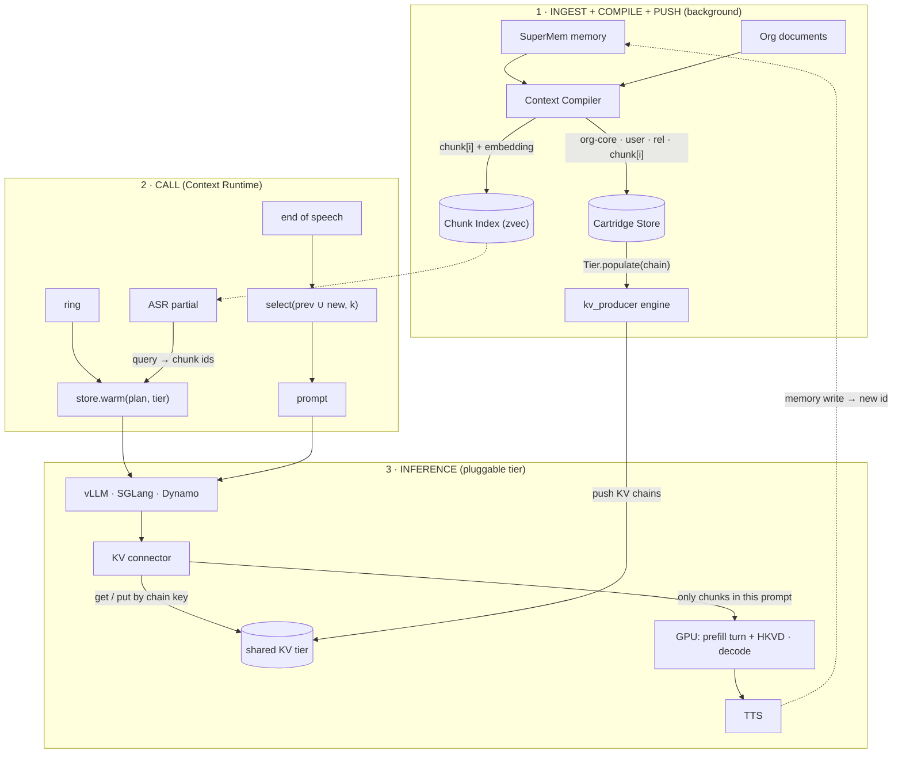
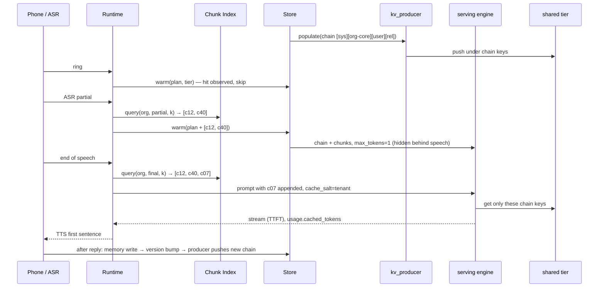

# KV Cartridge Engine — store, index, push, selective attach

Date: 2026-09-30
Status: design approved in brainstorm; implementation plan next
Diagrams: `diagrams/kv-cartridge-end-to-end.*`, `diagrams/kv-cartridge-one-turn.*`
(edit the `.mmd`, re-render with `/diagram`)

## Problem

Today a cartridge is canonical text plus an id (`supermem/cartridge/`). SuperMem
never touches KV; the engine keys KV by token-chunk hash and reuse works only
because the text is byte-stable and sits at the front of the prompt. Three
things the NVIDIA brief and the CacheBlend note ask for do not exist:

1. KV addressable by cartridge id and placed in a caching tier **before** the
   turn lands, on whatever engine the caller reaches.
2. Selective recompute we own and can explain. Today it is one line in
   `scripts/lmcache/blend.yaml`, with open upstream bugs.
3. Ingest → index → chunk-cartridges, so a turn attaches only the org knowledge
   it needs. This is CacheBlend's RAG shape: query + N retrieved chunks, each a
   cached cartridge.

## Goal

SuperMem keeps every piece of long-lived context mapped to an id, pushes its KV
into a caching tier (LMCache, OpenLake, Dynamo KVBM) under the key that tier
will look up, and at inference the engine loads only the KV the turn needs.
Result: lower TTFT, lower GPU-seconds per turn, and HBM holding only active KV.

## Scenario check

| Requirement | Supported | How |
|---|---|---|
| Context mapped by id ≙ cartridge store | yes | `Cartridge.id` = hash(tenant, scope, content, version, model, tokenizer, codec). Add `store.current(tenant, scope) → id`. |
| Store pushes KV into LMCache / OpenLake / KVBM by a prefix key | yes, after adjustment | A background `kv_producer` engine prefills cartridge **chains** into a tier the serving fleet shares. The store records `(tier, chain_key)` per cartridge set. See "Keying". |
| At inference, load only the needed KV by key | yes | Every tier looks up only the chunks in the prompt; `select(k)` bounds the set. Phase 2 adds explicit `kv_transfer_params.cartridges=[ids]`. |
| Non-prefix attach (CacheBlend) | LMCache only today | OpenLake and KVBM are prefix-only. Append-only chunk order keeps them hitting. Our own blender (phase 2b) removes the dependence. |
| Lowest GPU footprint | yes, but not from blend | Blend saves prefill compute. HBM footprint comes from tiering (inactive KV off-GPU), `select(k)` (smaller per-request KV), and codec (FP8, OpenLake lossless, TurboQuant later). The bench reports `gpu_cache_usage_perc` and tier hit rate so the slide names the right mechanism. |

## Architecture

Three responsibilities, three questions:

| File | Answers | Phase |
|---|---|---|
| `cartridge/index.py` — `ChunkIndex` | which cartridges exist, which are relevant now | 1 |
| `cartridge/store.py` — `CartridgeStore` + `cartridge/tiers/` | which are populated, in which tier, under which chain key | 1 |
| `cartridge/blend.py` | why reuse-anywhere is correct, at ground level | 2 |
| `cartridge/connector.py` | prefetch-by-id inside the engine; Dynamo inherits it | 2 |

Invariant for phase 1: **SuperMem never holds a KV tensor.** Text in, OpenAI API
out. The push is a producer engine writing into a shared tier. Bytes appear only
in phase 2.

## Keying: the prefix chain is the key

vLLM, LMCache (non-blend), OpenLake and KVBM key a block as
`hash(parent_block_hash, tokens)`. The key of the `user` cartridge therefore
depends on everything before it. Consequences:

- **Warm the chain, not the piece.** `store.warm(plan, tier)` takes the ordered
  attach plan. Prefix tiers get one request with the whole chain, exactly as the
  turn will send it. LMCache blend hashes segments independently, so there each
  segment is warmed alone.
- **`Tier.chain_key(plan)`** derives the key the way that tier does. The store
  records `(tier, chain_key, cartridge ids, populated_at, observed_hit)`. "Push
  by prefix key" is a column, not a hope.
- **Append-only chunk order within a call.** Chunks are ordered by first-attach
  time, so turn 2's chain `[c12, c40, c07]` extends turn 1's `[c12, c40]`
  instead of breaking it. Prefix-only tiers then miss only the new chunk. Order
  resets to canonical between calls.
- **Tenancy.** `cache_salt = tenant` on every request, warm and turn alike, so
  identical text in two tenants never shares KV.

## Phase 1 — stock engines, no internals

**`contract.py`.** Add kind `chunk` with scope `{"org", "doc", "chunk": i}`.
`KIND_ORDER` gets `chunk` last; `ordered()` tie-breaks by attach order, then
scope.

**`compiler.py`.** `compile_chunks(org_id, doc_id, text, chunk_tokens=512)` packs
paragraphs with the real tokenizer, no overlap (overlap breaks byte-identity and
doubles KV). The org cartridge shrinks to an org-core; the rest becomes chunks.

**`index.py` — `ChunkIndex`.** Zvec, in-process, one collection, `tenant` and
`org` scalar filters. `upsert(cartridges)`, `query(org, text, k) → ids`,
`drop(doc)`. Embeddings from `leftbrain/local_e5_embedder.py`, so writes and
reads share a space. Hybrid search if the pinned zvec exposes it; vector-only
otherwise. Verify the API before coding.

**`store.py` — `CartridgeStore`.** SQLite. Tables: `cartridges` (manifest +
body), `current` (tenant, kind, scope → id), `populated` (tier, chain_key, ids,
populated_at, prompt_tokens, cached_tokens, method). `warm(plan, tier)` is
idempotent and skips a chain with a recent observed hit. It records what the
engine reported; a second warm returning `cached_tokens ≈ prompt_tokens` is the
proof. The store never claims residency (tiers evict silently); it claims "hit
observed at T".

**`tiers/`.** `Tier` protocol: `chain_key(plan)`, `exists(keys)` where the tier
exposes lookup, `populate(plan, engine)`. Implementations `lmcache`, `openlake`,
`kvbm`. Phase 1 populates through an engine (producer or serving); `put(bytes)`
is phase 2.

**`kv_producer`.** A background vLLM with the same model, TP, dtype and chunk
size as the fleet, attached to the shared tier. `Tier.populate` sends it the
chain with `max_tokens=1`. Runs after every compile, so a returning caller's
chain is in the tier before the phone rings. Without a shared tier (single
node) the serving engine plays producer during the ring.

**`runtime.py`.** `attach(caller_id, chunk_ids)`; `select(prev, new, k)` keeps
last turn's chunks unless over budget, then appends. `mode` stays a config:
`blend` on LMCache, `cartridge` (prefix) elsewhere.

**Bench.** New arm `select` (top-k chunks vs whole org). Questions tagged with
their source chunk, so selection recall is a number. Per-turn
`vllm:gpu_cache_usage_perc`, `nvidia-smi memory.used`, and tier hit rate.
`scripts/gcp_serve_cartridges.sh` gets `KV_TIER=lmcache|openlake|kvbm`; the
`blend` arm runs on LMCache only and says so.

## One turn

Rules that make it hold: the whole-cartridge prefix never changes mid-call;
mid-call facts ride in the volatile turn text; the partial-ASR warm is
idempotent, so a second partial costs milliseconds; `select` keeps the final set
a superset of the prefetched set unless over budget.

## Phase 2 — engine level

**`blend.py`, reference selective recompute** (PyTorch + HF, one GPU, Qwen2.5
0.5B–3B). `precompute(text) → ChunkKV` forwards the chunk alone at offset 0.
RoPE is relative, so `rotate(K, Δ)` places it anywhere on attach. `fuse(chunks,
query)` concatenates re-rotated caches, recomputes layer 0 fully, then runs
layer by layer over a subset of positions attending to the full fused cache,
measures KV deviation, and keeps the top r% (default 15%) for the next layer.
`evaluation/cartridges/blend_eval.py` compares full prefill, naive concat
(r=0) and blend (r=15%): answer match, KV deviation, recompute fraction, ms.

**`connector.py` — `SuperMemConnectorV1`** (vLLM `KVConnectorBase_V1`).
*2a, prefetch-by-id:* requests carry `kv_transfer_params={"cartridges": [ids],
"tenant": ...}`; the scheduler side maps ids → chain keys → tier; the worker
side loads them. Works on every tier. *2b, blend in the layer hook:* the V1
API is prefix-shaped, so non-prefix reuse runs in `wait_for_layer_load(layer)`,
where LMCache runs its blender; ours ports `blend.py` to paged blocks and works
over any `Tier`. Owning the blender is what lets us fix that seam instead of
waiting.

**Bytes contract, only when bytes exist:** `kv_layout {layers, kv_heads,
head_dim}`, `rope {base, stored_offset}`, `codec ∈ fp16 | fp8 | openlake-lz |
tq3 | tq4`, all hashed into the id. `Tier.put` lands first on LMCache (Python
engine API exists), then on OpenLake and KVBM once their write APIs are
verified.

**Dynamo** needs no SuperMem code. The connector lives in the vLLM worker; the
KV-router sends a caller to the worker holding their chain; priority hints put
live turns ahead of memory-write LLM calls.

## KV tiers

| | LMCache | OpenLake | Dynamo KVBM |
|---|---|---|---|
| Tiers | GPU → CPU → disk/remote | DRAM → NVMe → S3, erasure-coded | GPU → CPU → SSD → remote, NIXL |
| Engine hook | `LMCacheConnectorV1`, SGLang | `OpenLakeConnector` (vLLM, SGLang) | vLLM / TRT-LLM worker + KV router |
| Keyed by | chain hash (segment hash in blend) | chain hash | block hash |
| Non-prefix reuse | blend flag, experimental | none | none |
| Shared across hosts | remote backend | yes, consistent hashing | yes |

The tier answers *where the bytes live*. Selective recompute is not the tier's
job, which is why `blend.py` is the asset.

## Failure handling

Nothing new blocks a reply. A failed or slow `warm` leaves no row; the turn runs
as a cold prefill. An empty or failed index query attaches zero chunks. A down
blend engine falls back to `cartridge` mode at startup. A version bump makes the
old id unreachable; the tier evicts it; the store keeps the manifest for tracing.

## Measurement

Only engine-reported numbers. Verify on the GPU run, do not assume:

- `usage.prompt_tokens_details.cached_tokens` counts connector-loaded tokens in
  the pinned vLLM build.
- LMCache exposes a recompute fraction in blend mode.
- OpenLake single-node (`openlaked`, local data dirs) runs beside vLLM on one L4.
- LMCache `CacheEngineKey` includes world size; producer and fleet must match TP.

Missing data prints "not measured". The simulator gains segment-level caching
(split on ` # # `) so `select` and `blend` arms rehearse on a laptop, banner
unchanged.

## Tests, no GPU

Chunk kind and deterministic order; `compile_chunks` idempotent, no overlap;
zvec round trip with a fake embedder and tenant isolation; `warm` twice against
the simulator, second observes a hit; chain key stable for the same plan,
different for a reordered plan; `select` hysteresis and append-only order;
prefix bytes unchanged when the chunk set changes. `blend.py` on a tiny model on
CPU: `rotate(K, Δ)` equals K computed at Δ; r=100% equals full prefill; r=0
deviates; r=15% lies between.

## Out of scope

TurboQuant kernels (codec value only), replacing Qdrant in leftbrain, SGLang
blending, Dynamo cache pinning, multi-node placement policy.

## Order of work

1. `contract` + `compiler.compile_chunks` + tests.
2. `store` with `current` and `populated`, `tiers/lmcache` chain key, `warm(plan)`.
3. `index` on zvec; `runtime.attach` + `select`.
4. Bench `select` arm, GPU-footprint sampling, `KV_TIER` switch; GCP run.
5. `kv_producer` on a shared LMCache remote or OpenLake single node.
6. `blend.py` + `blend_eval.py`.
7. `connector.py` 2a, then 2b.
